# <a name="tutorial-embed-power-bi-content-into-an-application-for-your-organization"></a>Självstudie: Bädda in Power BI-innehåll i ett program för din organisation

I **Power BI** kan du bädda in rapporter (Power BI eller sidnumrerade) och instrumentpaneler eller paneler i ett program med hjälp av användarägda data. **Användarägda data** gör att ditt program kan utöka Power BI-tjänsten så att den kan använda inbäddad analys. Den här självstudien visar hur du integrerar en rapport (Power BI eller sidnumrerad) i ett program. Du kan använda Power BI .NET SDK med Power BI JavaScript API för att bädda in Power BI i ett program för din organisation.

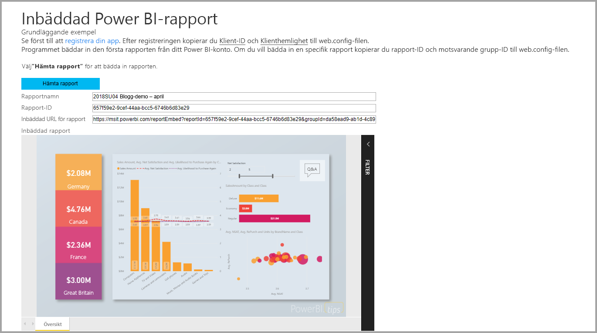

I den här självstudien går du igenom följande aktiviteter:
> [!div class="checklist"]
> * Registrera ett program i Azure.
> * Bädda in en Power BI-rapport eller sidnumrerad rapport i ett program med Power BI-klienten.

## <a name="prerequisites"></a>Förutsättningar

Du måste ha följande för att komma igång:

* Ett [Power BI Pro-konto](../service-self-service-signup-for-power-bi.md).
* En [Microsoft Azure](https://azure.microsoft.com/)-prenumeration.
* Du måste ha en egen installation för [Azure Active Directory-klient](create-an-azure-active-directory-tenant.md).
* För inbäddning av sidnumrerade rapporter behöver du minst P1-kapacitet. Se [Hur stor Premium-kapacitet måste jag ha för sidnumrerade rapporter?](../paginated-reports-faq.md#what-size-premium-capacity-do-i-need-for-paginated-reports).

Om du inte har registrerat dig för **Power BI Pro**, [registrerar du dig för en kostnadsfri utvärderingsversion](https://powerbi.microsoft.com/pricing/) innan du börjar.

Om du inte har någon Azure-prenumeration kan du [skapa ett kostnadsfritt konto](https://azure.microsoft.com/free/?WT.mc_id=A261C142F) innan du börjar.

## <a name="set-up-your-embedded-analytics-development-environment"></a>Konfigurera den inbäddade utvecklingsmiljön för analysverktyg

Innan du börjar bädda in rapporter, en instrumentpanel eller paneler i din app måste du se till att det går att bädda in Power BI i din miljö.

Med [konfigurationsverktyget för inbäddning](https://aka.ms/embedsetup/UserOwnsData) kommer du snabbt igång och kan ladda ned ett exempelprogram som steg för steg beskriver hur du skapar en miljö och bäddar in en rapport. Om du bäddar in en sidnumrerad rapport måste du tilldela minst P1-kapacitet till den arbetsyta du har skapat.

Om du väljer att konfigurera miljön manuellt kan du fortsätta nedan.

### <a name="register-an-application-in-azure-active-directory"></a>Registrera ett program i Azure Active Directory

[Registrera appen](register-app.md) med Azure Active Directory så att ditt program får åtkomst till [Power BI REST-API:er](https://docs.microsoft.com/rest/api/power-bi/). Genom att registrera din app kan du upprätta en identitet för din app och ange behörigheter till Power BI REST-resurser.

Du behöver fortsätta med att registrera en **webbapp för serversidan**-app. Du registrerar en webbapp på serversidan för att skapa en apphemlignet.

## <a name="set-up-your-power-bi-environment"></a>Konfigurera din Power BI-miljö

### <a name="create-a-workspace"></a>Skapa en arbetsyta

Om du bäddar in rapporter, instrumentpaneler eller paneler för dina kunder måste du placera innehållet i en arbetsyta. Det finns olika typer av arbetsytor du kan konfigurera: [traditionella arbetsytor](../service-create-workspaces.md) eller [nya arbetsytor](../service-create-the-new-workspaces.md).

### <a name="create-and-publish-your-power-bi-reports"></a>Skapa och publicera Power BI-rapporter

Du kan skapa rapporter och datauppsättningar med hjälp av Power BI Desktop. Sedan kan du publicera rapporterna till en arbetsyta. Slutanvändaren som publicerar rapporterna måste ha en Power BI Pro-licens för att publicera till arbetsytan.

1. Ladda ner exemplet [Demo](https://github.com/Microsoft/powerbi-desktop-samples) från GitHub.

    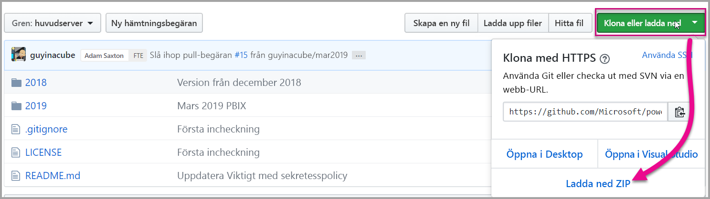

2. Öppna PBIX-exempelrapporten i Power BI Desktop.

   

3. Publicera till arbetsytan.

   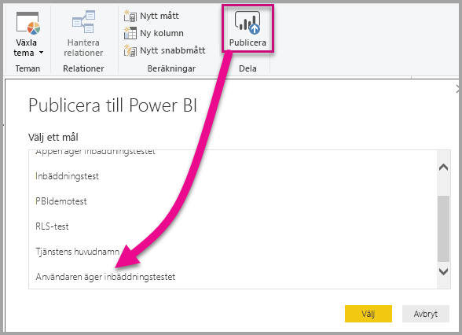

    Nu kan du visa rapporten i Power BI-tjänsten online.

   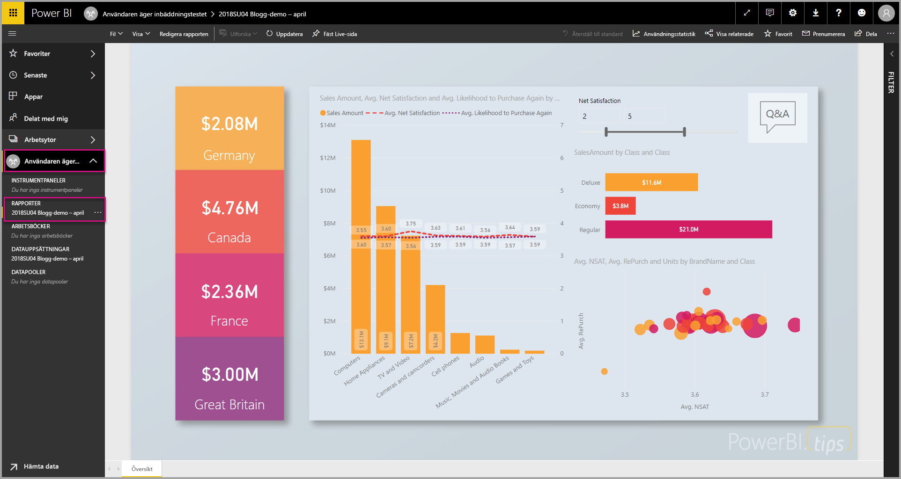
   
### <a name="create-and-publish-your-paginated-reports"></a>Skapa och publicera sidnumrerade rapporter

Du kan skapa dina sidnumrerade rapporter med hjälp av [Power BI Report Builder](../paginated-reports-report-builder-power-bi.md#create-reports-in-power-bi-report-builder). Sedan kan du [ladda upp rapporten](../paginated-reports-quickstart-aw.md#upload-the-report-to-the-service) till en arbetsyta som har tilldelats till minst P1-kapacitet. Slutanvändaren som laddar upp rapporterna måste ha en Power BI Pro-licens för att publicera till arbetsytan.
   
## <a name="embed-your-content-by-using-the-sample-application"></a>Bädda in innehåll med exempelprogrammet

Det här exemplet hålls medvetet enkelt i demonstrationssyfte.

Följ de här stegen nedan om du vill börja bädda in innehåll med hjälp av exempelprogrammet.

1. Ladda ned [Visual Studio](https://www.visualstudio.com/) (version 2013 eller senare). Se till att ladda ned det senaste [NuGet-paketet](https://www.nuget.org/profiles/powerbi).

2. Ladda ner [exempel på användare äger data](https://github.com/Microsoft/PowerBI-Developer-Samples) från GitHub för att komma igång.

    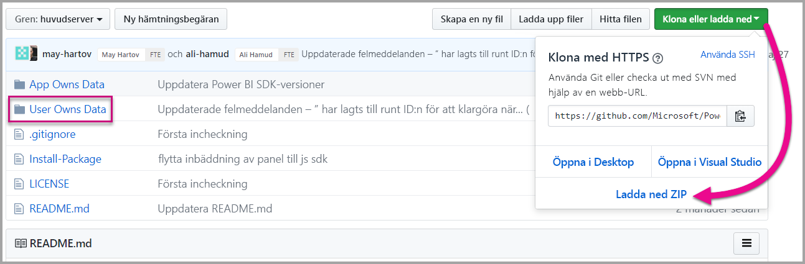

3. Öppna filen **Cloud.config** i exempelprogrammet.

    Du måste fylla i fälten för att kunna köra programmet.

    | Fält |
    |--------------------|
    | **[Program-ID](#application-id)** |
    | **[ID för arbetsyta](#workspace-id)** |
    | **[Rapport-ID](#report-id)** |
    | **[AADAuthorityUrl](#aadauthorityurl)** |

    

### <a name="application-id"></a>Program-ID

Fyll i **applicationId** med **program-ID:t** från **Azure**. **applicationId** används av programmet för att identifiera sig för användare som du begär behörighet från.

Så här hämtar du **applicationId**:

1. Logga in på [Azure Portal](https://portal.azure.com).

2. Välj **Alla tjänster** i det vänstra navigeringsfönstret och välj sedan **Appregistreringar**.

3. Välj det program som behöver **applicationId**.

    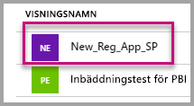

4. Det finns ett **program-ID** som listas som en GUID. Använd detta **program-ID** som **applicationId** för appen.

    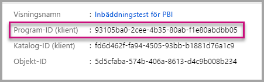

### <a name="workspace-id"></a>Arbetsyte-ID

Fyll i **workspaceId** med arbetsytans (gruppens) GUID från Power BI. Du kan få den här informationen från URL:en när du är inloggad i Power BI-tjänsten eller med hjälp av Powershell.

URL <br>


PowerShell <br>

```powershell
Get-PowerBIworkspace -name "User Owns Embed Test"
```

   

### <a name="report-id"></a>Rapport-ID

Fyll i **reportId**-information med rapport-GUID från Power BI. Du kan få den här informationen från URL:en när du är inloggad i Power BI-tjänsten eller med hjälp av Powershell.

URL för Power BI-rapport <br>


URL för sidnumrerad rapport<br>


PowerShell <br>

```powershell
Get-PowerBIworkspace -name "User Owns Embed Test" | Get-PowerBIReport
```


### <a name="aadauthorityurl"></a>AADAuthorityUrl

Fyll i informationen **AADAuthorityUrl** URL:en som du antingen kan bädda in i din organisations klient eller bädda in med en gästanvändare.

För att bädda in med din organisations klient använder du URL – *https://login.microsoftonline.com/common/oauth2/authorize* .

För att bädda in med en gäst använder du URL – *https://login.microsoftonline.com/report-owner-tenant-id* – där du lägger till klient-ID för rapportens ägare som ersätter *rapport-ägare-klient-id*.

### <a name="run-the-application"></a>Kör programmet

1. Välj **Kör** i **Visual Studio**.

    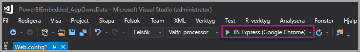

2. Välj sedan **Bädda in rapport**. Beroende på vilket innehåll du väljer att testa med – rapporter, instrumentpaneler eller paneler – väljer du det alternativet i programmet.

    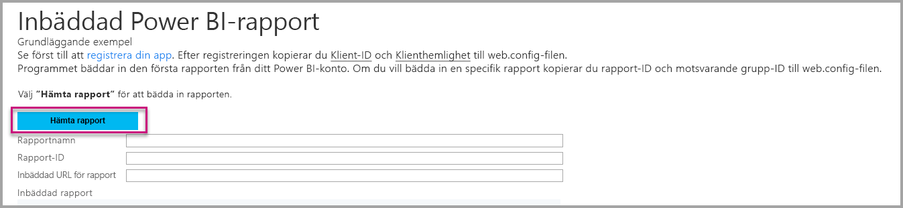

3. Nu kan du visa rapporten i exempelprogrammet.

    

## <a name="embed-your-content-within-your-application"></a>Bädda in innehåll i programmet

Innehåll kan bäddas in med hjälp av [Power BI REST API:er](https://docs.microsoft.com/rest/api/power-bi/), men exempelkoderna som beskrivs i den här artikeln görs med .NET SDK.

Om du vill integrera en rapport i en webbapp använder du Power BI REST API eller Power BI C# SDK. Du kan också använda en åtkomsttoken för Azure Active Directory-auktorisering för att hämta en rapport. Sedan kan du läsa in rapporten med samma åtkomsttoken. Power BI REST API ger programmeringsåtkomst till vissa Power BI-resurser. Mer information finns i [Power BI REST API](https://docs.microsoft.com/rest/api/power-bi/) och [Power BI JavaScript API](https://github.com/Microsoft/PowerBI-JavaScript).

### <a name="get-an-access-token-from-azure-ad"></a>Hämta en åtkomsttoken från Azure AD

Du måste hämta en åtkomsttoken från Azure AD i ditt program innan du kan göra anrop mot Power BI REST-API:t. Mer information finns i [Autentisera användare och hämta en Azure AD-åtkomsttoken för din Power BI-app](get-azuread-access-token.md).

### <a name="get-a-report"></a>Hämta en rapport

Du hämtar en Power BI-rapport eller en sidnumrerad rapport med åtgärden [Hämta rapporter](https://docs.microsoft.com/rest/api/power-bi/reports/getreports), som hämtar en lista med Power BI-rapporter och sidnumrerade rapporter. Du kan hämta ett rapport-ID från listan med rapporter.

### <a name="get-reports-by-using-an-access-token"></a>Hämta rapporter med hjälp av en åtkomsttoken

Åtgärden [Hämta rapporter](https://docs.microsoft.com/rest/api/power-bi/reports/getreports) returnerar en lista med rapporter. Du kan hämta en enda rapport från listan med rapporter.

Om du vill göra REST API-anrop måste du inkludera en *auktoriserings*rubrik i formatet *Ägare {åtkomsttoken}* .

#### <a name="get-reports-with-the-rest-api"></a>Hämta rapporter med REST API

Här är ett kodexempel på hur du hämtar rapporter med REST API:

> [!Note]
> Ett exempel på hur du hämtar ett innehållsobjekt som du vill bädda in finns i filen Default.aspx.cs i [exempelprogrammet](https://github.com/Microsoft/PowerBI-Developer-Samples). Exempel på detta är en rapport, en instrumentpanel eller en panel.

```csharp
using Newtonsoft.Json;

//Get a Report. In this sample, you get the first Report.
protected void GetReport(int index)
{
    //Configure Reports request
    System.Net.WebRequest request = System.Net.WebRequest.Create(
        String.Format("{0}/Reports",
        baseUri)) as System.Net.HttpWebRequest;

    request.Method = "GET";
    request.ContentLength = 0;
    request.Headers.Add("Authorization", String.Format("Bearer {0}", accessToken.Value));

    //Get Reports response from request.GetResponse()
    using (var response = request.GetResponse() as System.Net.HttpWebResponse)
    {
        //Get reader from response stream
        using (var reader = new System.IO.StreamReader(response.GetResponseStream()))
        {
            //Deserialize JSON string
            PBIReports Reports = JsonConvert.DeserializeObject<PBIReports>(reader.ReadToEnd());

            //Sample assumes at least one Report.
            //You could write an app that lists all Reports
            if (Reports.value.Length > 0)
            {
                var report = Reports.value[index];

                txtEmbedUrl.Text = report.embedUrl;
                txtReportId.Text = report.id;
                txtReportName.Text = report.name;
            }
        }
    }
}

//Power BI Reports used to deserialize the Get Reports response.
public class PBIReports
{
    public PBIReport[] value { get; set; }
}
public class PBIReport
{
    public string id { get; set; }
    public string reportType { get; set }
    public string name { get; set; }
    public string webUrl { get; set; }
    public string embedUrl { get; set; }
}
```

#### <a name="get-reports-by-using-the-net-sdk"></a>Hämta rapporter med .NET SDK

Du kan använda .NET SDK för att hämta en lista med rapporter i stället för att anropa REST API direkt. Följande kodexempel visar hur du listar rapporter:

```csharp
using Microsoft.IdentityModel.Clients.ActiveDirectory;
using Microsoft.PowerBI.Api.V2;
using Microsoft.PowerBI.Api.V2.Models;

var tokenCredentials = new TokenCredentials(<ACCESS TOKEN>, "Bearer");

// Create a Power BI Client object. It is used to call Power BI APIs.
using (var client = new PowerBIClient(new Uri(ApiUrl), tokenCredentials))
{
    // Get the first report all reports in that workspace
    ODataResponseListReport reports = client.Reports.GetReports();

    Report report = reports.Value.FirstOrDefault();

    var embedUrl = report.EmbedUrl;
}
```

### <a name="load-a-report-by-using-javascript"></a>Läs in en rapport med hjälp av JavaScript

Du kan använda JavaScript för att läsa in en rapport till olika element på webbsidan. Här är ett kodexempel på hur du hämtar en rapport från en given arbetsyta:

> [!NOTE]  
> Ett exempel på hur du läser in ett innehållsobjekt som du vill bädda in finns i filen **Default.aspx.cs** i [exempelprogrammet](https://github.com/Microsoft/PowerBI-Developer-Samples).

```javascript
<!-- Embed Report-->
<div> 
    <asp:Panel ID="PanelEmbed" runat="server" Visible="true">
        <div>
            <div><b class="step">Step 3</b>: Embed a report</div>

            <div>Enter an embed url for a report from Step 2 (starts with https://):</div>
            <input type="text" id="tb_EmbedURL" style="width: 1024px;" />
            <br />
            <input type="button" id="bEmbedReportAction" value="Embed Report" />
        </div>

        <div id="reportContainer"></div>
    </asp:Panel>
</div>
```

#### <a name="sitemaster"></a>Site.master

```javascript
window.onload = function () {
    // client side click to embed a selected report.
    var el = document.getElementById("bEmbedReportAction");
    if (el.addEventListener) {
        el.addEventListener("click", updateEmbedReport, false);
    } else {
        el.attachEvent('onclick', updateEmbedReport);
    }

    // handle server side post backs, optimize for reload scenarios
    // show embedded report if all fields were filled in.
    var accessTokenElement = document.getElementById('MainContent_accessTokenTextbox');
    if (accessTokenElement !== null) {
        var accessToken = accessTokenElement.value;
        if (accessToken !== "")
            updateEmbedReport();
    }
};

// update embed report
function updateEmbedReport() {

    // check if the embed url was selected
    var embedUrl = document.getElementById('tb_EmbedURL').value;
    if (embedUrl === "")
        return;

    // get the access token.
    accessToken = document.getElementById('MainContent_accessTokenTextbox').value;

    // Embed configuration used to describe the what and how to embed.
    // This object is used when calling powerbi.embed.
    // You can find more information at https://github.com/Microsoft/PowerBI-JavaScript/wiki/Embed-Configuration-Details.
    var config = {
        type: 'report',
        accessToken: accessToken,
        embedUrl: embedUrl
    };

    // Grab the reference to the div HTML element that will host the report.
    var reportContainer = document.getElementById('reportContainer');

    // Embed the report and display it within the div container.
    var report = powerbi.embed(reportContainer, config);

    // report.on will add an event handler which prints to Log window.
    report.on("error", function (event) {
        var logView = document.getElementById('logView');
        logView.innerHTML = logView.innerHTML + "Error<br/>";
        logView.innerHTML = logView.innerHTML + JSON.stringify(event.detail, null, "  ") + "<br/>";
        logView.innerHTML = logView.innerHTML + "---------<br/>";
    }
  );
}
```

## <a name="using-a-power-bi-premium-dedicated-capacity"></a>Använda en dedikerad kapacitet med Power BI Premium

Nu när du har utvecklat ditt program är det dags att skapa dedikerad kapacitet för arbetsytan.

### <a name="create-a-dedicated-capacity"></a>Skapa en dedikerad kapacitet

Genom att skapa dedikerad kapacitet får innehållet i arbetsytan dedikerade resurser. För sidnumrerade rapporter måste du minst använda en P1-kapacitet för arbetsytan. Du kan skapa en dedikerad kapacitet med hjälp av [Power BI Premium ](../service-premium-what-is.md).

Följande tabell innehåller de tillgängliga Power BI Premium-SKU:erna i [Microsoft Office 365](../service-admin-premium-purchase.md):

| Kapacitetsnod | Totalt antal virtuella kärnor<br/>(serverdel + klientdel) | Serverdelens virtuella kärnor | Klientdelens virtuella kärnor | DirectQuery/begränsningar vid liveanslutning |
| --- | --- | --- | --- | --- | --- |
| EM1 |1 virtuell kärna |0,5 virtuell kärna, 10 GB RAM-minne |0,5 virtuell kärna |3,75 per sekund |
| EM2 |2 virtuella kärnor |1 virtuell kärna, 10 GB RAM-minne |1 virtuell kärna |7,5 per sekund |
| EM3 |4 virtuella kärnor |2 virtuella kärnor, 10 GB RAM-minne |2 virtuella kärnor |15 per sekund |
| P1 |8 virtuella kärnor |4 virtuella kärnor, 25 GB RAM-minne |4 virtuella kärnor |30 per sekund |
| P2 |16 virtuella kärnor |8 virtuella kärnor, 50 GB RAM-minne |8 virtuella kärnor |60 per sekund |
| P3 |32 virtuella kärnor |16 virtuella kärnor, 100 GB RAM-minne |16 virtuella kärnor |120 per sekund |
| P4 |64 virtuella kärnor |32 virtuella kärnor, 200 GB RAM-minne |32 virtuella kärnor |240 per sekund |
| P5 |128 virtuella kärnor |64 virtuella kärnor, 400 GB RAM-minne |64 virtuella kärnor |480 per sekund |

> [!NOTE]
> - När du försöker bädda in med Microsoft Office-appar använder du EM-SKU:er för att komma åt innehåll med en kostnadsfri licens för Power BI. Du kan dock inte komma åt innehåll med en kostnadsfri licens för Power BI när du använder Powerbi.com eller Power BI Mobile.
> - När du försöker bädda in med Microsoft Office-appar och använder Powerbi.com eller Power BI Mobile kan du komma åt innehåll med en kostnadsfri licens för Power BI.

### <a name="assign-a-workspace-to-a-dedicated-capacity"></a>Tilldela en arbetsyta till en dedikerad kapacitet

När du har skapat en dedikerad kapacitet kan du tilldela arbetsytan till den dedikerade kapaciteten. Gör så här för att slutföra processen:

1. I Power BI-tjänsten expanderar du arbetsytorna och väljer ellipsen för arbetsytan som du vill bädda in ditt innehåll med. Välj sedan **Redigera arbetsytor**.

    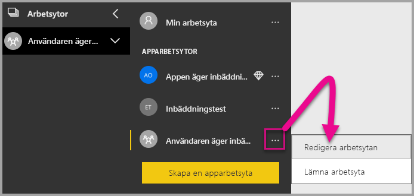

2. Expandera **Avancerat** och aktivera **Särskild avsedd kapacitet**. Välj den dedikerade kapaciteten som du skapade. Välj sedan **Spara**.

    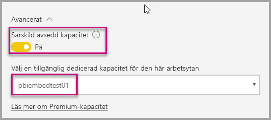

3. När du har valt **Spara** bör du se en romb bredvid namnet på arbetsytan.

    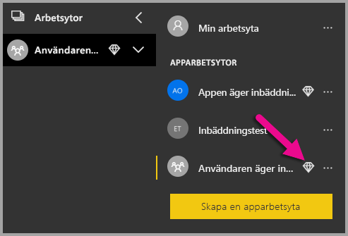

## <a name="admin-settings"></a>Administratörsinställningar

Globala eller Power BI-tjänstadministratörer kan aktivera eller inaktivera REST API:er för en klient. Power BI-administratörer kan ange den här inställningen för hela organisationen eller för enskilda säkerhetsgrupper. Den har aktiverats för hela organisationen som standard. Du kan göra dessa ändringar i [Power BI-administratörsportalen](../service-admin-portal.md).

## <a name="next-steps"></a>Nästa steg

I den här självstudien har du lärt dig hur du bäddar in Power BI-innehåll i ett program med hjälp av ditt Power BI-organisationskonto. Du kan nu prova att bädda in Power BI-innehåll i ett program med hjälp av appar. Du kan även prova att bädda in Power BI-innehåll för dina kunder (för närvarande stöds detta inte för sidnumrerade rapporter):

> [!div class="nextstepaction"]
> [Bädda in från appar](embed-from-apps.md)

> [!div class="nextstepaction"]
>[Bädda in för dina kunder](embed-sample-for-customers.md)

Om du har andra frågor kan du [fråga Power BI Community](https://community.powerbi.com/).
