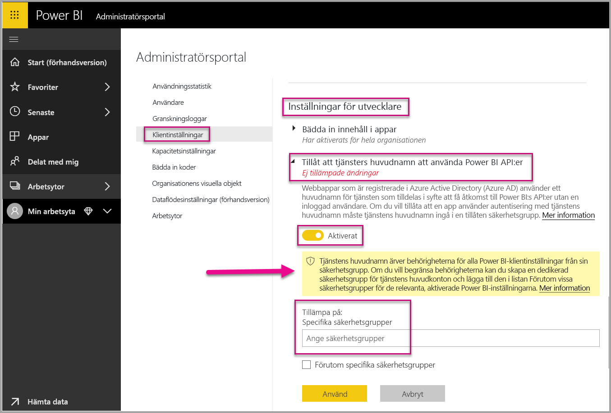
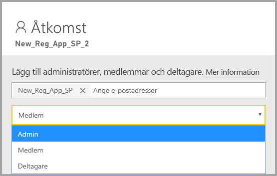
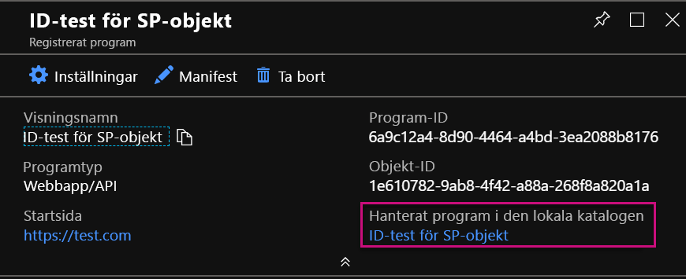
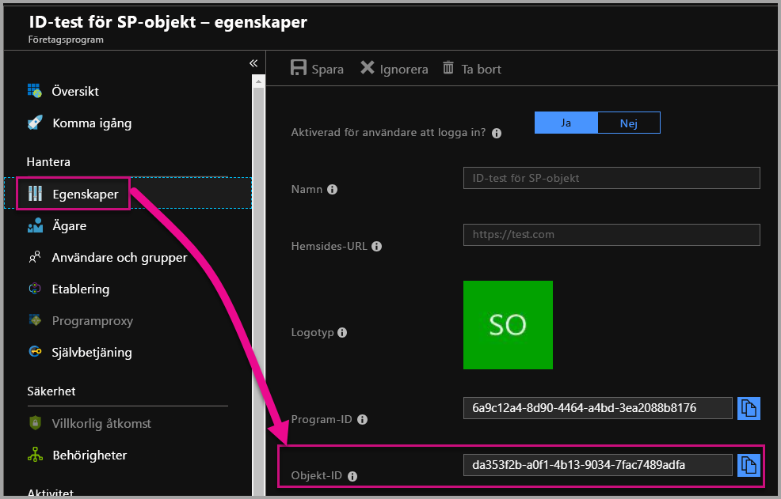

# <a name="service-principal-with-power-bi"></a>Tjänstens huvudnamn med Power BI

Med **tjänstens huvudnamn** kan du bädda in Power BI-innehåll i ett program och använda automatisering med Power BI med hjälp av en **appspecifik** token. Tjänstens huvudnamn är bra när du använder **Power BI Embedded** eller **automatiserar Power BI-uppgifter och -processer**.

När du arbetar med Power BI Embedded finns det fördelar när du använder tjänstens huvudnamn. En huvudsaklig fördel är att du inte behöver ett huvudkonto (Power BI Pro-licens som bara är ett användarnamn och lösenord för inloggning) för autentisering i programmet. Tjänstens huvudnamn använder ett program-ID och en apphemlighet för att autentisera programmet.

När du arbetar med att automatisera Power BI-uppgifter kan du även skapa skript för hur du bearbetar och hanterar tjänsthuvudnamn för skalanpassning.

## <a name="application-and-service-principal-relationship"></a>Relation mellan program och tjänstens huvudnamn

För att få åtkomst till resurser som skyddar en Azure AD-klientorganisation representerar entiteten som kräver åtkomst ett säkerhetsobjekt. Den här åtgärden gäller för båda användare (användarens huvudnamn) och program (tjänstens huvudnamn).

Säkerhetsobjektet definierar åtkomstprincipen och behörigheterna för användare och program i Azure AD-klientorganisationen. Åtkomstprincipen aktiverar kärnfunktioner som autentisering av användare och program vid inloggning och auktorisering vid resursåtkomst. Mer information finns i [Application and service principal in Azure Active Directory (AAD)](https://docs.microsoft.com/azure/active-directory/develop/app-objects-and-service-principals) (Program och tjänstens huvudnamn i Azure Active Directory (AAD)).

När du registrerar ett Azure AD-program i Azure-portalen skapas två objekt i Azure AD-klientorganisationen:

* Ett [programobjekt](https://docs.microsoft.com/azure/active-directory/develop/app-objects-and-service-principals#application-object)
* Ett [objekt för tjänstens huvudnamn](https://docs.microsoft.com/azure/active-directory/develop/app-objects-and-service-principals#service-principal-object)

Tänk dig programobjektet som den *globala* representationen av programmet för användning i alla klientorganisationer och objektet för tjänstens huvudnamn som den *lokala* representationen för användning i en specifik klientorganisation.

Programobjektet fungerar som mallen som vanliga och standardinställda egenskaper *härleds* för användning när motsvarande objekt för tjänstens huvudnamn skapas.

Ett tjänsthuvudnamn krävs per klientorganisation där programmet används – så att det kan upprätta en identitet för inloggning och åtkomst till resurser som skyddas av klientorganisationen. Ett program för enskild klient har bara ett tjänsthuvudnamn (i dess startklientorganisation), som skapas och godkänns vid programregistrering.

## <a name="service-principal-with-power-bi-embedded"></a>Tjänstens huvudnamn med Power BI Embedded

Med tjänstens huvudnamn kan du maskera huvudkontots information i programmet genom att använda ett program-ID och en apphemlighet. Du behöver inte längre hårdkoda ett huvudkonto i programmet för autentisering.

Eftersom **Power BI-API:er** och **Power BI .NET SDK** nu stöder anrop med tjänstens huvudnamn kan du använda [Power BI REST-API:er](https://docs.microsoft.com/rest/api/power-bi/) med tjänstens huvudnamn. Du kan till exempel göra ändringar av arbetsytor, som att skapa arbetsytor, lägga till och ta bort användare från arbetsytor och importera innehåll till arbetsytor.

Du kan bara använda tjänstens huvudnamn om dina Power BI-artefakter lagras på den [nya Power BI-arbetsytan](../service-create-the-new-workspaces.md).

## <a name="service-principal-vs-master-account"></a>Tjänstens huvudnamn jämfört med huvudkonto

Det finns skillnader mellan att använda tjänstens huvudnamn och ett standardhuvudkonto (Power BI Pro-licens) för autentisering. I tabellen nedan visas några skillnader.

| Funktion | Huvudanvändarkonto <br> (Power BI Pro-licens) | Tjänstens huvudnamn <br> (appspecifik token) |
|------------------------------------------------------|---------------------|-------------------|
| Kan logga in på Power BI-tjänsten  | Ja | Nej |
| Aktiverad i Power BI-administratörsportalen | Nej | Ja |
| [Fungerar med arbetsytor (v1)](../service-create-workspaces.md) | Ja | Nej |
| [Fungerar med de nya arbetsytorna (v2)](../service-create-the-new-workspaces.md) | Ja | Ja |
| Måste vara arbetsyteadministratör om de används med Power BI Embedded | Ja | Ja |
| Kan använda Power BI REST-API:er | Ja | Ja |
| Måste ha en global administratör för att skapa | Ja | Nej |
| Kan installera och hantera en lokal datagateway | Ja | Nej |

## <a name="get-started-with-a-service-principal"></a>Kom igång med ett tjänsthuvudnamn

Till skillnad från traditionell användning av ett huvudkonto kräver användning av tjänstens huvudnamn (appspecifik token) några olika delar som ska konfigureras. Om du vill komma igång med tjänstens huvudnamn (appspecifik token) måste du konfigurera rätt miljö.

1. [Registrera ett webbprogram på serversidan](register-app.md) i Azure Active Directory (AAD) för användning med Power BI. När du har registrerat programmet kan du registrera ett program-ID, en apphemlighet och objekt-ID för tjänstens huvudnamn för åtkomst till ditt Power BI-innehåll. Du kan skapa ett tjänsthuvudnamn med [PowerShell](https://docs.microsoft.com/powershell/azure/create-azure-service-principal-azureps?view=azps-1.1.0).

    Nedan är ett exempelskript för att skapa ett nytt Azure Active Directory-program.

    ```powershell
    # The app id - $app.appid
    # The service principal object id - $sp.objectId
    # The app key - $key.value

    # Sign in as a user that is allowed to create an app.
    Connect-AzureAD

    # Create a new AAD web application
    $app = New-AzureADApplication -DisplayName "testApp1" -Homepage "https://localhost:44322" -ReplyUrls "https://localhost:44322"

    # Creates a service principal
    $sp = New-AzureADServicePrincipal -AppId $app.AppId

    # Get the service principal key.
    $key = New-AzureADServicePrincipalPasswordCredential -ObjectId $sp.ObjectId
    ```

   > [!Important]
   > Om du aktiverar tjänstens huvudnamn för användning med Power BI gäller inte längre programmets AD-behörigheter. Programmets behörigheter hanteras då via Power BI-administrationsportalen.

2.  **Rekommenderat** – Skapa en [säkerhetsgrupp i Azure Active Directory (AAD)](https://docs.microsoft.com/azure/active-directory/fundamentals/active-directory-groups-create-azure-portal) och lägg till det program du skapade i den säkerhetsgruppen. Du kan skapa en AAD-säkerhetsgrupp med [PowerShell](https://docs.microsoft.com/powershell/azure/create-azure-service-principal-azureps?view=azps-1.1.0).

    Nedan är ett exempelskript för att skapa en ny säkerhetsgrupp och lägga till programmet i den säkerhetsgruppen.

    ```powershell
    # Required to sign in as a tenant admin
    Connect-AzureAD

    # Create an AAD security group
    $group = New-AzureADGroup -DisplayName <Group display name> -SecurityEnabled $true -MailEnabled $false -MailNickName notSet

    # Add the service principal to the group
    Add-AzureADGroupMember -ObjectId $($group.ObjectId) -RefObjectId $($sp.ObjectId)
    ```

3. Som Power BI-administratör måste du aktivera tjänstens huvudnamn i **Inställningar för utvecklare** i Power BI-administratörsportalen. Lägg till den säkerhetsgrupp som du skapade i Azure AD i det specifika avsnittet för säkerhetsgrupp i **Inställningar för utvecklare**. Du kan även aktivera åtkomst med tjänstens huvudnamn för hela organisationen. I det fallet krävs inte steg 2.

   > [!Important]
   > Tjänstens huvudnamn har åtkomst till alla klientorganisationsinställningar som är aktiverade för hela organisationen eller aktiverade för säkerhetsgrupper som har tjänstens huvudnamn som en del av gruppen. För att begränsa tjänstens huvudnamns åtkomst till specifika klientorganisationsinställningar tillåter du endast åtkomst till specifika säkerhetsgrupper, eller skapar en dedikerad säkerhetsgrupp för tjänstens huvudnamn och utesluter den.

    

4. Konfigurera din [Power BI-miljö](embed-sample-for-customers.md#set-up-your-power-bi-environment).

5. Lägg till tjänstens huvudnamn som **administratör** för den nya arbetsyta du har skapat. Du kan hantera den här uppgiften via [API:erna](https://docs.microsoft.com/rest/api/power-bi/groups/addgroupuser) eller med Power BI-tjänsten.

    

6. Välj nu att bädda in ditt innehåll med ett exempelprogram eller i ditt program.

    * [Bädda in innehåll med exempelprogrammet](embed-sample-for-customers.md#embed-content-using-the-sample-application)
    * [Bädda in innehåll i programmet](embed-sample-for-customers.md#embed-content-within-your-application)

7. Nu är du redo att [flytta till produktion](embed-sample-for-customers.md#move-to-production).

## <a name="migrate-to-service-principal"></a>Migrera till tjänstens huvudnamn

Du kan migrera till användning av tjänstens huvudnamn om du använder ett huvudkonto med Power BI eller med Power BI Embedded.

Slutför de tre första stegen i avsnittet [Kom igång med tjänstens huvudnamn](#get-started-with-a-service-principal), och när du är klar följer du informationen nedan.

Om du redan använder de [nya arbetsytorna](../service-create-the-new-workspaces.md) i Power BI lägger du sedan till tjänstens huvudnamn som **administratör** för arbetsytorna med dina Power BI-artefakter. Men om du använder de [traditionella arbetsytorna](../service-create-workspaces.md) kopierar eller flyttar du dina Power BI-artefakter och -resurser till de nya arbetsytorna och lägger sedan till tjänstens huvudnamn som **administratör** för de arbetsytorna.

Det finns ingen funktion i användargränssnittet för att flytta Power BI-artefakter och -resurser från en arbetsyta till en annan, så du måste använda [API:er](https://powerbi.microsoft.com/pt-br/blog/duplicate-workspaces-using-the-power-bi-rest-apis-a-step-by-step-tutorial/) för att utföra den här uppgiften. När du använder API:erna med tjänstens huvudnamn måste du ha objekt-ID:t för tjänstens huvudnamn.

### <a name="how-to-get-the-service-principal-object-id"></a>Så här får du objekt-ID för tjänstens huvudnamn

När du ska tilldela ett tjänsthuvudnamn till en ny arbetsyta använder du [REST-API:erna för Power BI](https://docs.microsoft.com/rest/api/power-bi/groups/addgroupuser). För att referera ett tjänsthuvudnamn för åtgärder eller för att göra ändringar använder du **objekt-ID för tjänstens huvudnamn** – till exempel tillämpa en tjänsthuvudnamn som administratör för en arbetsyta.

Nedan beskrivs hur du hämtar objekt-ID för tjänstens huvudnamn från Azure-portalen.

1. Skapa en ny appregistrering i Azure-portalen.  

2. Därefter väljer du, under **Hanterat program i den lokala katalogen**, namnet på programmet du har skapat.

   

    > [!Note]
    > Objekt-ID:t i bilden ovan är inte det som används med tjänstens huvudnamn.

3. Välj **Egenskaper** om du vill se objekt-ID:t.

    

Nedan är ett exempelskript för att hämta objekt-ID för tjänstens huvudnamn med PowerShell.

   ```powershell
   Get-AzureADServicePrincipal -Filter "DisplayName eq '<application name>'"
   ```

## <a name="considerations-and-limitations"></a>Överväganden och begränsningar

* Tjänstens huvudnamn fungerar bara med [nya arbetsytor](../service-create-the-new-workspaces.md).
* **Min arbetsyta** stöds inte när du använder tjänstens huvudnamn.
* Dedikerad kapacitet krävs vid flytt till produktion.
* Du kan inte logga in på Power BI-portal med tjänstens huvudnamn.
* Power BI-administratörsbehörighet krävs för att aktivera tjänstens huvudnamn i inställningarna för utvecklare i Power BI-administratörsportalen.
* Du kan inte installera eller hantera en lokal datagateway med tjänstens huvudnamn.
* Det går inte att använda tjänstens huvudnamn för [inbäddning för organisationens](embed-sample-for-your-organization.md) program.
* Hantering av [dataflöden](../service-dataflows-overview.md) stöds inte.
* Tjänstens huvudnamn har för närvarande inte stöd för några administratörs-API:er.

## <a name="next-steps"></a>Nästa steg

* [Registrera en app](register-app.md)
* [Power BI Embedded för dina kunder](embed-sample-for-customers.md)
* [Objekt för program och tjänstens huvudnamn i Azure Active Directory](https://docs.microsoft.com/azure/active-directory/develop/app-objects-and-service-principals)
* [Säkerhet på radnivå med hjälp av lokal datagateway med tjänstens huvudnamn](embedded-row-level-security.md#on-premises-data-gateway-with-service-principal)
