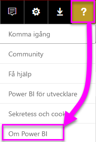

# <a name="frequently-asked-questions-about-power-bi-embedded"></a>Vanliga frågor och svar om Power BI Embedded

* Om du har andra frågor [kan du fråga Power BI Community](http://community.powerbi.com/).
* Har du fortfarande problem? Besök [Power BI-supportsidan](https://powerbi.microsoft.com/support/).

## <a name="general"></a>Allmänt

### <a name="what-is-power-bi-embedded"></a>Vad är Power BI Embedded?

Med Microsoft Power BI Embedded (PBIE) kan programutvecklare bädda in attraktiva och helt interaktiva rapporter i program utan att ödsla den tid och de utgifter som medföljer när man skapar egna datavisualiseringar och kontroller från grunden.

### <a name="who-is-the-target-audience-for-power-bi-embedded"></a>Vem kan använda Power BI Embedded?

Utvecklare och programvaruföretag som utvecklar sina egna program kallas ofta oberoende programvaruleverantörer (ISV; independent software vendors).

### <a name="how-is-power-bi-embedded-different-from-power-bi-the-service"></a>Hur skiljer sig Power BI Embedded från Power BI-tjänsten?

Power BI Embedded är avsedd för oberoende programvaruleverantörer och utvecklare som skapar program och vill bädda in visuella objekt i dessa program, så att deras kunder kan fatta beslut utan att behöva skapa en analyslösning från grunden. Inbäddade analysverktyg låter företagsanvändare få tillgång till företagsdata och ställa frågor för att skapa insikter om sina data inom applikationen.

Power BI, å andra sidan, är en analyslösning som tillhandahålls som tjänst och som ger organisationen en enhetlig vy över sina viktigaste affärsdata.

### <a name="what-is-the-difference-between-power-bi-premium-and-power-bi-embedded"></a>Vad är skillnaden mellan Power BI Premium och Power BI Embedded?

Power BI Premium är kapacitet som riktar sig till företag som behöver en fullständig BI-lösning som ger en enhetlig översikt över organisationen, partners, kunder och leverantörer. Power BI Premium hjälper din organisation att fatta beslut. Power BI Premium är en SaaS-produkt och har stöd för användning av innehåll via Power BI-portalen, mobilappar samt internt utvecklade appar.

Power BI Embedded är avsett för programvaruleverantörer eller utvecklare som utformar appar och vill bädda in visuella objekt i dessa appar. Power BI Embedded hjälper dina kunder fatta beslut eftersom Power BI Embedded har utvecklats för programutvecklare. Kunder som använder appen kan använda innehåll som lagras på Power BI Embedded, oavsett om de är inom eller utanför organisationen. Power BI Embedded-innehåll kan inte delas till webben eller SharePoint med ett klick och har inte stöd för SSRS-rapporter.

### <a name="what-is-the-microsoft-recommendation-for-when-a-customer-should-buy-power-bi-premium-vs-power-bi-embedded"></a>Vad rekommenderar Microsoft när en kund vill köpa antingen Power BI Premium eller Power BI Embedded?

Microsoft rekommenderar att företag köper Power BI Premium, en molnlösning i företagsklass för BI och att programvaruleverantörer köper Power BI Embedded, en inbäddad analyskomponent i molnet. Kunden kan dock välja att köpa det system de föredrar.

Det kan finnas tillfällen där en ISV (vanligtvis stor) vill använda en P-SKU för dra nytta av ytterligare fördelar med den kompletta Power BI-tjänsten i organisationen samt att bädda in i sina program. Och självklart kan vissa företag välja att använda A-SKU:er i Azure om de bara är intresserade av att bygga program för affärsverksamheten och bädda in analysverktyg i dem och inte är intresserade av att använda den kompletta Power BI-tjänsten.

### <a name="how-many-embed-tokens-can-i-create"></a>Hur många inbäddningstoken kan jag skapa?

Inbäddningstoken med PRO-licenser är avsedda för utvecklartestning så antalet inbäddningstoken ett Power BI-huvudkonto kan generera är begränsat. Du måste [köpa en kapacitet](#technical) för inbäddning i en produktionsmiljö. Det finns ingen gräns för att hur många inbäddningstoken du kan generera när en kapacitet köps. Gå till [Tillgängliga funktioner](https://docs.microsoft.com/rest/api/power-bi/availablefeatures) för att kontrollera användningsvärdet som anger aktuell inbäddad användning i procent.

## <a name="technical"></a>Teknik

### <a name="what-is-the-difference-between-the-a-skus-in-azure-and-the-em-skus-in-office-365"></a>Vad är skillnaden mellan A-SKU:er i Azure och EM-SKU:er i Office 365?

PowerBI.com är en enterprise-lösning som innehåller många funktioner, till exempel socialt samarbete, e-postprenumeration osv. som programvara som tjänst (SaaS)

Power BI Embedded är en uppsättning API:er som utvecklare kan använda för att bädda in analytiska lösningar i en plattform som tjänst. För scenariot med inbäddade analysverktyg bör PowerBI.com användas för att hjälpa programvaruutvecklare att hantera sin inbäddade analyslösning och klientnivåinställningar.

Här är en lista över några skillnader som du kan använda de olika funktionerna.

| Visning av aktuellt objekt | Power BI Embedded | Power BI Premium-kapacitet | Power BI Premium-kapacitet |
|----------------------------------------------------------------------------------|-------------------|---------------------------|---------------------------|
|   | (A SKU:er) | (EM SKU) | (P SKU) |
| Bädda in artefakter från en Power BI-apparbetsyta | Azure-kapacitet | Office 365-kapacitet | Office 365-kapacitet |
| Använda Power BI-rapporter i ett inbäddat program | Ja | Ja | Ja |
| Använda Power BI-rapporter i SharePoint | Nej | Ja | Ja |
| Använda Power BI-rapporter i Dynamics | Nej | Ja | Ja |
| Använda Power BI-rapporter i Teams (gäller inte mobilapp) | Nej | Ja | Ja |
| Få åtkomst till innehåll i Powerbi.com och Power BI Mobile med en kostnadsfri Power BI-licens | Nej | Nej | Ja |
| Få åtkomst till innehåll som är inbäddat i MS Office-appar med en kostnadsfri Power BI-licens | Nej | Ja | Ja |

### <a name="power-bi-now-offers-three-skus-for-embedding-a-skus-em-skus-and-p-skus-which-one-should-i-purchase-for-my-scenario"></a>Power BI erbjuder tre SKU:er för inbäddning: A SKU, EM SKU och P SKU. Vilken ska jag beställa för mitt scenario?

|  |A SKU (Power BI Embedded)  |EM SKU (Power BI Premium)  |P SKU (Power BI Premium)  |
|---------|---------|---------|---------|
|Köp  |Azure Portal |Office |Office |
|Användningsfall | Bädda in innehåll i ditt eget program | <li> Bädda in innehåll i ditt eget program <br><br></br> <li> Bädda in innehåll i MS Office-program: <br> - [SharePoint](https://powerbi.microsoft.com/blog/integrate-power-bi-reports-in-sharepoint-online/) <br> - [Teams (gäller inte mobilapp)](https://powerbi.microsoft.com/blog/power-bi-teams-up-with-microsoft-teams/) <br> - [Dynamics 365](https://docs.microsoft.com/dynamics365/customer-engagement/basics/add-edit-power-bi-visualizations-dashboard) | <li> Bädda in innehåll i ditt eget program <br><br></br> <li> Bädda in innehåll i MS Office-program: <br> - [SharePoint](https://powerbi.microsoft.com/blog/integrate-power-bi-reports-in-sharepoint-online/) <br> - [Teams (gäller inte mobilapp)](https://powerbi.microsoft.com/blog/power-bi-teams-up-with-microsoft-teams/) <br> - [Dynamics 365](https://docs.microsoft.com/dynamics365/customer-engagement/basics/add-edit-power-bi-visualizations-dashboard) <br><br></br> <li> Dela innehåll med Power BI-användare via [Power BI-tjänsten](https://powerbi.microsoft.com/en-us/)  |
|Fakturering |Varje timma |Varje månad |Varje månad |
|Bindningstid  |Ingen bindningstid |Varje år  |Varje månad/varje år |
|Skillnad |Fullständig elasticitet. Kan skapa upp/ner, pausa/återuppta resurser i Azure Portal eller med API  |Kan användas för att bädda in innehåll i SharePoint Online och Microsoft Teams (gäller inte mobilapp) |Kombinera att bädda in i applikationer och använda Power BI-tjänsten i samma utsträckning |

### <a name="what-are-the-prerequisites-to-create-a-pbie-capacity-in-azure"></a>Vilka är kraven för att skapa en PBIE-kapacitet i Azure? 

* Du måste logga in i din organisationskatalog (MSA-konton stöds inte).
* Du måste ha en Power BI-klient. Minst en användare i din katalog måste alltså ha registrerat sig för Power BI. 
* Du måste ha en Azure-prenumeration i din organisationskatalog.

### <a name="how-can-i-monitor-capacity-consumption"></a>Hur kan jag övervaka kapacitetsförbrukningen?

Vi kommer snart att erbjuda övervakning via Azure. Azure-resursen, Power BI Embedded, kommer att ha KPI:er för tillstånd och användning.

### <a name="will-my-capacity-scale-automatically-to-adjust-to-the-consumption-of-my-app"></a>Kommer min kapacitet att anpassas automatiskt i förhållande till hur mycket min app används?

Automatisk skalanpassning finns inte för tillfället men alla API:er kan spalanpassas när som helst.

### <a name="why-creatingscalingresuming-a-capacity-results-in-putting-the-capacity-into-a-suspended-state"></a>Varför placeras kapaciteten i pausat läge när den skapas/skalas/återupptas?

Kapacitetens etablering kan misslyckas (skalning/återupptagning/skapande). Etableringsanropets anropare ska kontrollera ProvisioningState för en kapacitet med API:t för att hämta information: [Kapaciteter – hämta information](https://docs.microsoft.com/rest/api/power-bi-embedded/capacities/getdetails).

### <a name="why-can-i-only-create-pbie-in-a-specific-region"></a>Varför kan jag bara skapa PBIE i en viss region?

Du kan bara skapa PBIE-kapaciteter för din PBI-klientorganisationsregion.

### <a name="how-can-i-find-what-is-my-pbi-tenant-region"></a>Hur tar jag reda på vad som är min PBI-klientorganisationsregion?

Du kan använda PBI-portalen för att ta reda på din PBI-klientorganisationsregion.

https://app.powerbi.com/ > ? > Om Power BI




### <a name="what-is-supported-with-the-communicating-sequential-processes-csp-channel"></a>Vad stöds med CSP-kanalen (Communicating Sequential Processes)?

* Du kan skapa PBIE för din klientorganisation med prenumerationstypen CSP.
* Ett partnerkonto kan logga in på en kundklientorganisation och köpa PBIE för kundklientorganisationen, och ange en användare hos kundklientorganisationen som Power BI-kapacitetsadministratör.

### <a name="why-do-i-get-an-unsupported-account-message"></a>Varför visas ett meddelande om att kontot inte stöds?

Power BI kräver att du registrerar dig med ett organisationskonto. Det går inte att registrera sig för Power BI med ett MSA (Microsoft-konto).

### <a name="can-i-use-apis-to-create--manage-azure-capacities"></a>Kan jag använda API:er för att skapa och hantera Azure-kapaciteter?

Ja, det finns PowerShell-cmdletar och Azure Resource Manager (ARM) API:er för att skapa och hantera PBIE-resurser.

* REST API:er – https://docs.microsoft.com/rest/api/power-bi-embedded/
* PowerShell-cmdletar – https://docs.microsoft.com/powershell/module/azurerm.powerbiembedded/

### <a name="what-is-the-pbi-embedded-dedicated-capacity-role-in-a-pbi-embedded-solution"></a>Vad är den dedikerade kapacitetsrollen för PBI Embedded i en PBI Embedded-lösning?

För att [flytta upp din lösning till produktion](https://docs.microsoft.com/power-bi/developer/embedding-content#step-3-promote-your-solution-to-production) behöver du Power BI-innehållet (apparbetsyta som du använder i ditt program som tilldelas till en Power BI Embedded-kapacitet (A SKU).

### <a name="what-are-the-azure-regions-pbi-embedded-is-available"></a>I vilka Azure-regioner är PBI Embedded tillgängligt?

[PAM](https://ecosystemmanager.azurewebsites.net/home) (EcoManager) – Se Ansvarig för produkttillgänglighet

Tillgängliga regioner (16 – samma regioner som Power BI)
* USA (6) – USA, östra, USA, östra 2, USA, norra centrala, USA, södra centrala, USA, västra, USA, västra 2
* Europa (2) – Europa, norra, Europa, västra
* Asien och stillahavsområdet (2) – Asien, sydöstra, Asien, östra
* Brasilien (1) – Brasilien, södra
* Japan (1) – Japan, östra
* Australien (1) – Australien, sydöstra
* Indien (1) – Indien, västra
* Kanada (1) – Kanada, centrala
* Storbritannien (1) – Storbritannien, södra

### <a name="what-is-the-authentication-model-for-power-bi-embedded"></a>Vilken autentiseringsmodell används för Power BI Embedded?

Power BI Embedded kommer att fortsätta att använda Azure AD för autentisering av masteranvändaren (en licensierad utsedd Power BI Pro-användare), d.v.s. autentisering av appen i Power BI.

Autentisering och auktorisering för det användarna kommer att implementeras av programvaruutvecklaren. Utvecklaren kan implementera sin egen autentisering.

Om du redan har en Azure AD-klient kan du använda en befintlig katalog och skapa en ny Azure AD-klient för att skydda ditt inbäddade innehåll.

Du kan skaffa en AAD-token genom att använda något av Azure Active Directory-autentiseringsbiblioteken – https://docs.microsoft.com/azure/active-directory/develop/active-directory-authentication-libraries. Det finns klientbibliotek för flera plattformar.

### <a name="my-application-already-uses-aad-for-user-authentication-how-can-we-use-this-identity-when-authenticating-to-power-bi-in-a-user-owns-data-scenario"></a>Mitt program använder redan AAD för användarautentisering. Hur kan den här identiteten användas vid Power BI-autentisering i ett scenario där ”användaren äger data”? 

Standard är flödet för OAuth (https://docs.microsoft.com/azure/active-directory/develop/active-directory-authentication-scenarios#web-application-to-web-api) Programmet måste konfigureras för att kräva behörigheter till Power BI-tjänsten (med nödvändiga omfattningar), och när du har en användartoken för din app anropar du ADAL API AcquireTokenAsync med din användaråtkomsttoken och anger resurs-URL för Power BI som resurs-ID. Här nedan visas ett kodfragment för hur detta kan göras:

```csharp
var context = new AD.AuthenticationContext(authorityUrl);
var userAssertion = new AD.UserAssertion(userAccessToken);
var clientAssertion = new AD.ClientAssertionCertificate(MyAppId, MyAppCertificate)
var authenticationResult = await context.AcquireTokenAsync(resourceId, clientAssertion, userAssertion);
```

### <a name="how-is-power-bi-embedded-different-from-other-azure-services"></a>Hur skiljer sig Power BI Embedded från övriga Azure-tjänster?

Utvecklaren måste ha ett Power BI-konto innan de köper Power BI Embedded i Azure. Distributionsregionen för Power BI Embedded avgörs av ditt Power BI-konto. Hantera din Power BI Embedded-resurs i Azure för att:

* Skalanpassa upp/ned
* Lägga till kapacitetsadministratörer
* Pausa/återuppta tjänsten

Använd PowerBI.com om du vill tilldela/ångra tilldelning av arbetsytor i din Power BI Embedded-kapacitet.

### <a name="what-deploy-regions-are-supported"></a>Vilka distributionsregioner stöds?

Sydöstra Australien, södra Brasilien, centrala Kanada, USA, östra 2, västra Indien, östra Japan, norra centrala USA, Nordeuropa, södra centrala USA, Sydostasien, södra Storbritannien, Västeuropa, västra USA och USA, västra 2.

### <a name="what-type-of-content-pack-data-can-be-embedded"></a>Vilken typ av data i innehållspaket kan bäddas in?

**Instrumentpaneler** och **paneler** som skapas utifrån datauppsättningar i innehållspaket *kan inte* bäddas in, men **rapporter** som skapas utifrån en datauppsättning i innehållspaket *kan* bäddas in.

## <a name="licensing"></a>Licensiering

### <a name="how-do-i-purchase-power-bi-embedded"></a>Hur köper jag Power BI Embedded?

Power BI Embedded är tillgänglig via Azure.

### <a name="what-happens-if-i-already-purchased-power-bi-premium-and-now-i-want-some-of-the-benefits-of-power-bi-embedded-in-azure"></a>Vad händer om jag redan har köpt Power BI Premium och vill ha några av fördelarna hos Power BI Embedded i Azure?

Kunder fortsätter att betala för alla befintliga Power BI Premium-inköp tills deras aktuella avtal har löpt ut och kan sedan ändra sina Power BI Premium efter behov.

### <a name="do-i-still-have-to-buy-power-bi-premium-to-get-access-to-power-bi-embedded"></a>Måste jag köpa Power BI Premium för att få åtkomst till Power BI Embedded?

Nej, Power BI Embedded inkluderar den Azure-baserade kapaciteten som du behöver för att distribuera din lösning till dina kunder.

### <a name="whats-the-purchase-commitment-for-power-bi-embedded"></a>Vilka inköpsåtaganden gäller för Power BI Embedded? 

Kunder kan ändra sin användning per timme. Det finns inget månatligt eller årligt åtagande för Power BI Embedded-tjänsten.

### <a name="how-does-the-usage-of-power-bi-embedded-show-up-on-my-bill"></a>Hur visas användningen av Power BI Embedded på min faktura?

Power BI Embedded faktureras enligt en förutsägbar timavgift baserat på antalet distribuerade noder. Observera att du debiteras så länge en resurs är aktiv, även om den inte används. För att sluta bli debiterad måste du aktivt pausa din resurs.

### <a name="who-needs-a-power-bi-pro-license-for-power-bi-embedded-and-why"></a>Vem behöver en Power BI Pro-licens för Power BI Embedded och varför?

Analytiker som behöver lägga till rapporter till en Power BI-arbetsyta, alla utvecklare som behöver använda REST API:er, eventuella klientadministratörer som behöver hantera Power BI-klienten och kapaciteter måste en licens för Power BI Pro.

Eftersom Power BI Embedded tillåter användning av Power BI-portalen för att hantera och verifiera inbäddat innehåll, krävs en Power BI Pro-licens för att autentisera appen inuti PowerBI.com för att få tillgång till rapporterna i rätt databaser.

Men för att [skapa/redigera inbäddade rapporter](https://github.com/Microsoft/PowerBI-JavaScript/wiki/Create-Report-in-Embed-View) i sitt egen program behöver slutanvändaren inte en Pro-licens eftersom denna inte behöver vara en Power BI-användare alls.

### <a name="can-i-get-started-for-free"></a>Kan jag komma igång gratis?

Ja, du kan använda din [Azure-kredit](https://azure.microsoft.com/free/) för Power BI Embedded.

### <a name="can-i-get-a-trial-experience-for-power-bi-embedded-in-azure"></a>Kan jag få en testperiod för Power BI Embedded i Azure?

Eftersom Power BI Embedded är en del av Azure är det möjligt att använda tjänsten med de [200 USD som du fick i kredit när du registrerade dig för Azure](https://azure.microsoft.com/free/).

### <a name="is-power-bi-embedded-available-for-sovereign-clouds-us-government-germany-china"></a>Finns Power BI Embedded för suveräna moln (US Government, Tyskland, Kina)?

Power BI Embedded finns tillgänglig för vissa [suveräna moln](embed-sample-for-customers-sovereign-clouds.md). Det finns fortfarande **INTE** tillgängligt för Kina-molnet.

### <a name="is-power-bi-embedded-available-for-non-profits-and-educational"></a>Är Power BI Embedded tillgängligt för ideella organisationer och högskolor?

Ideella organisationer och högskolor kan köpa Azure. Det finns ingen särskild prissättning för dessa typer av kunder i Azure.

## <a name="power-bi-workspace-collection"></a>Power BI-arbetsytesamling

### <a name="what-is-power-bi-workspace-collection"></a>Vad är Power BI-arbetsytesamling?

**Power BI-arbetsytesamling** (**Power BI Embedded**, version 1) är en lösning som baseras på Azure-resursen **Power BI-arbetsytesamling**. Med den här lösningen kan du skapa **Power BI Embedded**-program för dina kunder med Power BI-innehåll under **Power BI-arbetsytesamling**, dedikerade API:er och arbetsytesamlingsnycklar för att Power BI ska kunna autentisera programmet.

### <a name="can-i-migrate-from-power-bi-workspace-collection-to-power-bi-embedded"></a>Kan jag migrera från Power BI-arbetsytesamling till Power BI Embedded?

1. Du kan använda migreringsverktyget för att klona **Power BI-arbetsytesamling**-innehåll till Power BI – https://docs.microsoft.com/power-bi/developer/migrate-from-powerbi-embedded#content-migration.

2. Börja med **Power BI Embedded**-programmet POC som använder Power BI-innehåll.

3. När du är redo för produktion köper du en **Power BI Embedded**-dedikerad kapacitet och tilldelar ditt Power BI-innehåll (arbetsytan) till den kapaciteten.

> [!Note]
> Du kan fortsätta att använda **Power BI-arbetsytesamling** samtidigt som du bygger parallellt med en **Power BI Embedded**-lösning. När du är klar kan du flytta kunden till den nya **Power BI Embedded**-lösningen och dra tillbaka **Power BI-arbetsytesamlingen**.

Mer information finns i [Så här migrerar du innehåll från Power BI Embedded-arbetsytesamlingar till Power BI Embedded](https://docs.microsoft.com/power-bi/developer/migrate-from-powerbi-embedded).

### <a name="is-power-bi-workspace-collection-on-a-path-to-be-deprecated"></a>Håller Power BI-arbetsytesamling på att bli inaktuell?

Ja, men kunder som redan använder **Power BI-arbetsytesamling** kan fortsätta att använda den tills den är inaktuell. Kunder kan också skapa nya arbetsytesamlingar och eventuella **Power BI Embedded**-program som fortfarande använder **Power BI-arbetsytesamling**.

Men det innebär också att nya funktioner inte läggs till någon **Power BI-arbetsytesamling** och kunderna uppmanas att planera sin migrering till den nya **Power BI Embedded**-lösningen.
### <a name="when-will-power-bi-workspace-collection-support-be-discontinued"></a>När kommer supporten för Power BI-arbetsytesamling att utgå?

Kunder som redan använder **Power BI-arbetsytesamlingar** kan fortsätta att använda det fram till slutet av juni 2018 eller till slutet av deras supportavtal.

### <a name="in-what-regions-can-pbi-workspace-collection-be-created"></a>I vilka regioner kan PBI-arbetsytesamling skapas?

De tillgängliga regionerna är sydöstra Australien, södra Brasilien, centrala Kanada, USA, östra 2, östra Japan, norra centrala USA, Nordeuropa, södra centrala USA, Sydostasien, södra Storbritannien, Västeuropa, västra Indien och västra USA.

### <a name="why-should-i-migrate-from-pbi-workspace-collection-to-power-bi-embedded"></a>Varför bör jag migrera från PBI-arbetsytesamling till Power BI Embedded?

Det finns nya funktioner och egenskaper som introduceras i **Power BI Embedded**-lösningen som inte ingår i **Power BI-arbetsytesamling**.

Detta är några av funktionerna:
* Alla PBI-datakällor stöds, till skillnad mot de två datakällorna för **Power BI-arbetsytesamling**). 
* Nya funktioner, som frågor och svar, uppdatera, bokmärken, instrumentpanels- och panelinbäddning, anpassade menyer osv. stöds endast i **Power BI Embedded**-lösningen.
* Kapacitetsfaktureringsmodell.

## <a name="onboarding-experience-tool-for-embedding"></a>Integrationsverktyget för inbäddning

### <a name="what-is-the-onboarding-experience-tool"></a>Vad är integrationsverktyget?

Med [integrationsverktyget](https://aka.ms/embedsetup) kommer du snabbt igång och kan ladda ned ett exempelprogram och börja integrera med Power BI.

### <a name="which-solution-should-i-choose"></a>Vilken lösning ska jag välja?

* [Inbäddning för dina kunder](embedding.md#embedding-for-your-customers) ger dig möjlighet att bädda in instrumentpaneler och rapporter för användare som inte har något Power BI-konto. Kör lösningen [Embed for your customers](https://aka.ms/embedsetup/AppOwnsData) (Bädda in för dina kunder).
* [Inbäddning för din organisation](embedding.md#embedding-for-your-organization) låter dig utöka Power BI-tjänsten. Kör lösningen [Embed for your organization](https://aka.ms/embedsetup/UserOwnsData) (Bädda in för din organisation).

### <a name="ive-downloaded-the-sample-app-which-solution-do-i-choose"></a>Jag har laddat ned exempelappen. Vilken lösning ska jag välja?

Om du arbetar med upplevelsen **Embed for your customers**  (Bädda in för dina kunder) börjar du med att spara och packa upp filen *PowerBI-Developer-Samples.zip*. Öppna sedan mappen *PowerBI-Developer-Samples-master\App Owns Data* och kör filen *PowerBIEmbedded_AppOwnsData.sln*.

Om du arbetar med upplevelsen **Embed for your organization** (Bädda in för din organisation) börjar du med att spara och packa upp filen *PowerBI-Developer-Samples.zip*. Öppna sedan mappen *PowerBI-Developer-Samples-master\User Owns Data\integrate-report-web-app* och kör filen *pbi-saas-embed-report.sln*.

### <a name="how-can-i-edit-my-registered-application"></a>Hur kan jag redigera mitt registrerade program?

Information om hur du redigerar AAD-registrerade program finns [här](https://docs.microsoft.com/azure/active-directory/develop/active-directory-integrating-applications#updating-an-application).

### <a name="how-can-i-edit-my-power-bi-user-profile-or-data"></a>Hur kan jag redigera min Power BI-användarprofil eller mina Power BI-data?

Mer information om hur du redigerar dina Power BI-data finns [här](https://docs.microsoft.com/power-bi/service-basic-concepts).

Mer information finns i [Felsökning av ditt inbäddade program](embedded-troubleshoot.md)

Har du fler frågor? [Prova Power BI Community](http://community.powerbi.com/)
