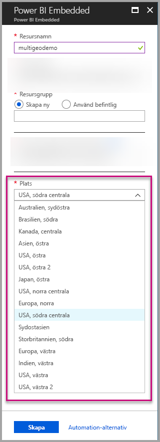
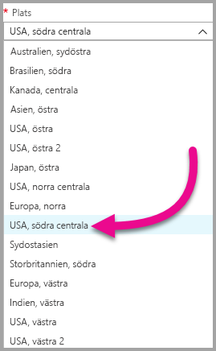
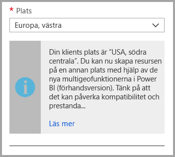
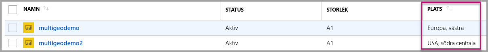
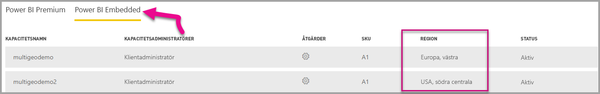

# Multi-Geo-stöd för Power BI Embedded

**Multi-Geo-stöd för Power BI Embedded** innebär att ISV: er och organisationer som utvecklar program som använder Power BI Embedded för att bädda in analyser i sina appar nu kan distribuera sina data i olika regioner runt om i världen.

Nu kan kunder som använder **Power BI Embedded** ställa in en **A-kapacitet** med **Multi-Geo**-alternativ baserad på samma funktioner och begränsningar som [Power BI Premium stöder genom att använda Multi-Geo](../service-admin-premium-Multi-Geo.md).

## Skapa en ny Power BI Embedded-kapacitetsresurs med Multi-GEO

På skärmen **Skapa resurs** väljer du platsen för din kapacitet. Fram till nu var den endast begränsad till platsen för din Power BI-klient så bara en enda plats var tillgänglig. Med Multi-Geo kan du välja mellan olika regioner för att distribuera din kapacitet.

Observera att när du öppnar listrutan över platser är din startklientorganisation standardvalet.
  

När du väljer en annan plats får du ett meddelande som kontrollerar att du är medveten om valet.

## Visa kapacitetsplats

Du kan se kapaciteternas plats enkelt när du går till huvudsidan i Power BI Embedded på Azure Portal.

Det visas också på administratörsportalen på Powerbi.com. På administratörsportalen väljer du ”Kapacitetsinställningar” och växlar sedan till fliken ”Power BI Embedded”.

[Läs mer om hur du skapar kapaciteter med Power BI Embedded.](azure-pbie-create-capacity.md)

## Hantera plats för befintliga kapaciteter

Du kan inte ändra plats för en Power BI Embedded-resurs när du har skapat en ny kapacitet.

Följ dessa steg om du vill flytta ditt Power BI-innehåll till en annan region:

1. [Skapa en ny kapacitet](azure-pbie-create-capacity.md) i en annan region.

2. Tilldela den nya kapaciteten alla arbetsytor från den befintliga kapaciteten.

3. Ta bort eller pausa den gamla kapaciteten.

Det är viktigt att observera att om du vill ta bort en kapacitet utan att tilldela om innehållet så flyttas allt innehåll i den kapaciteten till en delad kapacitet som finns i din hemregion.

## API-stöd för Multi-Geo

Vi har gjort några ändringar i befintliga API: er för att stödja hantering av kapaciteter med Multi-Geo via API:

1. **[Hämta kapaciteter](https://docs.microsoft.com/rest/api/power-bi/capacities/getcapacities)**  – API:n returnerar en lista med kapaciteter med åtkomst till användaren. Svaret innehåller nu en annan egenskap som kallas ”region”, som anger den kapacitetens plats.

2. **[Tilldela till kapacitet](https://docs.microsoft.com/rest/api/power-bi/capacities)**  – API:n gör att du kan tilldela en kapacitet en viss arbetsyta. Den här åtgärden låter dig inte tilldela en kapacitet utanför din hemregion arbetsytor eller flytta arbetsytor mellan olika kapaciteter i olika regioner. Om du vill göra det måste användaren eller [tjänstens huvudnamn](embed-service-principal.md) ha administratörsbehörigheter på arbetsytan och administrera eller tilldela behörighet på målkapaciteten.

3. **[Azure Resource Manager API](https://docs.microsoft.com/rest/api/power-bi-embedded/capacities)**  – alla Azure Resource Manager API-åtgärder, inklusive *Skapa* och *Ta bort*, har stöd för Multi-Geo.

## Begränsningar och överväganden

* Bekräfta att varje förflyttning du upprättar mellan regioner följer alla företags- och myndighetskrav innan du påbörjar dataöverföringen.

* En cachelagrad fråga som lagras i en avlägsen region kvar i den regionen i vila. Andra data under överföring kan dock flyttas fram och tillbaka mellan olika geografiska områden.

* När du flyttar data från en region till en annan i en Multi-Geo-miljö kan källdata finnas kvar i upp till 30 dagar i den region från vilken data har flyttats. Under den tiden har slutanvändare inte åtkomst till den. Den tas bort från den här regionen och förstörs under 30-dagarsperioden.

* Multi-Geo resultera inte i bättre prestanda i allmänhet. Att läsa in rapporter och instrumentpaneler involverar fortfarande förfrågningar om metadata från hemregionen.

## Nästa steg

Läs mer om Power BI Embedded-kapaciteter och Multi-Geo-alternativ för alla kapaciteter via länkarna nedan.

* [Vad är Power BI Embedded?](azure-pbie-what-is-power-bi-embedded.md)

* [Skapa en Power BI Embedded-kapacitet](azure-pbie-create-capacity.md)

* [Multi-Geo i Power BI Premium-kapaciteter](../service-admin-premium-multi-geo.md)

Har du fler frågor? [Fråga Power BI Community](http://community.powerbi.com/)