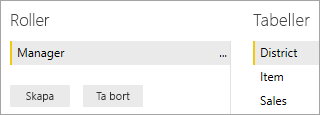
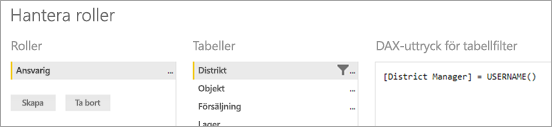
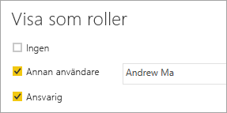

# <a name="use-row-level-security-with-power-bi-embedded-content"></a>Säkerhet på radnivå med inbäddat innehåll i Power BI
Säkerhet på radnivå (RLS) kan användas för att begränsa användares åtkomst till data i instrumentpaneler, paneler, rapporter och datauppsättningar. Flera olika användare kan arbeta med samma artefakter och alla se olika data. Inbäddning har stöd för RLS.

Om du bäddar in för användare som inte använder Power BI (appen äger data), vilket vanligtvis är ett ISV-scenario, är det här rätt artikel för dig. Du behöver konfigurera en inbäddningstoken för användaren och rollen. Läs vidare för att lära dig hur du gör detta.

Om du bäddar in till Power BI-användare (användare äger data) i din organisation fungerar RLS på samma sätt som i Power BI-tjänsten. Du behöver inte göra något mer i din app. Mer information finns i [säkerhet på radnivå (RLS) med Power BI](../service-admin-rls.md).


För att använda RLS är det viktigt att du förstå tre huvudsakliga koncept: användare, roller och regler. Låt oss ta en närmare titt på var och en:

**Användare** – slutanvändare visar artefakten (instrumentpanel, panel, rapport eller datauppsättning). Användare identifieras av username-egenskapen i en inbäddningstoken i Power BI Embedded.

**Roller** – användare tillhör roller. En roll är en behållare för regler och har namn som *försäljningschef* eller *säljare*. Du kan skapa roller i Power BI Desktop. Mer information finns i [Säkerhet på radnivå (RLS) med Power BI Desktop](../desktop-rls.md).

**Regler** – roller har regler och dessa regler är de faktiska filter som ska tillämpas på data. De kan vara enkla som ”Land = USA” eller något mycket mer dynamiskt.
I resten av den här artikeln ger vi exempel på hur RLS skapas och används i en inbäddad app. Vårt exempel använder PBIX-filen [Exempel för detaljhandelanalys](http://go.microsoft.com/fwlink/?LinkID=780547).


## <a name="adding-roles-with-power-bi-desktop"></a>Lägga till roller med Power BI Desktop
Vårt detaljhandelsexempel visar försäljning för alla butiker i en kedja. Utan RLS kommer samma data att visas oavsett vilken regionchef som loggar in. Företagsledningen har fastställt att varje regionschef endast bör se försäljning för butiker de hanterar och för att göra detta kan vi använda RLS.

RLS har skrivits i Power BI Desktop. När datauppsättningen och rapporten öppnas växlar vi till diagramvy för att visa schemat:


Här följer några saker att observera med schemat:

* Alla åtgärder som **Totalförsäljning** lagras i faktatabellen för **Försäljning**.
* Det finns ytterligare fyra relaterade dimensionstabeller: **Objekt**, **Tid**, **Butik** och **Distrikt**.
* Pilar på relationen raderna visar hur filter kan flöda från en tabell till en annan. Om exempelvis ett filter är placerat på **Tid [Date]** filtrerar den bara ned värdena i tabellen **Försäljning** i det aktuella schemat. Inga andra tabeller kan påverkas av det här filtret eftersom alla pilar i relationsraderna pekar på försäljningstabellen och inte bort.
* Tabellen **Distrikt** anger vem som är chef för varje distrikt:
  
    

Baserat på det här schemat, om vi använder ett filter på kolumnen **Distrikt** i tabellen **Distrikt** och om filtret matchar användaren som visar rapporten kommer filtret också filtrera ned tabellerna **Butik** och **Försäljning** för att endast visa data för den distriktchefen.

Gör så här:

1. Välj **Hantera roller** på fliken **Modellering**.
   
    
2. Skapa en ny roll som heter **Chef**.
   
    
3. I tabellen **Distrikt** anger du följande DAX-uttryck: **[distriktchef] = USERNAME()**.
   
    
4. Kontrollera att reglerna fungerar på fliken **Modellering**, välj **Visa som roller** och välj sedan både rollen **Chef** som du precis skapade, tillsammans med  **Andra användare**. Ange **Andrew Ma** för användaren.
   
    
   
    Rapporterna kommer nu att visa data som om du har loggat in som **Andrew Ma**.

När vi tillämpar filtret på detta sätt filtreras alla poster i tabellerna **Distrikt**, **Butik** och **Försäljning**. Men på grund av filterriktningen för relationerna mellan **Försäljning** och **Tid**, **Försäljning** och **Objekt**, samt **Objekt** och **tid** filtreras tabellerna inte. Om du vill veta mer om dubbelriktad korsfiltrering kan du hämta vårt whitepaper [Dubbelriktad korsfiltrering i SQL Server Analysis Services 2016 och Power BI Desktop](http://download.microsoft.com/download/2/7/8/2782DF95-3E0D-40CD-BFC8-749A2882E109/Bidirectional%20cross-filtering%20in%20Analysis%20Services%202016%20and%20Power%20BI.docx).

## <a name="applying-user-and-role-to-an-embed-token"></a>Tillämpa användare och roll på en inbäddningstoken
Nu när du har konfigurerat din Power BI Desktop-roller måste du vidta vissa åtgärder i din app för att dra nytta av rollerna.

Användare är autentiserade och auktoriserade av ditt program och bäddar in tokens som används för att bevilja användaren åtkomst till en viss Power BI Embedded-rapport. Power BI Embedded har inte någon särskild information om vem din användare är. För att RLS ska fungera måste du skicka ytterligare kontext som del av din inbäddade token som identiteter. Detta görs med API:et [GenerateToken](https://msdn.microsoft.com/library/mt784614.aspx).

API:et [GenerateToken](https://msdn.microsoft.com/library/mt784614.aspx) accepterar en lista med identiteter med information om relevanta datauppsättningar. För att RLS ska fungera måste du skicka följande som en del av identiteten.

* **användarnamn (obligatorisk)** – detta är en sträng som kan användas för att identifiera användaren när du använder RLS-regler. Det går bara att lista enskilda användare.
* **Roller (obligatorisk)** – en sträng som innehåller rollerna som kan väljas vid tillämpning av säkerhet på radnivå. Om du skickar mer än en roll bör de skickas som strängmatris.
* **datauppsättning (obligatoriskt)** – datauppsättningen som gäller för artefakten du bäddar in. 

Du kan skapa en inbäddningstoken med hjälp av metoden **GenerateTokenInGroup** på **PowerBIClient.Reports**. 

Du kan till exempel ändra exemplet [PowerBIEmbedded_AppOwnsData](https://github.com/Microsoft/PowerBI-Developer-Samples/tree/master/App%20Owns%20Data). *Home\HomeController.cs rad 76 och 77* kan uppdateras från:

```
// Generate Embed Token.
var generateTokenRequestParameters = new GenerateTokenRequest(accessLevel: "view");

var tokenResponse = await client.Reports.GenerateTokenInGroupAsync(GroupId, report.Id, generateTokenRequestParameters);
```

till

```
var generateTokenRequestParameters = new GenerateTokenRequest("View", null, identities: new List<EffectiveIdentity> { new EffectiveIdentity(username: "username", roles: new List<string> { "roleA", "roleB" }, datasets: new List<string> { "datasetId" }) });

var tokenResponse = await client.Reports.GenerateTokenInGroupAsync("groupId", "reportId", generateTokenRequestParameters);
```

Om du anropar REST API accepterar det uppdaterade API:et nu ytterligare en JSON-matris med namnet **identiteter**, som innehåller ett användarnamn, en lista över strängroller och en lista över strängdatauppsättningar, t.ex.:

```
{
    "accessLevel": "View",
    "identities": [
        {
            "username": "EffectiveIdentity",
            "roles": [ "Role1", "Role2" ],
            "datasets": [ "fe0a1aeb-f6a4-4b27-a2d3-b5df3bb28bdc" ]
        }
    ]
}
```

Nu är allt på plats. När någon nu loggar in i programmet för att visa artefakten syns bara de data personen har behörighet att visa enligt vad som definieras av säkerhetsinställningarna på radnivå.

## <a name="working-with-analysis-services-live-connections"></a>Arbete med realtidsanslutningar till Analysis Services
Säkerhet på radnivå kan användas med Analysis Services liveanslutningar för lokala servrar. Det finns några specifika begrepp som du bör känna till när du använder den här typen av anslutning.

Den identitet som har angetts för egenskapen användarnamn måste vara en Windows-användare med behörigheter på Analysis Services-servern.

**Konfiguration för lokal datagateway**

En [lokal datagateway](../service-gateway-onprem.md) används när du arbetar med live-anslutningar till Analysis Services. När du genererar en inbäddningstoken med en identitet som anges måste huvudkontot visas som en gatewayadministratör. Om masterkontot inte listas kommer säkerheten på låg nivå inte tillämpas korrekt på data. En icke-administratörer på gatewayen kan ange roller, men måste ange ett eget användarnamn för den effektiva identiteten.

**Användning av roller**

Roller kan tilldelas med en identitet i en inbäddad token. Om ingen roll anges kommer det angivna användarnamnet att användas för att lösa de associerade rollerna.

## <a name="considerations-and-limitations"></a>Överväganden och begränsningar
* Tilldelningen av användare till roller i Power BI-tjänsten påverkar inte RLS när du använder en inbäddningstoken.
* Medan Power BI-tjänsten inte tillämpar RLS-inställningar för administratörer eller medlemmar som har behörighet att redigera tillämpas identiteter med en inbäddad token på data.
* Analysis Services realtidsanslutningar stöds för lokala servrar.
* Azure Analysis Services live-anslutningar stöder filtrering efter roller, men inte dynamiska efter användarnamn.
* Om den underliggande datamängden inte kräver RLS får GenerateToken-begäran **inte** innehålla en effektiv identitet.
* Om den underliggande datauppsättningen är en molnmodell (cachelagrad modell eller DirectQuery) måste den effektiva identiteten innehålla minst en roll, annars sker ingen rolltilldelning.
* En lista över identiteter möjliggör flera identitetstoken för inbäddning av instrumentpanelen. För andra artefakter innehåller listan en enstaka identitet.

Har du fler frågor? [Fråga Power BI Community](https://community.powerbi.com/)

