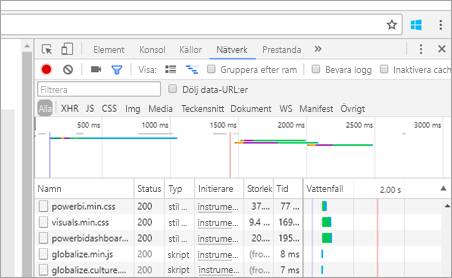
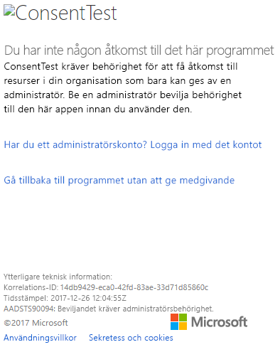
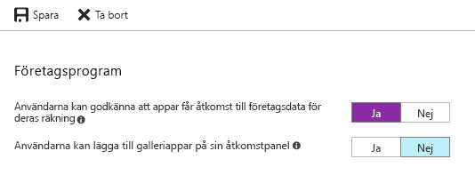

# <a name="troubleshoot-your-embedded-application"></a>Felsök ditt inbäddade program

Den här artikeln går igenom några vanliga problem som kan uppstå när du bäddar in innehåll från Power BI.

## <a name="tools-to-troubleshoot"></a>Verktyg för felsökning

### <a name="fiddler-trace"></a>Fiddlerspårning

[Fiddler](http://www.telerik.com/fiddler) är ett kostnadsfritt verktyg från Telerik som övervakar HTTP-trafik.  Du kan se trafiken med Power BI-API:erna från klientdatorn. Det här verktyget visar fel och annan relaterad information.


### <a name="f12-in-browser-for-front-end-debugging"></a>F12 i webbläsaren för felsökning av klientdelen

F12 startar utvecklarfönstret i din webbläsare. Detta verktyg ger dig möjlighet att titta på nätverkstrafik och annan information.



### <a name="extract-error-details-from-power-bi-response"></a>Extrahera felinformation från Power BI-svaret

Det här kodstycket visar hur man extraherar felinformationen från HTTP-undantaget:

```csharp
public static string GetExceptionText(this HttpOperationException exc)
{
    var errorText = string.Format("Request: {0}\r\nStatus: {1} ({2})\r\nResponse: {3}",
    exc.Request.Content, exc.Response.StatusCode, (int)exc.Response.StatusCode, exc.Response.Content);
    if (exc.Response.Headers.ContainsKey("RequestId"))
    {
        var requestId = exc.Response.Headers["RequestId"].FirstOrDefault();
        errorText += string.Format("\r\nRequestId: {0}", requestId);
    }

    return errorText;
}
```

Vi rekommenderar att du loggar ID för begäran (och felinformationen för felsökning).
Ange ID för begäran när du tar kontakt med Microsoft-supporten.

## <a name="app-registration"></a>Appregistrering

### <a name="app-registration-failure"></a>Appregistreringsfel

Felmeddelanden på Azure Portal eller Power BI-appregistreringssidan anger bristande behörigheter. Du måste vara en administratör i Azure AD-klienten för att registrera ett program eller så måste programregistreringar vara aktiverade för icke-administratörer.

### <a name="power-bi-service-doesnt-appear-in-the-azure-portal-when-registering-a-new-app"></a>Power BI-tjänsten visas inte i Azure-portalen när du registrerar en ny app

Minst en användare måste vara registrerad för Power BI. Om du inte ser **Power BI-tjänsten** i API-listan är ingen användare registrerad för Power BI.

## <a name="rest-api"></a>REST-API

### <a name="api-call-returning-401"></a>API-anropet returnerar 401

En fiddler-avbildning kan krävas för att undersöka vidare. Det nödvändiga behörighetsomfånget kan saknas för det registrerade programmet i Azure AD. Verifiera att det nödvändiga omfånget finns i appregistreringen för Azure AD i Azure-portalen.

### <a name="api-call-returning-403"></a>API-anropet returnerar 403

En fiddler-avbildning kan krävas för att undersöka vidare. Det kan finnas flera orsaker till ett 403-fel.

* Användaren har överskridit mängden inbäddningstoken som kan skapas på en delad kapacitet. Köp Azure-kapaciteter för att generera inbäddningstoken och tilldela arbetsytan till kapaciteten. Mer information finns på sidan om hur du [skapar en Power BI Embedded-kapacitet i Azure Portal](https://docs.microsoft.com/azure/power-bi-embedded/create-capacity).
* Azure AD-autentiseringstoken har upphört att gälla.
* Den autentiserade användaren är inte medlem i gruppen (apparbetsytan).
* Den autentiserade användaren är inte administratör i gruppen (apparbetsytan).
* Auktoriseringsrubriken är kanske inte korrekt listad. Kontrollera att det inte finns några stavfel.

Programmets serverdel kan behöva uppdatera auktoriseringstoken innan du anropar GenerateToken.

    ```
    GET https://wabi-us-north-central-redirect.analysis.windows.net/metadata/cluster HTTP/1.1
    Host: wabi-us-north-central-redirect.analysis.windows.net
    ...
    Authorization: Bearer eyJ0eXAiOi...
    ...

    HTTP/1.1 403 Forbidden
    ...

    {"error":{"code":"TokenExpired","message":"Access token has expired, resubmit with a new access token"}}
    ```

## <a name="authentication"></a>Autentisering

### <a name="authentication-failed-with-aadsts90002-tenant-authorize-not-found"></a>Autentiseringen misslyckades med felet AADSTS90002: Tenant 'authorize' not found (Auktorisering av klient hittades inte)

 Om du får meddelanden vid inloggning, till exempel ***error: invalid_request, error_description: AADSTS90002: Tenant 'authorize' not found*** är det för att ADAL 4.x inte stöder ”https://login.microsoftonline.com/{Tenant}/oauth2/authorize/” som utfärdar-URL.
 
Du kan lösa problemet genom att trimma ”oauth2/authorize/” i slutet av utfärdar-URL:en, se [Power BI Developer Samples](https://github.com/Microsoft/PowerBI-Developer-Samples) för referens.

 Ta en titt på [Better Authority validation](https://github.com/AzureAD/azure-activedirectory-library-for-dotnet/wiki/Changes-adalnet-4.0#better-authority-validation) (Bättre utfärdarvalidering) i den viktiga informationen om ADAL 4.x.

### <a name="authentication-failed-with-aadsts70002-or-aadsts50053"></a>Autentiseringen misslyckades med AADSTS70002 eller AADSTS50053

** _(AADSTS70002: Error validating credentials (Fel vid validering av autentiseringsuppgifter). AADSTS50053: You've tried to sign in too many times with an incorrect User ID or password (Du har försökt logga in för många gånger med ett felaktigt användar-ID eller lösenord)_ **

Om du använder Power BI Embedded och Azure AD:s direktautentisering och du får meddelanden när du loggar in som ***error:unauthorized_client, error_description:AADSTS70002: Error validating credentials (Fel vid validering av autentiseringsuppgifter). AADSTS50053: You've tried to sign in too many times with an incorrect User ID or password (Du har försökt logga in för många gånger med ett felaktigt användar-ID eller lösenord)***, beror detta på att direktautentisering som standard inte längre används sedan den 14 juni 2018.

Du kan aktivera funktionen igen med hjälp av en [Azure AD-princip](https://docs.microsoft.com/azure/active-directory/manage-apps/configure-authentication-for-federated-users-portal#enable-direct-authentication-for-legacy-applications) som definieras för organisationen eller [tjänstens huvudnamn](https://docs.microsoft.com/azure/active-directory/develop/active-directory-application-objects#service-principal-object).

Vi rekommenderar att du aktiverar den här principen enbart på appbasis.

Om du vill skapa den här principen måste du vara **Global administratör** för den katalog där du skapar principen och tilldelar. Här är ett exempelskript för att skapa principen och tilldela den till SP för det här programmet:

1. Installera [förhandsgranskningsmodulen för Azure AD PowerShell](https://docs.microsoft.com/powershell/azure/active-directory/install-adv2?view=azureadps-2.0).

2. Kör följande PowerShell-kommandon rad för rad (kontrollera att variabeln $sp inte har mer än ett program som resultat).

```powershell
Connect-AzureAD
```

```powershell
$sp = Get-AzureADServicePrincipal -SearchString "Name_Of_Application"
```

```powershell
$policy = New-AzureADPolicy -Definition @("{`"HomeRealmDiscoveryPolicy`":{`"AllowCloudPasswordValidation`":true}}") -DisplayName EnableDirectAuth -Type HomeRealmDiscoveryPolicy -IsOrganizationDefault $false
```

```powershell
Add-AzureADServicePrincipalPolicy -Id $sp.ObjectId -RefObjectId $policy.Id 
```

När du har tilldelat principen väntar du ungefär 15–20 sekunder för spridning innan du testar.

### <a name="generate-token-fails-when-providing-effective-identity"></a>Skapa token misslyckas när du anger en effektiv identitet

GenerateToken kan misslyckas med den effektiva identitet som angetts, av några olika skäl.

* Datauppsättningen stöder inte effektiv identitet
* Användarnamn har inte angetts
* Roll har inte angetts
* DatasetId har inte angetts
* Användaren har inte rätt behörighet

Prova stegen nedan för att verifiera vad det är.

* Kör [get dataset](https://docs.microsoft.com/rest/api/power-bi/datasets). Är egenskapen IsEffectiveIdentityRequired sann?
* Användarnamnet är obligatoriskt för alla EffectiveIdentity.
* Om IsEffectiveIdentityRolesRequired är sant, krävs rollen.
* DatasetId är obligatoriskt för alla EffectiveIdentity.
* För Analysis Services måste huvudanvändaren vara en gatewayadministratör.

### <a name="aadsts90094-the-grant-requires-admin-permission"></a>AADSTS90094: The grant requires admin permission (Beviljandet kräver administratörsbehörigheter)

**_Symptom:_ **<br>
När en icke-administratörsanvändare försöker logga in i ett program första gången för att bevilja medgivande och följande fel visas:

* ConsentTest kräver behörighet som bara kan ges av en administratör för att komma åt resurser i din organisation. Be en administratör bevilja behörighet till den här appen innan du använder den.
* AADSTS90094: Beviljandet kräver administratörsbehörighet.

    

En administratörsanvändare kan logga in och bevilja medgivande.

**_Rotorsak:_ **<br>
Användargodkännande har inaktiverats för klientorganisationen.

**_Det finns flera möjliga lösningar:_ **

*Aktivera användargodkännande för hela klientorganisationen (alla användare, alla program)*

1. I Azure-portalen navigerar du till Azure Active Directory => Användare och grupper => Användarinställningar
2. Aktivera ”Användare kan samtycka till att appar får åtkomst till företagsdata för deras räkning” och spara ändringarna.

    

En administratör kan *bevilja behörigheter* till programmet – antingen för hela klientorganisationen eller för en viss användare.

### <a name="cs1061-error"></a>CS1061 fel

Ladda ned [Microsoft.IdentityModel.Clients.ActiveDirectory](https://www.nuget.org/packages/Microsoft.IdentityModel.Clients.ActiveDirectory/2.22.302111727) om du får ett ”'AuthenticationContext' innehåller inte någon definition för” AcquireToken ”och ingen tillgänglig” AcquireToken ”tar emot en första argument av typen” AuthenticationContext' hittades (saknar du en med hjälp av direktiv eller en sammansättningsreferensen?) ”fel.

## <a name="data-sources"></a>Datakällor

### <a name="isv-wants-to-have-different-credentials-for-the-same-data-source"></a>ISV vill ha olika autentiseringsuppgifter för samma datakälla

En datakälla kan ha en enda uppsättning autentiseringsuppgifter för en huvudanvändare. Skapa ytterligare huvudanvändare om du behöver använda andra autentiseringsuppgifter. Tilldela därefter de olika autentiseringsuppgifterna i kontexten för varje huvudanvändare och bädda in med hjälp av Azure AD-token för den användaren.

## <a name="troubleshoot-your-embedded-application-with-the-ierror-object"></a>Felsöka inbäddade program med IError-objektet

Använd [ **IError-objektet** som returneras av *felhändelsen* från **JavaScript SDK**](https://github.com/Microsoft/PowerBI-JavaScript/wiki/Troubleshooting-and-debugging-of-embedded-parts) för att felsöka ditt program och bättre förstå orsaken till felen.

När du har hämtat IError-objektet bör du titta på relevant tabell över vanliga fel som passar den inbäddningstyp du använder. Jämför **IError-egenskaperna** med dem i tabellen och hitta möjliga skäl till felet.

### <a name="typical-errors-when-embedding-for-power-bi-users"></a>Vanliga fel vid inbäddning för Power BI-användare

| Meddelande | Detaljerat meddelande | Felkod | Möjliga orsaker |
|-------------------------------------------------------|-----------------------------------------------------------------------------------------------------------------------------|-----------|--------------------------------------------------------|
| TokenExpired | Åtkomsttoken har upphört att gälla, skicka igen med en ny åtkomsttoken | 403 | Token har upphört att gälla  |
| PowerBIEntityNotFound | Rapporten kunde inte hämtas | 404 | <li> Fel rapport-ID <li> Rapporten finns inte  |
| Ogiltiga parametrar | powerbiToken-parameter har inte angetts | Saknas | <li> Ingen åtkomsttoken har angetts <li> Inget rapport-ID har angetts |
| LoadReportFailed | Det gick inte att initiera – det gick inte att lösa klustret | 403 | * Felaktig åtkomsttoken * Inbäddningstypen matchar inte tokentypen |
| PowerBINotAuthorizedException | Rapporten kunde inte hämtas | 401 | <li> Fel grupp-ID <li> Ej auktoriserad grupp |
| TokenExpired | Åtkomsttoken har upphört att gälla, skicka igen med en ny åtkomsttoken. Det gick inte att återge ett visuellt rapportobjekt med namnet: <visual title> | Saknas | Frågedata Token har upphört att gälla |
| OpenConnectionError | Det går inte att visa det visuella objektet. Det gick inte att återge ett visuellt rapportobjekt med namnet: <visual title> | Saknas | Kapacitet som pausats eller tagits bort medan en rapport som rör kapaciteten var öppen i en session |
| ExplorationContainer_FailedToLoadModel_DefaultDetails | Det gick inte att läsa in modellschemat som är associerat med den här rapporten. Kontrollera att du har en anslutning till servern och försök igen. | Saknas | <li> Kapaciteten har pausats <li> Kapaciteten har tagits bort |

### <a name="typical-errors-when-embedding-for-non-power-bi-users-using-an-embed-token"></a>Vanliga fel när du bäddar in för icke-Power BI-användare (med en inbäddningstoken)

| Meddelande | Detaljerat meddelande | Felkod | Orsaker |
|-------------------------------------------------------|-------------------------------------------------------------------------------------------------------------------------------|------------|-------------------------------------------------|
| TokenExpired | Åtkomsttoken har upphört att gälla, skicka igen med en ny åtkomsttoken | 403 | Token har upphört att gälla  |
| LoadReportFailed | Rapporten kunde inte hämtas | 404 | <li> Fel rapport-ID <li> Rapporten finns inte  |
| LoadReportFailed | Rapporten kunde inte hämtas | 403 | Rapport-ID matchar inte token |
| LoadReportFailed | Rapporten kunde inte hämtas | 500 | Angivet rapport-ID är inte ett guid |
| Ogiltiga parametrar | powerbiToken-parameter har inte angetts | Saknas | <li> Ingen åtkomsttoken har angetts <li> Inget rapport-ID har angetts |
| LoadReportFailed | Det gick inte att initiera – det gick inte att lösa klustret | 403 | Fel tokentyp, ogiltig token |
| PowerBINotAuthorizedException | Rapporten kunde inte hämtas | 401 | Fel/obehörigt grupp-ID |
| TokenExpired | Åtkomsttoken har upphört att gälla, skicka igen med en ny åtkomsttoken. Det gick inte att återge ett visuellt rapportobjekt med namnet: <visual title> | Saknas | Frågedata Token har upphört att gälla |
| OpenConnectionError | Det går inte att visa det visuella objektet. Det gick inte att återge ett visuellt rapportobjekt med namnet: <visual title> | Saknas | Kapacitet som pausats eller tagits bort medan en rapport som rör kapaciteten var öppen i en session |
| ExplorationContainer_FailedToLoadModel_DefaultDetails | Det gick inte att läsa in modellschemat som är associerat med den här rapporten. Kontrollera att du har en anslutning till servern och försök igen. | Saknas | <li> Kapaciteten har pausats <li> Kapaciteten har tagits bort |

## <a name="content-rendering"></a>Innehållsåtergivning

### <a name="performance"></a>Prestanda

[Power BI Embedded-prestanda](embedded-performance-best-practices.md)

### <a name="rendering-or-consumption-of-embedded-content-fails-or-times-out"></a>Återgivning eller förbrukning av det inbäddade innehållet misslyckas eller når tidsgränsen

Kontrollera att inbäddningstoken inte har upphört att gälla. Se till att du kontrollerar giltighetstiden för inbäddningstoken och uppdaterar den. Mer information finns i [uppdatera token med JavaScript SDK](https://github.com/Microsoft/PowerBI-JavaScript/wiki/Refresh-token-using-JavaScript-SDK-example).

### <a name="report-or-dashboard-doesnt-load"></a>Rapporten eller instrumentpanelen läses inte in

Om användaren inte kan se rapporten eller instrumentpanelen, kontrollera att rapporten eller instrumentpanelen laddas korrekt i powerbi.com. Rapporten eller instrumentpanelen fungerar inte i ditt program om det inte laddas i powerbi.com.

### <a name="report-or-dashboard-is-performing-slowly"></a>Rapporten eller instrumentpanelen har dålig prestanda

Öppna filen från Power BI Desktop eller på powerbi.com och verifiera att prestandan är acceptabel för att kunna utesluta problem med ditt program eller inbäddnings-API:erna.

## <a name="embed-setup-tool"></a>Konfigurationsverktyg för inbäddning

Med [konfigurationsverktyget för inbäddning](https://aka.ms/embedsetup) kan du snabbt ladda ned ett exempelprogram. Sedan kan du jämföra ditt program med exemplet.

### <a name="prerequisites"></a>Förutsättningar

Kontrollera att du uppfyller förhandskraven innan du använder konfigurationsverktyget för inbäddning. Du behöver ett **Power BI Pro**-konto och en **Microsoft Azure**-prenumeration.

* Om du inte har registrerat dig för **Power BI Pro**, [registrerar du dig för en kostnadsfri utvärderingsversion](https://powerbi.microsoft.com/pricing/) innan du börjar.
* Om du inte har någon Azure-prenumeration kan du [skapa ett kostnadsfritt konto](https://azure.microsoft.com/free/?WT.mc_id=A261C142F) innan du börjar.
* Du måste ha en egen installation för [Azure Active Directory-klient](create-an-azure-active-directory-tenant.md).
* Du behöver [Visual Studio](https://www.visualstudio.com/) installerad (version 2013 eller senare).

### <a name="common-issues"></a>Vanliga problem

Här följer exempel på några vanliga problem som kan uppstå vid testning med konfigurationsverktyget för inbäddning:

#### <a name="using-the-embed-for-your-customers-sample-application"></a>Använda exempelprogrammet Embed for your customers (Bädda in för dina kunder)

Om du arbetar med upplevelsen **Embed for your customers** (Bädda in för dina kunder) börjar du med att spara och packa upp filen *PowerBI-Developer-Samples.zip*. Öppna sedan mappen *PowerBI-Developer-Samples-master\App Owns Data* och kör filen *PowerBIEmbedded_AppOwnsData.sln*.

När du väljer **Bevilja behörigheter** (steget Bevilja behörigheter) visas följande fel:

    AADSTS70001: Application with identifier <client ID> wasn't found in the directory <directory ID>

Du kommer runt det här problemet genom att stänga popup-fönstret, vänta några sekunder och sedan försöka igen. Du kan behöva upprepa den här åtgärden några gånger. En tidsförskjutning gör att programregistreringen inte kan slutföras förrän den är tillgänglig för externa API:er.

Följande felmeddelande visas när du kör exempelappen:

    Password is empty. Please fill password of Power BI username in web.config.

Det här felet uppstår eftersom det enda värdet som inte matas in i exempelprogrammet är användarlösenordet. Öppna filen Web.config i lösningen och fyll i fältet pbiPassword med användarens lösenord.

Om du får felet – AADSTS50079: The user is required to use multi-factor authentication (Användaren måste använda multifaktorautentisering).

    Need to use an AAD account that doesn't have MFA enabled.

#### <a name="using-the-embed-for-your-organization-sample-application"></a>Använda exempelprogrammet Embed for your organization (Bädda in för din organisation)

Om du arbetar med upplevelsen **Embed for your organization** (Bädda in för din organisation) börjar du med att spara och packa upp filen *PowerBI-Developer-Samples.zip*. Öppna sedan mappen *PowerBI-Developer-Samples-master\User Owns Data\integrate-report-web-app* och kör filen *pbi-saas-embed-report.sln*.

När du kör exempelappen **Embed for your organization** (Bädda in för din organisation) visas följande fel:

    AADSTS50011: The reply URL specified in the request doesn't match the reply URLs configured for the application: <client ID>

Felet beror på att omdirigerings-URL:en som angetts för webbserverprogrammet skiljer sig från exemplets URL. Om du vill registrera exempelprogrammet använder du `http://localhost:13526/` som omdirigerings-URL.

Om du vill redigera det registrerade programmet läser du avsnittet om hur du uppdaterar ett [Azure AD-registrerat program](https://docs.microsoft.com/azure/active-directory/develop/quickstart-v1-update-azure-ad-app), så att programmet kan ge åtkomst till webb-API:erna.

Om du vill redigera din Power BI-användarprofil eller dina Power BI-data läser du avsnittet om hur du redigerar [Power BI-data](https://docs.microsoft.com/power-bi/service-basic-concepts).

Om du får felet – AADSTS50079: The user is required to use multi-factor authentication (Användaren måste använda multifaktorautentisering).

    Need to use an AAD account that doesn't have MFA enabled.

Mer information finns i [Vanliga frågor om Power BI Embedded](embedded-faq.md).

Har du fler frågor? [Prova Power BI Community](http://community.powerbi.com/)

Om du behöver ytterligare hjälp kan du [kontakta supporten](https://powerbi.microsoft.com/support/pro/?Type=documentation&q=power+bi+embedded) eller [skapa en supportbegäran via Azure-portalen](https://ms.portal.azure.com/#blade/Microsoft_Azure_Support/HelpAndSupportBlade/newsupportrequest) och ange de felmeddelanden du får.

## <a name="next-steps"></a>Nästa steg

Mer information finns i [Vanliga frågor och svar](embedded-faq.md).

Har du fler frågor? [Prova Power BI Community](http://community.powerbi.com/)
