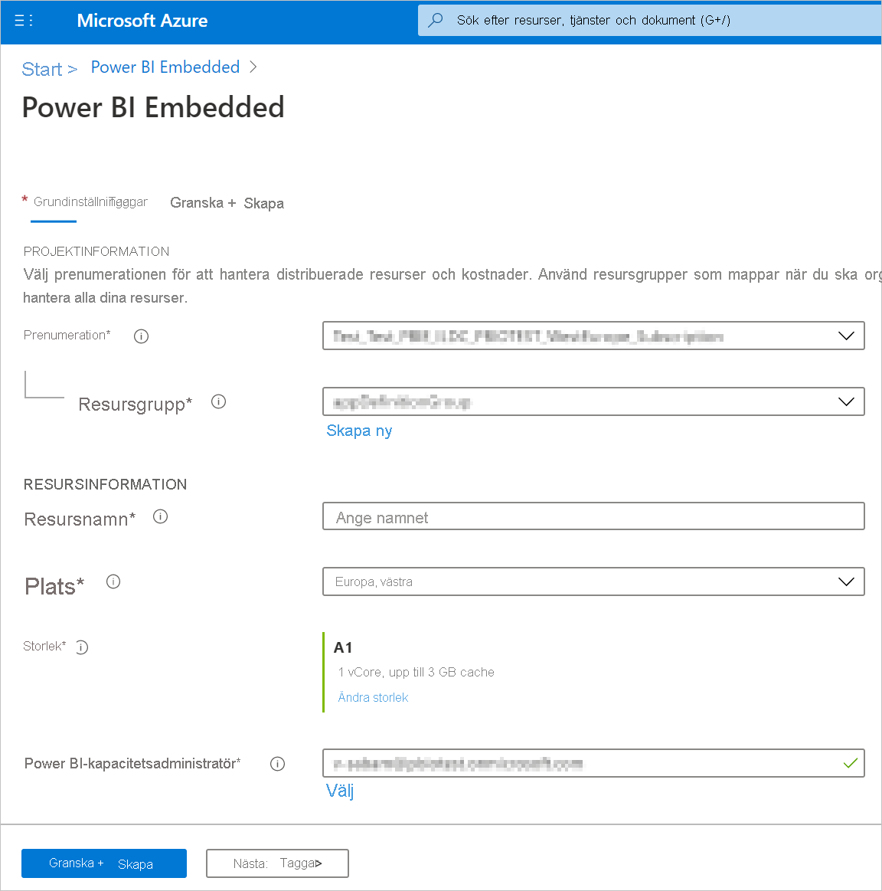
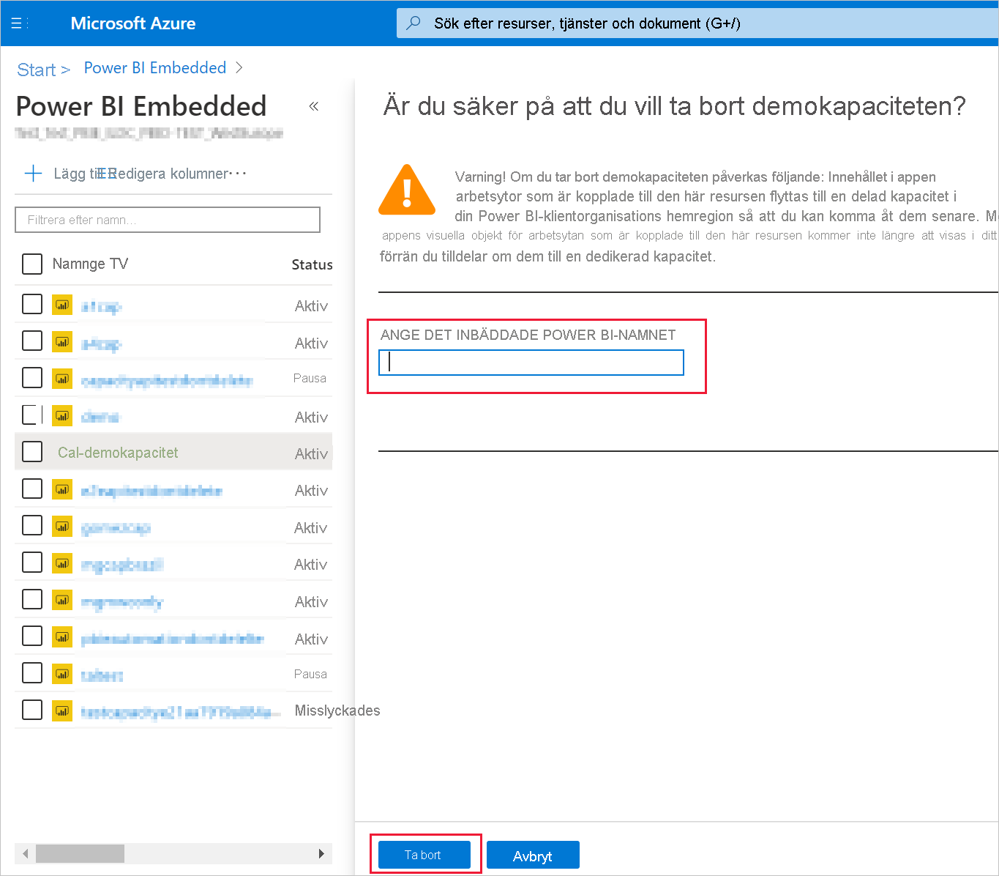

# <a name="create-power-bi-embedded-capacity-in-the-azure-portal"></a>Skapa Power BI Embedded-kapacitet på Azure Portal

Den här artikeln beskriver hur du skapar en [Power BI Embedded](azure-pbie-what-is-power-bi-embedded.md)-kapacitet i Microsoft Azure. Power BI Embedded förenklar användningen av funktionerna i Power BI genom att lägga till fantastiska visuella objekt, rapporter och instrumentpaneler i dina appar.

## <a name="before-you-begin"></a>Innan du börjar

För att slutföra den här snabbstarten behöver du:

* **Azure-prenumeration:** Gå till [Kostnadsfri utvärderingsversion av Azure](https://azure.microsoft.com/free/) för att skapa ett konto.

* **Azure Active Directory:** Din prenumeration måste vara associerad med en Azure Active Directory-klient (Azure AD). Dessutom ***måste du vara registrerad i Azure med ett konto i den klientorganisationen***. Microsoft-konton stöds inte. Mer information finns i [Autentisering och användarbehörigheter](https://docs.microsoft.com/azure/analysis-services/analysis-services-manage-users).

* **Power BI-klient:** Minst ett konto i Azure AD-klientorganisationen måste vara registrerat för Power BI.

* **Resursgrupp:** Använd en resursgrupp som du redan har eller [skapa en ny](https://docs.microsoft.com/azure/azure-resource-manager/resource-group-overview).

## <a name="create-a-capacity"></a>Skapa en kapacitet

Innan du skapar en Power BI Embedded-kapacitet ser du till att du har loggat in i Power BI minst en gång.

# <a name="portal"></a>[Portal](#tab/portal)

1. Logga in på [Azure Portal](https://portal.azure.com/).

2. Sök efter *Power BI Embedded* i sökrutan.

3. Välj **Lägg till** i Power BI Embedded.

4. Fyll i den information som efterfrågas och klicka på **Granska och skapa**.

    

    * **Prenumeration** – den prenumeration du vill skapa kapaciteten för.

    * **Resursgrupp** – den resursgrupp som ska innehålla den nya kapaciteten. Välj en befintlig resursgrupp eller skapa en ny. Mer information finns i [Översikt över Azure Resource Manager](https://docs.microsoft.com/azure/azure-resource-manager/resource-group-overview).

    * **Resursnamn** – kapacitetens resursnamn.

    * **Plats** – platsen där Power BI körs för klientorganisationen. Standardplatsen är din hemregion, men du kan ändra plats med hjälp av [Multi-Geo-alternativ](embedded-multi-geo.md).

    * **Storlek** – den [A-SKU](../../admin/service-admin-premium-purchase.md#purchase-a-skus-for-testing-and-other-scenarios) du behöver. Mer information finns i [Minne och beräkningskraft för SKU:er](/embedded/embedded-capacity.md#sku-memory-and-computing-power).

    * **Administratör för Power BI-kapacitet** – en administratör för kapaciteten.
        >[!NOTE]
        >* Som standard är den användare som skapar kapaciteten även administratör för den.
        >* Du kan välja en annan användare eller tjänstens huvudnamn som administratör för kapaciteten.
        >* Kapacitetsadministratören måste tillhöra den klientorganisation där kapaciteten etableras. B2B-användare kan inte vara kapacitetsadministratörer.

# <a name="azure-cli"></a>[Azure CLI](#tab/CLI)

### <a name="use-azure-cloud-shell"></a>Använda Azure Cloud Shell

Azure är värd för Azure Cloud Shell, en interaktiv gränssnittsmiljö som du kan använda via webbläsaren. Du kan använda antingen Bash eller PowerShell med Cloud Shell för att arbeta med Azure-tjänster. Du kan använda förinstallerade Cloud Shell-kommandon för att köra koden i den här artikeln utan att behöva installera något i din lokala miljö.

Så här startar du Azure Cloud Shell:

| Alternativ | Exempel/länk |
|-----------------------------------------------|---|
| Välj **Prova** i det övre högra hörnet av ett kodblock. Om du väljer **Prova** kopieras koden inte automatiskt till Cloud Shell. |  |
| Gå till [https://shell.azure.com](https://shell.azure.com) eller Välj knappen **Starta Cloud Shell** för att öppna Cloud Shell i webbläsaren. | [](https://shell.azure.com) |
| Välj knappen **Cloud Shell** på menyn längst upp till höger i [Azure-portalen](https://portal.azure.com). |  |

Så här kör du koden i den här artikeln i Azure Cloud Shell:

1. Starta Cloud Shell.

2. Kopiera koden genom att klicka på knappen **Kopiera** på ett kodblock.

3. Klistra in koden i Cloud Shell-sessionen genom att välja **Ctrl**+**Skift**+**V** på Windows och Linux eller genom att välja **Cmd**+**Skift**+**V** på macOS.

4. Välj **Retur** för att köra koden.

## <a name="prepare-your-environment"></a>Förbered din miljö

För kapacitetskommandon i Power BI Embedded måste du ha version 2.3.1 eller senare av Azure CLI. Kör `az --version` för att se vilken version och vilka beroende bibliotek som är installerade. Om du behöver installera eller uppgradera kan du läsa [Installera Azure CLI](/cli/azure/install-azure-cli).

1. Logga in.

   Logga in med kommandot [az login](/cli/azure/reference-index#az-login) om du använder en lokal CLI-installation.

    ```azurecli
    az login
    ```

    Slutför autentiseringsprocessen genom att följa anvisningarna i terminalen.

2. Installera Azure CLI-tillägget.

    När du arbetar med tilläggsreferenser för Azure CLI måste du först installera tillägget.  Med Azure CLI-tillägg får du tillgång till experimentella kommandon som inte finns med i standardversionen av CLI:t ännu.  Läs mer om tillägg, bland annat hur du uppdaterar och avinstallerar dem, i [Använda tillägg med Azure CLI](/cli/azure/azure-cli-extensions-overview).

    Installera tillägget för Power BI Embedded-kapaciteter genom att köra följande kommando:

    ```azurecli
    az extension add --name powerbidedicated
    ```

### <a name="create-a-capacity-with-azure-cli"></a>Skapa en kapacitet med Azure CLI

Använd kommandot [az Power BI embedded-capacity create](https://docs.microsoft.com/cli/azure/ext/powerbidedicated/powerbi/embedded-capacity?view=azure-cli-latest#ext-powerbidedicated-az-powerbi-embedded-capacity-create) för att skapa en kapacitet.

```azurecli
az powerbi embedded-capacity create --location westeurope
                                    --name
                                    --resource-group
                                    --sku-name "A1"
                                    --sku-tier "PBIE_Azure"
```

### <a name="delete-a-capacity-with-azure-cli"></a>Ta bort en kapacitet med Azure CLI

Om du vill ta bort en kapacitet med Azure CLI använder du kommandot [az powerbi embedded-capacity delete](https://docs.microsoft.com/cli/azure/ext/powerbidedicated/powerbi/embedded-capacity?view=azure-cli-latest#ext-powerbidedicated-az-powerbi-embedded-capacity-delete).

```azurecli
az powerbi embedded-capacity delete --name
                                    --resource-group
```

### <a name="manage-your-capacity-with-azure-cli"></a>Hantera din kapacitet med Azure CLI

Du kan visa alla Power BI Embedded Azure CLI-kommandon med [az powerbi](https://docs.microsoft.com/cli/azure/ext/powerbidedicated/powerbi?view=azure-cli-latest).

# <a name="arm-template"></a>[ARM-mall](#tab/ARM-template)

### <a name="use-resource-manager-template"></a>Använda Resource Manager-mallar

En [Resource Manager-mall](https://docs.microsoft.com/azure/azure-resource-manager/templates/overview) är en JSON-fil (JavaScript Object Notation) som definierar infrastrukturen och konfigurationen för ditt projekt. Mallen använder deklarativ syntax, som låter dig ange vad du vill distribuera utan att du behöver skriva sekvensen med programmeringskommandon för att skapa det. Om du vill veta mer om hur du utvecklar Resource Manager-mallar kan du läsa mer i [Resource Manager-dokumentationen](https://docs.microsoft.com/azure/azure-resource-manager/) och [mallreferensen](https://docs.microsoft.com/azure/templates/).

Om du inte har en Azure-prenumeration kan du skapa ett [kostnadsfritt](https://azure.microsoft.com/free/) konto innan du börjar.

### <a name="review-the-template"></a>Granska mallen

Mallen som används i den här snabbstarten kommer från [Azure-snabbstartsmallar](https://azure.microsoft.com/resources/templates/101-power-bi-embedded).

```json
{
    "$schema": "https://schema.management.azure.com/schemas/2019-04-01/deploymentTemplate.json#",
    "contentVersion": "1.0.0.0",
    "parameters": {
        "name": {
            "type": "string",
            "metadata": {
              "description": "The capacity name, which is displayed in the Azure portal and the Power BI admin portal"
            }
        },
        "location": {
            "type": "string",
            "defaultValue": "[resourceGroup().location]",
            "metadata": {
              "description": "The location where Power BI is hosted for your tenant"
            }
        },
        "sku": {
            "type": "string",
            "allowedValues": [
                "A1",
                "A2",
                "A3",
                "A4",
                "A5",
                "A6"
            ],
            "metadata": {
              "description": "The pricing tier, which determines the v-core count and memory size for the capacity"
            }
        },
        "admin": {
            "type": "string",
            "metadata": {
              "description": "A user within your Power BI tenant, who will serve as an admin for this capacity"
            }
        }
    },
    "resources": [
        {
            "type": "Microsoft.PowerBIDedicated/capacities",
            "apiVersion": "2017-10-01",
            "name": "[parameters('name')]",
            "location": "[parameters('location')]",
            "sku": {
                "name": "[parameters('sku')]"
            },
            "properties": {
                "administration": {
                    "members": [
                        "[parameters('admin')]"
                    ]
                }
            }
        }
    ]
}
```

En Azure-resurs definieras i mallen, [Microsoft.PowerBIDedicated/capacities Az](https://docs.microsoft.com/azure/templates/microsoft.powerbidedicated/allversions) – skapa en Power BI Embedded-kapacitet.

### <a name="deploy-the-template"></a>Distribuera mallen

1. Välj följande länk för att logga in i Azure och öppna en mall. Mallen skapar en Power BI Embedded-kapacitet.

    [](https://portal.azure.com/#create/Microsoft.Template/uri/https%3a%2f%2fraw.githubusercontent.com%2fAzure%2fazure-quickstart-templates%2fmaster%2f101-power-bi-embedded%2fazuredeploy.json)

2. Fyll i den information som efterfrågas och klicka på **Granska och skapa**.

    

    * **Prenumeration** – den prenumeration du vill skapa kapaciteten för.

    * **Resursgrupp** – den resursgrupp som ska innehålla den nya kapaciteten. Välj en befintlig resursgrupp eller skapa en ny. Mer information finns i [Översikt över Azure Resource Manager](https://docs.microsoft.com/azure/azure-resource-manager/resource-group-overview).

    * **Region** – regionen som kapaciteten ska tillhöra.

    * **Namn** – kapacitetens namn.

    * **Plats** – platsen där Power BI körs för klientorganisationen. Standardplatsen är din hemregion, men du kan ändra plats med hjälp av [Multi-Geo-alternativ](/embedded/embedded-multi-geo.md).

    * **SKU** – den [A-SKU](../../admin/service-admin-premium-purchase.md#purchase-a-skus-for-testing-and-other-scenarios) du behöver. Mer information finns i [Minne och beräkningskraft för SKU:er](/embedded/embedded-capacity.md#sku-memory-and-computing-power).

    * **Admin** – en administratör för kapaciteten.
        >[!NOTE]
        >* Som standard är den användare som skapar kapaciteten även administratör för den.
        >* Du kan välja en annan användare eller tjänstens huvudnamn som administratör för kapaciteten.
        >* Kapacitetsadministratören måste tillhöra den klientorganisation där kapaciteten etableras. B2B-användare kan inte vara kapacitetsadministratörer.

### <a name="validate-the-deployment"></a>Verifiera distributionen

Så här verifierar du distributionen:

1. Logga in på [Azure Portal](https://portal.azure.com/).

2. Sök efter *Power BI Embedded* i sökrutan.

3. Granska listan med Power BI Embedded-kapaciteter och kontrollera att den nya kapaciteten du skapade finns med.

    

### <a name="clean-up-resources"></a>Rensa resurser

Så här tar du bort kapaciteten du har skapat:

1. Logga in på [Azure Portal](https://portal.azure.com/).

2. Sök efter *Power BI Embedded* i sökrutan.

3. Öppna snabbmenyn för kapaciteten du skapade och klicka på **Ta bort**.

    

4. Ange kapacitetens namn på bekräftelsesidan och klicka på **Ta bort**.

    

---

## <a name="next-steps"></a>Nästa steg

>[!div class="nextstepaction"]
>[Hantera kapaciteter](../../admin/service-admin-premium-manage.md)

>[!div class="nextstepaction"]
>[Pausa och starta din Power BI Embedded-kapacitet i Azure-portalen](azure-pbie-pause-start.md)

>[!div class="nextstepaction"]
>[Bädda in Power BI-innehåll i ett program för dina kunder](embed-sample-for-customers.md)

>[!div class="nextstepaction"]
>[Har du fler frågor? Ställ dem i Power BI Community](https://community.powerbi.com/)