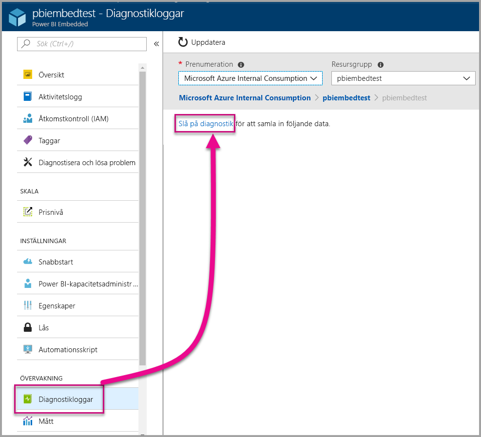
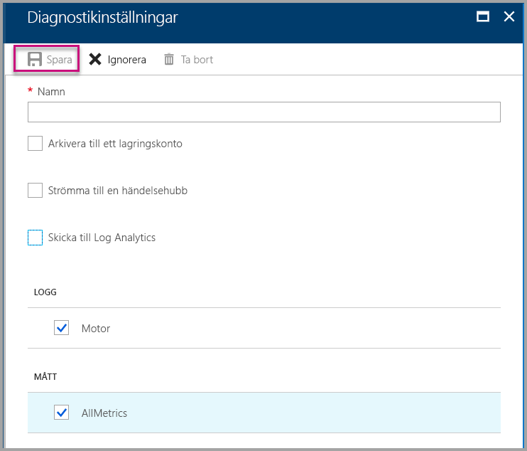
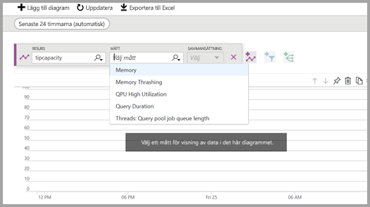
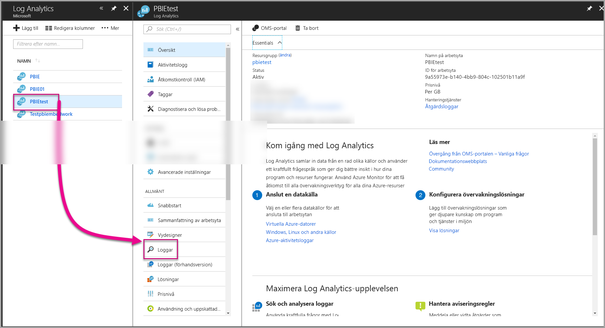
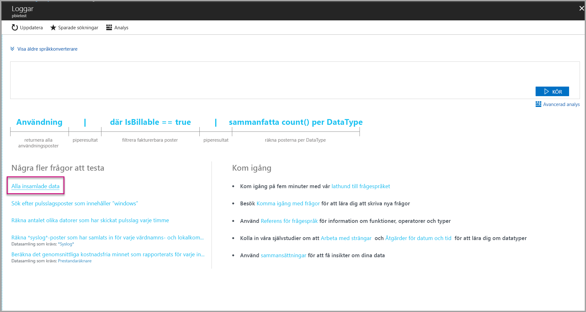
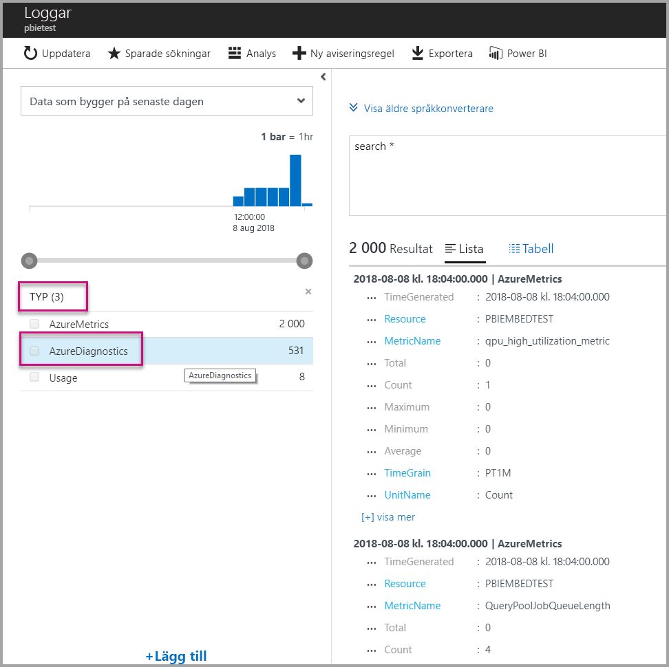
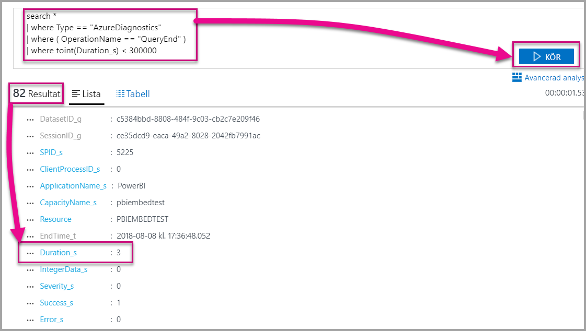
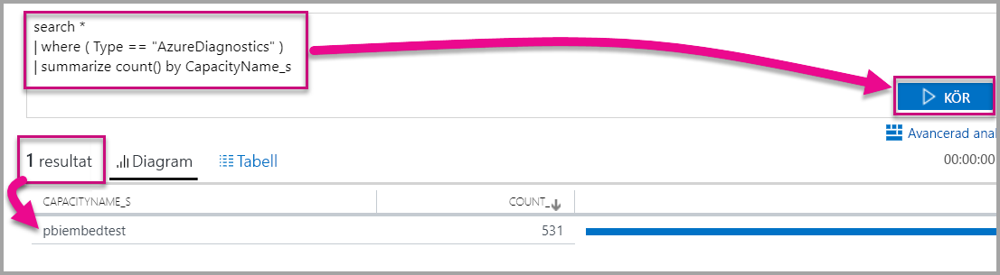

# <a name="diagnostic-logging-for-power-bi-embedded-in-azure"></a>Diagnostisk loggning för Power BI Embedded i Azure

Med [diagnostikloggarna för Azure-resurser](https://docs.microsoft.com/azure/monitoring-and-diagnostics/monitoring-overview-of-diagnostic-logs) kan du logga många händelser från din kapacitet, sammanföra dem i ett analysverktyg och få insikter i hur dina resurser beter sig.

Med hjälp av diagnostik kan du få hjälp i vissa situationer, till exempel med att

* identifiera långvariga eller problematiska frågor
* härleda [kapacitetsmått](https://powerbi.microsoft.com/blog/power-bi-developer-community-april-update/)
* spåra användning av specifika datamängder.

## <a name="set-up-diagnostics-logging"></a>Konfigurera diagnostikloggning

### <a name="azure-portal"></a>Azure Portal

1. I [Azure-portalen](https://portal.azure.com) > Power BI Embedded-resurs, väljer du **Diagnostikloggar** i navigeringsfönstret och sedan **Aktivera diagnostiken**.

    

2. I **Diagnostikinställningar** anger du följande alternativ:

    * **Namn** – ange ett namn för diagnostikinställningen för att skapa den.

    * **Arkivera till ett lagringskonto** – om du vill använda det här alternativet måste du ansluta till ett befintligt lagringskonto. Se [Skapa ett lagringskonto](https://docs.microsoft.com/azure/storage/common/storage-create-storage-account), och följ instruktionerna för att skapa ett lagringskonto. Välj sedan ditt lagringskonto genom att gå tillbaka till den här sidan i portalen. Det kan ta några minuter innan nyligen skapade lagringskonton visas i den nedrullningsbara menyn. Loggfilslagring i JSON-format.
    * **Strömma till en händelsehubb** – om du vill använda det här alternativet måste du ansluta till en befintlig namnrymd för en händelsehubb och en händelsehubb. Mer information finns i [Skapa en namnrymd för en händelsehubb och en händelsehubb med Azure-portalen](https://docs.microsoft.com/azure/event-hubs/event-hubs-create).
    * **Skicka till Log Analytics** – om du vill använda det här alternativet kan använda en befintlig arbetsyta eller skapa en ny Log Analytics-arbetsyta genom att följa stegen för att [skapa en ny arbetsyta](https://docs.microsoft.com/azure/log-analytics/log-analytics-quick-collect-azurevm#create-a-workspace) i portalen. Detta använder sig av [Azure Log Analytics](https://docs.microsoft.com/azure/log-analytics/log-analytics-overview) som innehåller inbyggda funktioner för analys, instrumentpanel och meddelanden. Du kan använda Log Analytics för att ansluta mer data från andra resurser och få en enda och komplett vy av data för ditt programs alla resurser. Det kan också anslutas till [Power BI med ett enda klick](https://docs.microsoft.com/azure/log-analytics/log-analytics-powerbi).
    Mer information om hur du visar dina loggar i Log Analytics finns i [Visa loggar i Log Analytics](https://docs.microsoft.com/azure/log-analytics/log-analytics-activity).
    * **Motor** – välj det här alternativet för att logga uppsättningen motorhändelser [ som anges](#whats-logged) nedan.
    * **AllMetrics** – Välj det här alternativet för att lagra utförliga data i [Mått](https://docs.microsoft.com/azure/analysis-services/analysis-services-monitor#server-metrics). Om du arkiverar till ett lagringskonto kan du välja kvarhållningsperiod för diagnostikloggarna. Loggarna tas bort automatiskt då kvarhållningsperioden löper ut.

3. Välj **Spara**.

    Du kan återgå till den här sidan för att ändra inställningarna om du vill ändra hur dina diagnostikloggar ska sparas.

    

### <a name="using-powershell-to-enable-diagnostics"></a>Använda PowerShell för att aktivera diagnostik

Om du vill aktivera mått och diagnostikloggning med hjälp av PowerShell, använder du följande kommandon:

* Använd följande kommando om du vill aktivera lagring av diagnostikloggar på ett lagringskonto:

    ```powershell
    Set-AzureRmDiagnosticSetting -ResourceId [your resource id] -StorageAccountId [your storage account id] -Enabled $true
    ```
    Ditt lagringskonto-ID är resurs-ID för det lagringskonto dit du vill skicka loggarna.

* Använd följande kommando om du vill aktivera direktuppspelning av diagnostikloggar till en händelsehubb:

    ```powershell
    Set-AzureRmDiagnosticSetting -ResourceId [your resource id] -ServiceBusRuleId [your service bus rule id] -Enabled $true
    ```
* Regel-ID för Azure Service Bus är en sträng med det här formatet:

    ```powershell
    {service bus resource ID}/authorizationrules/{key name}
    ```

* Använd följande kommando om du vill aktivera funktionen för att skicka diagnostikloggar till en Log Analytics-arbetsyta:

    ```powershell
        Set-AzureRmDiagnosticSetting -ResourceId [your resource id] -WorkspaceId [resource id of the log analytics workspace] -Enabled $true
    ```

* Du kan hämta resurs-ID för Log Analytics-arbetsytan med hjälp av följande kommando:

    ```powershell
    (Get-AzureRmOperationalInsightsWorkspace).ResourceId
    ```

Du kan kombinera dessa parametrar om du vill aktivera flera utdataalternativ.

### <a name="rest-api"></a>REST-API

Lär dig hur du [ändrar diagnostikinställningar med hjälp av REST-API i Azure Monitor](https://docs.microsoft.com/rest/api/monitor/). 

### <a name="resource-manager-template"></a>Resource Manager-mall

Lär dig hur du [aktiverar diagnostikinställningar när resursen skapas med hjälp av en Resource Manager-mall](https://docs.microsoft.com/azure/monitoring-and-diagnostics/monitoring-enable-diagnostic-logs-using-template).

## <a name="whats-logged"></a>Vad loggas?

Du kan välja **Motor**- och/eller **AllMetrics**-kategorierna.

### <a name="engine"></a>Motor

Motorkategorin instruerar resursen att logga följande händelser och det finns egenskaper för var och en av händelserna:

|     Händelsenamn     |     Händelsebeskrivning     |
|----------------------------|----------------------------------------------------------------------------------|
|    Granskning inloggning    |    Registrerar alla ny anslutningar till motorhändelserna sedan spårningen startade.    |
|    Sessionsinitiering    |    Registrerar alla sessionsinitieringar sedan spårningen startade.    |
|    Vertipaq-frågan börjar    |    Registrerar alla Frågan börjar-händelser för VertiPaq SE sedan spårningen startades.    |
|    Frågan börjar    |    Registrerar alla Frågan börjar-händelser sedan spårningen startades.    |
|    Frågan slutar    |    Registrerar alla Frågan slutar-händelser sedan spårningen startades.    |
|    Vertipaq-frågan slutar    |    Registrerar alla Frågan slutar-händelser för VertiPaq SE sedan spårningen startades.    |
|    Granskning utloggning    |    Registrerar alla bortkopplingar från motorhändelser sedan spårningen startades.    |
|    Fel    |    Registrerar alla motorfelshändelser sedan spårningen startades.    |

<br>
<br>

| Egenskapens namn | Vertipaq-frågan slutar, exempel | Beskrivning av egenskap |
|-------------------|---------------------------------------------------------------------------------------------------------------------------------------------------------------------------------------------------------|--------------------------------------------------------------------------------------------------------------------------|
| EventClass | XM_SEQUERY_END | Händelseklass används för att kategorisera händelser. |
| EventSubclass | 0 | Händelseunderklassen tillhandahåller ytterligare information om varje händelseklass. (till exempel 0: VertiPaq-genomsökning) |
| RootActivityId | ff217fd2-611d-43c0-9c12-19e202a94f70 | Rotaktivitets-ID. |
| CurrentTime | 2018-04-06T18:30:11.9137358Z | Tid då händelsen startade, när denna angivelse är tillgänglig. |
| StartTime | 2018-04-06T18:30:11.9137358Z | Tid då händelsen startade, när denna angivelse är tillgänglig. |
| JobID | 0 | Jobb-ID för utveckling. |
| ObjectID | 464 | Objekt-ID |
| ObjectType | 802012 | ObjectType |
| EndTime | 2018-04-06T18:30:11.9137358Z | Tid då händelsen avslutades. |
| Varaktighet | 0 | Den tid händelsen tar (i millisekunder). |
| SessionType | Användare | Sessionstyp (vilken entitet som orsakade åtgärden). |
| ProgressTotal | 0 | Total utveckling. |
| IntegerData | 0 | Integer-data. |
| Allvarlighetsgrad | 0 | Ett undantags allvarlighetsgrad. |
| Slutförd | 1 | 1 = Klart! 0 = fel (1 kan t.ex. innebära att en behörighetskontroll har slutförts och 0 att kontrollen underkänt behörigheten). |
| Fel | 0 | Felnummer för en given händelse. |
| ConnectionID | 3 | Unikt anslutnings-ID. |
| DatasetID | 5eaa550e-06ac-4adf-aba9-dbf0e8fd1527 | ID för den datamängd i vilken användarens instruktion körs. |
| SessionID | 3D063F66-A111-48EE-B960-141DEBDA8951 | Sessions-GUID. |
| SPID | 180 | Serverprocess-ID. Unik identifierare för en användarsession. Detta motsvarar direkt den sessions-GUID som används av XML/A. |
| ClientProcessID | null | Klientprogrammets process-ID. |
| ApplicationName | null | Namnet på det klientprogram som skapade anslutningen till servern. |
| CapacityName | pbi641fb41260f84aa2b778a85891ae2d97 | Du måste ange namnet på Power BI Embedded-resursen. |


### <a name="allmetrics"></a>AllMetrics

Kontrollera att alternativet **AllMetrics** loggar data för alla de mått som du kan använda med en Power BI Embedded-resurs.

   

## <a name="manage-your-logs"></a>Hantera dina loggar

Loggarna är vanligtvis tillgängliga inom några timmar efter det att loggning har konfigurerats. Det är upp till dig att hantera loggarna på ditt lagringskonto:

* Använd åtkomstkontrollsmetoder för Azure av standardtyp för att skydda loggarna genom att begränsa vem som kan komma åt dem.
* Ta bort loggar som du inte längre vill behålla på ditt lagringskonto.
* Glöm inte att ställa in en kvarhållningsperiod så att gamla loggar tas bort från ditt lagringskonto.

## <a name="view-logs-in-log-analytics"></a>Visa loggar i Log Analytics

Mått- och serverhändelser är integrerade med xEvents i Log Analytics för analys sida vid sida. Log Analytics kan också konfigureras för att ta emot händelser från andra Azure-tjänster som ger en holistisk vy över loggning av diagnostikdata i hela din arkitektur.

Om du vill visa dina diagnostiska data i Log Analytics öppnar du sidan **Loggar** i den vänstra menyn eller hanteringsområdet, enligt nedan.



Nu när du har aktiverat insamling av data i **Loggar** väljer du **Alla insamlade data**.



Vid **Typ** väljer du **AzureDiagnostics** och sedan **Tillämpa**. AzureDiagnostics innefattar motorhändelser. Lägg märke till att en Log Analytics-fråga skapas i farten.



Välj **EventClass\_s** eller ett av händelsenamnen så fortsätter Log Analytics att konstruera en fråga. Glöm inte att spara dina frågor så att du kan återanvända dem senare.

Besök gärna [Log Analytics](https://docs.microsoft.com/azure/log-analytics/) som tillhandahåller en webbplats med en förbättrad funktion för frågor, instrumentpanel och aviseringar utifrån insamlade data.

### <a name="queries"></a>Frågor

Det finns hundratals frågor som du kan använda. Här följer några exempel så att du kan komma igång. Mer information om hur du använder det nya frågespråket för loggsökning finns i [Förstå loggsökningar i Log Analytics](https://docs.microsoft.com/azure/log-analytics/log-analytics-log-search).

* Frågan returnerades på mindre än fem minuter (300 000 millisekunder).

    ```
    search *
    | where Type == "AzureDiagnostics"
    | where ( OperationName == "QueryEnd" )
    | where toint(Duration_s) < 300000
    ```

    

* Identifiera kapacitetsnamn.

    ```
    search *
    | where ( Type == "AzureDiagnostics" )
    | summarize count() by CapacityName_s 
    ```

    

## <a name="next-steps"></a>Nästa steg

Du kan lära dig mer om diagnostisk loggning för Azure-resurser.

> [!div class="nextstepaction"]
> [Diagnostisk loggning för Azure-resurser](https://docs.microsoft.com/azure/monitoring-and-diagnostics/monitoring-overview-of-diagnostic-logs)

> [!div class="nextstepaction"]
> [Set-AzureRmDiagnosticSetting](https://docs.microsoft.com/powershell/module/azurerm.insights/Set-AzureRmDiagnosticSetting)
