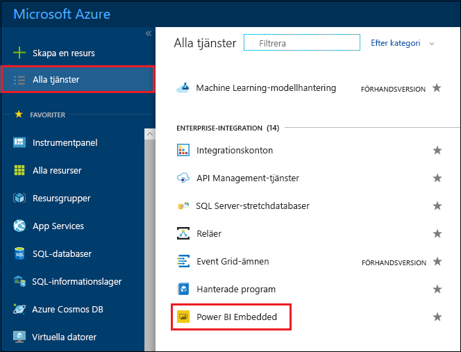
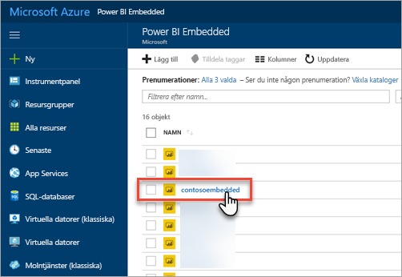
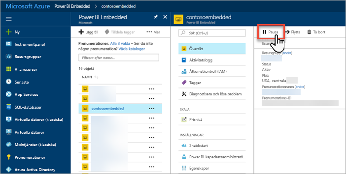
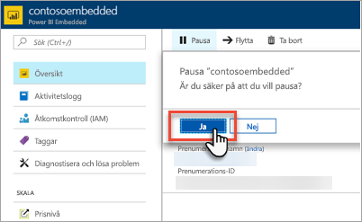
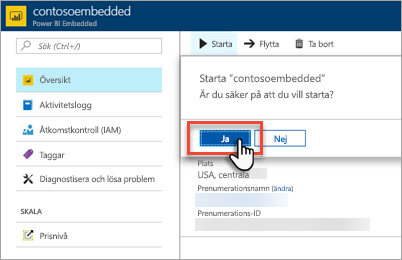

# Pausa och starta din Power BI Embedded-kapacitet på Azure Portal

Den här artikeln beskriver hur du pausar och startar en Power BI Embedded-kapacitet i Microsoft Azure. Detta förutsätter att du har skapat en Power BI Embedded-kapacitet. Om du inte har gjort det läser du [Skapa Power BI Embedded-kapacitet på Azure Portal](azure-pbie-create-capacity.md) för att komma igång.

Om du inte har någon Azure-prenumeration kan du [skapa ett kostnadsfritt konto](https://azure.microsoft.com/free/) innan du börjar.

## Pausa din kapacitet

När du pausar din kapacitet debiteras du inte längre. Pausa din kapacitet om du inte behöver använda kapaciteten under en viss tidsperiod. Följ stegen nedan om du vill pausa din kapacitet.

> [!NOTE]
> Om du pausar en kapacitet kan det hända att innehåll inte är tillgängligt i Power BI. Ta bort tilldelningar av arbetsytor från din kapacitet innan du pausar kapaciteten för att förhindra avbrott.

1. Logga in på [Azure Portal](https://portal.azure.com/).

2. Visa dina kapaciteter genom att välja **Alla tjänster** > **Power BI Embedded**.

    

3. Välj den kapacitet som du vill pausa.

    

4. Välj **Pausa** i kapacitetsinformationen.

    

5. Välj **Ja** för att bekräfta att du vill pausa kapaciteten.

    

## Starta din kapacitet

Återuppta användningen genom att starta din kapacitet. När du startar din kapacitet startar även debiteringen igen.

1. Logga in på [Azure Portal](https://portal.azure.com/).

2. Visa dina kapaciteter genom att välja **Alla tjänster** > **Power BI Embedded**.

    

3. Välj den kapacitet som du vill starta.

    

4. Välj **Starta** i kapacitetsinformationen.

    

5. Välj **Ja** för att bekräfta att du vill starta kapaciteten.

    

Om innehåll har tilldelats den här kapaciteten är det tillgängligt när kapaciteten har startats.

## Nästa steg

Om du vill skala upp eller ned din kapacitet läser du [Skala din Power BI Embedded-kapacitet](azure-pbie-scale-capacity.md).

Om du vill börja bädda in Power BI-innehåll i ditt program läser du [Bädda in Power BI-instrumentpaneler, -rapporter och -paneler](https://powerbi.microsoft.com/documentation/powerbi-developer-embedding-content/).

Har du fler frågor? [Fråga Power BI Community](https://community.powerbi.com/)