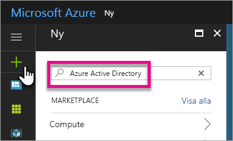
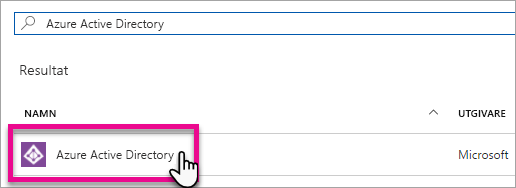
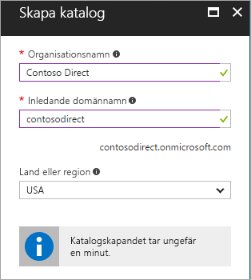
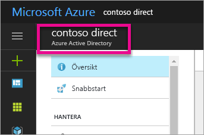
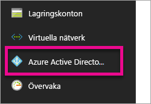
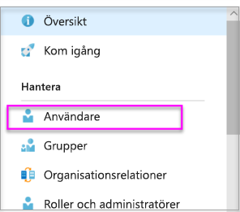
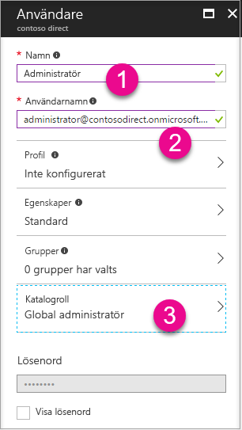
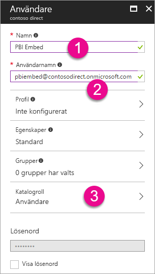
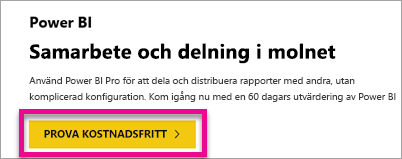

# Skapa en Azure Active Directory-klient som ska användas med Power BI

Lär dig hur du skapar en ny Azure AD-klientorganisation för en anpassad app som anropar [REST-API:er för Power BI](../automation/rest-api-reference.md).

En klientorganisation representerar en organisation i Azure Active Directory. Det är en dedikerad instans av Azure AD-tjänsten som en organisation tar emot och äger när den registrerar sig för en Microsoft-molntjänst som Azure, Microsoft Intune eller Office 365. Varje Azure AD-klient är unik och avgränsad från andra Azure AD-klienter.

När du har en Azure AD-klientorganisation kan du definiera en app och tilldela behörigheter för den så att den kan anropa [REST-API:er för Power BI](../automation/rest-api-reference.md).

Organisationen kanske redan har en Azure AD-klient som du kan använda för programmet. Du kan också skapa en ny klientorganisation specifikt för appen. I den här artikeln får du lära dig att skapa en ny klientorganisation.

## Skapa en Azure Active Directory-klient

För att kunna integrera Power BI i din anpassade app måste du definiera en app i Azure AD, och för det krävs en Azure AD-katalog. Den här katalogen är din *klientorganisation*. Om din organisation inte har någon klientorganisation än, eftersom de inte använder Power BI eller Office 365, [så måste du skapa en utvecklingsmiljö](https://docs.microsoft.com/azure/active-directory/develop/active-directory-howto-tenant). Du måste också skapa en sådan om du inte vill att appen ska blandas ihop med organisationens klientorganisation, så att du kan separera aktiviteterna. Eller kanske du bara vill skapa en klient i testsyfte.

Så här skapar du en ny Azure AD-klientorganisation:

1. Bläddra till [Azure-portalen](https://portal.azure.com) och logga in med ett konto som har en Azure-prenumeration.

2. Välj **plus-ikonen (+)** och sök efter **Azure Active Directory**.

    

3. Välj **Azure Active Directory** i sökresultatet.

    

4. Välj **Skapa**.

5. Ange värden för **Organisationsnamn** och **Ursprungligt domännamn**. Välj sedan **Skapa**. Katalogen skapas.

    

   > [!NOTE]
   > Din ursprungliga domän är en del av onmicrosoft.com. Du kan lägga till andra domännamn senare. Kataloger för klientorganisationer kan ha flera olika tilldelade domäner.

6. När du har skapat katalogen väljer du informationsrutan för att hantera den nya katalogen.

Sedan ska du lägga till användare i klientorganisationen.

## Skapa användare i Azure Active Directory-klientorganisationen

Nu när du har en katalog ska du skapa minst två användare. En är global administratör för klientorganisationen och den andra är en masteranvändare som ska bädda in innehåll. Tänk på den senare som ett tjänstkonto.

1. Se till att du befinner sig på Azure Active Directory-menyn i Azure-portalen.

    

    Om du inte gör det väljer du ikonen för Azure Active Directory i det vänstra navigeringsfältet.

    

2. Under **Hantera** väljer du **Användare**.

    

3. Välj **Alla användare** och sedan **+ Ny användare**.

4. Ange värden för **Namn** och **Användarnamn** för klientorganisationens globala administratör. Ändra **Katalogroll** till **Global administratör**. Du kan dessutom visa det tillfälliga lösenordet. När du är färdig väljer du **Skapa**.

    

5. Gör samma sak för en vanlig användare i klientorganisationen. Du kan använda det här kontot som huvudkonto för inbäddningen. Den här gången låter du **Katalogroll** vara **Användare**. Skriv ned lösenordet och välj sedan **Skapa**.

    

6. Registrera dig för Power BI med användarkontot du skapade i steg 5. Gå till [powerbi.com](https://powerbi.microsoft.com/get-started/) och välj **Testa kostnadsfritt** under **Power BI – Molnsamarbete och delning**.

    

    När du registrerar dig får du en fråga om du vill prova Power BI Pro kostnadsfritt under 60 dagar. Du kan välja det och bli Pro-användare, så att du kan [börja utveckla en inbäddad lösning](embed-sample-for-customers.md).

   > [!NOTE]
   > Se till att du registrerar dig med användarkontots e-postadress.

## Nästa steg

Nu när du har en Azure AD-klientorganisation kan du använda klientorganisationen till att testa olika saker i Power BI. Du kan också bädda in Power BI-instrumentpaneler och rapporter i din app. Mer information finns i [Bädda in dina Power BI-instrumentpaneler, rapporter och paneler](embed-sample-for-customers.md).

[Vad är Azure Active Directory?](https://docs.microsoft.com/azure/active-directory/active-directory-whatis) 
 
[Snabbstart: Konfigurera en utvecklingsmiljö](https://docs.microsoft.com/azure/active-directory/develop/active-directory-howto-tenant)  

Har du fler frågor? [Fråga Power BI Community](https://community.powerbi.com/)
