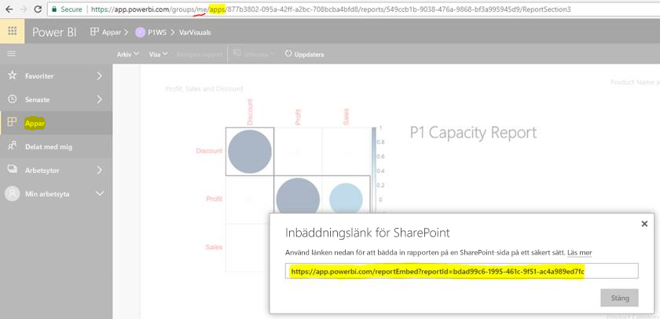

# Bädda in rapporter eller instrumentpaneler från appar

I Power BI kan du skapa appar som samlar relaterade instrumentpaneler och rapporter på ett och samma ställe. Du kan sedan publicera dem till stora grupper i din organisation. Användningen av dessa appar är relevant när alla dina användare är Power BI-användare. Då kan du dela innehåll med dem med hjälp av Power BI-appar. I den här artikeln delar vi med oss av några enkla steg för att utföra inbäddning av innehåll från en publicerad Power BI-App till ett program från tredje part.

## Hämta rapportens embedURL för inbäddning

1. Skapa en instans av programmet i en användararbetsyta, **Min arbetsyta**. Dela med dig själv eller be någon annan användare genomgå det här flödet.

2. Öppna önskad rapport i Power BI-tjänsten.

3. Gå till **Arkiv** > **Bädda in i SharePoint Online** och hämta rapportens embedURL. Ett exempel på embedURL visas i nedanstående ögonblicksbild. Du kan också anropa GetReports/GetReport REST API och extrahera motsvarande embedURL-fält från svaret. REST-anrop får inte ha en identifierare för arbetsytan som en del av URL:en eftersom appen har fått en instans i användarens arbetsyta.

    

4. Använd embedURL som du hämtade i steg 3 i JavaScript SDK.

## Hämta instrumentpanelens embedURL för inbäddning

1. Skapa en instans av programmet i en användararbetsyta, **Min arbetsyta**. Dela med dig själv eller be någon annan användare genomgå det här flödet.

2. Anropa GetDashboards REST API och extrahera motsvarande embedURL-fält från svaret. REST-anrop får inte ha en identifierare för arbetsytan som en del av URL:en eftersom appen har fått en instans i användarens arbetsyta.

3. Använd embedURL som du hämtade i steg 2 i JavaScript SDK.

## Nästa steg

Läs om hur du bäddar in från arbetsytor för kunder från tredje part och din organisation:

> [!div class="nextstepaction"]
>[Bädda in för kunder från tredje part](embed-sample-for-customers.md)

> [!div class="nextstepaction"]
>[Bädda in för din organisation](embed-sample-for-your-organization.md)
