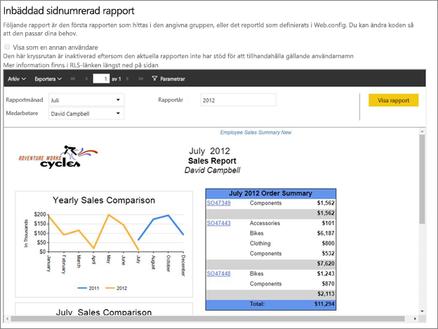
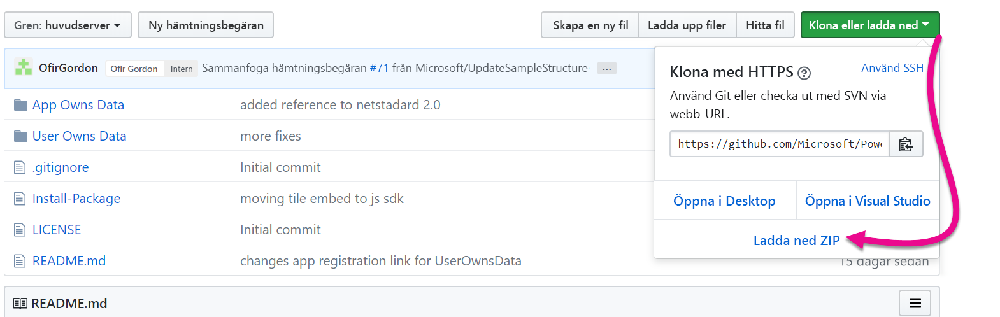
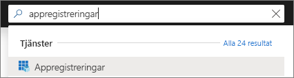
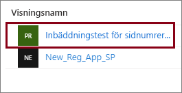
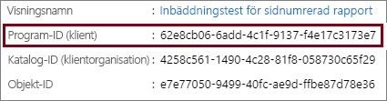
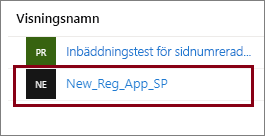
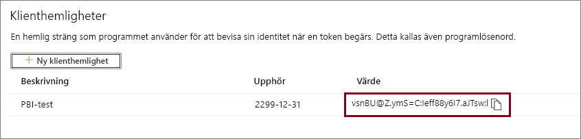
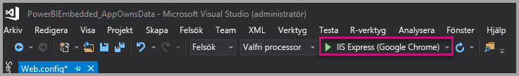
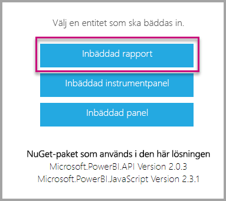

# <a name="tutorial-embed-power-bi-paginated-reports-into-an-application-for-your-customers-preview"></a>Självstudie: Bädda in Power BI:s sidnumrerade rapporter i ett program åt dina kunder (förhandsversion)

Med **Power BI Embedded i Azure** eller **Power BI-inbäddning i Office** kan du bädda in sidnumrerade rapporter i ett program med appens egna data. **App äger data** handlar om ett program som använder Power BI som en inbäddad analysplattform. Om du är **ISV** eller **utvecklare** kan du skapa Power BI-innehåll som visar sidnumrerade rapporter i ett program som är helt integrerat och interaktivt, utan att användarna behöver ha någon Power BI-licens. Den här självstudien visar hur du integrerar en sidnumrerad rapport i ett program med .NET SDK och JavaScript-API i Power BI.



I de här självstudierna får du lära dig att
> [!div class="checklist"]
> * Registrera ett program i Azure.
> * Bädda in en sidnumrerad Power BI-rapport i ett program.

## <a name="prerequisites"></a>Förutsättningar

Du måste ha följande för att komma igång:

* Ett [huvudnamn för tjänsten (appspecifik token)](embed-service-principal.md)
* En [Microsoft Azure](https://azure.microsoft.com/)-prenumeration
* Du måste ha en egen konfiguration av [Azure Active Directory-klientorganisationen](create-an-azure-active-directory-tenant.md)
* Minst en A4- eller P1-[kapacitet](#create-a-dedicated-capacity) med [sidnumrerade rapporter](../../service-admin-premium-workloads.md#paginated-reports) och en aktiverad arbetsbelastning

Om du inte har någon Azure-prenumeration kan du [skapa ett kostnadsfritt konto](https://azure.microsoft.com/free/?WT.mc_id=A261C142F) innan du börjar.

> [!IMPORTANT]
> * Du måste använda **tjänstens huvudnamn**. Huvudanvändaren stöds inte.
> * Datakällor som kräver enkel inloggning (SSO) stöds inte.
> * Power BI-datauppsättningen stöds inte som [datakälla](../../service-get-data.md).

## <a name="set-up-your-power-bi-environment"></a>Konfigurera din Power BI-miljö

Om du bäddar in en sidnumrerad rapport måste du tilldela en arbetsyta till en dedikerad kapacitet och ladda upp rapporten till arbetsytan.

### <a name="create-an-app-workspace"></a>Skapa en apparbetsyta

Men om du använder [tjänstens huvudnamn](embed-service-principal.md) när du loggar in i programmet, måste du använda de [nya arbetsytorna](../../service-create-the-new-workspaces.md). När du använder *tjänstens huvudnamn* måste du dessutom vara administratör eller medlem i de apparbetsytor som ingår i programmet.

### <a name="create-a-dedicated-capacity"></a>Skapa en dedikerad kapacitet

Innan du importerar eller laddar upp en sidnumrerad rapport som ska bäddas in, måste arbetsytan som innehåller rapporten vara tilldelad minst en A4- eller P1-kapacitet. Det finns två typer av kapaciteter att välja mellan:
* **Power BI Premium** – Om du ska bädda in en sidnumrerad rapport krävs en *P* SKU-kapacitet. När du bäddar in Power BI-innehåll kallas den här lösningen för *Power BI-inbäddning*. Mer information om prenumerationen finns i [Vad är Power BI Premium?](../../service-premium-what-is.md)
* **Azure Power BI Embedded** – Du kan köpa en dedikerad kapacitet i [Microsoft Azure-portalen](https://portal.azure.com). Den här prenumerationen använder *A* SKU:er. Vid inbäddning av sidnumrerade rapporter behöver du minst en *A4*-prenumeration. Mer information om hur du skapar Power BI Embedded-kapacitet finns i [Skapa Power BI Embedded-kapacitet i Azure-portalen](azure-pbie-create-capacity.md).

I tabellen nedan beskrivs resurserna och gränserna för varje SKU. När du ska avgöra vilken kapacitet som passar bäst för dina behov kan du använda tabellen [Vilken SKU ska jag köpa till mitt scenario](https://docs.microsoft.com/power-bi/developer/embedded-faq#which-solution-should-i-choose).

| Kapacitetsnoder | Totalt antal virtuella kärnor | Virtuella kärnor för serverdel | RAM (GB) | Virtuella kärnor för klientdel | 
| --- | --- | --- | --- | --- |
| P1/A4 | 8 | 4 | 25 | 4 |
| P2/A5 | 16 | 8 | 50 | 8 |
| P3/A6 | 32 | 16 | 100 | 16 |
| | | | | |

### <a name="assign-an-app-workspace-to-a-dedicated-capacity"></a>Tilldela en apparbetsyta till en dedikerad kapacitet

När du har skapat en dedikerad kapacitet kan du tilldela apparbetsytan till den dedikerade kapaciteten.

Tilldela en dedikerad kapacitet till en arbetsyta med hjälp av [service principal](embed-service-principal.md) genom att använda [Power BI REST-API:et](https://docs.microsoft.com/rest/api/power-bi/capacities/groups_assigntocapacity). När du använder Power BI REST-API:erna ser du till att använda [objekt-ID för tjänstens huvudnamn](embed-service-principal.md#how-to-get-the-service-principal-object-id).

### <a name="create-and-upload-your-paginated-reports"></a>Skapa och ladda upp sidnumrerade rapporter

Du kan skapa en sidnumrerad rapport med [Power BI Report Builder](../../paginated-reports/paginated-reports-report-builder-power-bi.md#create-reports-in-power-bi-report-builder) och sedan [ladda upp rapporten till tjänsten](../../paginated-reports/paginated-reports-quickstart-aw.md#upload-the-report-to-the-service).

Du kan importera sidnumrerade rapporter till de nya arbetsytorna med hjälp av [Power BI REST-API:er](https://docs.microsoft.com/rest/api/power-bi/imports/postimportingroup).

## <a name="embed-content-using-the-sample-application"></a>Bädda in innehåll med exempelprogrammet

Det här exemplet hålls medvetet enkelt i demonstrationssyfte. Det är upp till dig eller dina utvecklare att skydda programhemligheten.

Följ de här stegen nedan om du vill börja bädda in innehåll med hjälp av exempelprogrammet.

1. Ladda ned [Visual Studio](https://www.visualstudio.com/) (version 2013 eller senare). Se till att ladda ned det senaste [NuGet-paketet](https://www.nuget.org/profiles/powerbi).

2. Ladda ner [exempel på app äger data](https://github.com/Microsoft/PowerBI-Developer-Samples) från GitHub för att komma igång.

    

3. Öppna filen **Web.config** i exempelprogrammet. Du måste fylla i fälten för att kunna köra programmet. Välj **ServicePrincipal** som **AuthenticationType**.

    Fyll i följande fält:
    * [applicationId](#application-id)
    * [workspaceId](#workspace-id)
    * [reportId](#report-id)
    * [applicationsecret](#application-secret)
    * [tenant](#tenant)

    > [!Note]
    > Standardinställd **AuthenticationType** i det här exemplet är MasterUser. Kom ihåg att ändra den till **ServicePrincipal**. 


    

### <a name="application-id"></a>Program-ID

Fyll i **applicationId** med **program-ID:t** från **Azure**. **applicationId** används av programmet för att identifiera sig för användare som du begär behörighet från.

Så här hämtar du **applicationId**:

1. Logga in på [Azure Portal](https://portal.azure.com).

2. I det vänstra navigeringsfönstret väljer du **Alla tjänster**. Sök sedan efter **Appregistreringar**.

    

3. Välj det program som behöver **applicationId**.

    

4. Det finns ett **program-ID** som listas som en GUID. Använd detta **program-ID** som **applicationId** för appen.

    

### <a name="workspace-id"></a>Arbetsyte-ID

Fyll i **workspaceId** med (grupp-)GUID för apparbetsytan från Power BI. Du kan få den här informationen från URL:en när du är inloggad i Power BI-tjänsten eller med hjälp av PowerShell.

URL <br>


PowerShell <br>

```powershell
Get-PowerBIworkspace -name "Paginated Report Embed"
```

   

### <a name="report-id"></a>Rapport-ID

Fyll i **reportId**-information med rapport-GUID från Power BI. Du kan få den här informationen från URL:en när du är inloggad i Power BI-tjänsten eller med hjälp av PowerShell.

URL<br>


PowerShell <br>

```powershell
Get-PowerBIworkspace -name "Paginated Report Embed" | Get-PowerBIReport
```


### <a name="application-secret"></a>Apphemlighet

Fyll i **ApplicationSecret**-uppgifterna från avsnittet **Nycklar** från avsnittet **Appregistreringar** i **Azure**.

Hämta **ApplicationSecret** genom att utföra följande steg:

1. Logga in på [Azure-portalen](https://portal.azure.com).

2. I det vänstra navigeringsfönstret väljer du **Alla tjänster**. Sök sedan efter **Appregistreringar**.

    

3. Välj det program som behöver använda **ApplicationSecret**.

    

4. Välj **Certifikat och hemligheter** under **Hantera**.

5. Välj **Nya klienthemligheter**.

6. Ange ett namn i rutan **Beskrivning** och välj en varaktighet. Välj sedan **Spara** för att hämta **värdet** för ditt program. När du stänger fönstret **Nycklar** efter att ha sparat nyckelvärdet visas värdefältet bara som dolt. I det här läget kan du inte att hämta nyckelvärdet. Om du tappar bort nyckelvärdet måste du skapa ett nytt på Microsoft Azure-portalen.

    

### <a name="tenant"></a>Klientorganisation

Fyll i informationen om **klientorganisationen** med ditt Azure-klientorganisations-ID. Du kan få den här informationen från [Azure AD-administratörscentret](/onedrive/find-your-office-365-tenant-id) när du är inloggad i Power BI-tjänsten eller genom att använda Powershell.

### <a name="run-the-application"></a>Kör programmet

1. Välj **Kör** i **Visual Studio**.

    

2. Välj sedan **Bädda in rapport**.

    

3. Nu kan du visa rapporten i exempelprogrammet.

    

## <a name="embed-power-bi-paginated-reports-within-your-application"></a>Bädda in Power BI:s sidnumrerade rapporter i ditt program

Power BI:s sidnumrerade rapporter kan bäddas in med hjälp av [Power BI REST-API:er](https://docs.microsoft.com/rest/api/power-bi/), men exempelkoderna som beskrivs i den här artikeln görs med **.NET SDK**.

Inbäddning av sidnumrerade Power BI-rapporter åt dina kunder i programmet kräver att du har ett **Azure AD**-[tjänsthuvudnamn](embed-service-principal.md) och skaffar en [Azure AD-åtkomsttoken](get-azuread-access-token.md#access-token-for-non-power-bi-users-app-owns-data) för ditt Power BI-program innan du kan göra anrop till [Power BI REST-API:erna](https://docs.microsoft.com/rest/api/power-bi/).

Skapa Power BI-klienten med din **åtkomsttoken** genom att skapa Power BI-klientobjektet som gör att du kan interagera med [Power BI REST-API:erna](https://docs.microsoft.com/rest/api/power-bi/). Du skapar Power BI-klientobjektet genom att omsluta **AccessToken** med ett ***Microsoft.Rest.TokenCredentials***-objekt.

```csharp
using Microsoft.IdentityModel.Clients.ActiveDirectory;
using Microsoft.Rest;
using Microsoft.PowerBI.Api.V2;

var tokenCredentials = new TokenCredentials(authenticationResult.AccessToken, "Bearer");

// Create a Power BI Client object. it's used to call Power BI APIs.
using (var client = new PowerBIClient(new Uri(ApiUrl), tokenCredentials))
{
    // Your code to embed items.
}
```

### <a name="get-the-paginated-report-you-want-to-embed"></a>Hämta den sidnumrerade rapport som du vill bädda in

Använd Power BI-klientobjektet för att hämta en referens till det objekt du vill bädda in.

Här är ett kodexempel på hur du hämtar den första rapporten från en given arbetsyta.

*Ett exempel på hur du hämtar ett innehållsobjekt, vare sig du vill bädda in en rapport, instrumentpanel eller panel, finns i filen Services\EmbedService.cs i [exempelprogrammet](https://github.com/Microsoft/PowerBI-Developer-Samples).*

```csharp
using Microsoft.PowerBI.Api.V2;
using Microsoft.PowerBI.Api.V2.Models;

// You need to provide the workspaceId where the dashboard resides.
ODataResponseListReport reports = await client.Reports.GetReportsInGroupAsync(workspaceId);

// Get the first report in the group.
Report report = reports.Value.FirstOrDefault();
```

### <a name="create-the-embed-token"></a>Skapa inbäddningstoken

Skapa en inbäddningstoken som kan användas från JavaScript-API:et. Om du vill skapa en inbäddad token för att bädda in Power BI:s sidnumrerade rapporter, använder du API:et [Reports GenerateTokenForCreateInGroup](https://docs.microsoft.com/rest/api/power-bi/embedtoken/reports_generatetokenforcreateingroup).

Ett exempel på hur du skapar en inbäddningstoken finns i filen  *Services\EmbedService.cs* i [exempelprogrammet](https://github.com/Microsoft/PowerBI-Developer-Samples).

```csharp
using Microsoft.PowerBI.Api.V2;
using Microsoft.PowerBI.Api.V2.Models;

// Generate Embed Token.
var generateTokenRequestParameters = new GenerateTokenRequest(accessLevel: "view");
EmbedToken tokenResponse = client.Reports.GenerateTokenInGroup(workspaceId, report.Id, generateTokenRequestParameters);

// Generate Embed Configuration.
var embedConfig = new EmbedConfig()
{
    EmbedToken = tokenResponse,
    EmbedUrl = report.EmbedUrl,
    Id = report.Id
};
```

### <a name="load-an-item-using-javascript"></a>Läsa in ett objekt med JavaScript

Du kan använda JavaScript för att läsa in en sidnumrerad rapport till olika element på webbsidan.

Du kan använda ett fullständigt exempel i JavaScript API i [Playground-verktyget](https://microsoft.github.io/PowerBI-JavaScript/demo). Playground-verktyget är ett snabbt sätt att leka med olika typer av Power BI Embedded-exempel. Du kan även få mer information om API:et för JavaScript genom att besöka wiki-sidan för [PowerBI-JavaScript](https://github.com/Microsoft/powerbi-javascript/wiki).

## <a name="next-steps"></a>Nästa steg

I den här självstudien har du lärt dig att bädda in Power BI:s sidnumrerade rapporter i ett program åt dina kunder. Du kan även prova att bädda in Power BI-innehåll för dina kunder eller din organisation.

> [!div class="nextstepaction"]
>[Bädda in innehåll för kunderna](embed-sample-for-customers.md)

> [!div class="nextstepaction"]
>[Bädda in innehåll för organisationen](embed-sample-for-your-organization.md)

Har du fler frågor? [Fråga Power BI Community](https://community.powerbi.com/)
