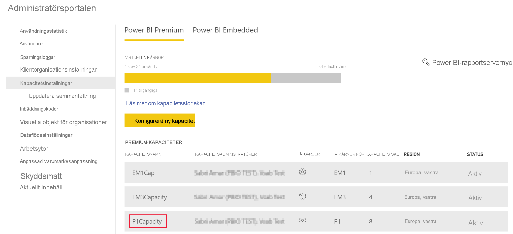
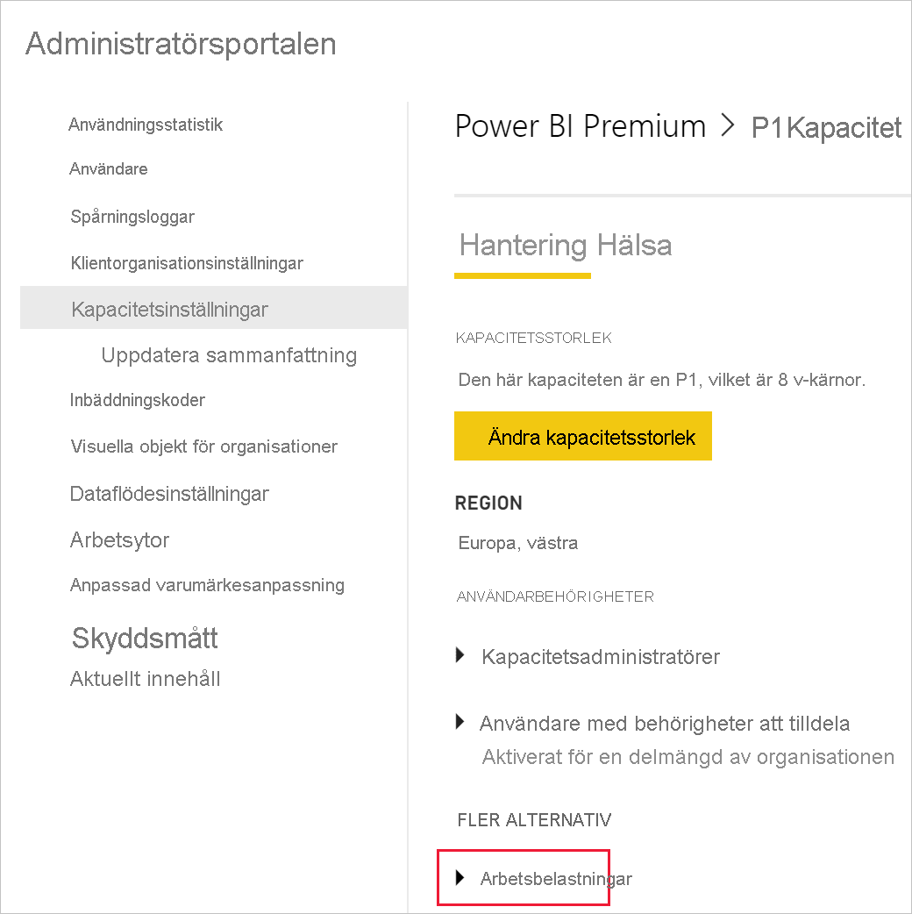
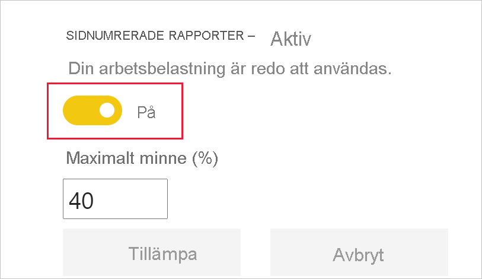
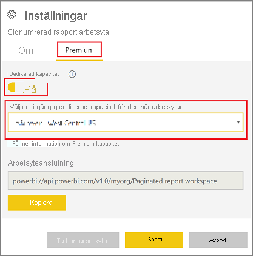
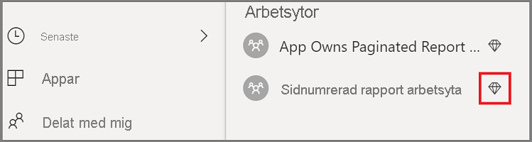
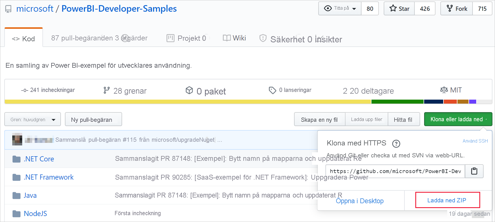
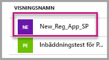
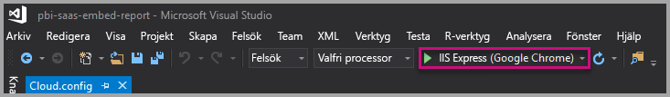
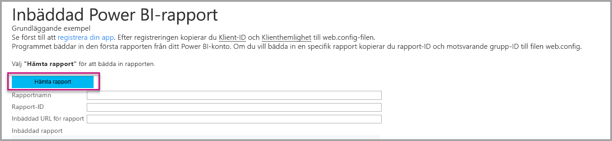

# <a name="tutorial-embed-power-bi-paginated-reports-into-an-application-for-your-organization"></a>Självstudie: Bädda in Power BI:s sidnumrerade rapporter i ett program åt din organisation

I **Power BI** kan du bädda in infogade rapporter i ett program för din organisation genom att använda scenariot *användaren äger data*.

Sidnumrerade rapporter är rapporter som har utformats för att skrivas ut med hög kvalitet. Dessa rapporter innehåller vanligtvis många data som återges på ett sätt som gör att de passar in på de utskrivna sidorna.
Information om hur Power BI stöder sidnumrerade rapporter finns i [Vad är sidnumrerade rapporter i Power BI Premium?](https://docs.microsoft.com/power-bi/paginated-reports-report-builder-power-bi)

**Användarägda data** gör att ditt program kan utöka Power BI-tjänsten så att den kan använda inbäddad analys. Den här självstudien visar hur man integrerar en rapport i ett program.

Du kan använda Power BI .NET SDK med Power BI JavaScript API för att bädda in Power BI i ett program för din organisation.


I den här självstudien går du igenom följande aktiviteter:
> [!div class="checklist"]
> * Registrera ett program i Azure.
> * Bädda in en sidnumrerad Power BI-rapport i ett program med hjälp av Power BI-klienten.

## <a name="prerequisites"></a>Förutsättningar
Du måste ha följande för att komma igång:

* Ett [Power BI Pro-konto](../../admin/service-admin-purchasing-power-bi-pro.md).

* Du måste ha en egen installation för [Azure Active Directory-klient](create-an-azure-active-directory-tenant.md).

* Minst P1-kapacitet. [Hur stor Premium-kapacitet måste jag ha för sidnumrerade rapporter?](../../paginated-reports/paginated-reports-faq.md#what-size-premium-capacity-do-i-need-for-paginated-reports)

Om du inte har registrerat dig för **Power BI Pro**, [registrerar du dig för en kostnadsfri utvärderingsversion](https://powerbi.microsoft.com/pricing/) innan du börjar.

## <a name="set-up-your-power-bi-environment"></a>Konfigurera din Power BI-miljö

Följ anvisningarna i det här avsnittet om du vill konfigurera Power BI för inbäddning av dina sidnumrerade rapporter.

### <a name="register-a-server-side-web-application-app"></a>Registrera en webbapp på serversidan

Följ anvisningarna i [Registrera ett Azure AD-program att använda med Power BI](register-app.md) när du ska registrera en webbapp på serversidan.

>[!NOTE]
>När du registrerar appen, så var noga med att göra följande:
>* Hämta programhemligheten
>* Använd **Report.ReadAll**-behörigheter (omfång) till din app.

### <a name="create-a-dedicated-capacity"></a>Skapa en dedikerad kapacitet

Genom att skapa en dedikerad kapacitet kan du dra nytta av att ha en dedikerad resurs för innehållet i din apps arbetsyta. För sidnumrerade rapporter måste du säkerhetskopiera din apparbetsyta med minst en P1-kapacitet. Du kan skapa en dedikerad kapacitet med hjälp av [Power BI Premium ](../../admin/service-premium-what-is.md).

I följande tabell visas de Power BI Premium-SKU:er som du kan använda för att skapa en dedikerad kapacitet för sidnumrerade rapporter i [Microsoft Office 365](../../admin/service-admin-premium-purchase.md):

| Kapacitetsnod | Totalt antal virtuella kärnor<br/>(serverdel + klientdel) | Serverdelens virtuella kärnor | Klientdelens virtuella kärnor | DirectQuery/begränsningar vid liveanslutning |
| --- | --- | --- | --- | --- | --- |
| P1 |8 virtuella kärnor |4 virtuella kärnor, 25 GB RAM-minne |4 virtuella kärnor |30 per sekund |
| P2 |16 virtuella kärnor |8 virtuella kärnor, 50 GB RAM-minne |8 virtuella kärnor |60 per sekund |
| P3 |32 virtuella kärnor |16 virtuella kärnor, 100 GB RAM-minne |16 virtuella kärnor |120 per sekund |
| P4 |64 virtuella kärnor |32 virtuella kärnor, 200 GB RAM-minne |32 virtuella kärnor |240 per sekund |
| P5 |128 virtuella kärnor |64 virtuella kärnor, 400 GB RAM-minne |64 virtuella kärnor |480 per sekund |
|||||

### <a name="enable-paginated-reports-workload"></a>Aktivera arbetsbelastningen för sidnumrerade rapporter

Du måste aktivera arbetsbelastningen för sidnumrerade rapporter på din dedikerade kapacitet.

1. Logga in på [Power BI > Administratörsportalen > Kapacitetsinställningar](https://app.powerbi.com/admin-portal/capacities).

2. Välj den kapacitet som innehåller den arbetsyta till vilken du vill överföra den sidnumrerade rapporten.

    

3. Utöka **Arbetsbelastningar**.

    

4. Aktivera arbetsbelastningen för sidnumrerade rapporter.

    

### <a name="assign-an-app-workspace-to-a-dedicated-capacity"></a>Tilldela en apparbetsyta till en dedikerad kapacitet

När du har skapat en dedikerad kapacitet kan du tilldela apparbetsytan till den dedikerade kapaciteten. Gör så här för att slutföra processen:

1. Expandera arbetsytorna i Power BI-tjänsten och välj **Mer** för den arbetsyta som du vill använda för att bädda in ditt innehåll. Välj sedan **Arbetsyteinställningar**.

    

2. Välj **Premium** och aktivera **Dedikerad kapacitet**. Välj den dedikerade kapaciteten som du skapade. Välj sedan **Spara**.

    

3. När du har valt **Spara** bör du se en romb bredvid namnet på apparbetsytan.

    

### <a name="create-and-publish-your-power-bi-paginated-reports"></a>Skapa och publicera dina sidnumrerade Power BI-rapporter

Du kan skapa dina sidnumrerade rapporter med hjälp av [Power BI Report Builder](../../paginated-reports/paginated-reports-report-builder-power-bi.md#create-reports-in-power-bi-report-builder). Sedan kan du [ladda upp rapporten](../../paginated-reports/paginated-reports-quickstart-aw.md#upload-the-report-to-the-service) till en apparbetsyta som har tilldelats till minst en P1-kapacitet och aktivera [arbetsbelastningen för sidnumrerade rapporter](#enable-paginated-reports-workload). Slutanvändaren som laddar upp rapporterna måste ha en Power BI Pro-licens för att kunna publicera till en apparbetsyta.
   
## <a name="embed-your-content-by-using-the-sample-application"></a>Bädda in innehåll med exempelprogrammet

Det här exemplet hålls medvetet enkelt i demonstrationssyfte.

Följ de här stegen nedan om du vill börja bädda in innehåll med hjälp av exempelprogrammet.

1. Ladda ned [Visual Studio](https://www.visualstudio.com/) (version 2013 eller senare). Se till att ladda ned det senaste [NuGet-paketet](https://www.nuget.org/profiles/powerbi).

2. Ladda ned [PowerBI-Developer-Samples](https://github.com/Microsoft/PowerBI-Developer-Samples) och öppna .NET Framework > Bädda in för din organisation > integrate-web-app > **PBIWebApp**.

    

3. Öppna filen **Cloud.config** i exempelprogrammet och fyll i följande fält så att du kan köra programmet:
    * [Program-ID](#application-id)
    * [Arbetsyte-ID](#workspace-id)
    * [Rapport-ID](#report-id)
    * [AADAuthorityUrl](#aadauthorityurl)

    

### <a name="application-id"></a>Program-ID

Fyll i **applicationId** med **program-ID:t** från **Azure**. **applicationId** används av programmet för att identifiera sig för användare som du begär behörighet från.

Så här hämtar du **applicationId**:

1. Logga in på [Azure Portal](https://portal.azure.com).

2. I det vänstra navigeringsfönstret väljer du **Alla tjänster** och **Appregistreringar**.

3. Välj det program som behöver **applicationId**.

    

4. Det finns ett **program-ID** som listas som en GUID. Använd detta **program-ID** som **applicationId** för appen.

    

### <a name="workspace-id"></a>Arbetsyte-ID

Fyll i **workspaceId** med (grupp-)GUID för apparbetsytan från Power BI. Du kan få den här informationen från URL:en när du är inloggad i Power BI-tjänsten eller med hjälp av PowerShell.

URL <br>


PowerShell <br>

```powershell
Get-PowerBIworkspace -name "User Owns Embed Test"
```

   

### <a name="report-id"></a>Rapport-ID

Fyll i **reportId**-information med rapport-GUID från Power BI. Du kan få den här informationen från URL:en när du är inloggad i Power BI-tjänsten eller med hjälp av PowerShell.


PowerShell <br>

```powershell
Get-PowerBIworkspace -name "User Owns Embed Test" | Get-PowerBIReport -Name "Sales Paginated Report"
```


### <a name="aadauthorityurl"></a>AADAuthorityUrl

Fyll i informationen **AADAuthorityUrl** URL:en som du antingen kan bädda in i din organisations klient eller bädda in med en gästanvändare.

För att bädda in med din organisations klient använder du URL – *https://login.microsoftonline.com/common/oauth2/authorize* .

För att bädda in med en gäst använder du URL – *`https://login.microsoftonline.com/report-owner-tenant-id`* – där du lägger till klient-ID för rapportens ägare som ersätter *rapport-ägare-klient-id*.

### <a name="run-the-application"></a>Kör programmet

1. Välj **Kör** i **Visual Studio**.

    

2. Välj sedan **Bädda in rapport**. Beroende på vilket innehåll du väljer att testa med – rapporter, instrumentpaneler eller paneler – väljer du det alternativet i programmet.

    

3. Nu kan du visa rapporten i exempelprogrammet.

    

## <a name="next-steps"></a>Nästa steg

I den här självstudien har du lärt dig hur du bäddar in sidnumrerade Power BI-rapporter i ett program med hjälp av ditt Power BI-organisationskonto. 

> [!div class="nextstepaction"]
> [Bädda in från appar](embed-from-apps.md)

> [!div class="nextstepaction"]
>[Bädda in Power BI-innehåll för kunderna](embed-sample-for-customers.md)

> [!div class="nextstepaction"]
>[Bädda in sidnumrerade Power BI-rapporter för kunderna](embed-paginated-reports-customers.md)

Om du har andra frågor kan du [fråga Power BI Community](http://community.powerbi.com/).
