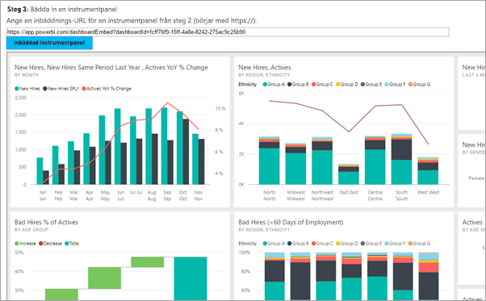
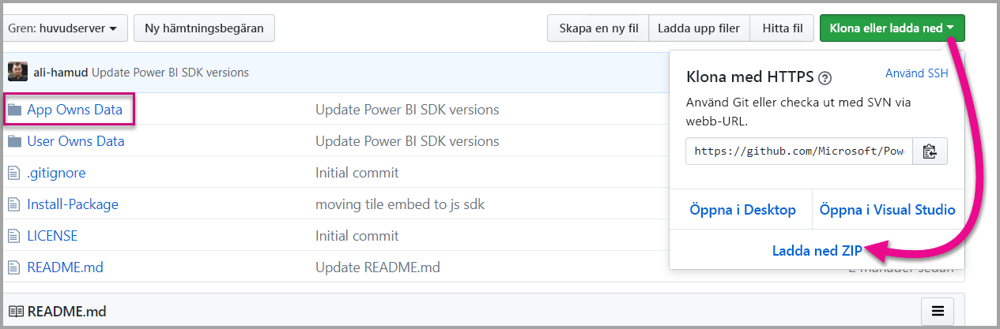

# <a name="tutorial-embed-a-power-bi-content-into-your-application-for-national-clouds"></a>Självstudie: Integrera Power BI-innehåll i ditt program för nationella moln

Lär dig mer om att bädda in analytiska innehåll i dina tillämpningar och för nationella moln. Du kan använda Power BI .NET SDK med Power BI JavaScript API för att bädda in en rapport, instrumentpanel eller panel i dina webbprogram.

Power BI stöder också [nationella moln](https://docs.microsoft.com/azure/active-directory/develop/authentication-national-cloud).

De olika nationella molnen är:

* USA Government Community Cloud (GCC)

* U. S. Government Community Cloud High (GCC High)

* U. S. Militära leverantörer (DoDCON)

* U. S. Militären (DoD)

* Power BI för moln i Tyskland

* Power BI för moln i Kina



För att komma igång med den här genomgången behöver du ett **Power BI**-konto. Om du inte har ett konto konfigurerat kan du, beroende på myndigheter eller land, välja rätt nationellt moln för dig. Du kan registrera dig för ett [Power BI-konto för amerikanska myndigheter](../../admin/service-govus-signup.md), ett [Power BI-konto för moln i Tyskland](https://powerbi.microsoft.com/power-bi-germany/?ru=https%3A%2F%2Fapp.powerbi.de%2F%3FnoSignUpCheck%3D1) eller ett [Power BI-konto för moln i Kina](https://www.21vbluecloud.com/powerbi/).

> [!NOTE]
> Vill du bädda in en instrumentpanel för din organisation istället? Se [Integrera en instrumentpanel i en app för din organisation](embed-sample-for-your-organization.md).

Om du vill integrera en instrumentpanel i en webbapp, använder du **Power BI**-API:t och en Azure Active Directory (AD)-**åtkomsttoken** för auktorisering för att hämta en instrumentpanel. Därefter läser du instrumentpanelen med hjälp av en inbäddningstoken. **Power BI**-API:et ger programmeringsåtkomst till specifika **Power BI**-resurser. Mer information finns i [Power BI REST API](https://docs.microsoft.com/rest/api/power-bi/), Power BI .NET SDK och [Power BI JavaScript-API](https://github.com/Microsoft/PowerBI-JavaScript).

## <a name="download-the-sample"></a>Ladda ned exemplet

Artikeln visar den kod som användes i exemplet [Appen äger data](https://github.com/Microsoft/PowerBI-Developer-Samples) på GitHub. Om du vill följa den här genomgången kan du ladda ned exemplet. 



* Government Community Cloud (GCC):

    > [!NOTE]
    > Du kan bara bädda in Power BI-innehåll från GCC (Government Community Cloud) med en Microsoft 365-SKU. Kunder i andra nationella moln kan använda [Microsoft 365- eller Azure-SKU:er](embedded-faq.md).

1. Skriv över Cloud.config-filen med GCCCloud.config-innehåll.

2. Uppdatera applicationId (inbyggt app-applicationId), workspaceId, användare (din huvudanvändare) och lösenordet i Web.config-filen.

3. Lägg till GCC-parametrar i web.config-filen enligt nedan.

```xml
<add key="authorityUrl" value="https://login.microsoftonline.com/common/" />
<add key="resourceUrl" value="https://analysis.usgovcloudapi.net/powerbi/api" />
<add key="apiUrl" value="https://api.powerbigov.us/" />
<add key="embedUrlBase" value="https://app.powerbigov.us" />
```

* Militära leverantörer (DoDCON):

1. Skriv över Cloud.config-filen med TBCloud.config-innehåll.

2. Uppdatera applicationId (inbyggt app-applicationId), workspaceId, användare (din huvudanvändare) och lösenordet i Web.config-filen.

3. Lägg till DoDCON-parametrar i web.config-filen enligt nedan.

```xml
<add key="authorityUrl" value="https://login.microsoftonlineS.net/common/" />
<add key="resourceUrl" value="https://high.analysis.usgovcloudapi.net/powerbi/api" />
<add key="apiUrl" value="https://api.high.powerbigov.us/" />
<add key="embedUrlBase" value="https://app.high.powerbigov.us" />
```

* Militären (DoD):

1. Skriv över Cloud.config-filen med PFCloud.config-innehåll.

2. Uppdatera applicationId (inbyggt app-applicationId), workspaceId, användare (din huvudanvändare) och lösenordet i Web.config-filen.

3. Lägg till DoDCON-parametrar i web.config-filen enligt nedan.

```xml
<add key="authorityUrl" value="https://login.microsoftonline.net/common/" />
<add key="resourceUrl" value="https://mil.analysis.usgovcloudapi.net/powerbi/api" />
<add key="apiUrl" value="https://api.mil.powerbigov.us/" />
<add key="embedUrlBase" value="https://app.mil.powerbigov.us" />
```

* Power BI för moln i Tyskland-parametrar

1. Skriv över Cloud.config-filen med Power BI för moln i Tyskland-innehåll.

2. Uppdatera applicationId (inbyggt app-applicationId), workspaceId, användare (din huvudanvändare) och lösenordet i Web.config-filen.

3. Lägg till Power BI för moln i Tyskland-parametrar i web.config-filen enligt nedan.

```xml
<add key="authorityUrl" value="https://login.microsoftonline.de/common/" />
<add key="resourceUrl" value="https://analysis.cloudapi.de/powerbi/api" />
<add key="apiUrl" value="https://api.powerbi.de/" />
<add key="embedUrlBase" value="https://app.powerbi.de" />
```

* Parametrar för Power BI för moln i Kina

1. Skriv över Cloud.config-filen med innehåll i [Power BI för moln i Kina](https://github.com/microsoft/PowerBI-Developer-Samples/blob/master/.NET%20Framework/Embed%20for%20your%20organization/CloudConfigs/Power%20BI%20operated%20by%2021Vianet%20in%20China/Cloud.config).

2. Uppdatera applicationId (inbyggt app-applicationId), workspaceId, användare (din huvudanvändare) och lösenordet i Web.config-filen.

3. Lägg till parametrarna för Power BI för moln i Kina i web.config-filen enligt nedan.

```xml
<add key="authorityUrl" value="https://login.chinacloudapi.cn/common/" />
<add key="resourceUrl" value="https://analysis.chinacloudapi.cn/powerbi/api" />
<add key="apiUrl" value="https://api.powerbi.cn/" />
<add key="embedUrlBase" value="https://app.powerbi.cn" />
```

## <a name="step-1---register-an-app-in-azure-ad"></a>Steg 1 – Registrera en app i Azure AD

Registrera ditt program med Microsoft Azure Active Directory om du vill göra REST API-anrop. Mer information finns i [Registrera en Azure AD-app för att bädda in Power BI-innehåll](register-app.md). Eftersom det finns olika nationella molnanknytningar finns det olika URL:er för programregistrering.

* Government Community Cloud (GCC) – ```https://app.powerbigov.us/apps```

* Militära leverantörer (DoDCON) – ```https://app.high.powerbigov.us/apps```

* Militären (DoD) – ```https://app.mil.powerbigov.us/apps```

* Power BI för moln i Tyskland – ```https://app.powerbi.de/apps```

* Power Bi för moln i Kina – ```https://app.powerbi.cn/apps```

Om du hämtade [exemplet för inbäddning för kunder](https://github.com/microsoft/PowerBI-Developer-Samples/tree/master/.NET%20Framework/Embed%20for%20your%20customers/PowerBIEmbedded_AppOwnsData) använder du det **applicationId** som du fick så att exemplet kan autentisera mot Microsoft Azure Active Directory. Om du vill konfigurera exemplet, ändrar du **applicationId** i *web.config*-filen.

## <a name="step-2---get-an-access-token-from-azure-ad"></a>Steg 2 – Hämta en åtkomsttoken från Azure AD

Du måste hämta en **åtkomsttoken** från Azure AD i ditt program innan du kan göra anrop mot Power BI REST-API:t. Mer information finns i [Autentisera användare och hämta en Azure AD-åtkomsttoken för din Power BI-app](get-azuread-access-token.md). Eftersom det finns olika nationella molnanknytningar finns det olika URL:er för att få en åtkomsttoken för ditt program.

* Government Community Cloud (GCC) – ```https://login.microsoftonline.com```

* Militära leverantörer (DoDCON) – ```https://login.microsoftonline.us```

* Militären (DoD) – ```https://login.microsoftonline.us```

* Power BI för moln i Tyskland – ```https://login.microsoftonline.de```

* Power Bi för moln i Kina – ```https://login.chinacloudapi.cn```

Du ser exempel på dessa åtkomsttoken i varje innehållsobjekts uppgift i filen **Controllers\HomeController.cs**.

## <a name="step-3---get-a-content-item"></a>Steg 3 – hämta ett innehållsobjekt

När du bäddar in Power BI-innehållet måste du göra ett par saker för att försäkra dig om att det bäddas in korrekt. Alla dessa steg kan utföras direkt med REST-API:et, men i exempelprogrammet och i exemplen här används .NET SDK.

### <a name="create-the-power-bi-client-with-your-access-token"></a>Skapa Power BI-klienten med din åtkomsttoken

Du använder din åtkomsttoken för att skapa Power BI-klientobjektet som gör att du kan interagera med Power BI-API:erna. Du skapar ditt Power BI-klientobjekt genom att omsluta AccessToken med ett *Microsoft.Rest.TokenCredentials*-objekt.

```csharp
using Microsoft.IdentityModel.Clients.ActiveDirectory;
using Microsoft.Rest;
using Microsoft.PowerBI.Api.V2;

var tokenCredentials = new TokenCredentials(authenticationResult.AccessToken, "Bearer");

// Create a Power BI Client object. This is used to call the Power BI APIs.
using (var client = new PowerBIClient(new Uri(ApiUrl), tokenCredentials))
{
    // Your code to embed items.
}
```

### <a name="get-the-content-item-you-want-to-embed"></a>Hämta innehållsobjektet som du vill bädda in

Använd Power BI-klientobjektet för att hämta en referens till det objekt du vill bädda in. Du kan bädda in instrumentpaneler, paneler eller rapporter. Här är ett exempel på hur du hämtar den första instrumentpanelen, panelen eller rapporten från en given arbetsyta.

Ett exempel finns i **Controllers\HomeController.cs** av [Appen äger dataexemplet](https://github.com/microsoft/PowerBI-Developer-Samples/tree/master/.NET%20Framework/App%20Owns%20Data/PowerBIEmbedded_AppOwnsData).

#### <a name="reports"></a>Rapporter

```csharp
using Microsoft.PowerBI.Api.V2;
using Microsoft.PowerBI.Api.V2.Models;

// You need to provide the workspaceId where the dashboard resides.
ODataResponseListReport reports = client.Reports.GetReportsInGroupAsync(workspaceId);

// Get the first report in the group.
Report report = reports.Value.FirstOrDefault();
```

#### <a name="dashboards"></a>Instrumentpaneler

```csharp
using Microsoft.PowerBI.Api.V2;
using Microsoft.PowerBI.Api.V2.Models;

// You need to provide the workspaceId where the dashboard resides.
ODataResponseListDashboard dashboards = client.Dashboards.GetDashboardsInGroup(workspaceId);

// Get the first report in the group.
Dashboard dashboard = dashboards.Value.FirstOrDefault();
```

#### <a name="tiles"></a>Ikoner

```csharp
using Microsoft.PowerBI.Api.V2;
using Microsoft.PowerBI.Api.V2.Models;

// To retrieve the tile, you first need to retrieve the dashboard.

// You need to provide the workspaceId where the dashboard resides.
ODataResponseListDashboard dashboards = client.Dashboards.GetDashboardsInGroup(workspaceId);

// Get the first report in the group.
Dashboard dashboard = dashboards.Value.FirstOrDefault();

// Get a list of tiles from a specific dashboard
ODataResponseListTile tiles = client.Dashboards.GetTilesInGroup(workspaceId, dashboard.Id);

// Get the first tile in the group.
Tile tile = tiles.Value.FirstOrDefault();
```

### <a name="create-the-embed-token"></a>Skapa inbäddningstoken

Med JavaScript-API kan du generera en inbäddningstoken. En inbäddningstoken gäller endast för det objekt du bäddar in. Varje gång som du bäddar in en bit Power BI-innehåll måste du skapa en ny inbäddningstoken för den. Mer information, inklusive vilken **accessLevel** du bör använda, finns i avsnittet om [inbäddningstoken](https://docs.microsoft.com/rest/api/power-bi/embedtoken).

> [!IMPORTANT]
> Eftersom inbäddningstoken endast är avsedda för utvecklartestning är antalet inbäddningstoken som ett Power BI-huvudkonto kan generera begränsat. En [kapacitet måste köpas](https://docs.microsoft.com/power-bi/developer/embedded-faq#technical) för inbäddningsscenarier för produktion. Det finns ingen gräns för generering av inbäddningstoken när en kapacitet köps.

Ett exempel finns i **Controllers\HomeController.cs** av [Inbäddning för ditt organisationsexempel](https://github.com/microsoft/PowerBI-Developer-Samples/tree/master/.NET%20Framework/App%20Owns%20Data/PowerBIEmbedded_AppOwnsData).

En klass skapas för **EmbedConfig** och **TileEmbedConfig**. Ett exempel är tillgängligt i **Models\EmbedConfig.cs** och **Models\TileEmbedConfig.cs**.

#### <a name="reports"></a>Rapporter

```csharp
using Microsoft.PowerBI.Api.V2;
using Microsoft.PowerBI.Api.V2.Models;

// Generate Embed Token.
var generateTokenRequestParameters = new GenerateTokenRequest(accessLevel: "view");
EmbedToken tokenResponse = client.Reports.GenerateTokenInGroup(workspaceId, report.Id, generateTokenRequestParameters);

// Generate Embed Configuration.
var embedConfig = new EmbedConfig()
{
    EmbedToken = tokenResponse,
    EmbedUrl = report.EmbedUrl,
    Id = report.Id
};
```

#### <a name="dashboards"></a>Instrumentpaneler

```csharp
using Microsoft.PowerBI.Api.V2;
using Microsoft.PowerBI.Api.V2.Models;

// Generate Embed Token.
var generateTokenRequestParameters = new GenerateTokenRequest(accessLevel: "view");
EmbedToken tokenResponse = client.Dashboards.GenerateTokenInGroup(workspaceId, dashboard.Id, generateTokenRequestParameters);

// Generate Embed Configuration.
var embedConfig = new EmbedConfig()
{
    EmbedToken = tokenResponse,
    EmbedUrl = dashboard.EmbedUrl,
    Id = dashboard.Id
};
```

#### <a name="tiles"></a>Ikoner

```csharp
using Microsoft.PowerBI.Api.V2;
using Microsoft.PowerBI.Api.V2.Models;

// Generate Embed Token for a tile.
var generateTokenRequestParameters = new GenerateTokenRequest(accessLevel: "view");
EmbedToken tokenResponse = client.Tiles.GenerateTokenInGroup(workspaceId, dashboard.Id, tile.Id, generateTokenRequestParameters);

// Generate Embed Configuration.
var embedConfig = new TileEmbedConfig()
{
    EmbedToken = tokenResponse,
    EmbedUrl = tile.EmbedUrl,
    Id = tile.Id,
    dashboardId = dashboard.Id
};
```

## <a name="step-4---load-an-item-using-javascript"></a>Steg 4 – läs in ett objekt med JavaScript

Du kan använda JavaScript för att läsa in en instrumentpanel till olika element på webbsidan. Exemplet använder en EmbedConfig/TileEmbedConfig-modell tillsammans med vyer för en instrumentpanel, panel eller rapport. Om du vill ha ett fullständigt exempel av att använda JavaScript API:t, kan du använda [Microsoft Power BI Embedded-exemplet](https://microsoft.github.io/PowerBI-JavaScript/demo).

Ett programexempel finns i [Inbäddning för ditt organisationsexempel](https://github.com/microsoft/PowerBI-Developer-Samples/tree/master/.NET%20Framework/Embed%20for%20your%20customers/PowerBIEmbedded_AppOwnsData).

### <a name="viewshomeembeddashboardcshtml"></a>Views\Home\EmbedDashboard.cshtml

```csharp
<script src="~/scripts/powerbi.js"></script>
<div id="dashboardContainer"></div>
<script>
    // Read embed application token from Model
    var accessToken = "@Model.EmbedToken.Token";

    // Read embed URL from Model
    var embedUrl = "@Html.Raw(Model.EmbedUrl)";

    // Read dashboard Id from Model
    var embedDashboardId = "@Model.Id";

    // Get models. models contains enums that can be used.
    var models = window['powerbi-client'].models;

    // Embed configuration used to describe the what and how to embed.
    // This object is used when calling powerbi.embed.
    // This also includes settings and options such as filters.
    // You can find more information at https://github.com/Microsoft/PowerBI-JavaScript/wiki/Embed-Configuration-Details.
    var config = {
        type: 'dashboard',
        tokenType: models.TokenType.Embed,
        accessToken: accessToken,
        embedUrl: embedUrl,
        id: embedDashboardId
    };

    // Get a reference to the embedded dashboard HTML element
    var dashboardContainer = $('#dashboardContainer')[0];

    // Embed the dashboard and display it within the div container.
    var dashboard = powerbi.embed(dashboardContainer, config);
</script>
```

### <a name="viewshomeembedtilecshtml"></a>Views\Home\EmbedTile.cshtml

```csharp
<script src="~/scripts/powerbi.js"></script>
<div id="tileContainer"></div>
<script>
    // Read embed application token from Model
    var accessToken = "@Model.EmbedToken.Token";

    // Read embed URL from Model
    var embedUrl = "@Html.Raw(Model.EmbedUrl)";

    // Read tile Id from Model
    var embedTileId = "@Model.Id";

    // Read dashboard Id from Model
    var embedDashboardId = "@Model.dashboardId";

    // Get models. models contains enums that can be used.
    var models = window['powerbi-client'].models;

    // Embed configuration used to describe the what and how to embed.
    // This object is used when calling powerbi.embed.
    // This also includes settings and options such as filters.
    // You can find more information at https://github.com/Microsoft/PowerBI-JavaScript/wiki/Embed-Configuration-Details.
    var config = {
        type: 'tile',
        tokenType: models.TokenType.Embed,
        accessToken: accessToken,
        embedUrl: embedUrl,
        id: embedTileId,
        dashboardId: embedDashboardId
    };

    // Get a reference to the embedded tile HTML element
    var tileContainer = $('#tileContainer')[0];

    // Embed the tile and display it within the div container.
    var tile = powerbi.embed(tileContainer, config);
</script>
```

### <a name="viewshomeembedreportcshtml"></a>Views\Home\EmbedReport.cshtml

```csharp
<script src="~/scripts/powerbi.js"></script>
<div id="reportContainer"></div>
<script>
    // Read embed application token from Model
    var accessToken = "@Model.EmbedToken.Token";

    // Read embed URL from Model
    var embedUrl = "@Html.Raw(Model.EmbedUrl)";

    // Read report Id from Model
    var embedReportId = "@Model.Id";

    // Get models. models contains enums that can be used.
    var models = window['powerbi-client'].models;

    // Embed configuration used to describe the what and how to embed.
    // This object is used when calling powerbi.embed.
    // This also includes settings and options such as filters.
    // You can find more information at https://github.com/Microsoft/PowerBI-JavaScript/wiki/Embed-Configuration-Details.
    var config = {
        type: 'report',
        tokenType: models.TokenType.Embed,
        accessToken: accessToken,
        embedUrl: embedUrl,
        id: embedReportId,
        permissions: models.Permissions.All,
        settings: {
            filterPaneEnabled: true,
            navContentPaneEnabled: true
        }
    };

    // Get a reference to the embedded report HTML element
    var reportContainer = $('#reportContainer')[0];

    // Embed the report and display it within the div container.
    var report = powerbi.embed(reportContainer, config);
</script>
```

## <a name="next-steps"></a>Nästa steg

* Det finns ett exempelprogram på GitHub som du kan granska. Ovanstående exempel baseras på det exemplet. Mer information finns i [Inbäddning för din organisation-exemplet](https://github.com/microsoft/PowerBI-Developer-Samples/tree/master/.NET%20Framework/Embed%20for%20your%20customers/PowerBIEmbedded_AppOwnsData).

* Mer information om JavaScript API finns i [Power BI JavaScript API](https://github.com/Microsoft/PowerBI-JavaScript).

* Mer information om Power BI för moln i Tyskland finns i [Vanliga frågor och svar om Power BI för moln Tyskland](https://docs.microsoft.com/power-bi/service-govde-faq)

* [Så här migrerar du innehåll från Power BI-arbetsytesamlingar till Power BI](migrate-from-powerbi-embedded.md)

Överväganden och begränsningar

Har du fler frågor? [Fråga Power BI Community](https://community.powerbi.com/)
