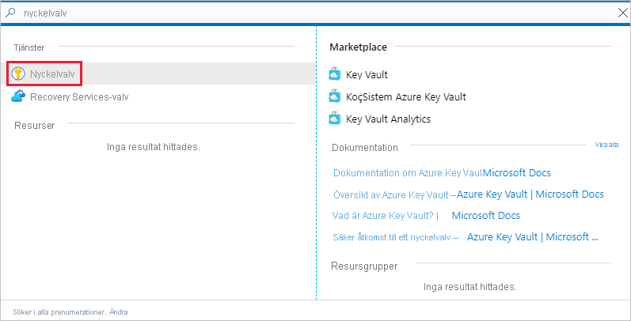
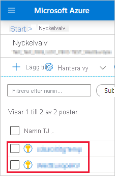
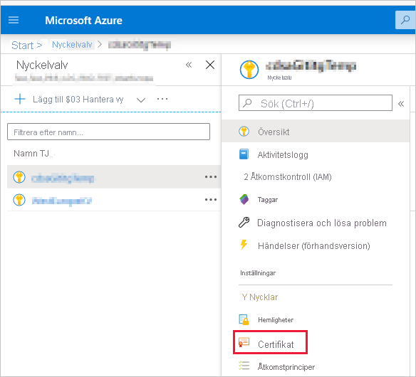
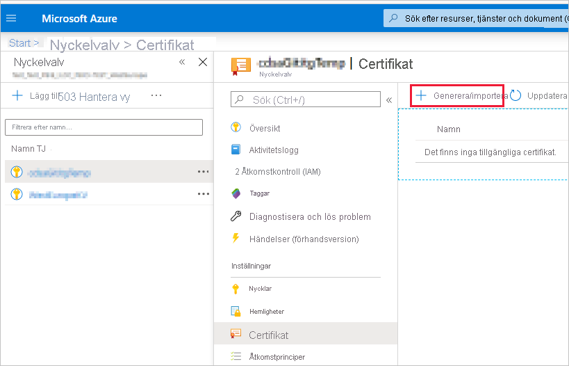
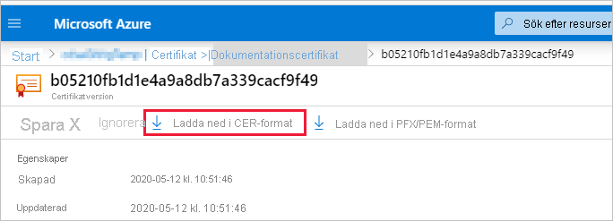
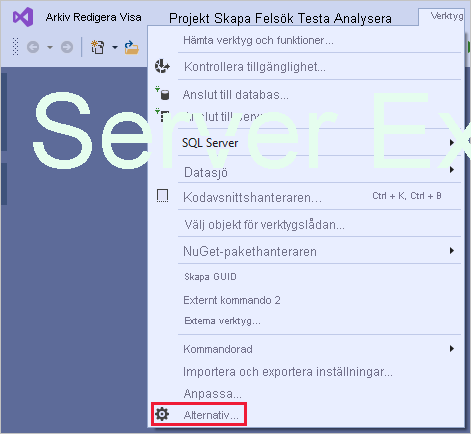
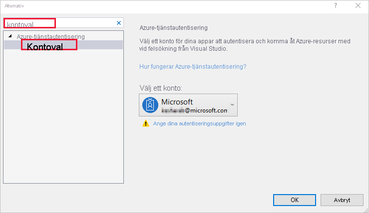

# <a name="embed-power-bi-content-with-service-principal-and-a-certificate"></a>Bädda in Power BI-innehåll med tjänstens huvudnamn och certifikat

[!INCLUDE[service principal overview](../../includes/service-principal-overview.md)]

>[!NOTE]
>Vi rekommenderar att du skyddar dina backend-tjänster med certifikat, i stället för med hemliga nycklar. [Läs mer om hur du hämtar åtkomsttoken från Azure AD med hjälp av hemliga nycklar eller certifikat](https://docs.microsoft.com/azure/architecture/multitenant-identity/client-assertion).

## <a name="certificate-based-authentication"></a>Certifikatbaserad autentisering

Med certifikatbaserad autentisering kan du autentiseras av Azure Active Directory (Azure AD) med ett klientcertifikat på en Windows-, Android- eller iOS-enhet, eller ett certifikat som lagras i [Azure Key Vault](https://docs.microsoft.com/azure/key-vault/basic-concepts).

Med den här autentiseringsmetoden kan du hantera certifikat från en central plats, med en certifikatutfärdare, för rotation eller återkallelse.

Du kan lära dig mer om certifikat i Azure AD på sidan om [flöden för klientens autentiseringsuppgifter](https://github.com/AzureAD/microsoft-authentication-library-for-dotnet/wiki/Client-credential-flows) på GitHub.

## <a name="method"></a>Metod

Följ dessa steg om du vill använda tjänstens huvudnamn och ett certifikat med inbäddad analys:

1. Skapa ett certifikat.

2. Skapa ett Azure AD-program.

3. Konfigurera certifikatautentisering.

4. Hämta certifikatet från Azure Key Vault.

5. Autentisera med hjälp av tjänstens huvudnamn och ett certifikat.

## <a name="step-1---create-a-certificate"></a>Steg 1 – Skapa ett certifikat

Du kan köpa ett certifikat från en betrodd *certifikatutfärdare* eller skapa ett certifikat själv.

I det här avsnittet beskriver vi hur du skapar ett certifikat med hjälp av [Azure Key Vault](https://docs.microsoft.com/azure/key-vault/create-certificate) och hur du hämtar *.cer*-filen som innehåller den offentliga nyckeln.

1. Logga in på [Microsoft Azure](https://ms.portal.azure.com/#allservices).

2. Sök efter **Nyckelvalv** och klicka på länken **Nyckelvalv**.

    

3. Klicka på det nyckelvalv som du vill lägga till ett certifikat till.

    

4. Klicka på **Certifikat**.

    

5. Klicka på **Generera/importera**.

    

6. Konfigurera fälten under **Skapa ett certifikat** enligt följande:

    * **Metod för skapande av certifikat** – allmänt

    * **Certifikatnamn** – Ange ett namn för ditt certifikat

    * **Typ av certifikatutfärdare (CA)** – Självsignerat certifikat

    * **Ämne** – Ett unikt [X.500](https://wikipedia.org/wiki/X.500)-namn

    * **DNS-namn** – 0 DNS-namn

    * **Giltighetsperiod (i månader)** – Ange certifikatets giltighetstid

    * **Innehållstyp** – PKCS #12

    * **Typ av livstidsåtgärd** – Förnya automatiskt när en viss procentandel av livstiden har uppnåtts

    * **Procentandel av livstid** – 80

    * **Avancerad principkonfiguration** – Ej konfigurerat

7. Klicka på **Skapa**. Certifikatet som du precis skapat är inaktiverat som standard. Det kan ta upp till fem minuter innan det aktiveras.

8. Välj det certifikat som du skapade.

9. Klicka på **Hämta i CER-format**. Den nedladdade filen innehåller den offentliga nyckeln.

    

## <a name="step-2---create-an-azure-ad-application"></a>Steg 2 – Skapa ett Azure AD-program

[!INCLUDE[service principal create app](../../includes/service-principal-create-app.md)]

## <a name="step-3---set-up-certificate-authentication"></a>Steg 3 – Konfigurera certifikatautentisering

1. I Azure AD-programmet klickar du på fliken **Certifikat och hemligheter**.

     

2. Klicka på **Ladda upp certifikat** och ladda upp *CER*-filen som du skapade och hämtade i det [första steget](#step-1---create-a-certificate) i den här självstudien. *CER*-filen innehåller den offentliga nyckeln.

## <a name="step-4---get-the-certificate-from-azure-key-vault"></a>Steg 4 – Hämta certifikatet från Azure Key Vault

Använd Hanterad tjänstidentitet (MSI) för att hämta certifikatet från Azure Key Vault. I den här processen hämtar du *PFX*-certifikatet som innehåller både de offentliga och privata nycklarna.

Kodexemplet visar certifikatinläsningen från Azure Key Vault. Om du vill använda Visual Studio läser du avsnittet [Konfigurera Visual Studio för MSI](#configure-visual-studio-to-use-msi).

```csharp
private X509Certificate2 ReadCertificateFromVault(string certName)
{
    var serviceTokenProvider = new AzureServiceTokenProvider();
    var keyVaultClient = new KeyVaultClient(new KeyVaultClient.AuthenticationCallback(serviceTokenProvider.KeyVaultTokenCallback));
    CertificateBundle certificate = null;
    SecretBundle secret = null;
    try
    {
        certificate = keyVaultClient.GetCertificateAsync($"https://{KeyVaultName}.vault.azure.net/", certName).Result;
        secret = keyVaultClient.GetSecretAsync(certificate.SecretIdentifier.Identifier).Result;
    }
    catch (Exception)
    {
        return null;
    }

    return new X509Certificate2(Convert.FromBase64String(secret.Value));
}
```

## <a name="step-5---authenticate-using-service-principal-and-a-certificate"></a>Steg 5 – Autentisera med hjälp av tjänstens huvudnamn och ett certifikat

Du kan autentisera din app med hjälp av tjänstens huvudnamn och ett certifikat som lagras i Azure Key Vault genom att ansluta till Azure Key Vault.

Koden nedan visar hur du ansluter och läser in certifikatet från Azure Key Vault.

>[!NOTE]
>Om du redan har ett certifikat som har skapats av din organisation kan du ladda upp *PFX*-filen till Azure Key Vault.

```csharp
// Preparing needed variables
var Scope = "https://analysis.windows.net/powerbi/api/.default"
var ApplicationId = "{YourApplicationId}"
var tenantSpecificURL = "https://login.microsoftonline.com/{YourTenantId}/"
X509Certificate2 certificate = ReadCertificateFromVault(CertificateName);

// Authenticating with a SP and a certificate
public async Task<AuthenticationResult> DoAuthentication(){
    IConfidentialClientApplication clientApp = null;
    clientApp = ConfidentialClientApplicationBuilder.Create(ApplicationId)
                                                    .WithCertificate(certificate)
                                                    .WithAuthority(tenantSpecificURL)
                                                    .Build();
    try
    {
        authenticationResult = await clientApp.AcquireTokenForClient(Scope).ExecuteAsync();
    }
    catch (MsalException)
    {
        throw;
    }
    return authenticationResult
}
```

## <a name="configure-visual-studio-to-use-msi"></a>Konfigurera Visual Studio för MSI

När du skapar en inbäddad lösning kan det vara praktiskt att konfigurera Visual Studio att använda Hanterad tjänstidentitet (MSI). [MSI](https://docs.microsoft.com/azure/active-directory/managed-identities-azure-resources/overview) är en funktion som hjälper dig att hantera din Azure AD-identitet. När den har konfigurerats kan Visual Studio autentisera mot ditt Azure Key Vault.

1. Öppna ditt projekt i Visual Studio.

2. Klicka på **Verktyg** > **Alternativ**.

     

3. Sök efter **Kontoval** och klicka på **Kontoval**.

    

4. Lägg till kontot som har åtkomst till ditt Azure Key Vault.

[!INCLUDE[service principal limitations](../../includes/service-principal-limitations.md)]

## <a name="next-steps"></a>Nästa steg

>[!div class="nextstepaction"]
>[Registrera en app](register-app.md)

>[!div class="nextstepaction"]
>[Power BI Embedded för dina kunder](embed-sample-for-customers.md)

>[!div class="nextstepaction"]
>[Objekt för program och tjänstens huvudnamn i Azure Active Directory](https://docs.microsoft.com/azure/active-directory/develop/app-objects-and-service-principals)

>[!div class="nextstepaction"]
>[Säkerhet på radnivå med hjälp av lokal datagateway med tjänstens huvudnamn](embedded-row-level-security.md#on-premises-data-gateway-with-service-principal)

>[!div class="nextstepaction"]
>[Bädda in Power BI-innehåll med tjänstens huvudnamn och en programhemlighet](embed-service-principal.md)