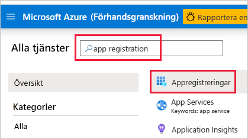
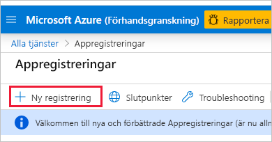
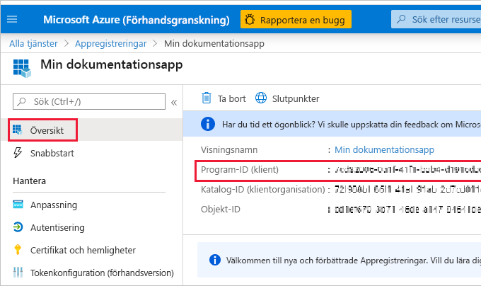
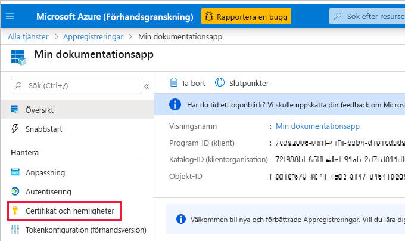
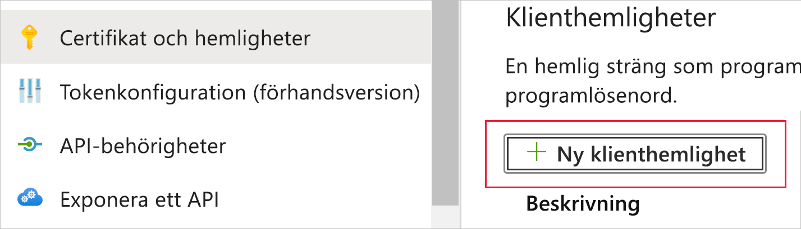
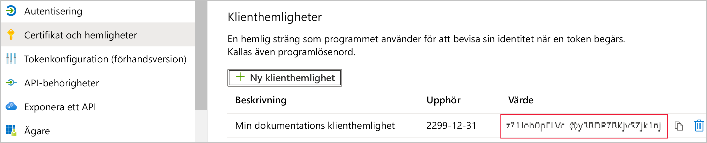
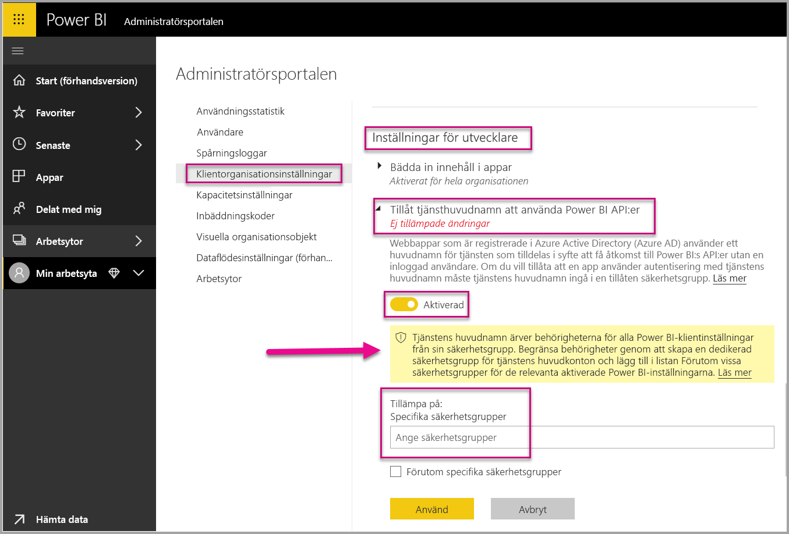
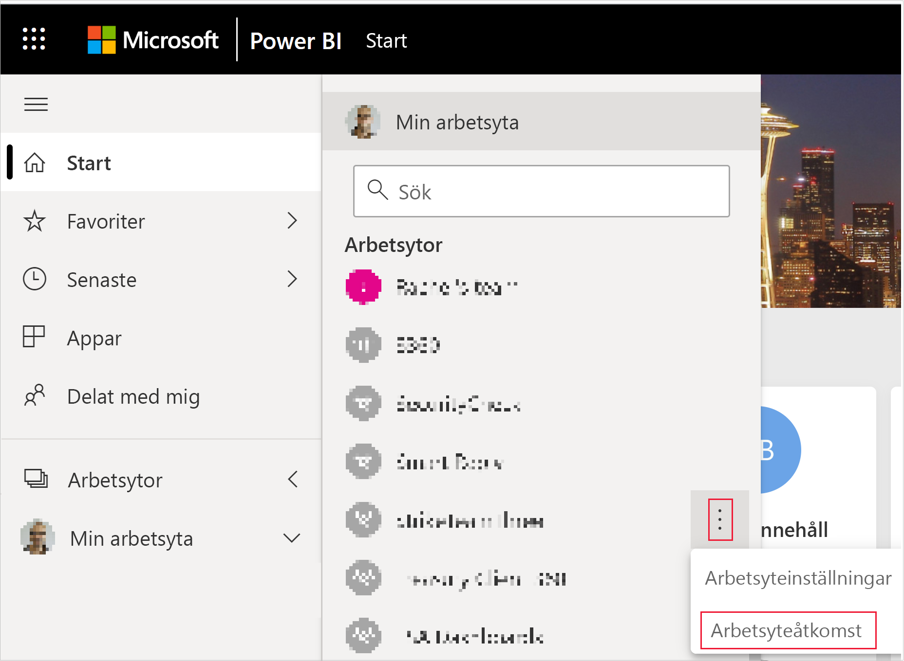
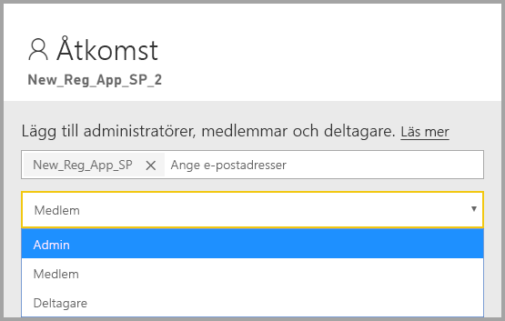

# <a name="embedding-power-bi-content-with-service-principal-and-application-secret"></a>Bädda in Power BI innehåll med tjänstens huvudnamn och apphemlighet

[!INCLUDE[service principal overview](../../includes/service-principal-overview.md)]

I den här artikeln beskrivs autentisering med tjänstens huvudnamn med *program-ID* och *apphemlighet*.

## <a name="method"></a>Metod

Följ dessa steg om du vill använda tjänstens huvudnamn och ett program-ID med inbäddad analys:

1. Skapa en [Azure AD-app](https://docs.microsoft.com/azure/active-directory/manage-apps/what-is-application-management).

    1. Skapa Azure AD-appens hemlighet.
    
    2. Hämta appens *program-ID* och *apphemlighet*.

    >[!NOTE]
    >De här stegen beskrivs i **steg 1**. Mer information om hur du skapar en Azure AD-app finns i artikeln [Skapa en Azure AD-App](https://docs.microsoft.com/azure/active-directory/develop/howto-create-service-principal-portal).

2. Skapa en Azure AD-säkerhetsgrupp.

3. Aktivera Power BI-tjänstens administratörsinställningar.

4. Lägg till ett tjänsthuvudnamn i din arbetsyta.

5. Bädda in innehållet.

> [!IMPORTANT]
> Om du aktiverar tjänstens huvudnamn för användning med Power BI gäller inte längre programmets AD-behörigheter. Programmets behörigheter hanteras då via Power BI-administrationsportalen.

## <a name="step-1---create-an-azure-ad-app"></a>Steg 1 – Skapa en Azure AD-app

Skapa en Azure AD-app med någon av följande metoder:
* Skapa appen i [Microsoft Azure-portalen](https://portal.azure.com/#allservices)
* Skapa appen med hjälp av [PowerShell](https://docs.microsoft.com/powershell/azure/create-azure-service-principal-azureps?view=azps-3.6.1).

### <a name="creating-an-azure-ad-app-in-the-microsoft-azure-portal"></a>Skapa en Azure AD-app i Microsoft Azure-portalen

1. Logga in på [Microsoft Azure](https://portal.azure.com/#allservices).

2. Sök efter **Appregistreringar** och klicka på länken **Appregistreringar**.

    

3. Klicka **Ny registrering**.

    

4. Fyll i nödvändig information:
    * **Namn** – Ange ett namn för ditt program
    * **Kontotyper som stöds** – Välj det Azure AD-konto du behöver
    * (Valfritt) **Omdirigerings-URI** – ange en URI om det behövs

5. Klicka på **Registrera**.

6. Efter registreringen är *Program-ID* tillgängligt på fliken **Översikt**. Kopiera och spara *Program-ID* för senare användning.

    

7. Klicka på fliken **Certifikat och hemligheter**.

     

8. Klicka på **Ny klienthemlighet**

    

9. I fönstret *Lägg till en klienthemlighet* anger du en beskrivning och när du vill att klienthemligheten ska upphöra att gälla. Klicka sedan på **Lägg till**.

10. Kopiera och spara värdet för *Klienthemligheten*.

    

    >[!NOTE]
    >När du lämnar det här fönstret döljs värdet för klienthemligheten och du kommer inte att kunna visa eller kopiera det igen.

### <a name="creating-an-azure-ad-app-using-powershell"></a>Skapa en Azure AD-app med PowerShell

Det här avsnittet innehåller ett exempelskript för att skapa en ny Azure AD-app med hjälp av [PowerShell](https://docs.microsoft.com/powershell/azure/create-azure-service-principal-azureps?view=azps-1.1.0).

```powershell
# The app ID - $app.appid
# The service principal object ID - $sp.objectId
# The app key - $key.value

# Sign in as a user that's allowed to create an app
Connect-AzureAD

# Create a new Azure AD web application
$app = New-AzureADApplication -DisplayName "testApp1" -Homepage "https://localhost:44322" -ReplyUrls "https://localhost:44322"

# Creates a service principal
$sp = New-AzureADServicePrincipal -AppId $app.AppId

# Get the service principal key
$key = New-AzureADServicePrincipalPasswordCredential -ObjectId $sp.ObjectId
```

## <a name="step-2---create-an-azure-ad-security-group"></a>Steg 2 – Skapa en Azure AD-säkerhetsgrupp

Tjänstens huvudnamn har inte åtkomst till något av dina Power BI-innehåll eller API:er. För att ge tjänstens huvudnamn åtkomst skapar du en säkerhetsgrupp i Azure AD och lägger till tjänstens huvudnamn som du skapade i säkerhetsgruppen.

Det finns två sätt att skapa en Azure AD-säkerhetsgrupp:
* Manuellt (i Azure)
* Använda PowerShell

### <a name="create-a-security-group-manually"></a>Skapa en säkerhetsgrupp manuellt

Om du vill skapa en Azure-säkerhetsgrupp manuellt följer du anvisningarna i artikeln [Skapa en basgrupp och lägga till medlemmar med hjälp av Azure Active Directory](https://docs.microsoft.com/azure/active-directory/fundamentals/active-directory-groups-create-azure-portal). 

### <a name="create-a-security-group-using-powershell"></a>Skapa en säkerhetsgrupp med PowerShell

Nedan är ett exempelskript för att skapa en ny säkerhetsgrupp och lägga till programmet i den säkerhetsgruppen.

>[!NOTE]
>Om du vill aktivera åtkomst med tjänstens huvudnamn för hela organisationen kan du hoppa över det här steget.

```powershell
# Required to sign in as a tenant admin
Connect-AzureAD

# Create an Azure AD security group
$group = New-AzureADGroup -DisplayName <Group display name> -SecurityEnabled $true -MailEnabled $false -MailNickName notSet

# Add the service principal to the group
Add-AzureADGroupMember -ObjectId $($group.ObjectId) -RefObjectId $($sp.ObjectId)
```

## <a name="step-3---enable-the-power-bi-service-admin-settings"></a>Steg 3 –Aktivera Power BI-tjänstens administratörsinställningar

För att en Azure AD-App ska kunna komma åt Power BI-innehåll och API:er måste en Power BI-administratör aktivera åtkomst till tjänstens huvudnamn i administratörsportalen för Power BI.

Lägg till den säkerhetsgrupp som du skapade i Azure AD i det specifika området för säkerhetsgrupp i **Inställningar för utvecklare**.

>[!IMPORTANT]
>Tjänstens huvudnamn har åtkomst till alla klientinställningar som de är aktiverade för. Beroende på dina administratörsinställningar inkluderar detta vissa säkerhetsgrupper eller hela organisationen.
>
>Om du vill begränsa åtkomsten till tjänstens huvudnamn till särskilda klientinställningar ger du åtkomst till vissa säkerhetsgrupper. Du kan också skapa en dedikerad säkerhetsgrupp för tjänstens huvudnamn och undanta den från önskade klientinställningar.



## <a name="step-4---add-the-service-principal-as-an-admin-to-your-workspace"></a>Steg 4 – Lägg till tjänstens huvudnamn som administratör för din arbetsyta

Om du vill aktivera åtkomstartefakter för Azure AD-appen, till exempel rapporter, instrumentpaneler och datauppsättningar i Power BI-tjänsten, lägger du till entiteten för tjänstens huvudnamn som medlem eller administratör på din arbetsyta.

>[!NOTE]
>Det här avsnittet innehåller gränssnittsanvisningar. Du kan också lägga till ett tjänsthuvudnamn i en arbetsyta med hjälp av [Grupper – Lägg till API för gruppanvändare](https://docs.microsoft.com/rest/api/power-bi/groups/addgroupuser).

1. Bläddra till den arbetsyta som du vill aktivera åtkomst för och välj **Åtkomst till arbetsytan** på menyn **Mer**.

    

2. Lägg till tjänstens huvudnamn som **Administratör** eller **Medlem** på arbetsytan.

    

## <a name="step-5---embed-your-content"></a>Steg 5: Bädda in innehåll

Du kan bädda in ditt innehåll med ett exempelprogram eller i ditt program.

* [Bädda in innehåll med exempelprogrammet](embed-sample-for-customers.md#embed-content-using-the-sample-application)
* [Bädda in innehåll i programmet](embed-sample-for-customers.md#embed-content-within-your-application)

När ditt innehåll hasr bäddats in kan du [övergå till produktion](embed-sample-for-customers.md#move-to-production).

## <a name="considerations-and-limitations"></a>Överväganden och begränsningar

* Tjänstens huvudnamn fungerar bara med [nya arbetsytor](../../service-create-the-new-workspaces.md).
* **Min arbetsyta** stöds inte när du använder tjänstens huvudnamn.
* Dedikerad kapacitet krävs vid flytt till produktion.
* Du kan inte logga in på Power BI-portal med tjänstens huvudnamn.
* Power BI-administratörsbehörighet krävs för att aktivera tjänstens huvudnamn i inställningarna för utvecklare i Power BI-administratörsportalen.
* Du kan inte installera eller hantera en lokal datagateway med tjänstens huvudnamn.
* Det går inte att använda tjänstens huvudnamn för [inbäddning för organisationens](embed-sample-for-your-organization.md) program.
* Hantering av [dataflöden](../../service-dataflows-overview.md) stöds inte.
* Tjänstens huvudnamn har för närvarande inte stöd för några administratörs-API:er.
* Vid användning av tjänsthuvudnamn med en [Azure Analysis Services](https://docs.microsoft.com/azure/analysis-services/analysis-services-overview)-datakälla måste själva tjänsthuvudnamnet ha en Azure Analysis Services-instansbehörighet. Det fungerar inte att använda en säkerhetsgrupp som innehåller tjänsthuvudnamnet för detta ändamål.

## <a name="next-steps"></a>Nästa steg

* [Power BI Embedded för dina kunder](embed-sample-for-customers.md)

* [Säkerhet på radnivå med hjälp av lokal datagateway med tjänstens huvudnamn](embedded-row-level-security.md#on-premises-data-gateway-with-service-principal)