# <a name="row-level-security-with-power-bi-embedded"></a>Säkerhet på radnivå med Power BI Embedded

**Säkerhet på radnivå (RLS)** kan användas för att begränsa användares åtkomst till data i instrumentpaneler, paneler, rapporter och datauppsättningar. Olika användare kan arbeta med samma artefakter och alla se olika data. Inbäddning har stöd för RLS.

Om du bäddar in för användare som inte använder Power BI (appen äger data), vilket vanligtvis är ett ISV-scenario, är det här rätt artikel för dig. Konfigurera en inbäddningstoken för användaren och rollen.

Om du bäddar in till Power BI-användare (användare äger data) i din organisation fungerar RLS på samma sätt som i Power BI-tjänsten. Du behöver inte göra något mer i din app. Mer information finns i [säkerhet på radnivå (RLS) med Power BI](../../admin/service-admin-rls.md).


För att du ska kunna använda RLS är det viktigt att du förstår tre huvudsakliga koncept: användare, roller och regler. Vi tar en närmare titt på de här begreppen:

**Användare** – slutanvändare som visar artefakten (instrumentpanel, panel, rapport eller datauppsättning). Användare identifieras av username-egenskapen i en inbäddningstoken i Power BI Embedded.

**Roller** – användare tillhör roller. En roll är en container för regler och har namn som *försäljningschef* eller *säljare*. Du kan skapa roller i Power BI Desktop. Mer information finns i [Säkerhet på radnivå (RLS) med Power BI Desktop](../../create-reports/desktop-rls.md).

**Regler** – roller har regler och dessa regler är de faktiska filter som ska tillämpas på data. Reglerna kan vara enkla som ”Land = USA” eller något mycket mer dynamiskt.
I resten av den här artikeln finns det ett exempel på hur RLS skapas och används i en inbäddad app. Vårt exempel använder PBIX-filen [Exempel för detaljhandelanalys](https://go.microsoft.com/fwlink/?LinkID=780547).


## <a name="adding-roles-with-power-bi-desktop"></a>Lägga till roller med Power BI Desktop

Vårt **detaljhandelsexempel** visar försäljning för alla butiker i en kedja. Utan RLS kommer samma data att visas oavsett vilken regionchef som loggar in. Företagsledningen har fastställt att varje regionschef endast bör se försäljning för butiker de hanterar. Om du använder RLS kan ledningen att begränsa data baserat på en distriktschef.

RLS har skrivits i Power BI Desktop. När datauppsättningen och rapporten öppnas växlar vi till diagramvy för att visa schemat:


Här följer några saker att observera med schemat:

* Alla åtgärder som **Totalförsäljning** lagras i faktatabellen för **Försäljning**.
* Det finns ytterligare fyra relaterade dimensionstabeller: **Objekt**, **tid**, **butik** och **distrikt**.
* Pilar på relationen raderna visar hur filter kan flöda från en tabell till en annan. Om exempelvis ett filter är placerat på **Tid [Date]** filtrerar den bara ned värdena i tabellen **Försäljning** i det aktuella schemat. Inga andra tabeller påverkas av det här filtret eftersom alla pilar i relationsraderna pekar mot försäljningstabellen och inte bort från den.
* Tabellen **Distrikt** anger vem som är chef för varje distrikt:
  
    

Baserat på det här schemat, om vi använder ett filter på kolumnen **Distriktschef** i tabellen **Distrikt** och om det filtret matchar användaren som visar rapporten så kommer det filtret att filtrera ned tabellerna **Butik** och **Försäljning** så att de endast visar data för den distriktschefen.

Gör så här:

1. Välj **Hantera roller** på fliken **Modellering**.

    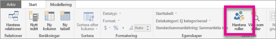
2. Skapa en ny roll som heter **Chef**.

    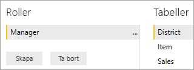
3. I tabellen **Distrikt** anger du det här DAX-uttrycket: **[distriktschef] = USERNAME()** .

    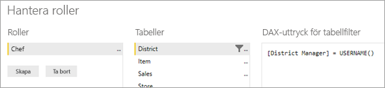
4. Kontrollera att reglerna fungerar på fliken **Modellering**, välj **Visa som roller** och välj sedan både rollen **Chef** som du skapade och **Andra användare**. Ange **AndrewMa** för användaren.

    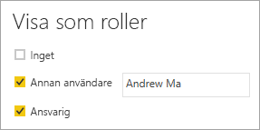

    Rapporterna visar data som om du har loggat in som **Andrew Ma**.

När vi tillämpar filtret på detta sätt så filtreras alla poster i tabellerna **Distrikt**, **Butik** och **Försäljning**. Men på grund av filterriktningen för relationerna mellan **Försäljning** och **Tid**, **Försäljning** och **Objekt**, samt **Objekt** och **Tid** filtreras tabellerna inte. Om du vill veta mer om dubbelriktad korsfiltrering kan du hämta vårt whitepaper [Dubbelriktad korsfiltrering i SQL Server Analysis Services 2016 och Power BI Desktop](https://download.microsoft.com/download/2/7/8/2782DF95-3E0D-40CD-BFC8-749A2882E109/Bidirectional%20cross-filtering%20in%20Analysis%20Services%202016%20and%20Power%20BI.docx).

## <a name="applying-user-and-role-to-an-embed-token"></a>Tillämpa användare och roll på en inbäddningstoken

Nu när du har konfigurerat dina Power BI Desktop-roller behöver du göra några fler saker i programmet för att dra nytta av rollerna.

Användare autentiseras och auktoriseras av ditt program, och inbäddningstoken används för att bevilja en användaren åtkomst till en viss Power BI Embedded-rapport. Power BI Embedded har inte någon särskild information om vem din användare är. För att RLS ska fungera måste du skicka ytterligare kontext som del av din inbäddade token som identiteter. Du kan skicka identiteterna med hjälp av API:t [Bädda in token](https://docs.microsoft.com/rest/api/power-bi/embedtoken).

API:et tillåter en lista med identiteter med information om relevanta datauppsättningar. För att RLS ska fungera så behöver du skicka nedanstående som en del av identiteten.

* **användarnamn (obligatorisk)** – en sträng som kan användas för att identifiera användaren när du använder RLS-regler. Det går bara att lista enskilda användare. Ditt användarnamn kan skapas med *ASCII* tecken.
* **Roller (obligatorisk)** – en sträng som innehåller rollerna som kan väljas vid tillämpning av säkerhet på radnivå. Om du skickar mer än en roll bör de skickas som strängmatris.
* **datauppsättning (obligatoriskt)** – datauppsättningen som gäller för artefakten du bäddar in.

Du kan skapa en inbäddningstoken med hjälp av metoden **GenerateTokenInGroup** på **PowerBIClient.Reports**.

Du kan till exempel ändra exemplet [PowerBIEmbedded_AppOwnsData](https://github.com/microsoft/PowerBI-Developer-Samples/tree/master/.NET%20Framework/App%20Owns%20Data/PowerBIEmbedded_AppOwnsData). *Services\EmbedService.cs rad 76 och 77* kan uppdateras från:

```csharp
// Generate Embed Token.
var generateTokenRequestParameters = new GenerateTokenRequest(accessLevel: "view");

var tokenResponse = await client.Reports.GenerateTokenInGroupAsync(GroupId, report.Id, generateTokenRequestParameters);
```

till

```csharp
var generateTokenRequestParameters = new GenerateTokenRequest("View", null, identities: new List<EffectiveIdentity> { new EffectiveIdentity(username: "username", roles: new List<string> { "roleA", "roleB" }, datasets: new List<string> { "datasetId" }) });

var tokenResponse = await client.Reports.GenerateTokenInGroupAsync("groupId", "reportId", generateTokenRequestParameters);
```

Om du anropar REST API accepterar det uppdaterade API:et nu ytterligare en JSON-matris med namnet **identiteter**, som innehåller ett användarnamn, en lista över strängroller och en lista över strängdatauppsättningar. 

Använd följande kod som exempel:

```json
{
    "accessLevel": "View",
    "identities": [
        {
            "username": "EffectiveIdentity",
            "roles": [ "Role1", "Role2" ],
            "datasets": [ "fe0a1aeb-f6a4-4b27-a2d3-b5df3bb28bdc" ]
        }
    ]
}
```

Nu är allt på plats. När någon nu loggar in i programmet för att visa artefakten syns bara de data personen har behörighet att visa enligt vad som definieras av säkerhetsinställningarna på radnivå.

## <a name="working-with-analysis-services-live-connections"></a>Arbete med realtidsanslutningar till Analysis Services

Säkerhet på radnivå kan användas med Analysis Services liveanslutningar för lokala servrar. Det finns några specifika begrepp som du bör känna till när du använder den här typen av anslutning.

Den identitet som har angetts för egenskapen användarnamn måste vara en Windows-användare med behörigheter på Analysis Services-servern.

>[!NOTE]
> Vid användning av tjänsthuvudnamn med en [Azure Analysis Services](https://docs.microsoft.com/azure/analysis-services/analysis-services-overview)-datakälla måste själva tjänsthuvudnamnet ha en Azure Analysis Services-instansbehörighet. Det fungerar inte att använda en säkerhetsgrupp som innehåller tjänsthuvudnamnet för detta ändamål.

### <a name="on-premises-data-gateway-configuration"></a>Konfiguration för lokal datagateway

En [lokal datagateway](../../connect-data/service-gateway-onprem.md) används när du arbetar med live-anslutningar till Analysis Services. När du genererar en inbäddningstoken med en identitet som anges måste huvudkontot visas som en gatewayadministratör. Om masterkontot inte listas kommer säkerheten på radnivå inte att tillämpas på dataegenskapen. En icke-administratörer på gatewayen kan ange roller, men måste ange ett eget användarnamn för den effektiva identiteten.

### <a name="use-of-roles"></a>Användning av roller

Roller kan tilldelas med identiteten i en inbäddad token. Om ingen roll anges kommer det angivna användarnamnet att användas för att lösa de associerade rollerna.

### <a name="using-the-customdata-feature"></a>Använda funktionen CustomData

CustomData-funktionen fungerar endast för modeller som finns i **Azure Analysis Services**, och den fungerar endast i läget **Anslut live**. Till skillnad från användare och roller så kan den anpassade datafunktionen inte anges inuti en .pbix-fil. När du skapar en token med Anpassade data-funktionen så måste du ha ett användarnamn.

Med CustomData-funktionen kan du lägga till ett radfilter när du visar Power BI-data i ditt program när du använder **Azure Analysis Services** som datakälla (visa Power BI-data som är anslutna till Azure Analysis Services i ditt program ).

CustomData-funktionen tillåter sändning av fritext (sträng) med anslutningssträngegenskapen för CustomData. Analysis Services använder det här värdet via funktionen *CUSTOMDATA()* .

Det enda sättet att ha dynamisk RLS (som använder dynamiska värden för utvärdering av filter) i **Azure Analysis Services** är att använda funktionen *CUSTOMDATA()* .

Du kan använda den i DAX-frågerollen, och den kan användas utan någon roll i en DAX-måttfråga.
CustomData-funktionen ingår i tokengenereringen för följande artefakter: instrumentpanel, rapport och panel. En instrumentpanel kan ha flera CustomData-identiteter (en per panel/modell).

#### <a name="customdata-sdk-additions"></a>SDK-tillägg för CustomData

CustomData-strängegenskapen har lagts till vår effektiva identitet i scenariot för tokengenerering.

```json
[JsonProperty(PropertyName = "customData")]
public string CustomData { get; set; }
```

Identiteten kan skapas med anpassade data med hjälp av följande anrop:

```csharp
public EffectiveIdentity(string username, IList<string> datasets, IList<string> roles = null, string customData = null);
```

#### <a name="customdata-sdk-usage"></a>SDK-användning för CustomData

Om du anropar REST-API:t kan du lägga till anpassade data inom varje identitet, till exempel:

```json
{
    "accessLevel": "View",
    "identities": [
        {
            "username": "EffectiveIdentity",
            "roles": [ "Role1", "Role2" ],
            "customData": "MyCustomData",
            "datasets": [ "fe0a1aeb-f6a4-4b27-a2d3-b5df3bb28bdc" ]
        }
    ]
}
```

Här följer stegen för att börja konfigurera funktionen CustomData() med appen Power BI Embedded.

1. Skapa din Azure Analysis Services-databas. Logga sedan in på Azure Analysis Services-servern via [SQL Server Management Studio](https://docs.microsoft.com/sql/ssms/download-sql-server-management-studio-ssms?view=sql-server-2017).

    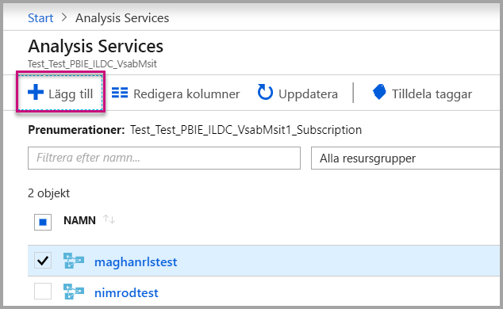

    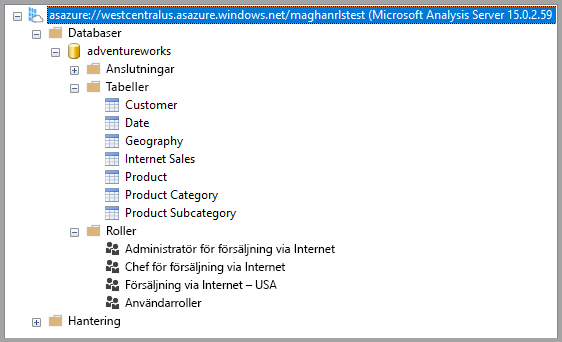

2. Skapa en roll i Analysis Services-servern.

    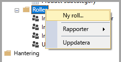

3. Ange de **Allmänna** inställningarna.  Här anger du ett **Rollnamn** och ställer in databasbehörigheten på **Skrivskyddad**.

    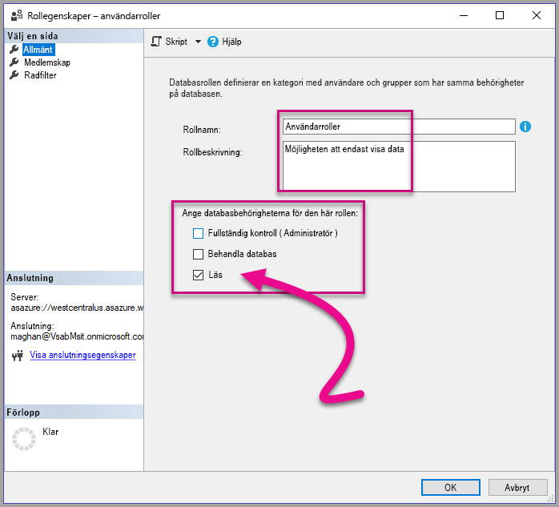

4. Ange inställning för **Medlemskap**. Nu lägger du till de användare som påverkas av den här rollen.

    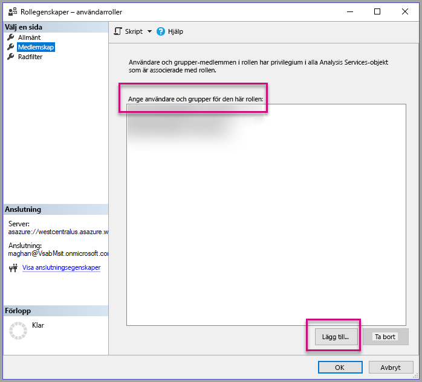

5. Ange din **radfilter** DAX-fråga med funktionen *CUSTOMDATA()* .

    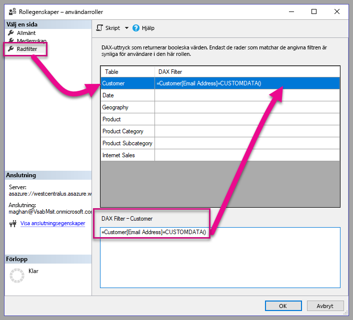

6. Skapa en PBI-rapport och publicera den till en arbetsyta med dedikerad kapacitet.

    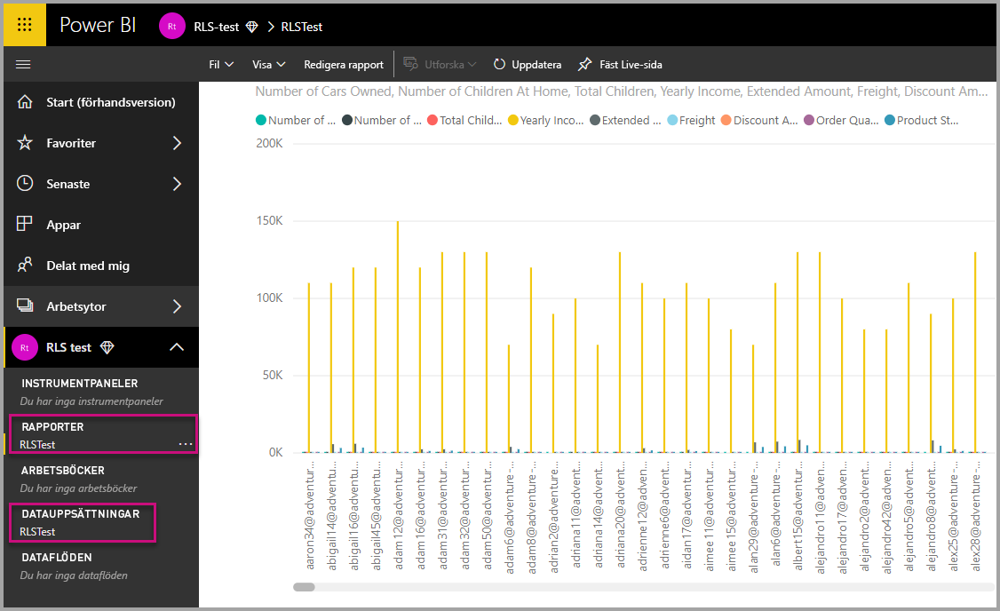

7. Använd Power BI-API: er för att använda funktionen CustomData i ditt program.  När du skapar en token med CustomData-funktionen så måste du ha ett användarnamn. Användarnamnet måste vara samma som UPN-namnet för överordnad användare. Överordnad användare måste vara medlem i de roller som du skapade. Om inga roller har angetts används de roller som överordnad användare är medlem i för RLS utvärdering.

    När du arbetar med ett [huvudnamn för tjänsten](embed-service-principal.md) måste du också utföra stegen ovan i stället för med ett huvudkonto. När du genererar inbäddningstoken ska du använda [objekt-ID:t för tjänstens huvudnamn](embed-service-principal.md) som användarnamn.

    > [!Note]
    > När du är redo att distribuera ditt program till produktion ska alternativet eller kontofältet för överordnad användare inte visas för slutanvändaren.

    Visa [koden](#customdata-sdk-additions) för att lägga till CustomData-funktionen.

8. Nu kan du visa rapporten i ditt program innan du tillämpar CustomData-värdena för att se alla data som din rapport innehåller.

    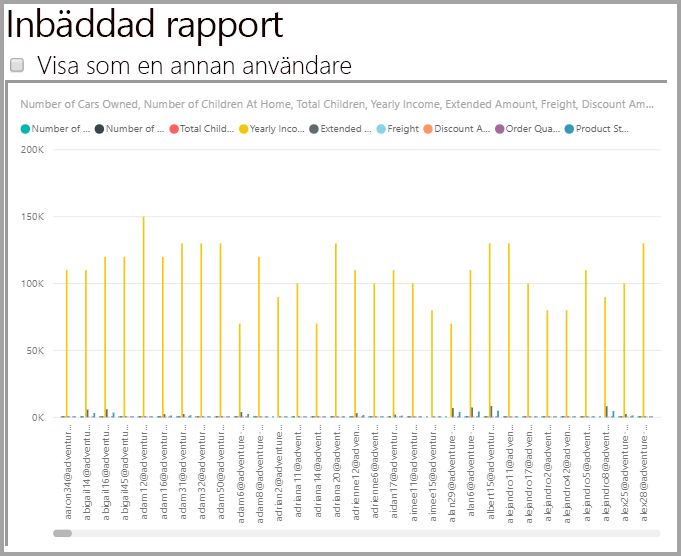

    Tillämpa därefter CustomData-värdena för att se hur rapporten visar en annan uppsättning data.
    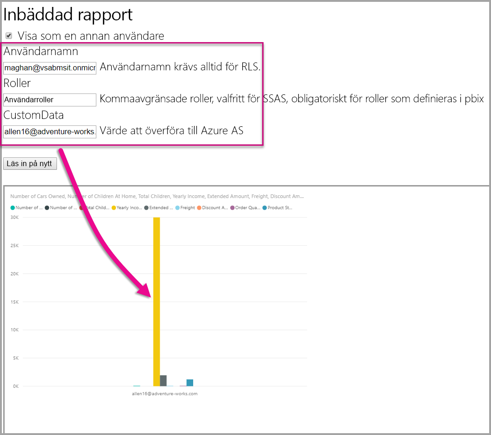

## <a name="using-rls-vs-javascript-filters"></a>Använda RLS jämfört med JavaScript-filter

När du bestämmer dig för att filtrera dina data i en rapport kan du använda **säkerhet på radnivå (RLS)** eller **JavaScript-filter**.

[Säkerhet på radnivå](../../admin/service-admin-rls.md) är en funktion som filtrerar data på datamodellsnivå. Serverdelens datakälla styr RLS-inställningarna. Baserat på datamodellen ställer genereringen av inbäddningstoken i användarnamn och roller för sessionen. Det kan inte åsidosättas, tas bort eller styras av koden på klientsidan och det är därför det anses vara säker. Vi rekommenderar att du använder RLS för att filtrera data på ett säkert sätt. Du kan filtrera data med RLS med något av alternativen nedan.

* [Konfigurera roller i en Power BI-rapport](../../create-reports/desktop-rls.md).
* Konfigurera roller på datakällnivå (enbart Analysis Services live-anslutning).
* Via programmering med en [inbäddningstoken](https://docs.microsoft.com/rest/api/power-bi/embedtoken/datasets_generatetokeningroup) med `EffectiveIdentity`. När du använder en inbäddningstoken passerar det faktiska filtret inbäddningstoken för en viss session.

[JavaScript-filter](https://github.com/Microsoft/PowerBI-JavaScript/wiki/Filters#page-level-and-visual-level-filters) används för att tillåta användaren att använda en begränsad, definierad eller filtrerad vy av aktuella data. Användaren har dock fortfarande åtkomst till modellens schematabeller, kolumner och mått och kan potentiellt få åtkomst till alla data där. Begränsad åtkomst till data kan endast användas med RLS och inte via filtrering API: er på klientsidan.

## <a name="token-based-identity-with-azure-sql-database"></a>Tokenbaserad identitet med Azure SQL Database

Den **tokenbaserad identiteten** låter dig ange den effektiva identiteten för en inbäddad token med hjälp av en **Azure Active Directory (AAD)** -åtkomsttoken för en **Azure SQL Database**.

Kunder som har sina data i **Azure SQL Database** kan nu dra nytta av en ny funktion för att hantera användare och deras åtkomst till data i Azure SQL vid integrering med **Power BI Embedded**.

När du genererar en inbäddningstoken så kan du ange den effektiva identiteten för en användare i Azure SQL. Du kan ange den effektiva identiteten för en användare genom att skicka AAD-åtkomsttoken till servern. Åtkomsttoken används för att enbart hämta relevanta data för den användaren från Azure SQL, för den specifika sessionen.

Den kan användas för att hantera varje användares vy i Azure SQL eller för att logga in på Azure SQL som en specifik kund i en databas för flera innehavare. Det kan tillämpa säkerhet på radnivå för den aktuella sessionen i Azure SQL och enbart hämta relevanta data för den sessionen, vilket gör att du inte behöver hantera RLS i Power BI.

Sådana effektiva identitetsproblem gäller för RLS-regler direkt på Azure SQL-servern. Power BI Embedded använder den angivna åtkomsttoken när den frågar efter data från Azure SQL Server. UPN för den användare (som åtkomsttoken har angetts för) finns tillgänglig som ett resultat av USER_NAME() SQL-funktionen.

Den tokenbaserade identiteten fungerar bara för DirectQuery-modeller på dedikerad kapacitet – ansluten till en Azure SQL Database som är konfigurerad för att tillåta AAD-autentisering ([läs mer om AAD-autentisering för Azure SQL Database](https://docs.microsoft.com/azure/sql-database/sql-database-manage-logins)). Datauppsättningens datakälla måste konfigureras för att använda slutanvändarnas OAuth2-autentiseringsuppgifter för att använda en tokenbaserad identitet.

   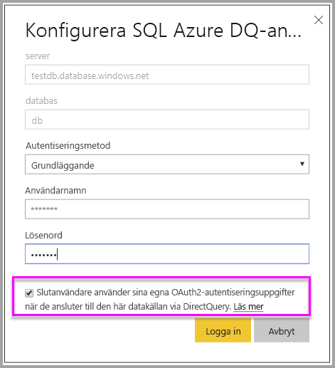

### <a name="token-based-identity-sdk-additions"></a>SDK-tillägg för tokenbaserad identitet

Identitetsblob-egenskapen lades till vår effektiva identitet i scenariot för tokengenerering.

```JSON
[JsonProperty(PropertyName = "identityBlob")]
public IdentityBlob IdentityBlob { get; set; }
```

IdentityBlob-typen är en enkel JSON-struktur som innehåller en värdesträngegenskap

```JSON
[JsonProperty(PropertyName = "value")]
public string value { get; set; }
```

EffectiveIdentity kan skapas med identitetsbloben med följande anrop:

```C#
public EffectiveIdentity(string username, IList<string> datasets, IList<string> roles = null, string customData = null, IdentityBlob identityBlob = null);
```

Identitetsbloben kan skapas med följande anrop.

```C#
public IdentityBlob(string value);
```

### <a name="token-based-identity-rest-api-usage"></a>Tokenbaserad identitet REST API-användning

Om du anropar [REST-API:t](/rest/api/power-bi/embedtoken/reports_generatetokeningroup#definitions) så kan du lägga till en identitetsblob inom varje identitet.

```JSON
{
    "accessLevel": "View",
    "identities": [
        {
            "datasets": ["fe0a1aeb-f6a4-4b27-a2d3-b5df3bb28bdc"],
        "identityBlob": {
            "value": "eyJ0eXAiOiJKV1QiLCJh…."
         }
        }
    ]
}
```

Värdet som angetts i identitysbloben ska vara en giltig åtkomsttoken till Azure SQL Server (med en resurs-URL på (<https://database.windows.net/>).

   > [!Note]
   > Om du vill kunna skapa en åtkomsttoken för Azure SQL så måste programmet ha **Åtkomst till Azure SQL DB och Data Warehouse**-delegerad behörighet till **Azure SQL Database**-API:et på AAD-konfigurationen för appregistrering i Azure-portalen.

   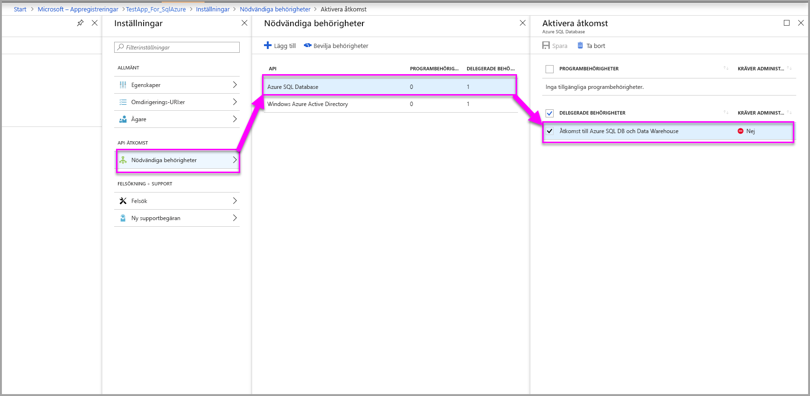

## <a name="on-premises-data-gateway-with-service-principal"></a>Lokal datagateway med tjänstens huvudnamn

Kunder som konfigurerar säkerhet på radnivå (RLS) med hjälp av en lokal SQL Server Analysis Services-datakälla (SSAS) med liveanslutning kan använda den nya funktionen för [tjänstens huvudnamn](embed-service-principal.md) för att hantera användare och deras åtkomst till data i SSAS vid integrering med **Power BI Embedded**.

Med [Power BI REST-API:er](https://docs.microsoft.com/rest/api/power-bi/) kan du ange de effektiva identiteten för lokala SSAS-liveanslutningar för en inbäddningstoken med hjälp av ett [objekt för tjänstens huvudnamn](https://docs.microsoft.com/azure/active-directory/develop/app-objects-and-service-principals#service-principal-object).

Fram till nu har huvudanvändaren som genererar en inbäddningstoken, för att kunna ange den effektiva identiteten för lokal SSAS-liveanslutning behövt vara en gatewayadministratör. Nu, istället för att kräva att användaren är gatewayadministratör, kan gatewayadministratören ge användaren dedikerad behörighet för den datakällan, som tillåter att användaren åsidosätter den effektiva identiteten när du genererar inbäddningstoken. Den här nya funktionen möjliggör inbäddning med tjänstens huvudnamn för en aktiv SSAS-anslutning.

För att aktivera det här scenariot använder gatewayadministratören [REST-API:et för att lägga till användare av datakälla](https://docs.microsoft.com/rest/api/power-bi/gateways/adddatasourceuser) för att ge tjänstens huvudnamn behörigheten *ReadOverrideEffectiveIdentity* för Power BI Embedded.

Du kan inte ange den här behörigheten med hjälp av administratörsportalen. Den här behörigheten anges bara med API:et. I administratörsportalen ser du en indikation för användare och tjänsthuvudnamn med sådana behörigheter.

## <a name="considerations-and-limitations"></a>Överväganden och begränsningar

* Tilldelningen av användare till roller i Power BI-tjänsten påverkar inte RLS när du använder en inbäddningstoken.
* Även om Power BI-tjänsten inte tillämpar RLS-inställningar för administratörer eller medlemmar med redigeringsbehörighet så tillämpas en identitet du anger med en inbäddningstoken på data.
* Analysis Services realtidsanslutningar stöds för lokala servrar.
* Azure Analysis Services live-anslutningar stöder filtrering efter roller. Dynamisk filtrering kan göras med hjälp av CustomData.
* Om den underliggande datamängden inte kräver RLS får GenerateToken-begäran **inte** innehålla en effektiv identitet.
* Om den underliggande datauppsättningen är en molnmodell (cachelagrad modell eller DirectQuery) måste den effektiva identiteten innehålla minst en roll, annars sker ingen rolltilldelning.
* En lista över identiteter möjliggör flera identitetstoken för inbäddning av instrumentpanelen. För andra artefakter innehåller listan en enstaka identitet.

### <a name="token-based-identity-limitations"></a>Begränsningar för tokenbaserade identiteter

* Du kan endast använda RLS om du har en dedikerad kapacitet.
* RLS fungerar inte med lokal SQL Server.

Har du fler frågor? [Fråga Power BI Community](https://community.powerbi.com/)
