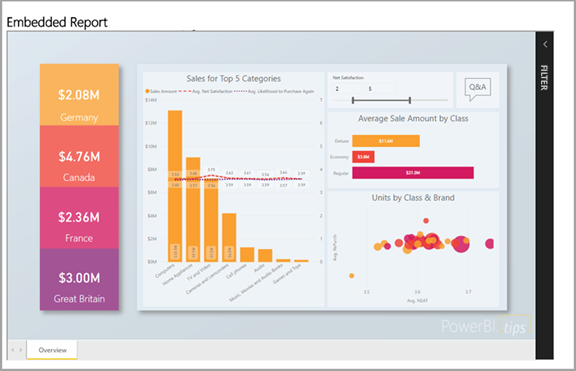
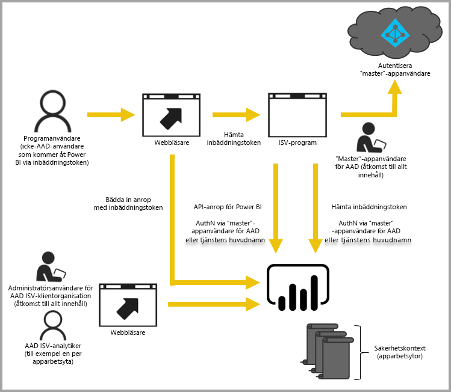

# Inbäddade analyser med Power BI

Power BI-tjänsten (SaaS) och Power BI Embedded-tjänsten i Azure (PaaS) har API:er för inbäddning av dina instrumentpaneler och rapporter. När du bäddar in innehåll får du tillgång till de senaste Power BI-funktionerna som instrumentpaneler, gatewayer och arbetsytor.

Med [konfigurationsverktyget för inbäddning](https://aka.ms/embedsetup) kommer du snabbt igång och kan ladda ned ett exempelprogram.

Välj den lösning som passar dig:

* [Inbäddning för din organisation](embedding.md#embedding-for-your-organization) låter dig utöka Power BI-tjänsten. Gör detta genom att implementera lösningen [Bädda in för din organisation](https://aka.ms/embedsetup/UserOwnsData).
* [Inbäddning för dina kunder](embedding.md#embedding-for-your-customers) gör att du kan bädda in instrumentpaneler och rapporter för användare som inte har något Power BI-konto. Gör detta genom att implementera lösningen [Bädda in för dina kunder](https://aka.ms/embedsetup/AppOwnsData).

## Använda API:er

Det finns två huvudscenarier för inbäddning av Power BI-innehåll:
- Inbäddning för din organisations användare (som har Power BI-licenser). 
 
- Inbäddning för dina användare och kunder utan krav på Power BI-licenser. 

[Power BI REST API](https://docs.microsoft.com/rest/api/power-bi/) tillåter båda scenarierna.

För kunder och användare utan Power BI-licenser, kan du kan bädda in instrumentpaneler och rapporter i ditt anpassade program, med samma API både till din organisation och dina kunder. Kunderna ser de data som hanteras av programmet. Och organisationens Power BI-användare har ytterligare alternativ för att visa *sina egna data* direkt i Power BI eller i kontexten för det inbäddade programmet. Du kan dra full nytta av JavaScript och REST API:er för dina inbäddningsbehov.

En genomgång av hur inbäddning fungerar finns i [JavaScript-inbäddningsexempel](https://microsoft.github.io/PowerBI-JavaScript/demo/).

## Inbäddning för din organisation

**Inbäddning för din organisation** låter dig utöka Power BI-tjänsten. Den här typen av inbäddning kräver att ditt programs användare loggar in Power BI-tjänsten för att visa innehållet. När någon i din organisation loggar in kommer de endast att ha åtkomst till instrumentpaneler och rapporter som de äger eller som någon har delat med dem i Power BI-tjänsten.

Exempel på organisationsinbäddning omfattar interna program, till exempel [SharePoint Online](https://powerbi.microsoft.com/blog/integrate-power-bi-reports-in-sharepoint-online/), [Microsoft Teams-integrering (du måste ha administratörsrättigheter)](https://powerbi.microsoft.com/blog/power-bi-teams-up-with-microsoft-teams/) och [Microsoft Dynamics](https://docs.microsoft.com/dynamics365/customer-engagement/basics/add-edit-power-bi-visualizations-dashboard).

En genomgång av inbäddning för din organisation finns i [Självstudie: Bädda in Power BI-innehåll i ett program för din organisation](embed-sample-for-your-organization.md).

Självbetjäningsfunktioner, som redigering, spara och mycket mer finns tillgängligt via [JavaScript API:t](https://github.com/Microsoft/PowerBI-JavaScript) vid inbäddning för Power BI-användare.

Du kan använda [konfigurationsverktyget för inbäddning](https://aka.ms/embedsetup/UserOwnsData) till att komma igång och ladda ned ett exempelprogram som vägleder dig genom integrering av en rapport för din organisation.

## Inbäddning för dina kunder

**Inbäddning för dina kunder** gör att du kan bädda in instrumentpaneler och rapporter för användare som inte har något Power BI-konto. Den här typen av inbäddning kallas även *Power BI Embedded*.

[Power BI Embedded](azure-pbie-what-is-power-bi-embedded.md) är en **Microsoft Azure**-tjänst som gör att oberoende programleverantörer (ISV) och utvecklare snabbt kan bädda in visuella objekt, rapporter och instrumentpaneler i ett program. Den här inbäddningen görs via en kapacitetsbaserad modell som mäts per timme.

Power BI Embedded har fördelar för oberoende programvaruleverantörer, utvecklare och kunder. En ISV kan till exempel börja skapa visuella objekt utan kostnad med Power BI Desktop. Genom att minimera arbetet med utveckling via visuell analys uppnår ISV:er kortare tid till marknad samt ökad konkurrenskraft gentemot konkurrenterna med särskilda dataupplevelser. ISV:er kan även välja att debitera en avgift för det ytterligare värde som de skapar med inbäddad analys.

Med Power BI Embedded behöver dina kunder inte känna till något om Power BI. Du kan använda två olika metoder för att skapa ett inbäddat program:
- Power BI Pro-konto 
- Tjänstens huvudnamn 

Power BI Pro-kontot fungerar som programmets huvudkonto (se det som ett proxykonto). Det här kontot gör att du kan generera inbäddningstoken som ger åtkomst till programmets Power BI-instrumentpaneler och -rapporter.

[Tjänstens huvudnamn](embed-service-principal.md) kan bädda in Power BI-innehåll i ett program med en **appspecifik** token. Det gör även att du kan generera inbäddningstoken som ger åtkomst till programmets Power BI-instrumentpaneler och -rapporter.

Utvecklare som använder Power BI Embedded kan ägna sig åt att bygga upp programmets huvudfunktioner i stället för att utveckla visuella objekt och analyser. De kan snabbt uppfylla kundkrav på rapportering och instrumentpaneler samt enkelt bädda in med fullständigt dokumenterade API:er och SDK:er. Med lättnavigerad datautforskning i apparna kan ISV:er göra det enklare för kunderna att fatta snabba, datadrivna och sammanhangsberoende beslut på valfri enhet.

> [!IMPORTANT]
> Inbäddning kräver Power BI-tjänsten, men dina kunder behöver inte ha ett Power BI-konto för att se programmets inbäddade innehåll. 

När du är redo att flytta till produktion måste arbetsytan tilldelas till en dedikerad kapacitet. Power BI Embedded i Microsoft Azure erbjuder [dedikerade kapaciteter](azure-pbie-create-capacity.md) att använda med dina program.

Information om inbäddning finns i [Så här bäddar du in Power BI-innehåll](embed-sample-for-customers.md).

## Nästa steg

Du kan nu försöka att bädda in Power BI-innehåll i ett program eller försöka bädda in Power BI-innehåll för dina kunder.

> [!div class="nextstepaction"]
> [Bädda in för din organisation](embed-sample-for-your-organization.md)

> [!div class="nextstepaction"]
> [Vad är Power BI Embedded?](azure-pbie-what-is-power-bi-embedded.md)

> [!div class="nextstepaction"]
>[Bädda in för dina kunder](embed-sample-for-customers.md)

Har du fler frågor? [Fråga Power BI Community](https://community.powerbi.com/)
