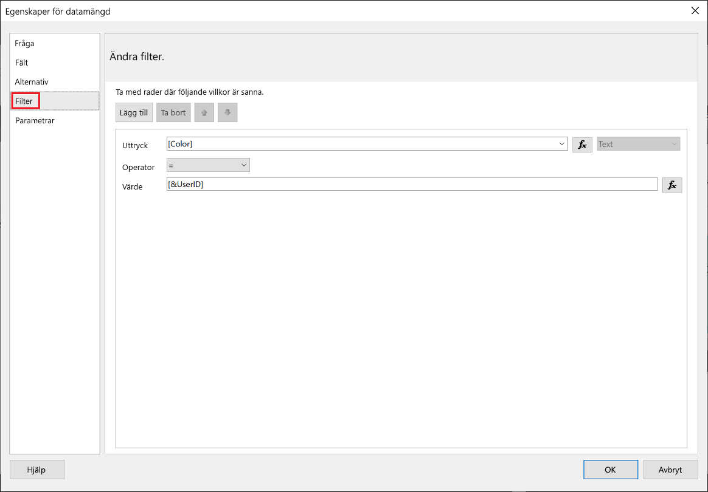
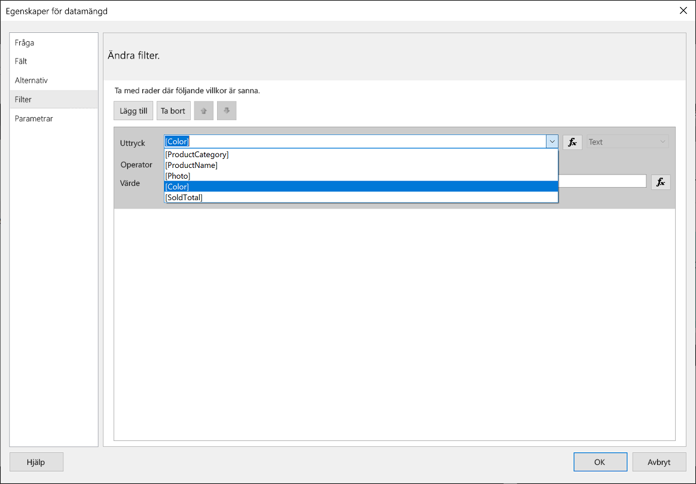
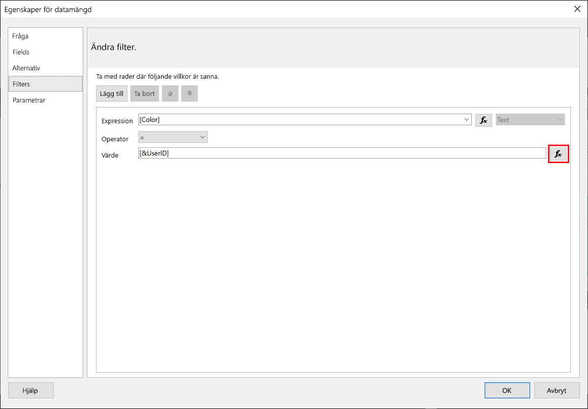
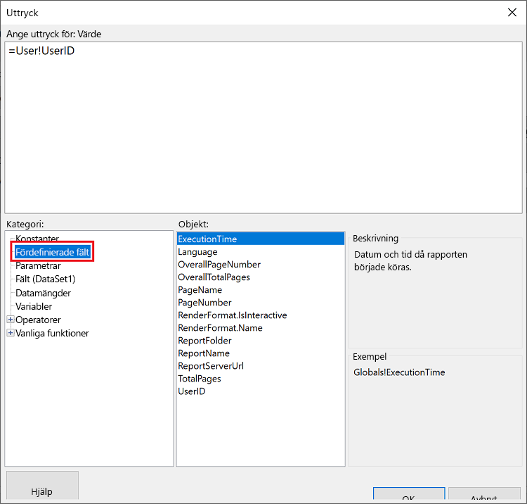
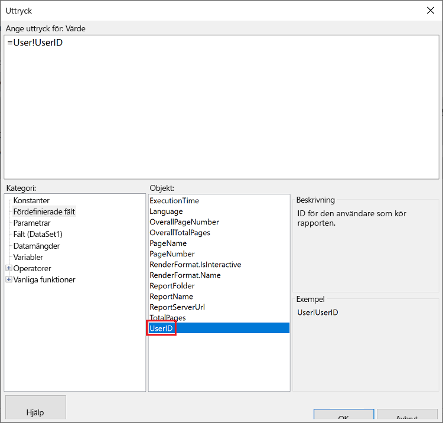
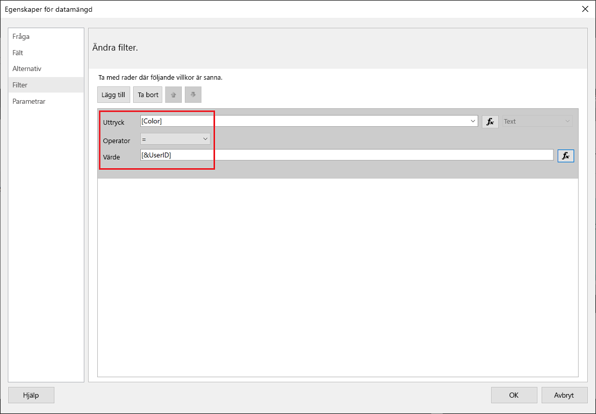
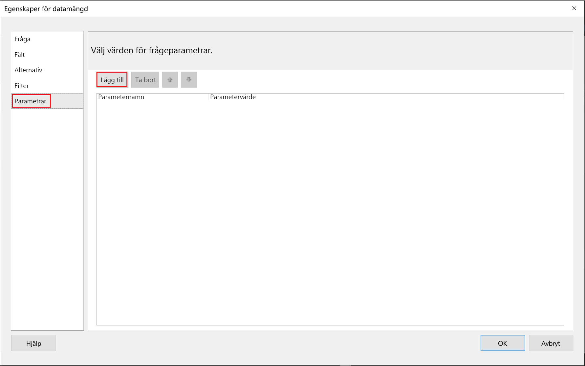
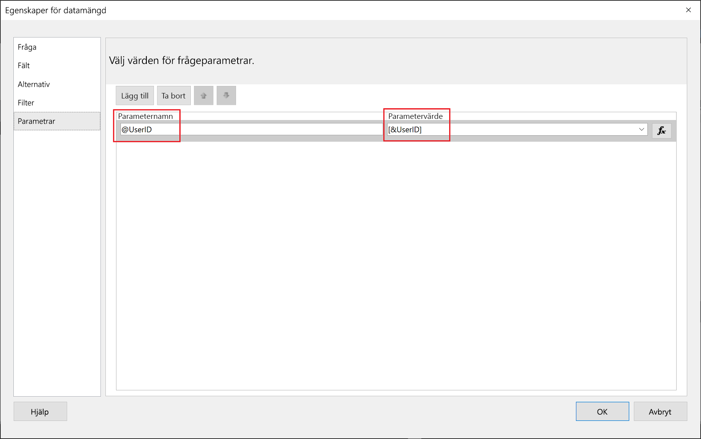
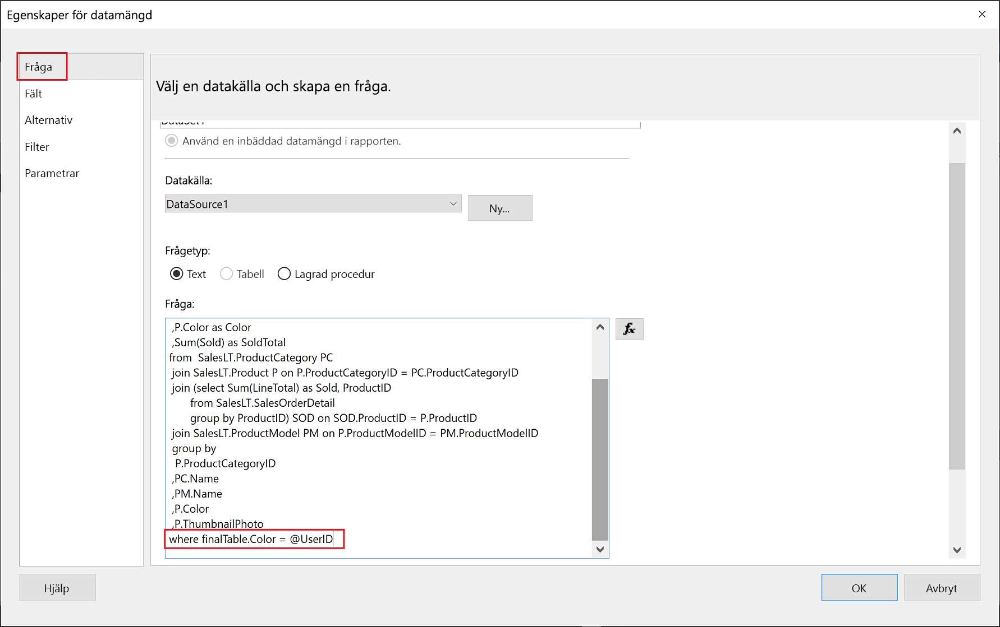

# <a name="implementing-row-level-security-in-embedded-paginated-reports"></a>Implementera säkerhet på radnivå i inbäddade sidnumrerade rapporter

När du bäddar in en sidnumrerad rapport kan du styra vilka data som ska visas. På så sätt kan du skräddarsy vilken information som ska visas per användare. Om du till exempel har en sidnumrerad Power BI-rapport som innehåller globala försäljningsresultat, kan du bädda in den så att endast försäljningsresultaten från en viss region är tillgängliga.

Den här funktionen ger ett säkert sätt att visa en delmängd av datan, utan att äventyra resten av informationen. Det liknar funktionen [Säkerhet på radnivå (RLS)](embedded-row-level-security.md), som är en säker metod att visa data på i Power BI-rapporter (som inte är sidnumrerade), instrumentpaneler, paneler och datamängder.  

> [!NOTE]
> Den här funktionen kan användas för inbäddade och sidnumrerade rapporter för kunder.

## <a name="configuring-a-parameter-to-filter-the-dataset"></a>Konfigurera en parameter som filtrerar datamängden

När du använder säkerhet på radnivå i en sidnumrerad Power BI-rapport, måste du tilldela en [-parameter](../../paginated-reports/report-builder-parameters.md) till **UserID**-attributet. Parametern begränsar vilka data som hämtas från datamängden innan rapporten bäddas in.

När du har tilldelat parametern till **UserID**, använder du API:et [Reports GenerateTokenInGroup](https://docs.microsoft.com/rest/api/power-bi/embedtoken/reports_generatetokeningroup) till att hämta din inbäddningstoken.

## <a name="use-userid-as-a-filter-at-report-or-query-level"></a>Använda UserID som filter på rapport- eller frågenivå

Du kan använda **UserId** som ett *filter* eller i en *fråga* till datakällan i [Power BI Report Builder](../../paginated-reports/report-builder-power-bi.md).

### <a name="using-the-filter"></a>Använda filtret

1. I fönstret **Egenskaper för datamängd** väljer du **Filter** i den vänstra rutan.

    

2. Välj den parameter som du vill använda när du filtrerar data i listmenyn **Uttryck**.

     

3. Klicka på funktionsknappen **Värde**. 

    

4. Välj **Inbyggda fält** i fönstret **Uttryck** i listan **Kategori**.

    

5. Välj **UserID** i listan **Objekt** och klicka på **OK**.

    

6. I fönstret **Egenskaper för datamängd** kontrollerar du att uttrycket är *den valda parametern = UserID*. Klicka sedan på **OK**.

    

### <a name="using-a-query"></a>Använda en fråga

1. I fönstret **Egenskaper för datamängd** väljer du **Parametrar** i det vänstra fönstret och klickar på **Lägg till**.

    

2. I **Parameternamn** anger du **\@UserID**, och i **Parametervärde** lägger du till **[&UserID]** .

     

3. I den vänstra rutan väljer du **Fråga** och i frågan lägger du till **UserID**-parametern som en del av din fråga. Klicka sedan på **OK**.
    > [!NOTE]
    > I skärmbilden nedan används färgparametern som exempel (whereFinalTable.Color = @UserID). Vid behov är det möjligt att skapa en mer komplex fråga.

    

## <a name="passing-the-configured-parameter-using-the-embed-token"></a>Skicka den konfigurerade parametern med hjälp av en inbäddningstoken

När du bäddar in en sidnumrerad rapport åt dina kunder, används API:et [Reports GenerateTokenInGroup](https://docs.microsoft.com/rest/api/power-bi/embedtoken/reports_generatetokeningroup) till att hämta en inbäddningstoken. Denna token kan också användas till att filtrera några av de data som hämtas från den sidnumrerade rapporten.

Om du bara vill exponera vissa data tilldelar du fältet `username` den information som du vill ska visas. Om du till exempel anger *grönt* i fältet `username` i en sidnumrerad rapport med en färgparameter, begränsar din inbäddningstoken inbäddade data så att de endast visar data med värdet *grönt* i färgkolumnen.

```JSON
{
    "accessLevel": "View",
    "reportId": "cfafbeb1-8037-4d0c-896e-a46fb27ff229",
    "identities": [
            {
                    // Replace the 'username' with a paginated report parameter
                    "username":     "...",
                    "reports: [
                        "cfafbeb1-8037-4d0c-896e-a46fb27ff229"
                    ]
            }
    ]
}
```
