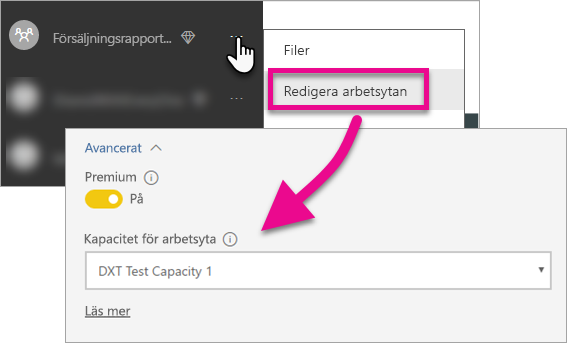

# Bädda in Power BI-innehåll i instrumentpaneler, rapporter och paneler

Läs mer om vad du behöver göra för att bädda in Power BI-innehåll i ditt program.

Microsoft [har lanserat Power BI Premium ](https://powerbi.microsoft.com/blog/microsoft-accelerates-modern-bi-adoption-with-power-bi-premium/), en ny kapacitetbaserad licensieringsmodell som ökar flexibiliteten för hur användare får åtkomst till, delar och distribuerar innehåll. Erbjudandet ger också ytterligare skalbarhet och prestanda till Power BI-tjänsten. Dessutom lanserades Power BI Embedded, som gör det möjligt att skapa kapacitet i Microsoft Azure. Power BI Embedded fokuserar på ditt program och dina kunder. 

Den här artikeln visar dig hur du bäddar in Power BI-innehåll för både din organisation och dina kunder. Stegen är liknande mellan båda scenarier. Du informeras när ett steg specifikt gäller inbäddning för din kund.

Det finns ett par steg du måste utföra för att aktivera detta för din app. Vi går igenom stegen för att skapa och använda inbäddat innehåll i din app.

> [!NOTE]
> Power BI-API:er refererar fortfarande till apparbetsytor som grupper. Alla referenser till grupper innebär att du arbetar med apparbetsytor.

## Steg 1: Konfigurera den inbäddade utvecklingsmiljön för analysverktyg

Innan du börjar bädda in instrumentpaneler och rapporter i din app måste du se till att din miljö har ställts in så att inbäddning tillåts. Som en del av installationen behöver du göra följande.

* [Se till att du har en Azure Active Directory-klient](embedding-content.md#azureadtenant)
* [Skapa ditt Power BI Pro-konto](embedding-content.md#proaccount)
* [Registrera din Azure Active Directory-app och behörigheter](embedding-content.md#appreg)

> [!NOTE]
> Power BI-kapacitet krävs inte för utveckling av din app. Apputvecklare behöver en Power BI Pro-licens.

### Azure Active Directory-klient

Du behöver en Azure Active Directory (Azure AD)-klient för att bädda in objekt från Power BI. Den här klienten måste ha minst en Power BI Pro-användare. Du måste också definiera en Azure AD-app i klienten. Du kan använda en befintlig Azure AD-klient eller skapa en ny specifikt för att bädda in.

Du måste ange vilken klientinställning du vill använda om du bäddar in för kunderna.

* Vill du använda din befintliga Power BI-företagsklient?
* Vill du använda en separat klient för ditt program?
* Vill du använda en separat klient för varje kund?

Om du inte vill använda en befintlig klient kan du skapa en ny klient för ditt program eller en för varje kund. Mer information finns i [Skapa en Azure Active Directory-klient](create-an-azure-active-directory-tenant.md) eller [Skaffa en Azure Active Directory-klient](https://docs.microsoft.com/azure/active-directory/develop/active-directory-howto-tenant).

### Skapa ett Power BI Pro användarkonto

Du behöver bara ett enda Power BI Pro konto för att bädda in innehåll. Du kanske vill att olika användare ska ha särskild åtkomst till objekt. Här ser du vilka användare som ska övervägas i din klient.

Följande konton måste finnas inom din klient och ha en tilldelad licens för Power BI Pro. Power BI Pro-licens krävs för att arbeta med apparbetsytor i Power BI.

#### En administratör för organisationen/klienten

Vi rekommenderar att den globala administratören för din organisation/klient inte används om din app använder inbäddning för kunder. Detta minskar åtkomsten som appkontot har i din klient. Den här administratören bör vara medlem i alla apparbetsytor som har skapats för inbäddning.

#### Konton för analytiker som skapar innehåll

Du kan ha flera användare som skapar innehåll för Power BI. Du behöver ett Power BI Pro-konto för varje analytiker som ska skapa och distribuera innehåll till Power BI.

#### Ett *huvud*konto för inbäddning för dina kunder

Huvudkontot är det konto som programmet ska använda för inbäddning av innehåll för kunderna. Det här scenariot gäller vanligtvis för ISV-appar. Huvudkontot är verkligen det enda obligatoriska kontot som du behöver i din organisation. Det kan också användas som administratör- och analytikerkonto, men det rekommenderas inte. Programmets serverdel sparar kontots autentiseringsuppgifter och använder dem för att skaffa en Azure AD-token som kan användas med Power BI-API:er. Det här kontot används för att generera programmets inbäddningstoken som används av kunderna.

Huvudkontot är en vanlig användare med en Power BI Pro-licens som du använder med ditt program. Kontot måste vara administratör för apparbetsytan som används för att bädda in.

###  Appregistrering och behörigheter

Du måste registrera ditt program med Azure AD för att kunna göra REST API-anrop. Mer information finns i [Registrera en Azure AD-app för att bädda in Power BI-innehåll](register-app.md).

### Skapa apparbetsytor

Om du bäddar in instrumentpaneler och rapporter för kunderna måste dessa instrumentpaneler och rapporter placeras i en apparbetsyta. *Huvud*kontot som har nämnts ovan måste vara administratör för apparbetsytan.

[!INCLUDE [powerbi-service-create-app-workspace](../includes/powerbi-service-create-app-workspace.md)]

### Skapa och ladda upp dina rapporter

Du kan skapa rapporter och datauppsättningar som använder Power BI Desktop och publicera dessa rapporter till en apparbetsyta. Användaren som publicerar rapporterna behöver en Power BI Pro-licens för att publicera till en apparbetsyta.

## Steg 2: Bädda in innehåll

Du måste autentisera med Power BI i din app. Om du bäddar in innehåll för kunderna, lagras autentiseringsuppgifterna för *huvud*kontot i din app. Mer information finns i [Autentisera användare och hämta en Azure AD-åtkomsttoken för din Power BI-app](get-azuread-access-token.md).

När autentiseringen i din app är klar använder du Power BI REST-API:er och JavaScript-API:er för att bädda in instrumentpaneler och rapporter i din app. 

Se följande för **inbäddning för din organisation**:

* [Integrera en instrumentpanel i en app](integrate-dashboard.md)
* [Integrera en panel i en app](integrate-tile.md)
* [Integrera en rapport i en app](integrate-report.md)

För **inbäddning med dina kunder**, vilket är typiskt för ISV:er, se följande:

* [Integrera en instrumentpanel, panel eller rapport i programmet](embed-sample-for-customers.md)

En inbäddningstoken krävs för att bädda in för dina kunder. Läs mer i [Skapa token](https://msdn.microsoft.com/library/mt784614.aspx).

## Steg 3: Flytta upp din lösning till produktion

Fler steg krävs för att flytta till produktion.

### Inbäddning för din organisation

Om du bäddar in för din organisation måste du informera användarna om hur de kommer åt din app. 

Gratisanvändare kan använda innehåll som har bäddats in från en apparbetsyta (grupp) om arbetsytan backas upp av kapacitet. Lägg till gratisanvändaren som medlem i apparbetsytan (gruppen), annars visas fel 401, obehörig användare. I följande tabell visas tillgängliga Power BI Premium SKU:er i Office 365.

| Kapacitetsnod | Totalt antal kärnor *(Serverdel + klientdel)* | Serverdelskärnor | Klientdelskärnor | DirectQuery/begränsningar vid liveanslutning | Max sidåtergivningar vid högbelastning |
| --- | --- | --- | --- | --- | --- |
| EM3 |4 v-kärnor |2 kärnor, 10 GB RAM-minne |2 kärnor | |601–1200 |
| P1 |8 v-kärnor |4 kärnor, 25 GB RAM-minne |4 kärnor |30 per sekund |1201–2400 |
| P2 |16 v-kärnor |8 kärnor, 50 GB RAM-minne |8 kärnor |60 per sekund |2401–4800 |
| P3 |32 v-kärnor |16 kärnor, 100 GB RAM-minne |16 kärnor |120 per sekund |4801–9600 |

> [!NOTE]
> Om du vill köpa Power BI Premium måste du vara global administratör eller faktureringsadministratör för din klient. Information om hur du köper Power BI Premium finns i [Så här köper du Power BI Premium](../service-admin-premium-purchase.md).

### Inbäddning för dina kunder

Om du bäddar in för kunderna behöver du vill göra följande.

* Om du använder en separat klient för utveckling, så måste du kontrollera att dina apparbetsytor, tillsammans med instrumentpaneler och rapporter, är tillgängliga i din produktionsmiljö. Kontrollera att du har skapat programmet i Azure AD för din produktionsklient och tilldelat rätt appbehörigheter, så som beskrivs i steg 1.
* Köp en kapacitet som passar dina behov. Du kan använda tabellen nedan för att förstå vilken SKU för Power BI Embedded-kapaciteten som du behöver. För mer information, se [White paper om kapacitetsplanering för inbäddad analys](https://aka.ms/pbiewhitepaper). När du är redo att köpa kan du göra detta i [Microsoft Azure-portalen](https://portal.azure.com). Mer information om hur du skapar Power BI Embedded-kapacitet finns i [Skapa Power BI Embedded-kapacitet i Azure-portalen](https://docs.microsoft.com/azure/power-bi-embedded/create-capacity).

| Kapacitetsnod | Totalt antal kärnor *(Serverdel + klientdel)* | Serverdelskärnor | Klientdelskärnor | DirectQuery/begränsningar vid liveanslutning | Max sidåtergivningar vid högbelastning |
| --- | --- | --- | --- | --- | --- |
| A1 |1 v-kärnor |0,5 kärnor, 3GB RAM-minne |0,5 kärnor | |1-300 |
| A2 |2 v-kärnor |1 kärna, 5GB RAM-minne |1 kärna | |301-600 |
| A3 |4 v-kärnor |2 kärnor, 10 GB RAM-minne |2 kärnor | |601–1200 |
| A4 |8 v-kärnor |4 kärnor, 25 GB RAM-minne |4 kärnor |30 per sekund |1201–2400 |
| A5 |16 v-kärnor |8 kärnor, 50 GB RAM-minne |8 kärnor |60 per sekund |2401–4800 |
| A6 |32 v-kärnor |16 kärnor, 100 GB RAM-minne |16 kärnor |120 per sekund |4801–9600 |

* Redigera apparbetsytan och tilldela den till en kapacitet under Avancerat.

    

* Distribuera ditt uppdaterade program till produktion och börja bädda in rapporter och instrumentpaneler från Power BI-tjänsten.

## Administratörsinställningar

Globala eller Power BI-tjänstadministratörer kan aktivera eller inaktivera REST API:er för en klient. Power BI-administratörer kan ange den här inställningen för hela organisationen eller för enskilda säkerhetsgrupper. Det har aktiverats för hela organisationen som standard. Detta görs via [Power BI-administratörsportalen](../service-admin-portal.md).

## Nästa steg

[Bädda in med Power BI](embedding.md)  
[Så här migrerar du innehåll från Power BI Embedded-arbetsytesamlingar till Power BI](migrate-from-powerbi-embedded.md)  
[Power BI Premium – vad är det?](../service-premium.md)  
[Så här köper du Power BI Premium](../service-admin-premium-purchase.md)  
[JavaScript API Git Repo](https://github.com/Microsoft/PowerBI-JavaScript)  
[Power BI C# Git Repo](https://github.com/Microsoft/PowerBI-CSharp)  
[JavaScript-inbäddningsexempel](https://microsoft.github.io/PowerBI-JavaScript/demo/)  
[White paper om kapacitetsplanering för inbäddad analys](https://aka.ms/pbiewhitepaper)  
[Power BI Premium – white paper](https://aka.ms/pbipremiumwhitepaper)  

Har du fler frågor? [Fråga Power BI Community](http://community.powerbi.com/)

