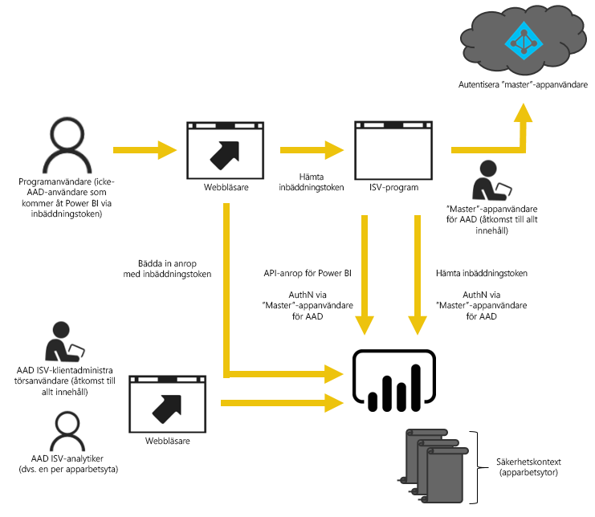

# Inbäddade analyser med Power BI

Power BI-tjänsten (SaaS) och Power BI Embedded-tjänsten i Azure (PaaS) har API:er för inbäddning av dina instrumentpaneler och rapporter. Det innebär att du har en uppsättning funktioner och tillgång till de senaste funktionerna i Power BI när du bäddar in innehåll, till exempel instrumentpaneler, gatewayer och apparbetsytor.

Med [konfigurationsverktyget för inbäddning](https://aka.ms/embedsetup) kommer du snabbt igång och kan ladda ned ett exempelprogram.

Välj den lösning som passar dig:

* [Inbäddning för din organisation](embedding.md#embedding-for-your-organization) låter dig utöka Power BI-tjänsten. Kör lösningen [Embed for your organization](https://aka.ms/embedsetup/UserOwnsData) (Bädda in för din organisation).
* [Inbäddning för dina kunder](embedding.md#embedding-for-your-customers) ger dig möjlighet att bädda in instrumentpaneler och rapporter för användare som inte har något Power BI-konto. Kör lösningen [Embed for your customers](https://aka.ms/embedsetup/AppOwnsData) (Bädda in för dina kunder).

## Använda API:er

Det finns två huvudscenarier när du bäddar in Power BI-innehåll. Inbäddning för användare i din organisation (som har licenser för Power BI) och inbäddning för dina användare och kunder utan att de behöver ha licenser för Power BI. Power BI REST API tillåter båda scenarierna.

För kunder och användare utan Power BI-licenser, kan du kan bädda in instrumentpaneler och rapporter i ditt anpassade program, med samma API både till din organisation och dina kunder. Kunderna ser de data som hanteras av programmet. Och för Power BI-användare i din organisation, har de även fler alternativ för att visa *sina egna data* direkt i Power BI eller i kontext med det inbäddade programmet. Du kan dra full nytta av JavaScript och REST API:er för dina inbäddningsbehov.

Ett exempel på hur inbäddning fungerar finns i [JavaScript-inbäddningsexempel](https://microsoft.github.io/PowerBI-JavaScript/demo/).

## Inbäddning för din organisation

**Inbäddning för din organisation** låter dig utöka Power BI-tjänsten. Inbäddning för din organisation kräver att slutanvändaren av ditt program loggar in på Power BI-tjänsten när de vill visa sitt innehåll. När någon i din organisation loggar in kommer de endast att ha åtkomst till instrumentpaneler och rapporter som de äger eller som någon har delat med dem i Power BI-tjänsten.

*Exempel på inbäddning för din organisation inkluderar interna program, till exempel [SharePoint Online](https://powerbi.microsoft.com/blog/integrate-power-bi-reports-in-sharepoint-online/), [Microsoft Teams-integrering (du måste ha administratörsrättigheter)](https://powerbi.microsoft.com/blog/power-bi-teams-up-with-microsoft-teams/) och [Microsoft Dynamics](https://docs.microsoft.com/dynamics365/customer-engagement/basics/add-edit-power-bi-visualizations-dashboard).*

Se nedan för inbäddning för din organisation:

* [Integrera en rapport i en app](embed-sample-for-your-organization.md)

Självbetjäningsfunktioner, som redigering, spara och mycket mer finns tillgängligt via [JavaScript API:t](https://github.com/Microsoft/PowerBI-JavaScript) vid inbäddning för Power BI-användare.

Med [konfigurationsverktyget för inbäddning](https://aka.ms/embedsetup/UserOwnsData) kommer du igång och kan ladda ned ett exempelprogram som steg för steg beskriver hur du integrerar en rapport för din organisation.

## Inbäddning för dina kunder

**Inbäddning för dina kunder** gör att du kan bädda in instrumentpaneler och rapporter för användare som inte har något Power BI-konto. Inbäddning för dina kunder kallas även **Power BI Embedded**.

[Power BI Embedded](azure-pbie-what-is-power-bi-embedded.md) är en **Microsoft Azure**-tjänst som gör att oberoende programleverantörer (ISV) och utvecklare snabbt kan bädda in visuella objekt, rapporter och instrumentpaneler i program med en kapacitetsbaserad modell som mäts per timme.

Power BI Embedded har fördelar för oberoende programvaruleverantörer, utvecklare och kunder. En ISV kan till exempel börja skapa visuella objekt utan kostnad med Power BI Desktop. ISV:er kan korta sin tid till marknad genom att minimera tiden för visuella analyser och differentiera sig från konkurrenterna med annorlunda dataupplevelser. ISV:er kan också välja att debitera en avgift för det ytterligare värde som skapas med inbäddad analys.

Med Power BI Embedded behöver dina kunder inte känna till något om Power BI. Du kan använda två olika metoder för att skapa ett inbäddat program. Ett alternativ är att använda ett Power BI Pro-konto. Ett annat alternativ är att använda tjänstens huvudnamn. 

Power BI Pro-kontot fungerar som ett huvudkonto för ditt program (se huvudkontot som ett proxykonto). Med Power BI Pro-kontot kan du generera inbäddningstokens som ger åtkomst till instrumentpaneler och rapporter i Power BI-tjänsten som ägs och hanteras av ditt program.

[Tjänstens huvudnamn](embed-service-principal.md) kan bädda in Power BI-innehåll i ett program med en **appspecifik** token. Med tjänstens huvudnamn kan du generera inbäddningstokens som ger åtkomst till instrumentpaneler och rapporter i Power BI-tjänsten som ägs och hanteras av ditt program.

Utvecklare som använder Power BI Embedded kan ägna sig åt att bygga upp kärnkompetensen för sina program i stället för att utveckla visuella objekt och analyser. Utvecklare kan snabbt uppfylla kundkrav på rapportering och instrumentpaneler och kan enkelt bädda in med fullständigt dokumenterade API:er och SDK:er. Med lättnavigerad datautforskning i apparna kan ISV:er göra det enklare för kunderna att fatta snabba, datadrivna och sammanhangsberoende beslut på valfri enhet.

> [!IMPORTANT]
> Även om inbäddning är beroende av Power BI-tjänsten så finns det inget beroende av Power BI för dina kunder. De behöver inte registrera sig för Power BI om du vill visa ditt programs inbäddade innehåll.

När du är redo att flytta till produktion, måste din apparbetsyta tilldelas till en dedikerad kapacitet. Power BI Embedded i Microsoft Azure erbjuder [dedikerade kapaciteter](azure-pbie-create-capacity.md) att använda med dina program.

Information om inbäddning finns i [Så här bäddar du in Power BI-innehåll](embed-sample-for-customers.md).

## Nästa steg

Du kan nu försöka att bädda in Power BI-innehåll i ett program eller försöka bädda in Power BI-innehåll för dina kunder.

> [!div class="nextstepaction"]
> [Bädda in för din organisation](embed-sample-for-your-organization.md)

> [!div class="nextstepaction"]
> [Vad är Power BI Embedded?](azure-pbie-what-is-power-bi-embedded.md)

> [!div class="nextstepaction"]
>[Bädda in för dina kunder](embed-sample-for-customers.md)

Har du fler frågor? [Fråga Power BI Community](http://community.powerbi.com/)