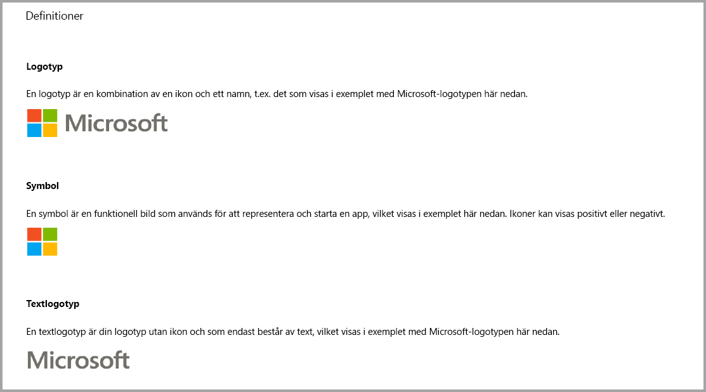
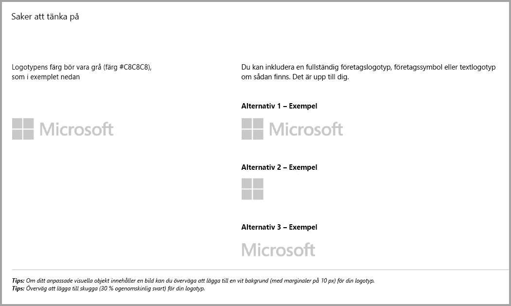
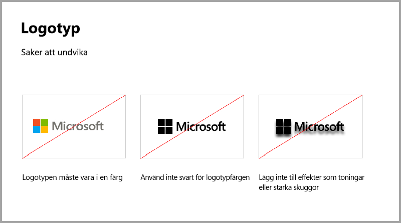
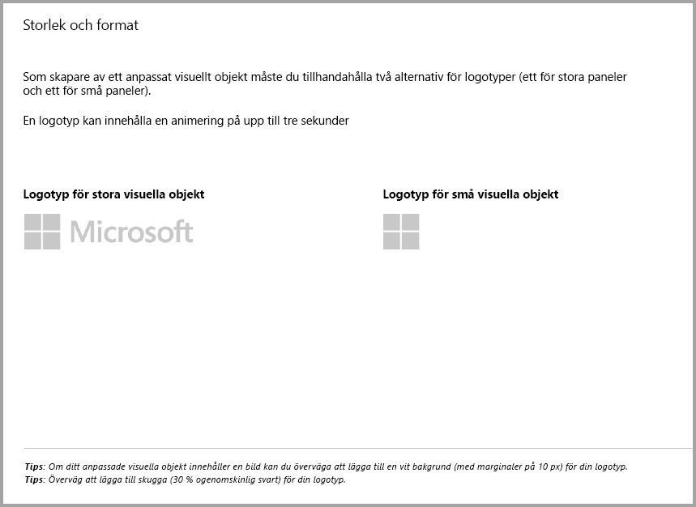
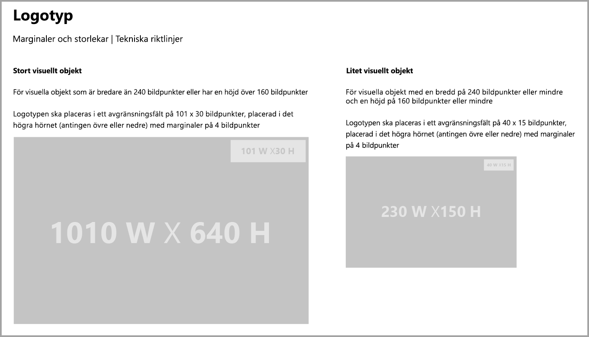
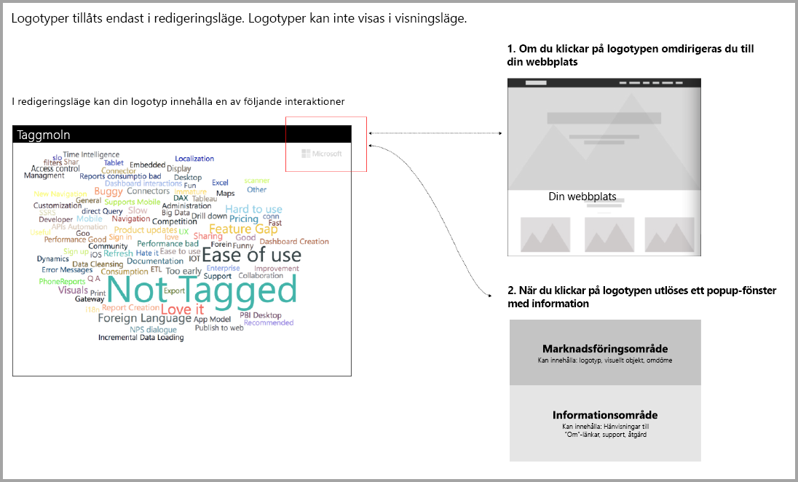

# Riktlinjer för visuella objekt för Power BI
Innan du [publicerar](https://docs.microsoft.com/power-bi/developer/office-store) ditt visuella objekt till AppSource så att andra kan upptäcka och använda det ska du se till att följa riktlinjerna för att skapa en bra upplevelse för användarna. 

## Snabbmeny
Snabbmenyn är den högerklicksmeny som visas när användaren hovrar över ett visuellt objekt.
Alla visuella Power BI-objekt bör aktivera snabbmenyn för att ge en enhetlig upplevelse. Information om hur du lägger till en snabbmeny finns i [den här artikeln](https://github.com/Microsoft/PowerBI-visuals/blob/gh-pages/tutorials/building-bar-chart/adding-context-menu-to-the-bar.md).

## Riktlinjer för logotyp

I det här avsnittet beskrivs specifikationerna för att lägga till logotyper och logotyper i visuella objekt.

> [!IMPORTANT]
> Logotyper tillåts *endast i redigeringsläge*. Logotyper *kan inte* visas i visningsläge.

## Riktlinjer för visuella objekt i Power BI med ytterligare inköp

Tills nyligen godkände endast Marketplace (AppSource) kostnadsfria visuella objekt i Power BI. Den här principen har ändrats (december 2018) så att du nu även kan skicka in visuella objekt till AppSource som har pristaggen ytterligare köp kan krävas. 

Visuella objekt där ytterligare köp kan krävas liknar tillägg med in-app köp (IAP) i Office Store. Utvecklare kan också skicka in dessa visuella objekt för certifiering efter att AppSource-teamet godkänt dem och efter att de sett till att de uppfyller certifieringskraven. Mer information om kraven finns i [Certifierade anpassade visuella objekt](../power-bi-custom-visuals-certified.md).

> [!NOTE]
> Det visuella objektet måste inte ha åtkomst till externa tjänster eller resurser för att godkännas.

>[!IMPORTANT]  
> Om du uppdaterar ditt visuella objekt från kostnadsfritt till ”Ytterligare köp kan krävas” måste användarna får samma nivå av kostnadsfria funktioner som före uppdateringen. Du kan lägga till valfria avancerade betalfunktioner utöver de tidigare kostnadsfria funktionerna. Vi rekommenderar att du skickar in visuella IAP-objekt med de avancerade funktionerna som nya visuella objekt och inte uppdaterar de tidigare kostnadsfria versionerna.

## Vad ändras i inlämningsprocessen?

Utvecklare laddar upp sina visuella IAP-objekt till AppSource via instrumentpanelen för försäljning, precis som med kostnadsfria visuella objekt. För att visa att det inlämnade visuella objektet har IAP-funktioner så ska utvecklare skriva följande i anteckningarna i säljarens instrumentpanel: ”Visual with in-app purchase” (Visuellt objekt med köp i appen). Utvecklare måste också ange en licensnyckel eller token så att verifieringsteamet kan validera IAP-funktioner. När det visuella objektet har verifierats och godkänts anger AppSource-listningen det visuella IAP-objektet ”Ytterligare köp kan krävas” under prissättningsalternativen.

## Vad är ett visuellt Power BI-objekt med IAP-funktioner?

Ett visuellt IAP-objekt är ett *kostnadsfritt* visuellt objekt som erbjuder *kostnadsfria funktioner*. Det har även vissa avancerade funktioner kan kräva extra avgifter för att använda. I beskrivningen för det visuella objektet så måste utvecklare meddela användare om vilka funktioner som kräver ytterligare köp för att fungera. Microsoft tillhandahåller för närvarande inte inbyggda API:er för att stödja köp av appar och tilläggsprogram.

Utvecklare kan använda valfritt betalningssystem från tredje part för dessa köp. Se vår [policy för marknadsplatsen](https://docs.microsoft.com/office/dev/store/validation-policies#2-apps-or-add-ins-can-display-certain-ads) för mer information.

> [!NOTE]
> Vattenstämplar tillåts inte på de kostnadsfria funktionerna eller kostnadsfria visuella objekt. Vattenstämplar kan bara användas på betalda funktioner som används utan giltig licens. Vi rekommenderar att du visar ett popup-fönster all licensrelaterad information om de avancerade betalfunktionerna används utan giltig licens.  

## Metodtips

### Landningssida för visuellt objekt

Använd landningssidan för att klargöra för användarna hur de kan använda ditt visuella objekt och var de kan köpa licensen. Omfattar inte videor som utlöses automatiskt. Lägg bara till material som hjälper till att förbättra användarupplevelsen som information eller länkar till hur man köper en licens och hur man använder IAP-funktioner.

### Licensnyckel och token

För att underlätta för användaren så kan du lägga till licensnyckeln eller tokenrelaterade fält överst i formatfönstret.

## Vanliga frågor och svar

Mer information om visuella objekt finns i [Vanliga frågor och svar om visuella objekt med ytterligare köp](https://docs.microsoft.com/power-bi/power-bi-custom-visuals-faq#visuals-with-additional-purchases).

## Nästa steg

Läs hur du kan publicera dina anpassade visuella objekt till [AppSource](office-store.md) där andra kan upptäcka och använda dem.
