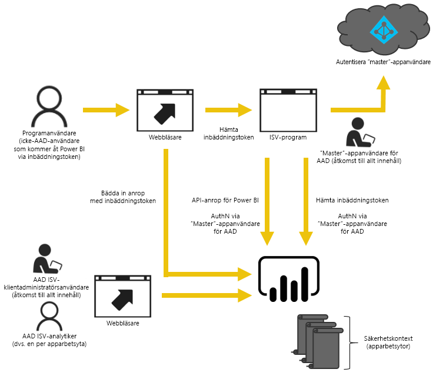

# Så här migrerar du innehållspaket från Power BI Embedded till Power BI
Lär dig hur du migrerar från Power BI Embedded till Power BI-tjänsten och utnyttjar nyheterna för inbäddning i appar.

Microsoft presenterade nyligen [Power BI Premium](https://powerbi.microsoft.com/blog/microsoft-accelerates-modern-bi-adoption-with-power-bi-premium/), en ny kapacitetsbaserad licensieringsmodell som ökar flexibiliteten för hur användare får åtkomst till innehåll, och hur de kan dela och distribuera det. Erbjudandet ger också ytterligare skalbarhet och prestanda till Power BI-tjänsten.

Med introduktionen av Power BI Premium konvergerar Power BI Embedded och Power BI-tjänsten för att förbättra hur Power BI-innehåll kan bäddas in i appar. Det innebär att du kommer att ha en API-yta, en konsekvent uppsättning funktioner och tillgång till de senaste funktionerna i Power BI när du bäddar in innehåll, till exempel instrumentpaneler, gatewayer och apparbetsytor. Fortsättningsvis kommer du att kunna börja med Power BI Desktop och flytta till distribution med Power BI Premium, som kommer att vara allmänt tillgängligt mot slutet av andra kvartalet 2017.

Den aktuella Power BI Embedded-tjänsten fortsätter att vara tillgänglig under en begränsad tid efter det att det konvergerade erbjudandet blivit allmänt tillgängligt: kunder med Enterprise-avtal har åtkomst fram till att deras nuvarande avtal upphör, och kunder som har förvärvat Power BI Embedded via direktkanaler eller CSP-kanaler har åtkomst under ett år från det att Power BI Premium blivit allmänt tillgängligt.  Den här artikeln ger dig anvisningar om hur du migrerar från Azure-tjänsten till Power BI-tjänsten, och information om vilka förändringar du kan förvänta dig i ditt program.

> [!IMPORTANT]
> Medan migreringen har ett beroende i förhållande till Power BI-tjänsten, så finns det inget beroende gentemot Power BI ditt programs användare när de använder en **inbäddningstoken**. De behöver inte registrera sig för Power BI om du vill visa ditt programs inbäddade innehåll. Du kan använda den här inbäddningsmetoden för att betjäna användare som inte använder Power BI.
> 
> 

## Förbereda för migrering
Det finns några saker du behöver göra för att förbereda migreringen från Power BI Embedded Azure-tjänsten till Power BI-tjänsten. Du behöver en tillgänglig klient och en användare med en Power BI Pro-licens.

1. Kontrollera att du har åtkomst till en Azure Active Directory (Azure AD)-klient.
   
    Du måste fastställa vilken klientkonfiguration som ska användas.
   
   * Vill du använda din befintliga Power BI-företagsklient?
   * Vill du använda en separat klient för ditt program?
   * Vill du använda en separat klient för varje kund?
     
     Mer information om hur du skapar en ny klient för ditt program eller för varje kund finns i [Skapa en Azure Active Directory-klient](create-an-azure-active-directory-tenant.md) eller [Skaffa en Azure Active Directory-klient](https://docs.microsoft.com/azure/active-directory/develop/active-directory-howto-tenant).
2. Skapa en användare i den nya klienten som ska fungera som ditt programs ”huvudkonto”. Detta konto måste registreras för Power BI och måste ha tilldelats en Power BI Pro-licens.

## Konton i Azure AD
Följande konton måste finnas i din klient.

> [!NOTE]
> Dessa konton måste ha Power BI Pro-licenser för att kunna använda appens arbetsytor.
> 
> 

1. En klientadministratörsanvändare.
   
    Den här användaren bör vara medlem i alla apparbetsytor som har skapats för inbäddning.
2. Konton för analytiker som skapar innehåll.
   
    Dessa användare ska tilldelas apparbetsytor vid behov.
3. Ett programs *huvudanvändarkonto* eller tjänstkonto.
   
    Programmets serverdel sparar kontots autentiseringsuppgifter och använder dem för att skaffa en Azure AD-token som kan användas med Power BI REST-API:er. Det här kontot används för att generera programmets inbäddningstoken. Kontot måste också vara administratör för de apparbetsytor som skapats för inbäddning.
   
   > [!NOTE]
   > Detta är helt enkelt ett vanligt användarkonto i din organisation som används i inbäddningssyfte.
   > 
   > 

## Appregistrering och behörigheter
Du måste registrera ett program i Azure AD och bevilja det vissa behörigheter.

### Registrera ett program
Du måste registrera ditt program med Azure AD för att kunna göra REST API-anrop. Detta inkluderar att gå till Azure Portal så att du kan göra ytterligare konfiguration utöver Power BI-appens registreringssida. Mer information finns i [Registrera en Azure AD-app för att bädda in Power BI-innehåll](register-app.md).

Du bör registrera programmet med programmets **huvudkonto**.

## Skapa apparbetsytor (obligatoriskt)
Du kan utnyttja apparbetsytor för att ge bättre isolering om programmet betjänar flera kunder. Instrumentpaneler och rapporter skulle isoleras mellan kunderna. Du kan sedan använda ett Power BI-konto per apparbetsyta och därmed isolera programanvändandet ytterligare mellan dina kunder.

> [!IMPORTANT]
> Du kan inte använda en personlig arbetsyta för att utnyttja inbäddningsmöjligheten för användare som inte är Power BI-användare.
> 
> 

Du behöver en användare som har en Pro-licens för att kunna skapa en apparbetsyta i Power BI. Den Power BI-användare som skapar apparbetsytan blir som standard arbetsytans administratör.

> [!NOTE]
> Programmets *huvudkonto* måste vara arbetsytans administratör.
> 
> 

## Innehållsmigrering
Migrering av innehållet från dina samlingar med arbetsytor till Power BI-tjänsten kan ske parallellt med din aktuella lösning och kräver inget driftstopp.

Det finns ett tillgängligt **migreringsverktyg** som du kan använda för att kopiera innehåll från Power BI Embedded till Power BI-tjänsten. Särskilt om du har mycket innehåll. Mer information finns i [Migreringsverktyget för Power BI Embedded](migrate-tool.md).

Innehållsmigreringen förlitar sig i huvudsak på två API:er.

1. Hämta PBIX – detta API kan hämta PBIX-filer som har överförts till Power BI efter oktober 2016.
2. Importera PBIX – detta API överför valfri PBIX till Power BI.

Relaterade kodfragment beskrivs i [Kodfragment för migrering av innehåll från Power BI Embedded](migrate-code-snippets.md).

### Rapporttyper
Det finns flera typer av rapporter, som var och en kräver ett något annorlunda migreringsflöde.

#### Cachelagrad datauppsättning och rapport
Med cachelagrade datauppsättningar avses PBIX-filer som har importerade data istället för en live-anslutning eller DirectQuery-anslutning.

**Flow**

1. Anropshämta PBIX API från PaaS-arbetsytan.
2. Spara PBIX.
3. Anropsimportera PBIX till SaaS-arbetsytan.

#### DirectQuery-datauppsättning och -rapport
**Flow**

1. Anropa GET https://api.powerbi.com/v1.0/collections/{collection_id}/workspaces/{wid}/datasets/{dataset_id}/Default.GetBoundGatewayDataSources och spara den mottagna anslutningssträngen.
2. Anropshämta PBIX API från PaaS-arbetsytan.
3. Spara PBIX.
4. Anropsimportera PBIX till SaaS-arbetsytan.
5. Uppdatera anslutningssträngen genom att anropa - POST  https://api.powerbi.com/v1.0/myorg/datasets/{dataset_id}/Default.SetAllConnections
6. Hämta GW-ID och datakälls-ID genom att anropa - GET https://api.powerbi.com/v1.0/myorg/datasets/{dataset_id}/Default.GetBoundGatewayDataSources
7. Uppdatera användarens autentiseringsuppgifter genom att anropa - PATCH https://api.powerbi.com/v1.0/myorg/gateways/{gateway_id}/datasources/{datasource_id}

#### Gammal datauppsättning och rapporter
Dessa är datauppsättningar/rapporter som skapats före oktober 2016. PBIX-hämtningen stöder inte PBIX:er som hämtades före oktober 2016

**Flow**

1. Hämta PBIX från din utvecklingsmiljö (din interna källkontroll).
2. Anropsimportera PBIX till SaaS-arbetsytan.

#### Push-överför datauppsättning och rapport
PBIX-hämtning stöder inte *Push API*-datauppsättningar. API-datauppsättningsdata för push-överföring API kan inte porteras från PaaS till SaaS.

**Flow**

1. Anropa API:et för att skapa datauppsättning med datauppsättnings-JSON för att skapa datauppsättningar på SaaS-arbetsytan.
2. Återskapa rapporten för den skapade datauppsättningen *.

Du kan använda vissa lösningar för att migrera push-API-rapporten från PaaS till SaaS genom att göra på följande sätt.

1. Ladda upp några dummy-PBIX:er till PaaS-arbetsytan.
2. Klona push-API-rapporten och bind den till dummy-PBIX:en från steg 1.
3. Hämta push-API-rapporten med dummy-PBIX:en.
4. Överför dummy-PBIX:en till SaaS-arbetsytan.
5. Skapa push-datauppsättning på din SaaS-arbetsyta.
6. Bind om rapporten till push-API-datauppsättningen.

## Skapa och ladda upp nya rapporter
Utöver det innehåll som du har migrerat från Power BI Embedded Azure-tjänsten, så kan du skapa rapporter och datauppsättningar som använder Power BI Desktop och publicera dessa rapporter på en apparbetsyta. Användaren som publicerar rapporterna behöver en Power BI Pro-licens för att publicera till en apparbetsyta.

## Återskapa ditt program
1. Du måste ändra ditt program om du vill kunna använda Power BI REST-API:erna och rapportplatsen på powerbi.com.
2. Återskapa din AuthN/AuthZ-autentisering med hjälp av ditt programs *huvudkonto*. Du kan utnyttja möjligheten att använda en [inbäddningstoken](https://msdn.microsoft.com/library/mt784614.aspx) så att användaren kan agera som ombud för andra användare.
3. Bädda in dina rapporter från powerbi.com i ditt program.

## Mappa dina användare till en Power BI-användare
I ditt program mappar du användare som du hanterar i programmet till ett Power BI- *huvudkontos* autentiseringsuppgifter. Autentiseringsuppgifterna för det här Power BI-*huvudkontot* lagras i ditt program och används för att skapa inbäddningstoken.

## Vad du ska göra när det är dags för produktion
När du är redo att gå vidare till produktion måste du göra följande.

* Om du använder en separat klient för utveckling, så måste du kontrollera att dina apparbetsytor, tillsammans med instrumentpaneler och rapporter, är tillgängliga i din produktionsmiljö. Du måste också kontrollera att du har skapat programmet i Azure AD för din produktionsklient och tilldelat rätt appbehörigheter, så som beskrivs i steg 1.
* Köp en kapacitet som passar dina behov. För att bättre förstå den mängd och typ av kapacitet du behöver, se [Vitbok om kapacitetsplanering för inbäddad analys](https://aka.ms/pbiewhitepaper). Du kan [köpa kapacitet](https://portal.azure.com/#create/Microsoft.PowerBIDedicated) i Azure.
* Redigera apparbetsytan och tilldela den till en Premium.kapacitet under Avancerat.
 
    
    
* Distribuera ditt uppdaterade program till produktion och börja bädda in rapporter från Power BI-tjänsten.

## Efter migreringen
Rensa i Azure.

* Ta bort alla arbetsytor från den distribuerade lösningen i Azure-tjänsten för Power BI Embedded.
* Ta bort eventuella arbetsytesamlingar från Azure.

## Nästa steg
[Bädda in med Power BI](embedding.md)  
[Migreringsverktyg för Power BI Embedded](migrate-tool.md)  
[Kodavsnitt för migrering av innehåll från Power BI Embedded](migrate-code-snippets.md)  
[Hur du bäddar in dina Power BI-instrumentpaneler, -rapporter och -paneler](embedding-content.md)  
[Power BI Premium – vad är det?](../service-premium.md)  
[JavaScript API Git Repo](https://github.com/Microsoft/PowerBI-JavaScript)  
[Power BI C# Git Repo](https://github.com/Microsoft/PowerBI-CSharp)  
[JavaScript-inbäddningsexempel](https://microsoft.github.io/PowerBI-JavaScript/demo/)  
[White paper om kapacitetsplanering för inbäddad analys](https://aka.ms/pbiewhitepaper)  
[Power BI Premium – white paper](https://aka.ms/pbipremiumwhitepaper)  

Har du fler frågor? [Fråga Power BI Community](http://community.powerbi.com/)

