# <a name="power-bi-embedded-migration-tool"></a>Migreringsverktyg för Power BI Embedded

Det här migreringsverktyget kan användas för att kopiera dina rapporter från Power BI Embedded Azure-tjänsten (PaaS) till Power BI-tjänsten (SaaS).

Migrering av innehållet från dina samlingar med arbetsytor till Power BI-tjänsten kan ske parallellt med din aktuella lösning och kräver inget driftstopp.

## <a name="limitations"></a>Begränsningar

* Skickade datauppsättningar kan inte hämtas och måste återskapas med hjälp av Power BI REST-API:er för Power BI-tjänsten.
* PBIX-filer som importeras innan 26 November 2016 kan inte hämtas.

## <a name="download"></a>Hämta

Du kan hämta verktygsexemplet för migrering från [GitHub](https://github.com/Microsoft/powerbi-migration-sample). Du kan antingen ladda ned en zipfil av databasen eller klona den lokalt. När du har hämtat den, kan du öppna *powerbi-migration-sample.sln* i Visual Studio för att skapa och köra migreringsverktyget.

## <a name="migration-plans"></a>Migreringsplaner

Din migreringsplan är bara metadata som katalogiserar innehållet i Power BI Embedded och hur du vill publicera dem i Power BI-tjänsten.

### <a name="start-with-a-new-migration-plan"></a>Börja med en ny migreringsplan

En migreringsplan är metadata för objekt som är tillgängliga i Power BI Embedded som du sedan vill flytta över till Power BI-tjänsten. Migreringsplanen lagras som en XML-fil.

Du vill börja med att skapa en ny migreringsplan. Gör följande om du vill skapa en ny migreringsplan.

1. Välj **Arkiv** > **Ny migreringsplan**.

    

2. I dialogrutan **Välj Power BI Embedded-resursgrupp** dialogrutan ska du markera listrutan miljö och välja prod.

3. Du uppmanas att logga in. Du använder Azure-prenumerationen för att logga in.

   > [!IMPORTANT]
   > Detta är **inte** din organisations Office 365-konto som du loggar in på Power BI med.

4. Välj den Azure-prenumeration som lagrar dina samlingar med Power BI Embedded-arbetsytor.

    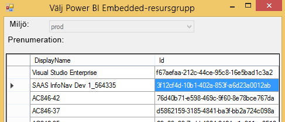
5. Under prenumerationslistan väljer du den **resursgruppen** som innehåller din samling med arbetsytor och väljer **Välj**.

    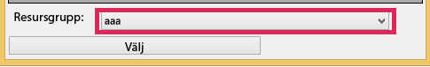

6. Välj **Analysera**. Då hämtas en förteckning över artiklarna i din Azure-prenumeration så att du kan påbörja din plan.

    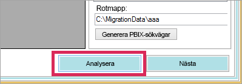

   > [!NOTE]
   > Analysprocessen kan ta flera minuter baserat på antalet samlingar med arbetsytor och hur mycket innehåll som finns i varje samling.

7. När **Analysera** är klar, blir du ombedd att spara din migreringsplan.

Nu har du anslutit din migreringsplan till din Azure-prenumeration. Läs följande för att lära dig hur du arbetar med din migreringsplan. Detta inkluderar att analysera och planera migreringen, hämta, skapa grupper och ladda upp.

### <a name="save-your-migration-plan"></a>Spara din migreringsplan

Du kan spara din migreringsplan för senare användning. Detta skapar en XML-fil som innehåller all information i din migreringsplan.

Gör följande om du vill spara din migreringsplan.

1. Välj **Arkiv** > **Spara migreringsplan**.

    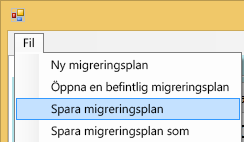

2. Namnge din fil eller använda det automatiskt skapade filnamnet och välj **Spara**.

### <a name="open-an-existing-migration-plan"></a>Öppna en befintlig migreringsplan

Du kan öppna en sparad migreringsplan för att fortsätta arbeta med migreringen.

Gör följande om du vill öppna din befintliga migreringsplan.

1. Välj **Arkiv** > **Öppna befintlig migreringsplan**.

    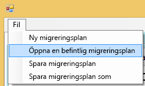

2. Välj din migreringsfil och välj **Öppna**.

## <a name="step-1-analyze--plan-migration"></a>Steg 1: Analysera och planera migrering

Fliken **Analysera och planera migrering** ger dig en översikt över vad som finns för tillfället i din Azure-prenumerations resursgrupp.

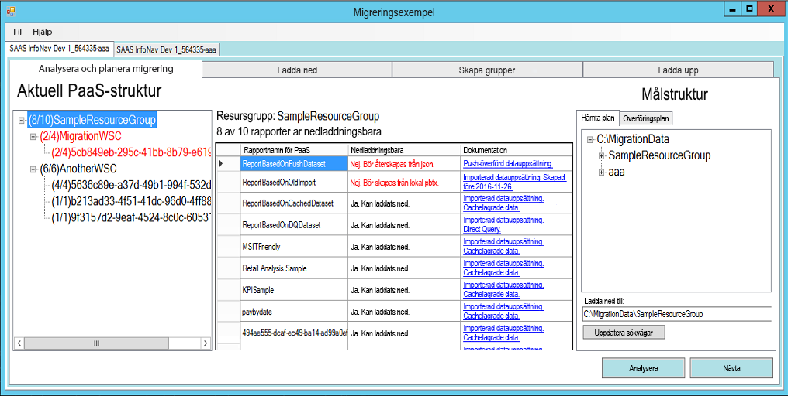

Vi ska titta på *SampleResourceGroup* som exempel.

### <a name="paas-topology"></a>PaaS-topologi

Detta är en lista över din *Resursgrupp > Samlingar med arbetsytor > Arbetsytor*. Resursgruppen och samlingar med arbetsytor visar ett bekant namn. Arbetsytorna visar ett GUID.

Objekten i listan visas också en färg och ett nummer i formatet (N/N). Detta anger antalet rapporter som kan hämtas.
Svart färg innebär att alla rapporter kan hämtas.

Röd färg innebär att vissa rapporter inte kan hämtas. Siffran till vänster anger det sammanlagda antalet rapporter som kan hämtas. Siffran till höger anger det totala antalet rapporter i grupperingen.

Du kan välja ett objekt i PaaS-topologin för att visa rapporterna i området rapporter.

### <a name="reports"></a>Rapporter

Området rapporter visar en lista med de tillgängliga rapporterna och anger om du kan hämta dem eller inte.

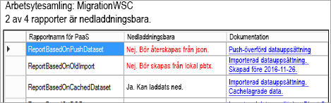

### <a name="target-structure"></a>Målstruktur

**Målstrukturen** används för att instruera verktyget om var saker kan hämtas och hur de ska överföras.

#### <a name="download-plan"></a>Hämta plan

En sökväg skapas automatiskt åt dig. Du kan ändra den här sökvägen om du vill. Om du ändrar sökvägen måste du välja **Uppdatera sökvägar**.

> [!NOTE]
> Detta innebär inte att något hämtas. Du anger endast strukturen som rapporterna kommer att hämtas till.

#### <a name="upload-plan"></a>Överföringsplan

Här kan du ange ett prefix som ska användas för de arbetsytor du skapar i Power BI-tjänsten. Efter prefixet kommer att GUID för den arbetsyta som fanns i Azure.


> [!NOTE]
> Detta skapar inte grupperna i Power BI-tjänsten. Det definierar bara namngivningsstrukturen för grupperna.

Om du ändrar prefixet måste du välja **Skapa överföringsplan**.

Du kan högerklicka på en grupp och byta namn på gruppen i Överföringsplanen direkt om du vill.

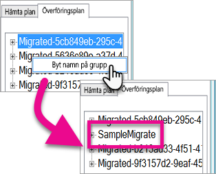

> [!NOTE]
> Namnet på *gruppen* får inte innehålla blanksteg eller ogiltiga tecken.

## <a name="step-2-download"></a>Steg 2: Ladda ned

På fliken **Hämta** visas en lista över rapporter och tillhörande metadata. Du kan se exporteringsstatusen tillsammans med föregående exporteringsstatus.


Du har två alternativ.

* Välj specifika rapporter och välj **Hämta valda rapporter**
* Välj **Hämta alla**.

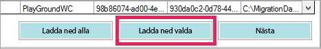

Efter en lyckad hämtning visas statusen *Klar*, vilket innebär att PBIX-filen existerar.

När hämtningen är klar väljer du fliken **Skapa grupper**.

## <a name="step-3-create-groups"></a>Steg 3: Skapa grupper

När du har hämtat de rapporter som är tillgängliga går du till fliken **Skapa grupper**. På den här fliken skapar du arbetsytor i Power BI-tjänsten baserat på den migreringsplan du skapade. Arbetsytan skapas med det namn du angett på fliken **Ladda upp** i **Analysera och planera migrering**.

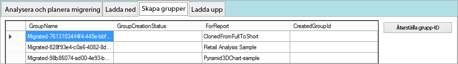

När du ska skapa arbetsytor kan du antingen välja **Skapa valda grupper** eller **Skapa alla grupper som saknas**.

När du väljer något av dessa alternativ kan du uppmanas att logga in. *Använd de autentiseringsuppgifter för Power BI-tjänsten som du använder för att skapa arbetsytor.*

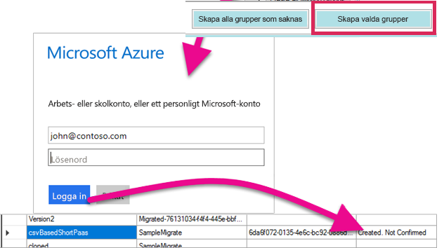

Detta skapar arbetsytan i Power BI-tjänsten. Rapporterna laddas inte upp till arbetsytan.

Du kan kontrollera att arbetsytan har skapats genom att logga in i Power BI och verifiera att arbetsytan finns. Du kan se att arbetsytan är tom.

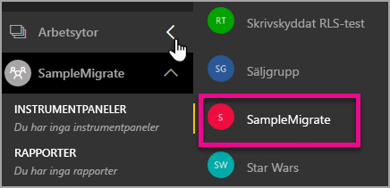

Efter att arbetsytan har skapats kan du gå vidare till fliken **Överför**.

## <a name="step-4-upload"></a>Steg 4: Ladda upp

Använd fliken **Överför** för att överföra rapporter till Power BI-tjänsten. Du kan se en lista över de rapporter som vi hämtade på fliken Hämta tillsammans med målgruppens namn baserat på din migreringsplan.

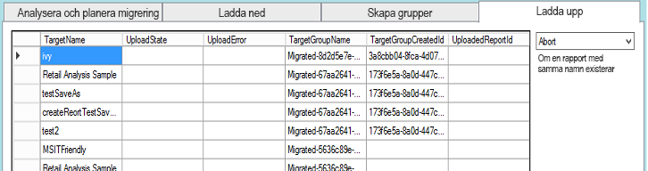

Du kan överföra valda rapporter eller alla rapporter. Du kan också återställa överföringsstatusen om du vill överföra objekt på nytt.

Du kan också välja vad du vill göra om en rapport med samma namn existerar. Du kan välja mellan **Avbryt**, **Ignorera** och **Skriv över**.

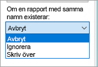

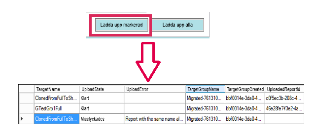

### <a name="duplicate-report-names"></a>Duplicerade rapportnamn

Om du har en rapport som har samma namn, men du vet att det är en annan rapport, måste du ändra **TargetName** för den rapporten. Du kan ändra namnet genom att manuellt redigera migreringsplanens XML-fil.

Du måste stänga migreringsverktyget för att genomföra ändringen och sedan öppna verktyget och migreringsplanen på nytt.

I ovanstående exempel kunde inte en av de klonade rapporterna överföras eftersom en rapport med samma namn redan fanns. Om vi tittar på XML-filen för migreringsplanen ser vi följande.

```xml
<ReportMigrationData>
    <PaaSWorkspaceCollectionName>SampleWorkspaceCollection</PaaSWorkspaceCollectionName>
    <PaaSWorkspaceId>4c04147b-d8fc-478b-8dcb-bcf687149823</PaaSWorkspaceId>
    <PaaSReportId>525a8328-b8cc-4f0d-b2cb-c3a9b4ba2efe</PaaSReportId>
    <PaaSReportLastImportTime>1/3/2017 2:10:19 PM</PaaSReportLastImportTime>
    <PaaSReportName>cloned</PaaSReportName>
    <IsPushDataset>false</IsPushDataset>
    <IsBoundToOldDataset>false</IsBoundToOldDataset>
    <PbixPath>C:\MigrationData\SampleResourceGroup\SampleWorkspaceCollection\4c04147b-d8fc-478b-8dcb-bcf687149823\cloned-525a8328-b8cc-4f0d-b2cb-c3a9b4ba2efe.pbix</PbixPath>
    <ExportState>Done</ExportState>
    <LastExportStatus>OK</LastExportStatus>
    <SaaSTargetGroupName>SampleMigrate</SaaSTargetGroupName>
    <SaaSTargetGroupId>6da6f072-0135-4e6c-bc92-0886d8aeb79d</SaaSTargetGroupId>
    <SaaSTargetReportName>cloned</SaaSTargetReportName>
    <SaaSImportState>Failed</SaaSImportState>
    <SaaSImportError>Report with the same name already exists</SaaSImportError>
</ReportMigrationData>
```

Vi kan ändra namnet på SaaSTargetReportName för objektet som misslyckades.

```xml
<SaaSTargetReportName>cloned2</SaaSTargetReportName>
```

Vi kan sedan öppna planen igen i migreringsverktyget och överföra rapporten.

När vi går tillbaka till Power BI ser vi att rapporterna och datauppsättningarna har överförts till arbetsytan.

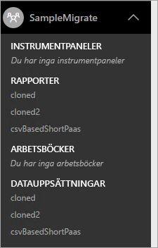

<a name="upload-local-file"></a>

### <a name="upload-a-local-pbix-file"></a>Ladda upp en lokal PBIX-fil

Du kan ladda upp en lokal version av en Power BI Desktop-fil. Du måste stänga verktyget, redigera XML-filen och placera den fullständiga sökvägen till din lokala PBIX i egenskapen **PbixPath**.

```xml
<PbixPath>[Full Path to PBIX file]</PbixPath>
```

När du har redigerat XML-filen öppnar du planen igen med migrationsverktyget och överför rapporten.

<a name="directquery-reports"></a>

### <a name="directquery-reports"></a>DirectQuery-rapporter

Du måste uppdatera anslutningssträngen för DirectQuery-rapporter. Detta kan göras i *powerbi.com*. Du kan också programmera en fråga för anslutningssträngen från Power BI Embedded (PaaS). Ett exempel på detta är [Extrahera DirectQuery anslutningssträngen från PaaS rapport](migrate-code-snippets.md#extract-directquery-connection-string-from-paas-report).

Du kan uppdatera anslutningssträngen för datamängden i Power BI-tjänst (SaaS) och ange autentiseringsuppgifter för datakällan. Du kan titta på följande exempel för att se hur du gör detta.

* [Uppdatera anslutningssträngen för DirectQuery i SaaS-arbetsytan](migrate-code-snippets.md#update-directquery-connection-string-is-saas-workspace)
* [Ange autentiseringsuppgifterna för DirectQuery i SaaS-arbetsytan](migrate-code-snippets.md#set-directquery-credentials-in-saas-workspace)

## <a name="embedding"></a>Bädda in

När dina rapporter ha migrerats från Power BI Embedded Azure-tjänsten till Power BI-tjänsten kan du uppdatera din app och börja bädda in rapporterna i arbetsytan.

Mer information finns i [Så här migrerar du innehåll från Power BI Embedded-arbetsytesamlingar till Power BI](migrate-from-powerbi-embedded.md).

## <a name="next-steps"></a>Nästa steg

[Bädda in med Power BI](embedding.md)  
[Så här migrerar du innehåll från Power BI Embedded-arbetsytesamlingar till Power BI](migrate-from-powerbi-embedded.md)  
[Power BI Premium – vad är det?](../service-premium-what-is.md)  
[JavaScript API Git Repo](https://github.com/Microsoft/PowerBI-JavaScript)  
[Power BI C# Git Repo](https://github.com/Microsoft/PowerBI-CSharp)  
[JavaScript-inbäddningsexempel](https://microsoft.github.io/PowerBI-JavaScript/demo/)  
[Power BI Premium – white paper](https://aka.ms/pbipremiumwhitepaper)  

Har du fler frågor? [Fråga Power BI Community](https://community.powerbi.com/)