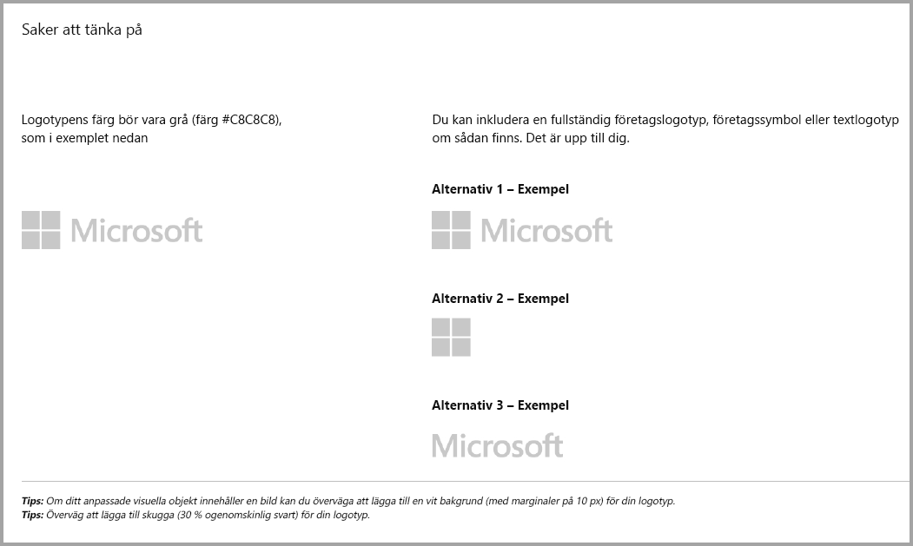
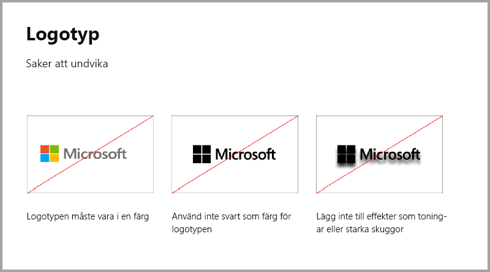
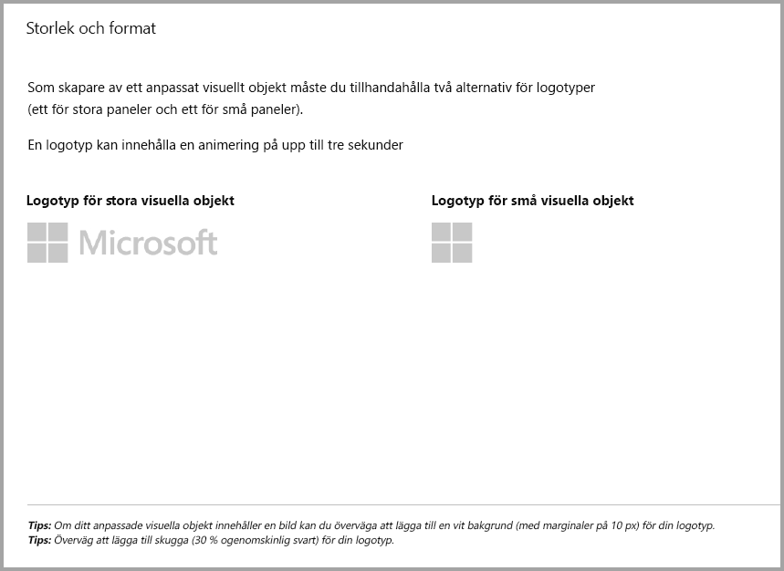
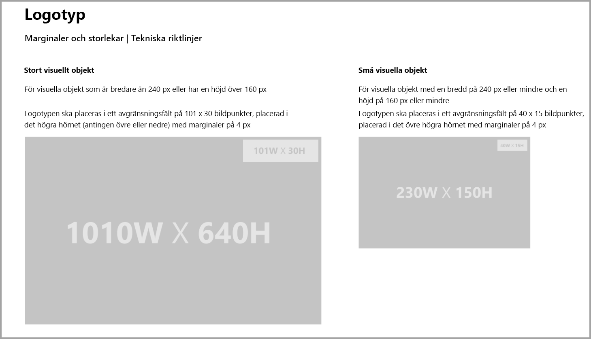
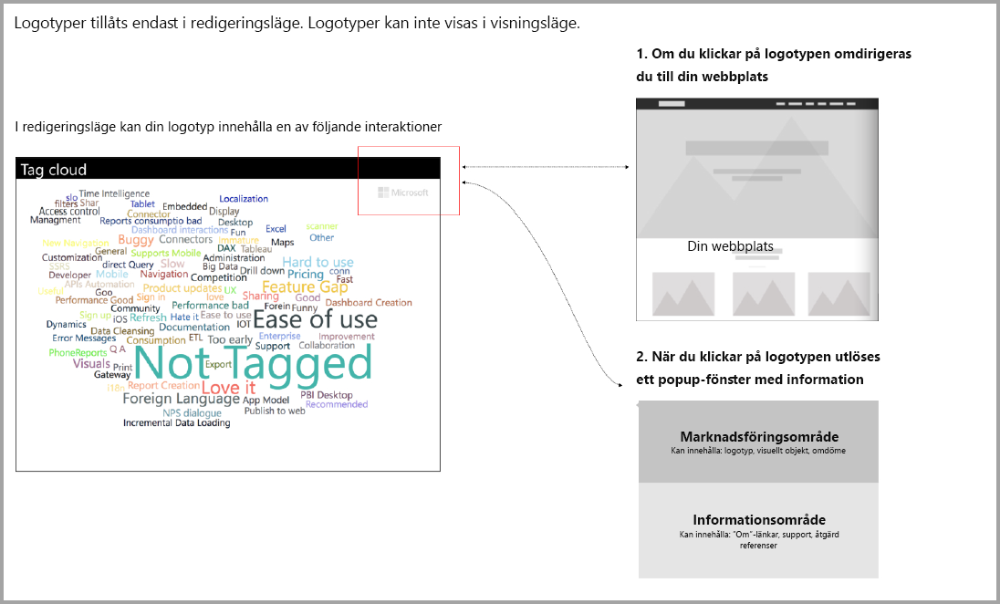

# Riktlinjer för visuella objekt i Power BI med ytterligare inköp

Tills nyligen godkände endast **marknadsplatsen (AppSource)** kostnadsfria visuella objekt i Power BI. Den här principen ändras så att visuella objekt med prislappen ”ytterligare köp kan krävas” också kan skickas till **AppSource**. Visuella objekt där ytterligare köp kan krävas liknar köp via app-tillägg (IAP) i Office Store. Utvecklare kan också skicka dessa visuella objekt för certifiering när de har godkänts av **AppSource**-teamet och när du har kontrollerat att de uppfyller certifieringskraven enligt beskrivningen i [artikeln om certifierade anpassade visuella objekt](../power-bi-custom-visuals-certified.md).

> [!Note]
> Det visuella objektet måste inte ha åtkomst till externa tjänster eller resurser för att godkännas.

> [!Note]
> Alla kostnadsfria visuella objekt måste behålla de kostnadsfria funktioner som erbjudits tidigare. Du kan lägga till valfria avancerade betalfunktioner utöver de tidigare kostnadsfria funktionerna. Vi rekommenderar att du skickar visuella IAP-objekt med de avancerade funktionerna som nya visuella objekt och inte uppdaterar de gamla kostnadsfria visuella objekten.

## Vad ändras i överföringsprocessen?

Utvecklare laddar upp sina visuella IAP-objekt till AppSource via instrumentpanelen för försäljning, precis som med kostnadsfria visuella objekt. Utvecklare bör visa att det skickade visuella objektet har IAP-funktioner genom att skriva följande i anteckningarna för säljinstrumentpanelen: "Visuellt objekt med köp i appen." Utvecklare måste också ange en licensnyckel eller token så att verifieringsteamet kan validera IAP-funktioner. När det visuella objektet har verifierats och godkänts anger AppSources lista för lägen för visuella IAP-objekt ”Ytterligare köp kan krävas” under alternativen för prisnivå.

## Vad är ett visuellt Power BI-objekt med IAP-funktioner?

Ett visuellt IAP-objekt är kostnadsfria visuella objekt och kostnadsfria avancerade funktioner, men har även ytterligare funktioner som kan innebära att extra avgifter kan tillkomma för att driva dem. Utvecklare måste meddela användare i det visuella objektets beskrivning av vilka funktioner som kräver ytterligare köp för att fungera. Microsoft tillhandahåller för närvarande inte inbyggda programgränssnitt (API:er) för att stödja köp i appar och tilläggsprogram. Utvecklare kan använda valfritt betalningssystem från tredje part för dessa inköp. Se vår [butiksprincip](https://docs.microsoft.com/office/dev/store/validation-policies#2-apps-or-add-ins-can-display-certain-ads).

> [!NOTE]
> Vattenstämplar tillåts inte på de kostnadsfria funktionerna. Utvecklare kan visa ett popup-fönster eller en vattenstämpel om de avancerade betalfunktionerna används utan giltig licens.  

## Riktlinjer för logotyp

I det här avsnittet beskrivs specifikationerna för att lägga till logotyper och logotyper i visuella objekt.

> [!NOTE]
> Logotyper tillåts endast i redigeringsläge. Logotyper kan inte visas i visningsläge.

## Metodtips

### Landningssida för visuellt objekt

Använd landningssidan för att klargöra för användarna hur de kan använda ditt visuella objekt och var de kan köpa licensen. Omfattar inte videor som utlöses automatiskt. Lägg bara till material som hjälper till att förbättra användarupplevelsen, till exempel information eller länkar till information om licensköp, och hur IAP-funktioner används.

### Licensnyckel och token

För att underlätta för användaren lägger du till licensnyckel eller tokenrelaterade fält överst i formatfönstret så att de blir bättre placerade för användarna.

## Vanliga frågor och svar

Mer information och svar på frågor finns i [Vanliga frågor och svar om visuella objekt med ytterligare köp](https://docs.microsoft.com/power-bi/power-bi-custom-visuals-faq#visuals-with-additional-purchases).

## Nästa steg

Läs hur du kan publicera dina anpassade visuella objekt till [AppSource](office-store.md) där andra kan upptäcka och använda dem.
