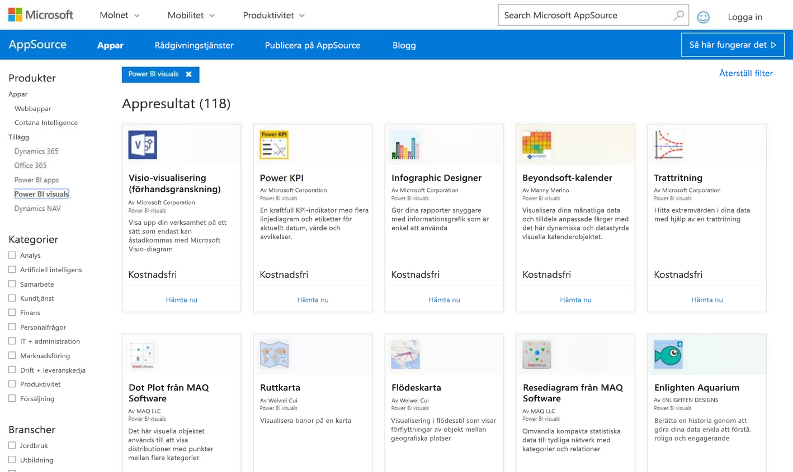
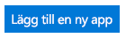
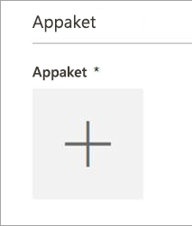
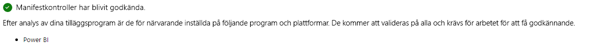
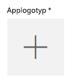
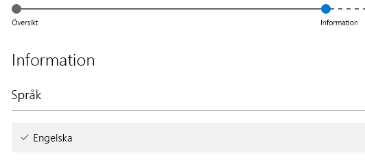

# Publicera visuella Power BI-objekt till AppSource

Läs hur du kan publicera dina anpassade visuella objekt till AppSource där andra kan upptäcka och använda dem.

När du har skapat ditt anpassade visuella objekt, vill du kanske publicera det på AppSource så att andra kan hitta och använda det. Det finns vissa förberedelser som måste göras innan du kan göra det. Mer information om hur du skapar ett anpassat visuellt objekt finns i [Utveckla ett anpassat visuellt Power BI-objekt](visuals/custom-visual-develop-tutorial.md).

   

## Vad är AppSource?

**AppSource** är det ställe där du hittar SaaS-appar och tillägg för dina Microsoft-produkter och tjänster. [AppSource](https://appsource.microsoft.com/marketplace/apps?product=power-bi-visuals) ger miljontals användare av Office 365, Dynamics 365, Cortana Intelligence och andra tillgång till lösningar som hjälper dem att få mer jobb gjort på ett effektivare sätt, med mer insikt och snyggare än tidigare.

## Förbereda att skicka ditt anpassade visuella objekt

När du har läst [riktlinjerna för visuella Power BI-objekt](guidelines-powerbi-visuals.md), kodat och [testat ditt anpassade visuella objekt](https://github.com/Microsoft/PowerBI-visuals/blob/master/Tutorial/SubmissionTesting.md), samt har paketerat det i en pbiviz-fil, bör nedanstående vara klart för din överföring.

| Objekt | Krävs | Beskrivning |
| --- | --- | --- |
| Pbiviz-paketet innehåller alla metadata som krävs |Ja |Visuellt namn Visningsnamn GUID Version Beskrivning Författarens namn och e-post |
| Exempel på .pbix-rapportfil |Ja |Om du vill visa ditt visuella objekt bör du hjälpa användare att bekanta sig med det visuella objektet. Du bör fokusera på det mervärde som det visuella objektet medför till användaren och ge exempel på användningsområden, formateringsalternativ med mera. Du kan också lägga till en *”tips”* -sida på slutet med några tips och tricks, saker att undvika och liknande. Exemplet på en .pbix-rapportfil måste fungera offline, utan någon extern anslutning. |
| Ikon |Ja |Du bör inkludera den anpassade visuella logotypen som visas i Store. Formatet kan vara .png, .jpg, .jpeg eller .gif. Det måste vara exakt 300 px (bredd) x 300 px (höjd). **Viktigt!** Granska [snabbguiden](https://docs.microsoft.com/office/dev/store/craft-effective-appsource-store-images) noggrant innan du skickar ikonen. |
| Skärmbilder |Ja |Du måste ange minst en skärmbild. Formatet kan vara .png, .jpg, .jpeg eller .gif. Det måste vara exakt 1366 px (bredd) x 768 px (höjd). Filstorleken får inte vara större än 1024 kB. *Lägg till textbubblor för att tydligt betona mervärdet av viktiga funktioner som visas i varje skärmbild.* |
| Länk till nedladdningssupport |Ja |Ange en URL för att stödja kunder som har problem med ditt visuella objekt. Den här länken har angetts som en del av din SellerDashboard-registrering och är synlig för användare när de bereder sig åtkomst till ditt visuella objekts lista i AppSource. Formatet på URL:en ska inkludera https:// eller http://. |
| Länk till sekretessdokumentet |Ja |Ange en länk till sekretesspolicyn för kunder som använder ditt visuella objekt. Den här länken har angetts som en del av din SellerDashboard-registrering och är synlig för användare när de bereder sig åtkomst till ditt visuella objekts lista i AppSource. Formatet på länken ska inkludera https:// eller http://. |
| Licensavtal (EULA) |Ja |Du måste överföra ett licensavtal. Detta kan vara ditt eget licensavtal eller standardlicensavtalet från Office Store för visuella objekt i Power BI. Om du vill använda standardlicensavtalet klistrar du in följande URL i dialogrutan för filöverföring av ”Licensavtal” i försäljningsinstrumentpanelen: [https://visuals.azureedge.net/app-store/Power BI - Default Custom Visual EULA.pdf](https://visuals.azureedge.net/app-store/Power%20BI%20-%20Default%20Custom%20Visual%20EULA.pdf). |
| Videolänk |Nej |Om du vill öka användarnas intresse för ditt anpassade visuella objekt är det bäst att ange en länk till en video om ditt visuella objekt. Formatet på URL:en ska inkludera https:// eller http://. |
| GitHub-lagringsplats |Nej |Det är lämpligt att ha en giltig och offentlig länk till en [GitHub](https://www.github.com)-databas med datakällor för ditt visuella objekt och exempeldata, så att andra utvecklare kan ge feedback och föreslå förbättringar för din kod. |

## Publicera till Power BI

Publiceringen börjar med att skicka ett e-postmeddelande till Power BI-teamet för överföring av visuella Power BI-objekt. Du kan skicka e-post till [pbivizsubmit@microsoft.com](mailto:pbivizsubmit@microsoft.com).

> [!IMPORTANT]
> Du måste fylla i följande fält i filen pbiviz.json: ”beskrivning”, ”supportUrl”, ”författare”, ”namn” och ”e-post” innan du skapar .pbiviz-paketet.

Bifoga **.pbiviz-filen** och **.pbix-filen med exempelrapporten** i ditt e-postmeddelande. Power BI-teamet kommer att svara med instruktioner och en XML-appaketsfil att överföra. Det här XML-appaketet krävs för att skicka ditt visuella objekt via Office Developer Center.

> [!NOTE]
> För att förbättra kvaliteten och säkerställa att befintliga rapporter inte slutar fungera, tar det ytterligare 2 veckor för uppdateringar i befintliga visuella objekt att nå produktionsmiljön efter att de har godkänts i Store.

## Skicka in till AppSource

När du har hämtat XML-appaketet från Power BI-teamet, går du till [Developer Center](https://sellerdashboard.microsoft.com/Application/Summary) för att skicka ditt visuella objekt till AppSource.

> [!NOTE]
> Du måste ha ett giltigt Office-utvecklarkonto för att logga in på [Office Developer Center](https://dev.office.com/). Ett Office-utvecklarkonto måste vara ett Microsoft-konto (Live ID, t.ex. hotmail.com eller outlook.com).

> [!IMPORTANT]
> Innan du skickar till AppSource, måste du skicka ett e-postmeddelande med .pbiviz-filen och .pbx-filen till Power BI-teamet. På så vis kan Power BI-teamet överföra filerna till en offentlig resursserver. Annars kommer butiken inte att hämta filerna. Du måste skicka filerna med varje ny inlämning av visuella objekt, uppdatering av visuella objekt och korrigeringar av avvisade inlämningar.

### Processen för att skicka visuella objekt

Slutför överföringen genom att följa stegen.

1. Välj **lägg till en app**.

    

2. Välj anpassat visuellt objekt i **Power BI** och sedan **Nästa**.

3. Välj **+** under **Appaket** och välj appaketets XML-fil som du har fått från Power BI-teamet från dialogrutan Öppna fil.

    

4. Du bör få ett godkännande om att detta är ett giltigt programpaket för Power BI.

    

5. Fyll i **Allmän information**.

   * *Överföringsrubrik:* Namnet din överföring får i Developer Center.
   * *Version:* Versionsnumret är automatiskt ifyllt från ditt tilläggsprogrampaket.
   * *Utgivningsdatum (UTC):* Välj ett datum då din app ska lanseras i butiken. Om du väljer ett datum i framtiden blir appen inte tillgängligt i store förrän detta datum har nåtts.
   * *Kategori:* Den första kategorin fylls i automatiskt som ”Datavisualisering + BI”. Så här markeras alla visuella Power BI-objekt. Du kan ange upp till 2 ytterligare kategorier som hjälper användare att söka efter ditt visuella objekt
   * *Testanteckningar:* valfritt om du vill ge anvisningar till testarna på Microsoft
   * *Min app anropar, stöder, innehåller eller använder kryptografi eller kryptering:* lämna alternativet omarkerat
   * *Gör det här tillägget tillgängligt i Office-tillägg-katalogen på iPad:* lämna alternativet omarkerat
6. Ladda upp en logotyp för ditt visuella objekt genom att välja **+** under **App-logotyp**. Välj sedan ikonfilen i dialogrutan Öppna fil. Filen måste vara .png, .jpg, .jpeg eller .gif. Det måste vara exakt 300 px (bredd) x 300 px (höjd) och inte större än 512 kB.

    

7. Fyll i **Stöddokumentationen**.

   * Länk till stöddokumentet
   * Länk till sekretessdokumentet
   * Videolänk
   * Licensavtalet (EULA)

       Du måste överföra ett licensavtal. Detta kan vara ditt eget licensavtal eller standardlicensavtalet från Office Store för visuella objekt i Power BI. Om du vill använda standardlicensavtalet klistrar du in följande URL i dialogrutan för filöverföring av ”Licensavtal” i försäljningsinstrumentpanelen: [https://visuals.azureedge.net/app-store/Power BI - Default Custom Visual EULA.pdf](https://visuals.azureedge.net/app-store/Power%20BI%20-%20Default%20Custom%20Visual%20EULA.pdf).

8. Välj **nästa** för att komma till sidan **Information**.

9. Välj **språk** och välj ett språk i listan.

    

10. Fyll i ”Beskrivning”.

    * *Programnamn (för det här språket):* Ange rubriken för appen som det visas i storefront.
    * *Kort beskrivning:* Ange den korta beskrivningen för din app, upp till 100 tecken, som det visas i storefront. Den här beskrivningen visas på sidorna på den högsta nivån tillsammans med logotypen. Du kan använda beskrivningen från pbiviz-paketet.
    * *Lång beskrivning:* Ge en mer detaljerad beskrivning av din app som kommer att visas på din appinformationssida. Ange en länk till den offentliga databasen, till exempel GitHub, här om du vill låta communityn förbättra din visuella genom att öppna källkoden.

11. Överför minst en skärmbild. Formatet kan vara .png, .jpg, .jpeg eller .gif. Det måste vara exakt 1366 px (bredd) x 768 px (höjd). Filstorleken får inte vara större än 1024 kB. *Lägg till textbubblor för att tydligt betona mervärdet av viktiga funktioner som visas i varje skärmbild.*

12. Om du vill lägga till fler språk väljer du **Lägg till ett språk** och upprepa steg 10 och 11. Genom att lägga till fler språk kan användarna visa information om det anpassade visuella objektet på sina egna språk. Språk som inte visas kommer att övergå till det första valda språket som standard.

13. När du är klar med att lägga till språk väljer du **Nästa** för att komma till sidan **Blockera åtkomst**.

14. Om du vill förhindra kunder i vissa länder eller regioner från att använda eller köpa din app, markerar du kryssrutan och väljer dessa i listan.

15. Välj **Nästa** för att komma till sidan **Prissättning**.

16. För närvarande stöds endast *kostnadsfria* visuella objekt och ytterligare inköp i visuella objekt (köp i appen) är inte tillåtna. Välj **Den här appen är kostnadsfri**.

    > [!NOTE]
    > Om du väljer något annat alternativ än kostnadsfri eller har inköp i appinnehåll i det skickade visuella objektet, kommer överföringen att avvisas.

17. Nu kan du välja **Spara som utkast** och skicka senare, eller välja **Överför för godkännande** för att skicka det anpassade visuella objektet till Office Store.

## Spåra sändningsstatus och användning

Du kan granska [verifieringsprinciperna](https://dev.office.com/officestore/docs/validation-policies#13-power-bi-custom-visuals).

Därefter kommer du att kunna visa status för ansökan i [appinstrumentpanelen](https://sellerdashboard.microsoft.com/Application/Summary/).

## Godkänn ditt visuella objekt

När du har skapat ditt visuella objekt kan du eventuellt få ditt visuella objekt godkänt. Detta innebär att den kan köras i Power BI-tjänsten och användas med andra funktioner i tjänsten, till exempel export till PowerPoint. Mer information finns i [Godkänn ett anpassat *visuellt objekt*](../power-bi-custom-visuals-certified.md).

## Nästa steg

[Utveckla ett anpassat visuellt objekt i Power BI](visuals/custom-visual-develop-tutorial.md)  
[Visualiseringar i Power BI](../visuals/power-bi-report-visualizations.md)  
[Anpassade visualiseringar i Power BI](../power-bi-custom-visuals.md)  
[Få anpassade visuella objekt *certifierade*](../power-bi-custom-visuals-certified.md)

Har du fler frågor? [Fråga Power BI Community](http://community.powerbi.com/)
