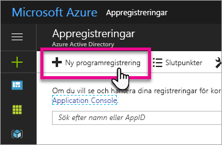
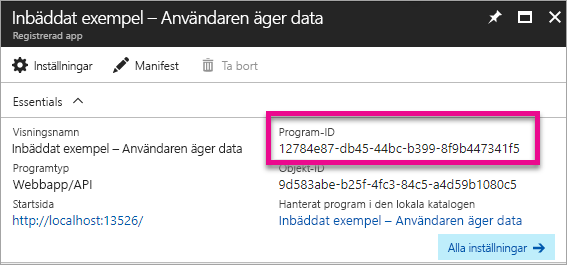
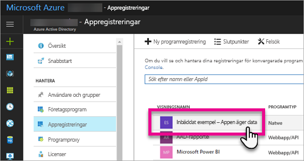
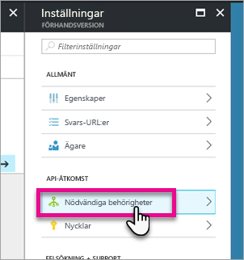
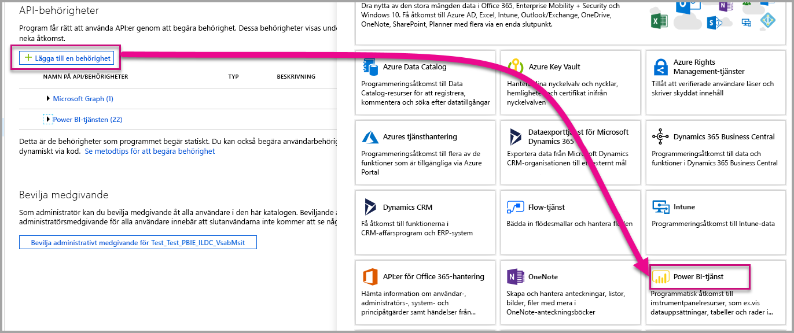
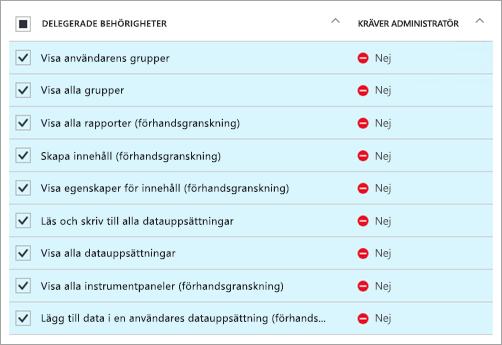

# <a name="register-an-azure-ad-app-to-embed-power-bi-content"></a>Registrera en Azure AD-app för att bädda in Power BI-innehåll
Lär dig hur du registrerar en app i Azure Active Directory (Azure AD) för användning med inbäddning av Power BI-innehåll.

Du kan registrera din app med Azure AD så att din ansökan ger åtkomst till Power BI REST-API: er. Därmed kan du upprätta en identitet för din app och ange behörigheter till Power BI REST-resurser.

> [!IMPORTANT]
> Innan du registrerar en Power BI-app behöver du en [Azure Active Directory-klient och en organisationsanvändare](create-an-azure-active-directory-tenant.md). Om du inte har registrerat dig för Power BI med en användare i din klientorganisation går det inte att slutföra appregistreringen.
> 
> 

Det finns två sätt att registrera din app. Du kan använda [registreringsverktyget för Power BI-appen](https://dev.powerbi.com/apps/) eller göra det direkt i Azure Portal. Registreringsverktyget för Power BI-appen är det enklaste alternativet eftersom du bara behöver fylla i ett fåtal fält. Om du vill göra ändringar i din app ska du använda Azure Portal.

## <a name="register-with-the-power-bi-app-registration-tool"></a>Registrera med registreringsverktyget för Power BI-appen
Du måste registrera din app i **Azure Active Directory** att upprätta en identitet för ditt program och ange behörigheter till Power BI REST-resurser. När du registrerar en app, till exempel en konsolapp eller en webbplats, får du en identifierare som används av programmet för att identifiera sig för de användare som det begär behörigheter från.

Så här gör du för att registrera din app med registreringsverktyget för Power BI-appen:

1. Gå till [dev.powerbi.com/apps](https://dev.powerbi.com/apps).
2. Välj **Logga in med ditt befintliga konto**.
3. Ange ett **Appnamn**.
4. Valet av apptyp beror på vilken sorts app du använder.
   
   * Använd **webbapp för serversidan** för webbappar eller webb-API:er.
   * Använd **inbyggd app** för appar som körs på klientenheter. ***Du kan också välja **inbyggd app** om du bäddar in innehåll för kunderna oavsett vilken typ av app det gäller. Även webbappar.***
5. Ange ett värde för **omdirigerings-URL** och **hemsidans URL**. Alla giltiga URL:er fungerar.
   
    **URL för hemsidan** är endast tillgängligt om du väljer **webbapp för serversidan** som apptyp.
   
    För exemplen *inbäddning för dina kunder* och *integrera instrumentpanelen med webbappen* är omdirigerings-URL:en `http://localhost:13526/redirect`. För rapporten och panelen är omdirigerings-URL:en `http://localhost:13526/`.
6. Välj de API: er som har åtkomst till det här programmet. Läs mer om Power BI-behörigheter i [Power BI-behörigheter](power-bi-permissions.md).
   
    
7. Välj **Registrera app**.
   
    Du kommer därefter att få ett **klient-ID**. Om du har valt **webbprogram för serversidan**får du även en **Klienthemlighet**. Ditt **klient-ID** kan hämtas från Azure Portal vid ett senare tillfälle om det behövs. Om du tappar bort din **Klienthemlighet** måste du skapa ett nytt på Azure Portal.

8. Du behöver gå till Azure för att välja **Bevilja behörigheter**.
> [!Note]
    > Måste vara en global administratör i Azure-klienten för att slutföra det här
>

* Gå till Azure.
* Sök och välj **App-registreringar**.
* Välj din app.
* Välj **inställningar**.
* Välj **Nödvändiga behörigheter**.
* Välj **Power BI-tjänsten** för att verifiera de behörigheter som du har valt från App-registreringsplatsen.
* Välj **Bevilja behörigheter**.

Du kan nu använda det registrerade programmet som del av ditt anpassade program så att det interagerar med Power BI-tjänsten.

> [!IMPORTANT]
> Om du bäddar in innehåll för dina kunder måste du konfigurera ytterligare tillstånd i Azure Portal. Mer information finns i [tillämpa behörigheter för ditt program](#apply-permissions-to-your-application).
> 
> 

## <a name="register-with-the-azure-portal"></a>Registrera med Azure Portal
Ett annat alternativ för att registrera ditt program är att göra det direkt i Azure Portal. Följ dessa steg om du vill registrera din app.

1. Godkänn [villkoren för Microsoft Power BI-API](https://powerbi.microsoft.com/api-terms).
2. Logga in på [Azure Portal](https://portal.azure.com).
3. Välj Azure AD-klienten genom att välja kontot i det övre högra hörnet på sidan.
4. I det vänstra navigeringsfönstret väljer du **Fler tjänster**, **App-registreringar** under **Säkerhet + Identitet**. Välj **Ny appregistrering**.
   
    
5. Följ anvisningarna och skapa ett nytt program.
   
   * För webbprogram, anger du den inloggnings-URL, som är den grundläggande URL:en för din app, där användare kan logga in osv. http://localhost:13526.
   * Ange en omdirigerings-URI som används i Azure AD för att returnera tokensvar för interna program. Ange ett specifikt värde för din app, till exempel http://myapplication/redirect

Mer information om hur du registrerar program i Azure Active Directory finns i [Integrera program med Azure Active Directory](https://docs.microsoft.com/azure/active-directory/develop/active-directory-integrating-applications)

## <a name="how-to-get-the-client-id"></a>Så här gör du för att hämta klient-id
När du registrerar ett program får du ett **klient-ID**.  Ditt **klient-ID** används av programmet för att identifiera sig för de användare som det begär behörigheter från.

Så här får du ett klient-id:

1. Logga in på [Azure Portal](https://portal.azure.com).
2. Välj Azure AD-klienten genom att välja kontot i det övre högra hörnet på sidan.
3. I det vänstra navigeringsfönstret väljer du **Fler tjänster** och **App-registreringar**.
4. Välj det program som du vill hämta klient-id för.
5. Du kommer att se **Applikations-ID** visas som en GUID. Detta är klient-id för programmet.
   
    

## <a name="apply-permissions-to-your-application-within-azure-ad"></a>Tillämpa behörigheter för ditt program i Azure AD
> [!IMPORTANT]
> Det här avsnittet gäller endast för program som **bäddar in innehåll för sin organisation**.
> 
> 

Du måste aktivera ytterligare behörigheter för ditt program utöver vad som fanns på app-registreringssidan. Du kan göra detta via Azure AD Portal eller med programmering.

Logga in antingen med *master*-kontot som används för inbäddning eller ett globalt administratörkonto.

### <a name="using-the-azure-ad-portal"></a>Med hjälp av Azure AD Portal
1. Bläddra till [App-registreringar](https://portal.azure.com/#blade/Microsoft_AAD_IAM/ApplicationsListBlade) i Azure Portal och välj den app som du använder för att bädda in.
   
    
2. Välj **Nödvändiga behörigheter** under **API-åtkomst**.
   
    
3. Välj **Windows Azure Active Directory** och kontrollera att **Åtkomst till katalogen som den inloggade användaren** är markerad. Välj **Spara**.
   
    
4. Inom **Nödvändiga behörigheter** väljer du **Power BI-tjänsten (Power BI)**.
   
    
   
   > [!NOTE]
   > Om du har skapat appen direkt i Azure AD Portal är **Power BI-tjänsten (Power BI)** kanske inte tillgänglig. Väl i sådant fall **+ Lägg till** och sedan **1 Välj och API**. Välj **Power BI-tjänsten** i API-listan och välj **Välj**.  Om **Power BI-tjänsten (Power BI)** är inte tillgänglig i **+ Lägg till** ska du registrera dig för Power BI med minst en användare.
   > 
   > 
5. Välj alla behörigheter under **Delegerade behörigheter**. Du måste markera dem en och en för att kunna spara valen. Välj **Spara** när du är klar.
   
    
6. Inom **Nödvändiga behörigheter** väljer du **Bevilja behörigheter**.
   
    Åtgärden **Bevilja behörigheter** krävs för *masterkontot*. Annars kommer du att tillfrågas av Azure AD. Om kontot som utför den här åtgärden är en Global administratör kommer du att bevilja behörighet till alla användare inom din organisation för den här appen. Om det konto som utför den här åtgärden är *master-kontot* och inte en global administratör beviljar du endast behörigheter till *master-kontot* för den här appen.
   
    

### <a name="applying-permissions-programmatically"></a>Tillämpa behörigheter via programmering
1. Du måste hämta befintliga huvudmän för tjänsten (användare) i din klient. Mer information om hur du gör det finns i [hämta servicePrincipal](https://developer.microsoft.com/en-us/graph/docs/api-reference/beta/api/serviceprincipal_get).
   
    Du kan anropa API:et *Hämta servicePrincipal* utan {id} och den hämtar alla service-säkerhetsobjekt i klienten.
2. Sök efter ett huvudnamn för tjänsten med ditt app klient-id som **appId**-egenskap.
3. Skapa en ny serviceplan om detta saknas för din app.
   
    ```
    Post https://graph.microsoft.com/beta/servicePrincipals
    Authorization: Bearer ey..qw
    Content-Type: application/json
    {
    "accountEnabled" : true,
    "appId" : "{App_Client_ID}",
    "displayName" : "{App_DisplayName}"
    }
    ```
4. Ge appen behörighet till PowerBI-API
   
    ```
    Post https://graph.microsoft.com/beta/OAuth2PermissionGrants
    Authorization: Bearer ey..qw
    Content-Type: application/json
    { 
    "clientId":"{Service_Plan_ID}",
    "consentType":"AllPrincipals",
    "resourceId":"c78b2585-1df6-41de-95f7-dc5aeb7dc98e",
    "scope":"Dataset.ReadWrite.All Dashboard.Read.All Report.Read.All Group.Read Group.Read.All Content.Create Metadata.View_Any Dataset.Read.All Data.Alter_Any",
    "expiryTime":"2018-03-29T14:35:32.4943409+03:00",
    "startTime":"2017-03-29T14:35:32.4933413+03:00"
    }
    ```
5. Ge appen behörighet till AAD
   
    Värdet för **consentType** beror på den användare som utför förfrågan. Du kan ange antingen **AllPrincipals** eller **Principal**. **AllPrincipals** kan endast användas av en administratör för att ge behörighet till alla användare. **Principal** används för att ge behörighet till en specifik användare. 
   
    Åtgärden Bevilja behörigheter krävs för *masterkontot*. Annars kommer du att tillfrågas av Azure AD. 
   
    Om du använder en befintlig klient och inte är intresserad av att bevilja behörigheter för alla klientanvändare kan du ge behörigheter till en specifik användare genom att ersätta värdet för **contentType** till **Principal**.
   
    ```
    Post https://graph.microsoft.com/beta/OAuth2PermissionGrants
    Authorization: Bearer ey..qw
    Content-Type: application/json
    { 
    "clientId":"{Service_Plan_ID}",
    "consentType":"AllPrincipals",
    "resourceId":"61e57743-d5cf-41ba-bd1a-2b381390a3f1",
    "scope":"User.Read Directory.AccessAsUser.All",
    "expiryTime":"2018-03-29T14:35:32.4943409+03:00",
    "startTime":"2017-03-29T14:35:32.4933413+03:00"
    }
    ```

## <a name="next-steps"></a>Nästa steg
Nu när du har registrerat ditt program i Azure AD behöver du autentisera användare i din app. Mer information finns i [Autentisera användare och hämta en Azure AD-åtkomsttoken för din Power BI-app](get-azuread-access-token.md).

Har du fler frågor? [Fråga Power BI Community](http://community.powerbi.com/)


