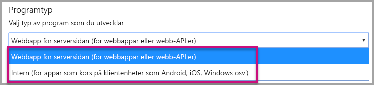
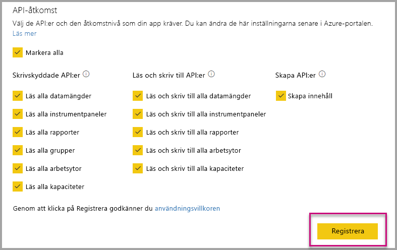
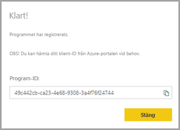
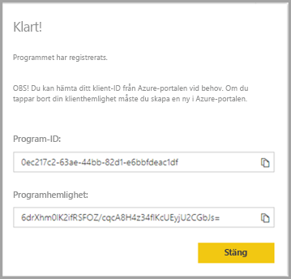

# <a name="register-an-azure-ad-application-to-use-with-power-bi"></a>Registrera en Azure AD-app för användning med Power BI

Lär dig hur du registrerar en app i Azure Active Directory (Azure AD) för användning med inbäddning av Power BI-innehåll.

Du kan registrera din app med Azure AD så att din ansökan ger åtkomst till [Power BI REST-API:er](https://docs.microsoft.com/rest/api/power-bi/). När du väl har registrerat ditt program kan du upprätta en identitet för programmet och ange behörigheter till Power BI REST-resurser.

> [!IMPORTANT]
> Innan du registrerar en Power BI-app behöver du en [Azure Active Directory-klient och en organisationsanvändare](create-an-azure-active-directory-tenant.md). Appregistreringen misslyckas om du inte har registrerat dig för Power BI med en användare i din klientorganisation.

Det finns två sätt att registrera din app. Du kan antingen använda [registreringsverktyget för Power BI-appen](https://dev.powerbi.com/apps/) eller göra det direkt i Azure Portal. Registreringsverktyget för Power BI-appen är mer praktiskt att använda eftersom du bara behöver fylla i några få fält. Använd Azure Portal om du vill göra ändringar i din app.

## <a name="register-with-the-power-bi-application-registration-tool"></a>Registrera med registreringsverktyget för Power BI-appen

Du måste registrera ditt program i **Azure Active Directory** om du vill upprätta en identitet för ditt program och ange behörigheter till Power BI REST-resurser. När du registrerar en app, t.ex. en konsolapp eller en webbplats, får du en identifierare som appen använder för att identifiera sig gentemot de användare som det begär behörigheter från.

Så här gör du för att registrera din app med registreringsverktyget för Power BI-appen:

1. Gå till [dev.powerbi.com/apps](https://dev.powerbi.com/apps).

2. Välj **Logga in med ditt befintliga konto** och välj sedan **Nästa**.

3. Ange ett **namn på appen**.

4. Ange en **programtyp**.

    Här finns skillnaderna för varför du väljer **Intern** istället för **Server-side web application** (Webbapp på serversidan) som apptyp.

    Inbyggd:
    * Du planerar att skapa en app som är [utformad för dina kunder](embed-sample-for-customers.md) med ett huvudanvändarkonto (en Power BI Pro-licens som används för att logga in på Power BI) för autentisering.

    Webbapp på serversidan:
    * Du planerar att skapa en app [utformad för din organisation](embed-sample-for-your-organization.md).
    * Du planerar att skapa en app [utformad för dina kunder](embed-sample-for-customers.md) som använder tjänstens huvudnamn för autentisering.
    * Du planerar att skapa webbappar eller webb-API:er.

    

5. Om du väljer **Server-side web application** (Webbapp på serversidan) som apptyp fortsätter du med att ange ett värde för **Hemside-URL** och **Omdirigerings-URL**. **Omdirigerings-URL** fungerar med alla giltiga URL-adresser och ska motsvara den app som du har skapat. Om du har valt **Intern** fortsätter du till steg 6.

6. Välj de Power BI-API:er som appen behöver. Läs mer om Power BI-behörigheter i [Power BI-behörigheter](power-bi-permissions.md). Välj **Registrera**.

    

    > [!Important]
    > Om du aktiverar tjänsthuvudnamn för användning med Power BI gäller inte längre Azure Active Directory-behörigheterna. Behörigheterna hanteras via Power BI-administrationsportalen.

7. Om du väljer **Intern** som programtyp får du ett **program-ID**. Om du väljer **Server-side Web app** (Webbapp på serversidan) som apptyp får du ett **program-ID** och en **apphemlighet**.

    > [!Note]
    > Ditt **program-ID** kan hämtas från Azure-portalen vid ett senare tillfälle om det behövs. Om du tappar bort din **apphemlighet** måste du skapa en ny på Azure-portalen.

| Intern | Webbapp på serversidan |
|--------|-----------------------------|
|  |  |

Du kan nu använda det registrerade programmet som del av ditt anpassade program så att det interagerar med Power BI-tjänsten och med din Power BI Embedded-app.

## <a name="register-with-the-azure-portal"></a>Registrera med Azure Portal

Ett annat alternativ för att registrera ditt program är att göra det direkt i Azure Portal. Följ dessa steg om du vill registrera din app.

1. Godkänn [villkoren för Microsoft Power BI-API](https://powerbi.microsoft.com/api-terms).

2. Logga in på [Azure Portal](https://portal.azure.com).

3. Välj Azure AD-klientorganisationen genom att markera ditt konto i sidans övre högra hörn.

4. I det vänstra navigeringsfönstret går du till **Alla tjänster** och väljer **Appregistreringar** följt av **Ny registrering**.

5. Följ anvisningarna och skapa ett nytt program.

   Mer information om hur du registrerar program i Azure Active Directory finns i [Registrera en app med Azure Active Directory](https://docs.microsoft.com/azure/active-directory/develop/quickstart-v2-register-an-app)

## <a name="how-to-get-the-application-id"></a>Så här får du program-ID

När du registrerar en app får du ett [program-ID](embed-sample-for-customers.md#application-id).  **Program-ID:t** begär behörigheter till användarna genom programmet för identifiering.

## <a name="how-to-get-the-service-principal-object-id"></a>Så här får du objekt-ID för tjänstens huvudnamn

När du använder [Power BI-API:er](https://docs.microsoft.com/rest/api/power-bi/) ser du till att definiera åtgärder som använder [objekt-ID för tjänstens huvudnamn](embed-service-principal.md#how-to-get-the-service-principal-object-id) så att det refererar till tjänstens huvudnamn – till exempel att tillämpa ett tjänsthuvudnamn som en administratör för en arbetsyta.

## <a name="apply-permissions-to-your-application-within-azure-ad"></a>Tillämpa behörigheter för ditt program i Azure AD

Aktivera ytterligare behörigheter för programmet utöver de som finns på appregistreringssidan. Du kan göra detta via Azure AD-portalen eller med programmering.

Logga in med *huvudkontot*, som används för inbäddning, eller med ett globalt administratörskonto.

### <a name="using-the-azure-ad-portal"></a>Med hjälp av Azure AD Portal

1. Bläddra till [Appregistreringar](https://portal.azure.com/#blade/Microsoft_AAD_IAM/ApplicationsListBlade) i Azure-portalen och välj den app som du använder för att bädda in.

2. Välj **API-behörigheter** under **Hantera**.

3. I **API-behörigheter** väljer du **Lägg till en behörighet** och sedan **Power BI-tjänst**.

    

4. Välj de specifika behörigheter som du behöver under **Delegerade behörigheter**. Du måste välja dem separat för valen ska sparas. Välj **Spara** när du är klar.

5. Välj **Bevilja medgivande**.

    Åtgärden **Bevilja medgivande** krävs för *huvudkontot*. Annars blir du tillfrågad av Azure AD angående medgivande. Om kontot som utför den här åtgärden är en global administratör beviljar du behörighet till alla användare i din organisation för den här appen. Om kontot som utför den här åtgärden är *huvudkontot* och inte en global administratör beviljar du endast behörigheter till *huvudkontot* för den här appen.

### <a name="applying-permissions-programmatically"></a>Tillämpa behörigheter via programmering

1. Du måste hämta de befintliga tjänstobjekten (användare) i din klientorganisation. Mer information om hur du gör det finns i [servicePrincipal](https://docs.microsoft.com/graph/api/resources/serviceprincipal?view=graph-rest-beta).

    Du kan anropa *Get servicePrincipal*-API:et utan {ID} så hämtas alla tjänstobjekt i klientorganisationen.

2. Sök efter ett huvudnamn för tjänsten med ditt program-ID som **appId**-egenskap.

3. Skapa en ny serviceplan om din app inte har någon.

    ```json
    Post https://graph.microsoft.com/beta/servicePrincipals
    Authorization: Bearer ey..qw
    Content-Type: application/json
    {
    "accountEnabled" : true,
    "appId" : "{App_Client_ID}",
    "displayName" : "{App_DisplayName}"
    }
    ```

4. Bevilja appbehörigheter till Power BI-API:et

   Om du använder en befintlig klient och inte är intresserad av att bevilja behörigheter för alla klientanvändare kan du ge behörigheter till en specifik användare genom att ersätta värdet för **contentType** till **Principal**.

   Värdet för **consentType** kan vara antingen **AllPrincipals** eller **Principal**.

   * **AllPrincipals** används av administratören för en klientorganisation för att bevilja behörigheter för alla användare i klientorganisationen.
   * **Principal** används för att bevilja behörigheter för en specifik användare. I det här fallet bör ytterligare en egenskap läggas till i själva begäran, *principalId = {User_ObjectId}* .

     Du måste *bevilja behörigheter* för huvudkontot så att inte användarna uppmanas att ge sitt tillstånd av Azure AD, vilket inte är möjligt vid icke-interaktiv inloggning.

     ```json
     Post https://graph.microsoft.com/beta/OAuth2PermissionGrants
     Authorization: Bearer ey..qw
     Content-Type: application/json
     {
     "clientId":"{Service_Plan_ID}",
     "consentType":"AllPrincipals",
     "resourceId":"c78a3685-1ce7-52cd-95f7-dc5aea8ec98e",
     "scope":"Dataset.ReadWrite.All Dashboard.Read.All Report.Read.All Group.Read Group.Read.All Content.Create Metadata.View_Any Dataset.Read.All Data.Alter_Any",
     "expiryTime":"2018-03-29T14:35:32.4943409+03:00",
     "startTime":"2017-03-29T14:35:32.4933413+03:00"
     }
     ```

    **resourceId** *c78a3685-1ce7-52cd-95f7-dc5aea8ec98e* är inte universellt utan är olika för olika klienter. Det här värdet är objectId för Power BI-tjänsten i Azure Active Directory-klienten (AAD).

    Du kan snabbt få det här värdet i Azure Portal:
    1. https://portal.azure.com/#blade/Microsoft_AAD_IAM/StartboardApplicationsMenuBlade/AllApps

    2. Sök efter ”Power BI Service” i sökrutan

5. Bevilja appbehörigheter till Azure Active Directory (AAD)

   Värdet för **consentType** kan vara antingen **AllPrincipals** eller **Principal**.

   * **AllPrincipals** kan endast användas av en klientorganisationsadministratör för att bevilja behörigheter för alla användare i klientorganisationen.
   * **Principal** används för att ge behörighet för en specifik användare. I det här fallet bör ytterligare en egenskap läggas till i själva begäran, *principalId = {User_ObjectId}* .

   Du måste *bevilja behörigheter* för huvudkontot så att inte användarna uppmanas att ge sitt tillstånd av Azure AD, vilket inte är möjligt vid icke-interaktiv inloggning.

   ```json
   Post https://graph.microsoft.com/beta/OAuth2PermissionGrants
   Authorization: Bearer ey..qw
   Content-Type: application/json
   { 
   "clientId":"{Service_Plan_ID}",
   "consentType":"AllPrincipals",
   "resourceId":"61e57743-d5cf-41ba-bd1a-2b381390a3f1",
   "scope":"User.Read Directory.AccessAsUser.All",
   "expiryTime":"2018-03-29T14:35:32.4943409+03:00",
   "startTime":"2017-03-29T14:35:32.4933413+03:00"
   }
   ```

## <a name="next-steps"></a>Nästa steg

Nu när du har registrerat appen i Azure AD måste du autentisera användare i appen. Mer information finns i [Autentisera användare och hämta en Azure AD-åtkomsttoken för din Power BI-app](get-azuread-access-token.md).

Har du fler frågor? [Fråga Power BI Community](https://community.powerbi.com/)