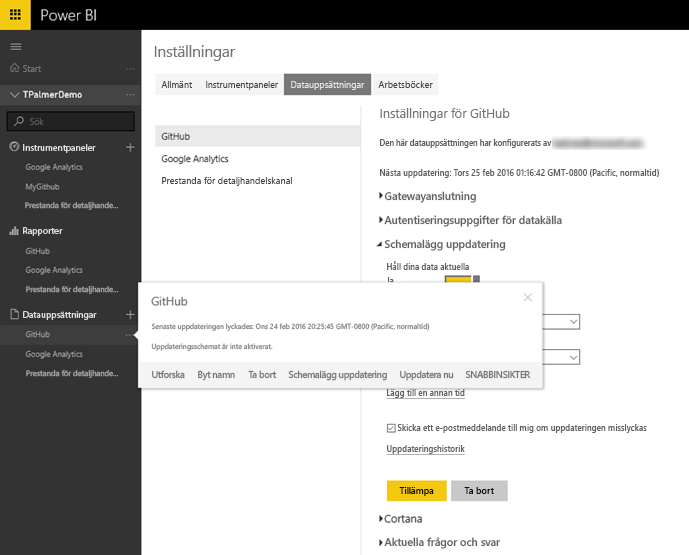
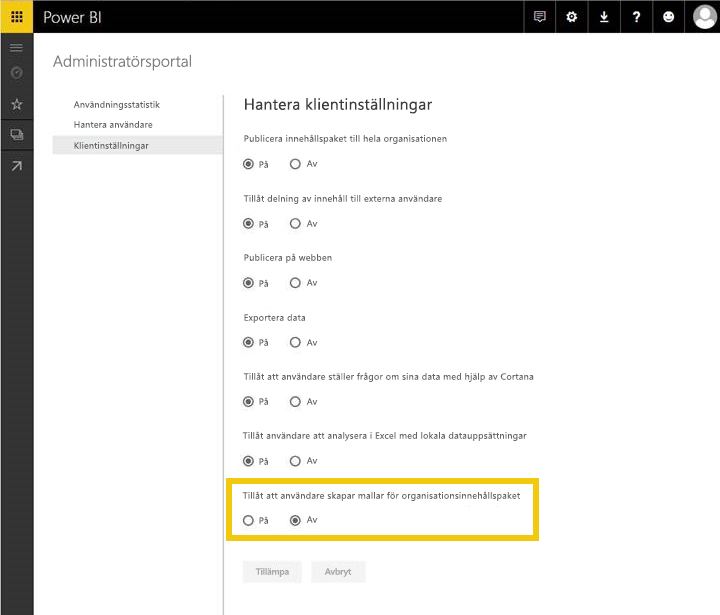
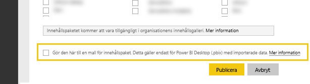
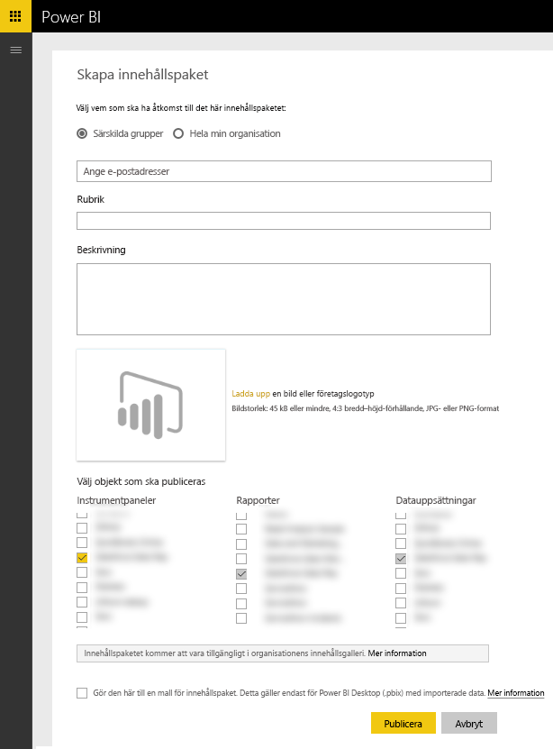

# Testa mallinnehållspaket för Power BI
Det finns olika sätt att testa innehållspaketet innan du skickar det för publicering.  

> [!NOTE]
> Om innehållspaketet använder en anpassad [Dataanslutning](https://aka.ms/DataConnectors) som du har utvecklat, kan du inte testa datauppdateringen eller mallinnehållspaketet enligt beskrivningen nedan. Om detta är fallet går du vidare med att [skicka](#submission) innehållspaketet. Power BI-teamet kommer att hjälpa dig testa innehållspaketet.
> 
> 

## Testa schemalagd datauppdatering
Mallinnehållspaketen använder Uppdatera på PowerBI.com till att skapa en instans av ett innehållspaket med kunddata när de ansluter. Innan innehållspaketet blir publikt tillgängligt kan du testa flödet med den Desktop-fil du skapade.

När du har laddat upp filen väljer du ”...” bredvid datauppsättningen och sedan Schemalägg uppdatering. Konfigurera autentiseringsuppgifterna för källan. Kontrollera att datauppsättningen uppdateras med både ”Uppdatera nu” och ”Schemalagd uppdatering”. Om det uppstår något fel vid uppdateringen kontrollerar du felmeddelandet, frågorna och slutsystemet.

### Fler uppdateringstips
* Det ska bara gå att hitta en datakälla när du försöker schemalägga uppdateringen  
* Testanslutningen ska visa att användaren kan läsa in innehållspaketet. Om detta inte är fallet kontrollerar du att frågorna hanterar ytterligare felhändelser.  
* Uppdateringen ska slutföras inom rimlig tid, cirka 5 minuter  

## Testa mallar
Ett mallinnehållspaket liknar befintliga lösningar, förutom att det inte innefattar faktiska data i datauppsättningen. När en användare använder eller skapar en instans av en mall uppmanas de i stället att ange parametrar och autentiseringsuppgifter för att kunna ansluta. När de har anslutit ser de sina egna data i instrumentpanelen, rapporten och datauppsättningarna. 

När en användare skapar en instans av innehållspaketet får de åtkomst till datauppsättningens inställningar inklusive schemalagd uppdatering. Eventuella RLS-inställningar i datauppsättningen publiceras **inte** med innehållspaketet.  

> [!NOTE]
> Mallinnehållspaket kan bara innehålla en instrumentpanel, en rapport och en datauppsättning. Se listan med begränsningar på sidan [Redigering](template-content-pack-authoring.md#restrictions). 
> 
> 

Om du vill aktivera mallskapande för din klient ber du Power BI-administratören att aktivera funktionsväxlingen nedan. 

När den är aktiverad ser du en kryssruta längst ner i [”Skapa innehållspaket”](https://app.powerbi.com/groups/me/publish-content/) där du kan publicera ett mallinnehållspaket till organisationen. 

### Namnge
Vi föreslår att du namnger instrumentpanelen, rapporten och datauppsättningen likadant i hela innehållspaketet. Dessa namn är hårdkodade och kommer att vara samma för alla användare, så om du använder dina produkt-/scenarionamn blir det enklare för kunderna att hitta den.

### Fler malltips
* Kontrollera att parametrarna som du angav i frågorna är meningsfulla för slutanvändarna
* Fundera över hur länge slutanvändaren ska vänta på att den schemalagda uppdateringen slutförs

## Skicka
Med processen Skicka i [Microsoft AppSource](https://appsource.microsoft.com/en-us/partners/list-an-app) kan du publicera ditt mallinnehållspaket i tjänstens innehållspaketgalleri i PowerBI.com, samt lägga till innehållspaketet en lista i [Microsoft AppSource](http://appsource.microsoft.com).

### Innan du skickar
* Gå igenom redigeringstipsen för varje artefakt i innehållspaketet
* Testa och anslut med olika konton och dataförhållanden. (Hoppa över det här steget om du har utvecklat en egen anpassad [dataanslutning](https://aka.ms/DataConnectors))
* Granska alla visuella objekt och håll utkik efter felstavade objekt
* Kontrollera att innehållspaketet svarar som det ska på Frågor och svar. Vi föreslår att du testar minst 30 olika frågor i hela datamodellen. (Hoppa över det här steget om du har utvecklat en egen anpassad [dataanslutning](https://aka.ms/DataConnectors))

### Skicka
När du är klar att skicka går du till [sidan för att skicka appar](https://appsource.microsoft.com/en-us/partners/list-an-app) i AppSource och skickar informationen. Var noga med att välja Power BI i listan med tillgängliga produkter

Power BI-teamet granskar det du skickat och kontaktar dig för att kontrollera att alla artefakter uppfyller kraven. Förutom att kontrollera att det är komplett, verifierar vi också kvaliteten på instrumentpanelen och rapporterna så att de uppfyller det företagscenario som beskrivs i programmet.

### Uppdateringar
Att uppdatera innehållspaketet följer ett liknande flöde som när du skickade det första gången. 

