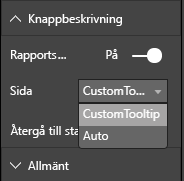

# <a name="tooltips-in-power-bi-visuals"></a>Knappbeskrivningar i visuella Power BI-objekt

Visuella objekt kan nu utnyttja stödet för knappbeskrivningar i Power BI. Power BI-knappbeskrivningar hanterar följande interaktioner:

* Visa en knappbeskrivning.
* Dölj en knappbeskrivning.
* Flytta en knappbeskrivning.

Knappbeskrivningar kan visa ett textelement med en rubrik, ett värde med en viss färg och opacitet vid en angiven uppsättning koordinater. Dessa data tillhandahålls till API:et, och Power BI-värden renderar dem på samma sätt som det renderar knappbeskrivningar för inbyggda visuella objekt.

En knappbeskrivning i ett exempelstapeldiagram visas i följande bild:


Föregående bild med knappbeskrivningar visar en kategori och ett värde för en stapel. Du kan utöka en enskild knappbeskrivning till att visa flera värden.

## <a name="manage-tooltips"></a>Hantera knappbeskrivningar

Du hanterar knappbeskrivningar via gränssnittet ”ITooltipService”. Det används för att meddela värden om att en knappbeskrivning behöver visas, tas bort eller flyttas.

```typescript
    interface ITooltipService {
        enabled(): boolean;
        show(options: TooltipShowOptions): void;
        move(options: TooltipMoveOptions): void;
        hide(options: TooltipHideOptions): void;
    }
```

Ditt visuella objekt behöver lyssna på mushändelserna i det visuella objektet och anropa delegaterna `show()`, `move()` och `hide()` efter behov med lämpligt innehåll som fylls på i `Tooltip****Options`-objekten.
`TooltipShowOptions` och `TooltipHideOptions` definierar i sin tur vad som ska visas samt hur beteendet ska vara i dessa händelser.

Eftersom anrop av dessa metoder innefattar användarhändelser såsom musrörelser och pekhändelser är det bra att skapa lyssnare för dessa händelser, som i sin tur anropar `TooltipService`-medlemmarna.
Vårt exempel aggregeras i en klass som heter `TooltipServiceWrapper`.

### <a name="the-tooltipservicewrapper-class"></a>Klassen TooltipServiceWrapper

Den grundläggande idén bakom den här klassen är att den ska innehålla instansen av `TooltipService`, lyssna på D3-mushändelser över relevanta element och sedan anropa elementen `show()` och `hide()` när det behövs.

Klassen innehåller och hanterar alla relevanta tillstånd och all logik för dessa händelser, som främst inriktar sig på att samverka med den underliggande D3-koden. D3-gränssnitt och -konvertering behandlas inte i den här artikeln.

Du hittar den fullständiga exempelkoden på [lagringsplatsen för SampleBarChart](https://github.com/Microsoft/PowerBI-visuals-sampleBarChart/commit/981b021612d7b333adffe9f723ab27783c76fb14).

### <a name="create-tooltipservicewrapper"></a>Skapa TooltipServiceWrapper

Nu har stapeldiagramskonstruktorn en `TooltipServiceWrapper`-medlem som instansieras i konstruktorn med `tooltipService`-värdinstansen.

```typescript
        private tooltipServiceWrapper: ITooltipServiceWrapper;

        this.tooltipServiceWrapper = createTooltipServiceWrapper(this.host.tooltipService, options.element);
```

Klassen `TooltipServiceWrapper` innehåller instansen `tooltipService`, och även som D3-rotelement för det visuella objektet och touchparametrarna.

```typescript
    class TooltipServiceWrapper implements ITooltipServiceWrapper {
        private handleTouchTimeoutId: number;
        private visualHostTooltipService: ITooltipService;
        private rootElement: Element;
        private handleTouchDelay: number;

        constructor(tooltipService: ITooltipService, rootElement: Element, handleTouchDelay: number) {
            this.visualHostTooltipService = tooltipService;
            this.handleTouchDelay = handleTouchDelay;
            this.rootElement = rootElement;
        }
        .
        .
        .
    }
```

Metoden `addTooltip` är klassens enda ingångspunkt för att registrera händelselyssnare.

### <a name="the-addtooltip-method"></a>Metoden addTooltip

```typescript
        public addTooltip<T>(
            selection: d3.Selection<Element>,
            getTooltipInfoDelegate: (args: TooltipEventArgs<T>) => VisualTooltipDataItem[],
            getDataPointIdentity: (args: TooltipEventArgs<T>) => ISelectionId,
            reloadTooltipDataOnMouseMove?: boolean): void {

            if (!selection || !this.visualHostTooltipService.enabled()) {
                return;
            }
        ...
        ...
        }
```

* **selection: d3.Selection<Element>** : De D3-element över vilka knappbeskrivningar hanteras.

* **getTooltipInfoDelegate: (args: TooltipEventArgs<T>) => VisualTooltipDataItem[]** : Delegaten för att fylla i knappbeskrivningsinnehållet (det som ska visas) efter kontext.

* **getDataPointIdentity: (args: TooltipEventArgs<T>) => ISelectionId**: Delegaten för att hämta datapunkts-ID (används inte i det här exemplet). 

* **reloadTooltipDataOnMouseMove? boolean**: Ett booleskt värde som anger huruvida knappbeskrivningsdata ska uppdateras under en MouseMove-händelse (används inte i det här exemplet).

Som du ser avslutas `addTooltip` utan åtgärd om `tooltipService` är inaktiverad eller om inget faktiskt val har gjorts.

### <a name="call-the-show-method-to-display-a-tooltip"></a>Anropa show-metoden för att visa en knappbeskrivning

Metoden `addTooltip` lyssnar sedan på D3 `mouseover`-händelsen enligt följande kod:

```typescript
        ...
        ...
        selection.on("mouseover.tooltip", () => {
            // Ignore mouseover while handling touch events
            if (!this.canDisplayTooltip(d3.event))
                return;

            let tooltipEventArgs = this.makeTooltipEventArgs<T>(rootNode, true, false);
            if (!tooltipEventArgs)
                return;

            let tooltipInfo = getTooltipInfoDelegate(tooltipEventArgs);
            if (tooltipInfo == null)
                return;

            let selectionId = getDataPointIdentity(tooltipEventArgs);

            this.visualHostTooltipService.show({
                coordinates: tooltipEventArgs.coordinates,
                isTouchEvent: false,
                dataItems: tooltipInfo,
                identities: selectionId ? [selectionId] : [],
            });
        });
```

* **makeTooltipEventArgs**: Extraherar kontexten från de valda D3-elementen till tooltipEventArgs. Den beräknar även koordinaterna.

* **getTooltipInfoDelegate**: Sedan skapar den knappbeskrivningsinnehållet från tooltipEventArgs. Det här är ett återanrop till klassen BarChart eftersom det är det visuella objektets logik. Det är det faktiska textinnehåll som ska visas i knappbeskrivningen.

* **getDataPointIdentity**: Används inte i det här exemplet.

* **this.visualHostTooltipService.show**: Anropet för att visa knappbeskrivningen.  

Ytterligare hantering finns i exemplet för `mouseout`- och `mousemove`-händelser.

Mer information finns på [lagringsplatsen för SampleBarChart](https://github.com/Microsoft/PowerBI-visuals-sampleBarChart/commit/981b021612d7b333adffe9f723ab27783c76fb14).

### <a name="populate-the-tooltip-content-by-the-gettooltipdata-method"></a>Fylla i knappbeskrivningsinnehållet med hjälp av metoden getTooltipData

Klassen BarChart lades till med en `getTooltipData`-medlem, vilket extraherar `category`, `value` och `color` för datapunkten till ett VisualTooltipDataItem[]-element.

```typescript
        private static getTooltipData(value: any): VisualTooltipDataItem[] {
            return [{
                displayName: value.category,
                value: value.value.toString(),
                color: value.color,
                header: 'ToolTip Title'
            }];
        }
```

I föregående implementering är `header`-medlemmen konstant, men du kan använda den för mer komplexa implementeringar som kräver dynamiska värden. Du kan fylla i `VisualTooltipDataItem[]` med fler än ett element, vilket innebär att flera rader läggs till i knappbeskrivningen. Det kan vara användbart i visuella objekt såsom liggande stapeldiagram där knappbeskrivningen kan visa data från fler än en enskild datapunkt.

### <a name="call-the-addtooltip-method"></a>Anropa metoden addTooltip

Det sista steget är att anropa metoden `addTooltip` när faktiska data kan ändras. Det här anropet sker i metoden `BarChart.update()`. Ett anrop görs för att övervaka valet av alla ”bar”-element. Endast `BarChart.getTooltipData()` skickas, som nämnts ovan.

```typescript
        this.tooltipServiceWrapper.addTooltip(this.barContainer.selectAll('.bar'),
            (tooltipEvent: TooltipEventArgs<number>) => BarChart.getTooltipData(tooltipEvent.data),
            (tooltipEvent: TooltipEventArgs<number>) => null);
```

## <a name="add-report-page-tooltips"></a>Lägga till knappbeskrivningar för rapportsida

Om du vill lägga till stöd för knappbeskrivningar för rapportsida är de flesta ändringarna i filen *capabilities.json*.

Ett exempel på ett schema:

```json
{
    "tooltips": {
        "supportedTypes": {
            "default": true,
            "canvas": true
        },
        "roles": [
            "tooltips"
        ]
    }
}
```

Du kan definiera knappbeskrivningar för rapportsida i fönstret **Format**.



* `supportedTypes`: Den knappbeskrivningskonfiguration som stöds av det visuella objektet och avspeglas i fältkällan. 
   * `default`: Anger huruvida ”automatisk” knappbeskrivningsbindning via datafält stöds. 
   * `canvas`: Anger huruvida knappbeskrivningar för rapportsida stöds.

* `roles`: (Valfritt) Anger, efter att ha definierats, vilka dataroller som binds till det valda knappbeskrivningsalternativet i fältkällan.

Mer information finns i [riktlinjerna för användning av knappbeskrivningar för rapportsida](https://powerbi.microsoft.com/blog/power-bi-desktop-march-2018-feature-summary/#tooltips).

För visning av en knappbeskrivning för rapportsida, efter att Power BI-värden har anropat `ITooltipService.Show(options: TooltipShowOptions)` eller `ITooltipService.Move(options: TooltipMoveOptions)`, konsumeras selectionId (egenskapen `identities` för föregående `options`-argument). För att selectionId ska hämtas av knappbeskrivningen bör det representerar valda data (kategori, serie och så vidare) för det objekt som du hovrade över.

Ett exempel på hur selectionId skickas till anrop för visning av knappbeskrivning visas i följande kod:

```typescript
    this.tooltipServiceWrapper.addTooltip(this.barContainer.selectAll('.bar'),
        (tooltipEvent: TooltipEventArgs<number>) => BarChart.getTooltipData(tooltipEvent.data),
        (tooltipEvent: TooltipEventArgs<number>) => tooltipEvent.data.selectionID);
```
