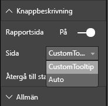

# <a name="power-bi-visuals-tooltips"></a>Knappbeskrivningar för visuella Power BI-objekt

Nu kan visuella objekt utnyttja Power BI:s stöd för knappbeskrivningar. Power BI-knappbeskrivningar hanterar följande interaktioner:

Visa en knappbeskrivning.
Dölj en knappbeskrivning.
Flytta en knappbeskrivning.

Knappbeskrivningar kan visa ett textelement med en rubrik, ett värde med en viss färg och opacitet vid en angiven uppsättning koordinater. Dessa data skickas till API:et. Och Power BI-värden återger knappbeskrivningarna på samma sätt som för inbyggda visuella objekt.

Exempel på knappbeskrivning i BarChart-exemplet.


Knappbeskrivningen ovan visar en kategori och ett värde för en stapel. Den kan utökas för att visa flera värden i en enskild knappbeskrivning.

## <a name="handling-tooltips"></a>Hantera knappbeskrivningar

Knappbeskrivningar hanteras via gränssnittet ITooltipService. Det här gränssnittet används för att meddela värden att en knappbeskrivning måste visas, tas bort eller flyttas.

```typescript
    interface ITooltipService {
        enabled(): boolean;
        show(options: TooltipShowOptions): void;
        move(options: TooltipMoveOptions): void;
        hide(options: TooltipHideOptions): void;
    }
```

Ditt visuella objekt måste lyssna på mushändelserna i det visuella objektet och anropa delegaterna `show()`, `move()` och `hide()` efter behov med lämpligt innehåll som fylls på i `Tooltip****Options`-objekten.
`TooltipShowOptions` och `TooltipHideOptions` definierar i sin tur vad som ska visas och deras beteenden i dessa händelser.
Eftersom de anropen av dessa metoder innefattar användarhändelser, till exempel musrörelser eller touchhändelser, är en bra idé att skapa lyssnare för dessa händelser, som i sin tur anropar `TooltipService`-medlemmarna.
Vårt exempel aggregeras i en klass som heter `TooltipServiceWrapper`.

### <a name="tooltipservicewrapper-class"></a>Klassen TooltipServiceWrapper

Den grundläggande idén bakom den här klassen är att den ska innehålla instansen av `TooltipService`, lyssna på D3-mushändelser över relevanta element och sedan anropa `show()` och `hide()` när det behövs.
Klassen innehåller och hanterar alla relevanta tillstånd och all logik för dessa händelser, främst med inriktning på att samverka med den underliggande D3-koden. D3-gränssnitt och -konvertering behandlas inte i det här dokumentet.

Du hittar den fullständiga exempelkoden på [lagringsplatsen för SampleBarChart](https://github.com/Microsoft/PowerBI-visuals-sampleBarChart/commit/981b021612d7b333adffe9f723ab27783c76fb14)

### <a name="creating-tooltipservicewrapper"></a>Skapa TooltipServiceWrapper

Nu har BarChart-konstruktorn en `tooltipServiceWrapper`-medlem som är instansierad i konstruktorn med `tooltipService`-värdinstansen.

```typescript
        private tooltipServiceWrapper: ITooltipServiceWrapper;

        this.tooltipServiceWrapper = createTooltipServiceWrapper(this.host.tooltipService, options.element);
```

Klassen `TooltipServiceWrapper` innehåller instansen `tooltipService`, och även som D3-rotelement för det visuella objektet och touchparametrarna.

```typescript
    class TooltipServiceWrapper implements ITooltipServiceWrapper {
        private handleTouchTimeoutId: number;
        private visualHostTooltipService: ITooltipService;
        private rootElement: Element;
        private handleTouchDelay: number;

        constructor(tooltipService: ITooltipService, rootElement: Element, handleTouchDelay: number) {
            this.visualHostTooltipService = tooltipService;
            this.handleTouchDelay = handleTouchDelay;
            this.rootElement = rootElement;
        }
        .
        .
        .
    }
```

Metoden `addTooltip` är klassens enda ingångspunkt för att registrera händelselyssnare.

### <a name="addtooltip-method"></a>Metoden addTooltip

```typescript
        public addTooltip<T>(
            selection: d3.Selection<Element>,
            getTooltipInfoDelegate: (args: TooltipEventArgs<T>) => VisualTooltipDataItem[],
            getDataPointIdentity: (args: TooltipEventArgs<T>) => ISelectionId,
            reloadTooltipDataOnMouseMove?: boolean): void {

            if (!selection || !this.visualHostTooltipService.enabled()) {
                return;
            }
        ...
        ...
        }
```

* **selection: d3.Selection<Element>**
* D3-element över vilka knappbeskrivningar hanteras
* **getTooltipInfoDelegate: (args: TooltipEventArgs<T>) => VisualTooltipDataItem[]**
* Delegat för att fylla i knappbeskrivningsinnehållet (vad som ska visas) efter kontext
* **getDataPointIdentity: (args: TooltipEventArgs<T>) => ISelectionId**
* Delegat för att hämta datapunkts-ID:t – används inte i det här exemplet 
* **reloadTooltipDataOnMouseMove?: boolean**
* booleskt värde som anger om knappbeskrivningsdata ska uppdateras under en mouseMove-händelse – används inte i det här exemplet

som du kan se avslutas `addTooltip` utan åtgärd om `tooltipService` är inaktiverad eller om inget val har gjorts.

### <a name="call-of-show-method-to-display-a-tooltip"></a>Anrop av show-metoden för att visa en knappbeskrivning

`addTooltip` lyssnar sedan på D3 `mouseover`-händelsen.

```typescript
        ...
        ...
        selection.on("mouseover.tooltip", () => {
            // Ignore mouseover while handling touch events
            if (!this.canDisplayTooltip(d3.event))
                return;

            let tooltipEventArgs = this.makeTooltipEventArgs<T>(rootNode, true, false);
            if (!tooltipEventArgs)
                return;

            let tooltipInfo = getTooltipInfoDelegate(tooltipEventArgs);
            if (tooltipInfo == null)
                return;

            let selectionId = getDataPointIdentity(tooltipEventArgs);

            this.visualHostTooltipService.show({
                coordinates: tooltipEventArgs.coordinates,
                isTouchEvent: false,
                dataItems: tooltipInfo,
                identities: selectionId ? [selectionId] : [],
            });
        });
```

* **makeTooltipEventArgs**
* Extraherar kontexten från de valda D3-elementen till tooltipEventArgs. Koordinaterna beräknas också.
* **getTooltipInfoDelegate**
* Skapar sedan knappbeskrivningsinnehållet från tooltipEventArgs. Det här är ett återanrop till klassen BarChart eftersom det är det visuella objektets logik. Det är det faktiska textinnehållet som visas i knappbeskrivningen.
* **getDataPointIdentity**
* Används inte i det här exemplet
* **this.visualHostTooltipService.show**
* Anropet för att visa knappbeskrivningen  

Ytterligare hantering finns i exemplet för `mouseout`- och `mousemove`-händelser.

Mer information finns på [lagringsplatsen för SampleBarChart](https://github.com/Microsoft/PowerBI-visuals-sampleBarChart/commit/981b021612d7b333adffe9f723ab27783c76fb14).

### <a name="populating-the-tooltip-content-by-gettooltipdata-method"></a>Fylla i knappbeskrivningsinnehåll med metoden getTooltipData

`BarChart` lades till med medlemmen `getTooltipData` vilket extraherar kategorin, värdet och färgen för datapunkten till ett VisualTooltipDataItem[]-element.

```typescript
        private static getTooltipData(value: any): VisualTooltipDataItem[] {
            return [{
                displayName: value.category,
                value: value.value.toString(),
                color: value.color,
                header: 'ToolTip Title'
            }];
        }
```

I implementeringen ovan är medlemmen `header` konstant, men kan användas för mer komplexa implementeringar som kräver dynamiska värden. Du kan fylla i `VisualTooltipDataItem[]` med fler än ett element, vilket innebär att flera rader läggs till i knappbeskrivningen. Det kan vara användbart i visuella objekt, till exempel liggande stapeldiagram där knappbeskrivningen kan visa data från mer än en enskild datapunkt.

### <a name="calling-addtooltip-method"></a>Anropa metoden addTooltip

Det sista steget är att anropa `addTooltip` när faktiska data kan ha ändrats. Det här anropet sker i metoden `BarChart.update()`. Ett anrop görs för att övervaka val av alla ”bar”-element. Endast `BarChart.getTooltipData()` skickas, som nämnts ovan.

```typescript
        this.tooltipServiceWrapper.addTooltip(this.barContainer.selectAll('.bar'),
            (tooltipEvent: TooltipEventArgs<number>) => BarChart.getTooltipData(tooltipEvent.data),
            (tooltipEvent: TooltipEventArgs<number>) => null);
```

## <a name="adding-report-page-tooltips"></a>Lägga till knappbeskrivningar för rapportsidan

Om du vill lägga till support för knappbeskrivningar för rapportsidan är de flesta ändringarna i capabilities.json.

Ett exempel på ett schema:

```json
{
    "tooltips": {
        "supportedTypes": {
            "default": true,
            "canvas": true
        },
        "roles": [
            "tooltips"
        ]
    }
}
```

Definitionen av knappbeskrivningen för rapportsidan görs i formateringsfönstret.



`supportedTypes` är knappbeskrivningskonfigurationen som stöds av det visuella objektet och visas i fältkällan. `default` anger om "automatisk" knappbeskrivningsbindning via datafält stöds. canvas anger om knappbeskrivningar för rapportsidan stöds.

`roles` är valfritt. Anger, efter att ha definierats, vilka dataroller som ska bindas till det valda knappbeskrivningsalternativet i fältkällan.

Mer information finns i användningsriktlinjerna under [Report Page Tooltips](https://powerbi.microsoft.com/blog/power-bi-desktop-march-2018-feature-summary/#tooltips) (Knappbeskrivningar för rapportsidan)

För att visa knappbeskrivningen för rapportsidan vid anrop av `ITooltipService.Show(options: TooltipShowOptions)` eller `ITooltipService.Move(options: TooltipMoveOptions)` använder Power BI-värden selectionId (`identities`-egenskapen för `options`-argumentet ovan). SelectionId ska representera de data (kategori, serie och så vidare) som ska hämtas för knappbeskrivningen när du hovrar över objektet.

Exempel på hur selectionId skickas till anrop för visning av en knappbeskrivning:

```typescript
    this.tooltipServiceWrapper.addTooltip(this.barContainer.selectAll('.bar'),
        (tooltipEvent: TooltipEventArgs<number>) => BarChart.getTooltipData(tooltipEvent.data),
        (tooltipEvent: TooltipEventArgs<number>) => tooltipEvent.data.selectionID);
```
