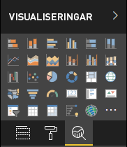

# <a name="the-analytics-pane-in-power-bi-visuals"></a>Fönstret Analys i visuella Power BI-objekt

Fönstret **Analys** introducerades för [inbyggda visuella objekt](https://docs.microsoft.com/power-bi/desktop-analytics-pane) i november 2018.
I den här artikeln diskuteras hur visuella Power BI-objekt med API-version 2.5.0 kan visa och hantera sina egenskaper i fönstret **Analys**.



## <a name="manage-the-analytics-pane"></a>Hantera fönstret Analys

På liknande sätt som du hanterar egenskaper i fönstret [**Format**](https://docs.microsoft.com/power-bi/developer/visuals/custom-visual-develop-tutorial-format-options) hanterar du fönstret **Analys** genom att definiera ett objekt i det visuella objektets *capabilities.json*-fil.

I fönstret **Analys** ser skillnaderna ut så här:

* Under objektets definition lägger du till ett **objectCategory**-fält med värdet 2.

    > [!NOTE]
    > Det valfria fältet `objectCategory` introducerades i API-version 2.5.0. Det definierar vilken aspekt av det visuella objektet som objektet styr (1 = formatering, 2 = analys). `Formatting` används för element såsom utseende och känsla, färger, axlar och etiketter. `Analytics` används för element såsom prognoser, trendlinjer, referenslinjer och former.
    >
    > Om värdet inte anges använder `objectCategory` standardvärdet ”Formatting” (formatering).

* Objektet måste ha följande två egenskaper:
    * `show` av typen `bool` med standardvärdet `false`.
    * `displayName` av typen `text`. Det standardvärde som du väljer blir instansens inledande visningsnamn.

```json
{
  "objects": {
    "YourAnalyticsPropertiesCard": {
      "displayName": "Your analytics properties card's name",
      "objectCategory": 2,
      "properties": {
        "show": {
          "type": {
            "bool": true
          }
        },
        "displayName": {
          "type": {
            "text": true
          }
        },
      ... //any other properties for your Analytics card
      }
    }
  ...
  }
}
```

Du kan definiera andra egenskaper på samma sätt som du gör för **Format**-objekt. Och du kan räkna upp objekt precis som i fönstret **Format**.

## <a name="known-limitations-and-issues-of-the-analytics-pane"></a>Kända begränsningar och problem med fönstret Analys

* Fönstret **Analys** har inget stöd för flera instanser ännu. Objekt kan inte ha en annan [väljare](https://microsoft.github.io/PowerBI-visuals/docs/concepts/objects-and-properties/#selector) än statisk (det vill säga "selector": null), och visuella Power BI-objekt kan inte ha flera användardefinierade instanser av ett kort.
* Egenskaper av typen `integer` visas inte korrekt. Som en tillfällig lösning kan du använda typen `numeric` i stället.

> [!NOTE]
> * Använd endast fönstret **Analys** för objekt som lägger till ny information eller som ger ett nytt perspektiv på den information som visas (till exempel dynamiska referenslinjer som illustrerar viktiga trender).
> * Alla alternativ som styr utseendet och känslan för det visuella objektet (det vill säga formateringen) ska begränsas till fönstret **Formatering**.
