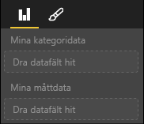

# <a name="capabilities-and-properties-of-power-bi-visuals"></a>Funktioner och egenskaper för visuella Power BI-objekt 

Du använder funktioner för att ge värden information om ditt visuella objekt. Alla egenskaper för funktionsmodellen är `optional`.

Rotobjekten för ett visuellt objekts funktioner är `dataRoles`, `dataViewMappings` och så vidare.

```json
{
    "dataRoles": [ ... ],
    "dataViewMappings": [ ... ],
    "objects":  { ... },
    "supportsHighlight": true|false,
    "advancedEditModeSupport": 0|1|2,
    "sorting": { ... }
}

```

## <a name="define-the-data-fields-that-your-visual-expects-dataroles"></a>Definiera de datafält som förväntas av det visuella objektet: dataRoles

Du använder `dataRoles` för att definiera fält som kan bindas till data. `dataRoles` tar en matris med `DataViewRole`-objekt, som definierar alla obligatoriska egenskaper.

### <a name="properties"></a>Egenskaper

* **name**: Det interna namnet för det här datafältet (måste vara unikt).
* **kind**: Typen av fält:
    * `Grouping`: Diskreta värden som används för att gruppera måttfält.
    * `Measure`: Numeriska datavärden.
    * `GroupingOrMeasure`: Värden som kan användas som antingen en gruppering eller ett mått.
* **displayName**: Det namn som visas för användaren i fönstret **Egenskaper**.
* **description**: En kort beskrivning av fältet (valfritt).
* **requiredTypes**: Den datatyp som krävs för den här datarollen. Värden som inte matchar anges till null (valfritt).
* **preferredTypes**: Den föredragna datatypen för den här datarollen (valfritt).

### <a name="valid-data-types-in-requiredtypes-and-preferredtypes"></a>Giltiga datatyper i requiredTypes och preferredTypes

* **bool**: Ett booleskt värde
* **integer**: Ett heltalsvärde
* **numeric**: Ett numeriskt värde
* **text**: Ett textvärde
* **geography**: Geografiska data

### <a name="example"></a>Exempel

```json
"dataRoles": [
    {
        "displayName": "My Category Data",
        "name": "myCategory",
        "kind": "Grouping",
        "requiredTypes": [
            {
                "text": true
            },
            {
                "numeric": true
            },
            {
                "integer": true
            }
        ],
        "preferredTypes": [
            {
                "text": true
            }
        ]
    },
    {
        "displayName": "My Measure Data",
        "name": "myMeasure",
        "kind": "Measure",
        "requiredTypes": [
            {
                "integer": true
            },
            {
                "numeric": true
            }
        ],
        "preferredTypes": [
            {
                "integer": true
            }
        ]
    },
    {
        "displayNameKey": "Visual_Location",
        "name": "Locations",
        "kind": "Measure",
        "displayName": "Locations",
        "requiredTypes": [
            {
                "geography": {
                    "address": true
                }
            },
            {
                "geography": {
                    "city": true
                }
            },
            {
                "geography": {
                    "continent": true
                }
            },
            {
                "geography": {
                    "country": true
                }
            },
            {
                "geography": {
                    "county": true
                }
            },
            {
                "geography": {
                    "place": true
                }
            },
            {
                "geography": {
                    "postalCode": true
                }
            },
            {
                "geography": {
                    "region": true
                }
            },
            {
                "geography": {
                    "stateOrProvince": true
                }
            }
        ]
    }
]
```

Föregående dataroller skulle skapa de fält som visas i följande bild:



## <a name="define-how-you-want-the-data-mapped-dataviewmappings"></a>Definiera hur du vill att data ska mappas: dataViewMappings

En DataViewMapping-egenskap beskriver hur datarollerna är relaterade till varandra och gör att du kan ange villkorskrav för dem.

De flesta visuella objekt har en enda mappning, men du kan ange flera dataViewMappings. Varje giltig mappning skapar en datavy. 

```json
"dataViewMappings": [
    {
        "conditions": [ ... ],
        "categorical": { ... },
        "table": { ... },
        "single": { ... },
        "matrix": { ... }
    }
]
```

Mer information finns i [Förstå datavymappning i visuella Power BI-objekt](dataview-mappings.md).

## <a name="define-property-pane-options-objects"></a>Definiera alternativ för egenskapsfönster: objects

Objekt beskriver anpassningsbara egenskaper som är associerade med det visuella objektet. Varje objekt kan ha flera egenskaper och varje egenskap har en typ som är associerad med den. Typer refererar till vad egenskapen ska vara. 

```json
"objects": {
    "myCustomObject": {
        "displayName": "My Object Name",
        "properties": { ... }
    }
}
```

Mer information finns i [Objekt och egenskaper för visuella Power BI-objekt](objects-properties.md).

## <a name="handle-partial-highlighting-supportshighlight"></a>Hantera partiell markering: supportsHighlight

Som standard är det här värdet angett till `false`, vilket innebär att dina värden filtreras automatiskt när något på sidan väljs. Den här automatiska filtreringen uppdaterar i sin tur ditt visuella objekt så att endast det valda värdet visas. Om du vill visa fullständiga data, men endast markera de valda objekten, behöver du ange `supportsHighlight` till `true` i filen *capabilities.json*.

Mer information finns i [Markera datapunkter i visuella Power BI-objekt](highlight.md).

## <a name="handle-advanced-edit-mode-advancededitmodesupport"></a>Hantera avancerat redigeringsläge: advancedEditModeSupport

Ett visuellt objekt kan deklarera sitt stöd för avancerat redigeringsläge. Som standard har ett visuellt objekt inte stöd för avancerat redigeringsläge, såvida inget annat anges i filen *capabilities.json*.

Mer information finns i [Avancerat redigeringsläge i visuella Power BI-objekt](advanced-edit-mode.md).

## <a name="data-sorting-options-for-visual-sorting"></a>Datasorteringsalternativ för visuellt objekt: sorting

Ett visuellt objekt kan definiera dess sorteringsbeteende via dess funktioner. Som standard har ett visuellt objekt inte stöd för ändring av sin sorteringsordning, såvida inget annat anges i filen *capabilities.json*.

Mer information finns i [Sorteringsalternativ för visuella Power BI-objekt](sort-options.md).
