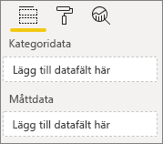
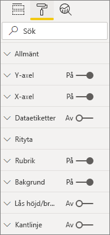
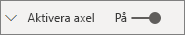
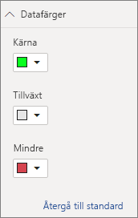

# <a name="build-a-bar-chart"></a>Skapa ett stapeldiagram

Den här artikeln är en steg-för-steg-guide om hur du skapar ett exempel på ett visuellt Power BI-stapeldiagram med kod. Du kan hämta det fullständiga kodexemplet på [https://github.com/Microsoft/PowerBI-visuals-sampleBarChart](https://github.com/Microsoft/PowerBI-visuals-sampleBarChart).

## <a name="view-model"></a>Visa modell
Det är viktigt att definiera stapeldiagrammets visningsmodell först och iterera på vad som exponeras för ditt visuella objekt när du skapar det.

```typescript
/**
 * Interface for BarCharts viewmodel.
 *
 * @interface
 * @property {BarChartDataPoint[]} dataPoints - Set of data points the visual will render.
 * @property {number} dataMax                 - Maximum data value in the set of data points.
 */
interface BarChartViewModel {
    dataPoints: BarChartDataPoint[];
    dataMax: number;
};

/**
 * Interface for BarChart data points.
 *
 * @interface
 * @property {number} value    - Data value for the point.
 * @property {string} category - Corresponding category of the data value.
 */
interface BarChartDataPoint {
    value: number;
    category: string;
};
```

### <a name="use-static-data"></a>Använd statiska data

Att använda statiska data är ett bra sätt att testa ditt visuella objekt utan databindning. Din visningsmodell ändras inte, även när du har lagt till databindning i ett senare steg.

```typescript
let testData: BarChartDataPoint[] = [
    {
        value: 10,
        category: 'a'
    },
    {
        value: 20,
        category: 'b'
    },
    {
        value: 1,
        category: 'c'
    },
    {
        value: 100,
        category: 'd'
    },
    {
        value: 500,
        category: 'e'
    }];

let viewModel: BarChartViewModel = {
    dataPoints: testData,
    dataMax: d3.max(testData.map((dataPoint) => dataPoint.value))
};
```

## <a name="data-binding"></a>Databindning 
Du lägger till databindning genom att definiera dina visuella funktioner i *capabilities.json*. Exempelkoden har redan ett schema som du kan använda.

Databindningen fungerar på en **Fält**källa i Power BI.



### <a name="add-data-roles"></a>Lägg till dataroller
Exempelkoden har redan dataroller, men du kan anpassa dem.

- `displayName` är det namn som visas i **Fält**källan.
- `name` är det interna namnet som används för att referera till datarollen.
- `kind` är för fältets variant. *Grupperings*-fält (0) har diskreta värden. *Mått*-fält (1) har numeriska datavärden.

```json
"dataRoles": [
    {
        "displayName": "Category Data",
        "name": "category",
        "kind": 0
    },
    {
        "displayName": "Measure Data",
        "name": "measure",
        "kind": 1
    }
],
```

Mer information finns i [Dataroller](./capabilities.md#define-the-data-fields-that-your-visual-expects-dataroles).

### <a name="add-conditions-to-dataviewmapping"></a>Lägg till villkor i DataViewMapping
Definiera villkor inom `dataViewMappings` för att ange hur många fält som respektive fältkälla kan binda. Använd datarollens interna `name` för att referera till varje fält.

```json
    "dataViewMappings": [
        {
            "conditions": [
                {
                    "category": {
                        "max": 1
                    },
                    "measure": {
                        "max": 1
                    }
                }
            ],
        }
    ]
```

Mer information finns i [Datavymappning](./dataview-mappings.md).

### <a name="define-and-use-visualtransform"></a>Definiera och använda visualTransform
`DataView` är den struktur som Power BI ger ditt visuella objekt, som innehåller de frågedata som ska visualiseras. `DataView` kan dock tillhandahålla data i olika former, till exempel kategoriska och tabell. Om du vill bygga ett kategoriskt visuellt objekt som ett stapeldiagram, behöver du bara använda egenskapen kategoriska på `DataView`. Genom att definiera `visualTransform` kan du konvertera `DataView` till en vymodell som ditt visuella objekt ska använda.

Om du vill tilldela färger och välja dem när du definierar enskilda datapunkter använder du `IVisualHost`. 

```typescript
/**
 * Function that converts queried data into a view model that will be used by the visual
 *
 * @function
 * @param {VisualUpdateOptions} options - Contains references to the size of the container
 *                                        and the dataView which contains all the data
 *                                        the visual had queried.
 * @param {IVisualHost} host            - Contains references to the host which contains services
 */
function visualTransform(options: VisualUpdateOptions, host: IVisualHost): BarChartViewModel {
    /*Convert dataView to your viewModel*/
}

```

## <a name="color"></a>Färg 
Färgen visas som en av de tjänster som är tillgängliga på `IVisualHost`.

### <a name="add-color-to-data-points"></a>Lägg till färg till datapunkter
Varje datapunkt representeras av en annan färg. Du lägger till färg i gränssnittet för `BarChartDataPoint`.

```typescript
/**
 * Interface for BarChart data points.
 *
 * @interface
 * @property {number} value    - Data value for the point.
 * @property {string} category - Corresponding category of the data value.
 * @property {string} color    - Color corresponding to the data point.
 */
interface BarChartDataPoint {
    value: number;
    category: string;
    color: string;
};
```

### <a name="the-colorpalette-service"></a>colorPalette-tjänsten
Tjänsten `colorPalette` hanterar de färger som används i ditt visuella objekt. Dess instans finns tillgänglig på `IVisualHost`.

### <a name="assign-color-to-data-points"></a>Lägg till färg till datapunkter
Du har definierat `visualTransform` som en konstruktion för att konvertera `dataView` till en vymodell som ett stapeldiagram kan använda. Eftersom du itererar genom datapunkterna i `visualTransform` är det också den perfekta platsen att tilldela färger.

```typescript
let colorPalette: IColorPalette = host.colorPalette; // host: IVisualHost
for (let i = 0, len = Math.max(category.values.length, dataValue.values.length); i < len; i++) {
    barChartDataPoints.push({
        category: category.values[i],
        value: dataValue.values[i],
        color: colorPalette.getColor(category.values[i]).value,
    });
}
```

## <a name="selection-and-interactions"></a>Markeringar och interaktioner
Med markeringar kan användaren interagera både med ditt och andra visuella objekt. 

### <a name="add-selection-to-each-data-point"></a>Lägg till markering för varje datapunkt
Eftersom varje datapunkt är unik, lägger du till markeringen i varje datapunkt. Du lägger till markeringsegenskapen i gränssnittet för `BarChartDataPoint`.

```typescript
/**
 * Interface for BarChart data points.
 *
 * @interface
 * @property {number} value             - Data value for the point.
 * @property {string} category          - Corresponding category of data value.
 * @property {string} color             - Color corresponding to data point.
 * @property {ISelectionId} selectionId - Id assigned to data point for cross filtering
 *                                        and visual interaction.
 */
interface BarChartDataPoint {
    value: number;
    category: string;
    color: string;
    selectionId: ISelectionId;
};
```

### <a name="assign-selection-ids-to-each-data-point"></a>Lägg till markerings-ID för varje datapunkt
Eftersom du itererar genom datapunkterna i `visualTransform` är det också den perfekta platsen att skapa markerings-ID. Värd-variabeln är en `IVisualHost` som innehåller tjänster som det visuella objektet kan använda, till exempel färg- och markeringsverktyget. 

Använd `createSelectionIdBuilder` fabriksmetoden på `IVisualHost` för att skapa ett nytt markerings-ID. Skapa ett nytt markeringsverktyg för varje datapunkt.

Eftersom du bara gör markeringar baserade på kategorin, behöver du bara definiera markeringar `withCategory`.

```typescript
for (let i = 0, len = Math.max(category.values.length, dataValue.values.length); i < len; i++) {
    barChartDataPoints.push({
        category: category.values[i],
        value: dataValue.values[i],
        color: colorPalette.getColor(category.values[i]).value,
        selectionId: host.createSelectionIdBuilder()
            .withCategory(category, i)
            .createSelectionId()
    });
}
```

För mer information, se [Skapa en instans av markeringsverktyget](./selection-api.md#create-an-instance-of-the-selection-builder).

### <a name="interact-with-data-points"></a>Interagera med datapunkter
Du kan interagera med varje stapel i stapeldiagrammet när ett markerings-ID tilldelas till datapunkten. Stapeldiagrammet lyssnar på `click`-händelser.

Använd `selectionManager` fabriksmetoden på `IVisualHost` för att skapa en urvalshanterare för korsfiltrering och rensning av val.

```typescript
let selectionManager = this.selectionManager;

//This must be an anonymous function instead of a lambda because
//d3 uses 'this' as the reference to the element that was clicked.
bars.on('click', function(d) {
    selectionManager.select(d.selectionId).then((ids: ISelectionId[]) => {
        bars.attr({
            'fill-opacity': ids.length > 0 ? BarChart.Config.transparentOpacity : BarChart.Config.solidOpacity
        });

        d3.select(this).attr({
            'fill-opacity': BarChart.Config.solidOpacity
        });
    });

    (<Event>d3.event).stopPropagation();
});
```

Mer information finns i [Så här använder du SelectionManager](./selection-api.md#how-to-use-selectionmanager-to-select-data-points).

## <a name="static-objects"></a>Statiska objekt

Du kan lägga till objekt i fönstret **Egenskap** för att ytterligare anpassa det visuella objektet. Dessa anpassningar kan vara ändringar i användargränssnittet eller ändringar som rör de data som har frågats. Exemplet använder statiska objekt för att rendera X-axeln för stapeldiagrammet.

Du kan aktivera eller inaktivera objekt i fönstret **Egenskap**.



### <a name="define-objects-in-capabilities"></a>Definiera objekt i funktioner
Definiera en `objects`-egenskap i *capabilities.json*-filen för objekt som ska visas i fönstret **Egenskap**.
- `enableAxis` är det interna namnet som `dataView` refererar till. 
- `displayName` är namnet som visas i fönstret **Egenskap**.
- `bool` är ett primitivt värde som vanligtvis används med statiska objekt, till exempel textrutor eller växlar.
- `show` är en särskild egenskap i `properties` som aktiverar växeln `show` för objektet. Eftersom `show` är en växel anges den som en `bool`.



```typescript
"objects": {
    "enableAxis": {
        "displayName": "Enable Axis",
        "properties": {
            "show": {
                "displayName": "Enable Axis",
                "type": { "bool": true }
            }
        }
    }
}
```

Mer information finns i [Objekt](./objects-properties.md).

### <a name="define-property-settings"></a>Definiera egenskapsinställningarna

I följande avsnitt beskrivs de grundläggande principerna för att definiera egenskapsinställningar. Du kan också använda de verktygsklasser som definierats i `powerbi-visuals-utils-dataviewutils`-paketet för att definiera egenskapsinställningar. Mer information finns i dokumentationen och exemplen för klassen [DataViewObjectsParser](https://github.com/Microsoft/powerbi-visuals-utils-dataviewutils/blob/master/docs/api/data-view-objects-parser.md).


Även om det är valfritt, är det bäst att lokalisera de flesta inställningar till ett enda objekt för enkel referens.

```typescript
/**
 * Interface for BarCharts viewmodel.
 *
 * @interface
 * @property {BarChartDataPoint[]} dataPoints - Set of data points the visual will render.
 * @property {number} dataMax                 - Maximum data value in the set of data points.
 * @property {BarChartSettings} settings      - Object property settings
 */
interface BarChartViewModel {
    dataPoints: BarChartDataPoint[];
    dataMax: number;
    settings: BarChartSettings;
};

/**
 * Interface for BarChart settings.
 *
 * @interface
 * @property "show" enableAxis - Object property that allows axis to be enabled.
 */
interface BarChartSettings {
    enableAxis: {
        show: boolean;
    };
}
```

### <a name="define-and-use-objectenumerationutility"></a>Definiera och använda ObjectEnumerationUtility
Objektegenskapsvärden är tillgängliga som metadata på `dataView`, men det finns ingen tjänst för att hämta dessa egenskaper. `ObjectEnumerationUtility` är en uppsättning statiska funktioner som du kan använda för att hämta objektvärden från `dataView` och för andra visuella projekt. `ObjectEnumerationUtility` är valfritt, men det är bra att gå igenom `dataView` för att hämta objektegenskaper.

```typescript
/**
 * Gets property value for a particular object.
 *
 * @function
 * @param {DataViewObjects} objects - Map of defined objects.
 * @param {string} objectName       - Name of desired object.
 * @param {string} propertyName     - Name of desired property.
 * @param {T} defaultValue          - Default value of desired property.
 */
export function getValue<T>(objects: DataViewObjects, objectName: string, propertyName: string, defaultValue: T ): T {
    if(objects) {
        let object = objects[objectName];
        if(object) {
            let property: T = object[propertyName];
            if(property !== undefined) {
                return property;
            }
        }
    }
    return defaultValue;
}
```

Se [objectEnumerationUtility.ts](https://github.com/Microsoft/PowerBI-visuals-sampleBarChart/blob/master/src/objectEnumerationUtility.ts) för källkoden.

### <a name="retrieve-property-values-from-dataview"></a>Hämta egenskapsvärden från dataView
`visualTransform` är den perfekta platsen för att ändra det visuella objektets vymodell. Om du vill fortsätta med det här mönstret hämtar du objektegenskaperna från `dataView`.

Definiera egenskapens standardtillstånd och Använd `getValue` för att hämta egenskapen från `dataView`.

```typescript
let defaultSettings: BarChartSettings = {
    enableAxis: {
        show: false,
    }
};

let barChartSettings: BarChartSettings = {
    enableAxis: {
        show: getValue<boolean>(objects, 'enableAxis', 'show', defaultSettings.enableAxis.show),
    }
}
```

### <a name="populate-property-pane-with-enumerateobjectinstances"></a>Fyll i egenskapsfönstret med enumerateObjectInstances
Den `enumerateObjectInstances` valfria metoden på `IVisual` räknar upp genom alla objekt och placerar dem i **Egenskap**-fönstret. Varje objekt anropas med `enumerateObjectInstances`. Objektets namn är tillgängligt på `EnumerateVisualObjectInstancesOptions`.

För varje objekt definierar du egenskapen med dess aktuella tillstånd.

```typescript
/**
 * Enumerates through the objects defined in the capabilities and adds the properties to the format pane
 *
 * @function
 * @param {EnumerateVisualObjectInstancesOptions} options - Map of defined objects
 */
public enumerateObjectInstances(options: EnumerateVisualObjectInstancesOptions): VisualObjectInstanceEnumeration {
    let objectName = options.objectName;
    let objectEnumeration: VisualObjectInstance[] = [];

    switch(objectName) {
        case 'enableAxis':
            objectEnumeration.push({
                objectName: objectName,
                properties: {
                    show: this.barChartSettings.enableAxis.show,
                },
                selector: null
            });
    };

    return objectEnumeration;
}
```

### <a name="control-property-update-logic"></a>Kontrollera egenskapens uppdateringslogik
När ett objekt läggs till i **Egenskaper**-fönstret utlöser varje växling en uppdatering. Lägg till en specifik objektlogik i `if` block:

```typescript
if(settings.enableAxis.show) {
    let margins = BarChart.Config.margins;
    height -= margins.bottom;
}
```

## <a name="databound-objects"></a>Databundna objekt
Databundna objekt liknar statiska objekt, men hanterar vanligtvis dataurval. Du kan till exempel ändra färgen som är kopplad till datapunkten.



### <a name="define-object-in-capabilities"></a>Definiera objekt i funktioner
På liknande sätt som statiska objekt, definiera ett annat objekt i *capabilities.json*. 
- `colorSelector` är det interna namnet som `dataView` refererar till.
- `displayName` är namnet som visas i fönstret **Egenskap**.
- `fill` är ett strukturellt objektvärde som inte är associerat med en primitiv typ.

```typescript
"colorSelector": {
    "displayName": "Data Colors",
    "properties": {
        "fill": {
            "displayName": "Color",
            "type": {
                "fill": {
                    "solid": {
                        "color": true
                    }
                }
            }
        }
    }
}
```

Mer information finns i [Objekt](./objects-properties.md).

### <a name="use-objectenumerationutility"></a>Använda ObjectEnumerationUtility
Precis som med statiska objekt måste du hämta objektinformation från `dataView`. Men i stället för objektvärden i metadata associeras objektvärdena med varje kategori.

```typescript
/**
 * Gets property value for a particular object in a category.
 *
 * @function
 * @param {DataViewCategoryColumn} category - List of category objects.
 * @param {number} index                    - Index of category object.
 * @param {string} objectName               - Name of desired object.
 * @param {string} propertyName             - Name of desired property.
 * @param {T} defaultValue                  - Default value of desired property.
 */
export function getCategoricalObjectValue<T>(category: DataViewCategoryColumn, index: number, objectName: string, propertyName: string, defaultValue: T): T {
    let categoryObjects = category.objects;

    if(categoryObjects) {
        let categoryObject: DataViewObject = categoryObjects[index];
        if(categoryObject) {
            let object = categoryObject[objectName];
            if(object) {
                let property: T = object[propertyName];
                if(property !== undefined) {
                    return property;
                }
            }
        }
    }
    return defaultValue;
}
```

Se [objectEnumerationUtility.ts](https://github.com/Microsoft/PowerBI-visuals-sampleBarChart/blob/master/src/objectEnumerationUtility.ts) för källkoden.

### <a name="define-default-color-and-retrieve-categorical-object-from-dataview"></a>Definiera standardfärg och hämta kategoriska objekt från dataView
Varje färg är nu associerad med varje kategori i `dataView`. Du kan ställa in varje datapunkt på motsvarande färg.

```typescript
for (let i = 0, len = Math.max(category.values.length, dataValue.values.length); i < len; i++) {
    let defaultColor: Fill = {
        solid: {
            color: colorPalette.getColor(category.values[i]).value
        }
    }

    barChartDataPoints.push({
        category: category.values[i],
        value: dataValue.values[i],
        color: getCategoricalObjectValue<Fill>(category, i, 'colorSelector', 'fill', defaultColor).solid.color,
        selectionId: host.createSelectionIdBuilder()
            .withCategory(category, i)
            .createSelectionId()
    });
}
```

### <a name="populate-property-pane-with-enumerateobjectinstances"></a>Fyll i egenskapsfönstret med enumerateObjectInstances
Använd `enumerateObjectInstances` för att fylla i **Egenskap**-fönstret med objekt. 

För den här instansen lägger du till en färgväljare som återger varje kategori i **Egenskap**-fönstret. Det gör du genom att lägga till ett extra ärende i `switch`-instruktionen för `colorSelector` och iterera genom varje datapunkt med tillhörande färg. 

Urval krävs för att associera färgen med datapunkten.

```typescript
/**
 * Enumerates through the objects defined in the capabilities and adds the properties to the format pane
 *
 * @function
 * @param {EnumerateVisualObjectInstancesOptions} options - Map of defined objects
 */
public enumerateObjectInstances(options: EnumerateVisualObjectInstancesOptions): VisualObjectInstanceEnumeration {
    let objectName = options.objectName;
    let objectEnumeration: VisualObjectInstance[] = [];

    switch(objectName) {
        case 'enableAxis':
            objectEnumeration.push({
                objectName: objectName,
                properties: {
                    show: this.barChartSettings.enableAxis.show,
                },
                selector: null
            });
            break;
        case 'colorSelector':
            for(let barDataPoint of this.barDataPoints) {
                objectEnumeration.push({
                    objectName: objectName,
                    displayName: barDataPoint.category,
                    properties: {
                        fill: {
                            solid: {
                                color: barDataPoint.color
                            }
                        }
                    },
                    selector: barDataPoint.selectionId.getSelector()
                });
            }
            break;
    };

    return objectEnumeration;
}
```

När du har angett en väljare för varje egenskap visas följande `dataView`-objektmatris:


Varje objekt i matrisen `dataViews[0].categorical.categories[0].objects` motsvarar den konkreta kategorin för datauppsättningen.

Funktionen `getCategoricalObjectValue` ger bara ett bekvämt sätt att komma åt egenskaper genom deras kategoriindex. Du måste ange ett `objectName` och `propertyName` som matchar objektet och egenskapen i *capabilities.json*.

## <a name="other-features"></a>Andra funktioner 
Du kan lägga till en kontroll för skjutreglage eller knappbeskrivningar i stapeldiagrammet. Information om koden som ska läggas till finns i incheckningarna vid [Lägga till ett skjutreglage för egenskapsfönster för att kontrollera opacitet](https://github.com/Microsoft/PowerBI-visuals-sampleBarChart/commit/e2e0bc5888d9a3ca305a7a7af5046068645c8b30) och [Lägga till stöd för knappbeskrivningar](https://github.com/Microsoft/PowerBI-visuals-sampleBarChart/commit/981b021612d7b333adffe9f723ab27783c76fb14). Mer information om knappbeskrivningar finns i [Knappbeskrivningar i visuella Power BI-objekt](./add-tooltips.md).

## <a name="packaging"></a>Paketering

Innan du kan läsa in ditt visuella objekt i [Power BI Desktop](https://powerbi.microsoft.com/desktop/) eller dela det med communityn i [Power BI-galleriet för visuella objekt](https://visuals.powerbi.com/) måste du paketera det. Gå till rotmappen för det visuella projektet som innehåller filen *pbiviz.json*och använd följande kommando för att skapa en *pbiviz*-fil:

```bash
pbiviz package
```
Det här kommandot skapar en *pbiviz*-fil i katalogen *dist/* i det visuella projektet, och skriver över alla *pbiviz*-filer från tidigare paketåtgärder.

## <a name="next-steps"></a>Nästa steg
Du kan lägga till följande förmågor i ditt visuella objekt:
* [Lägga till en snabbmeny i ett visuellt objekt](./context-menu.md)
* [Landningssida](./landing-page.md)
* [Start-URL](./launch-url.md)
* [Språkstöd](./localization.md)