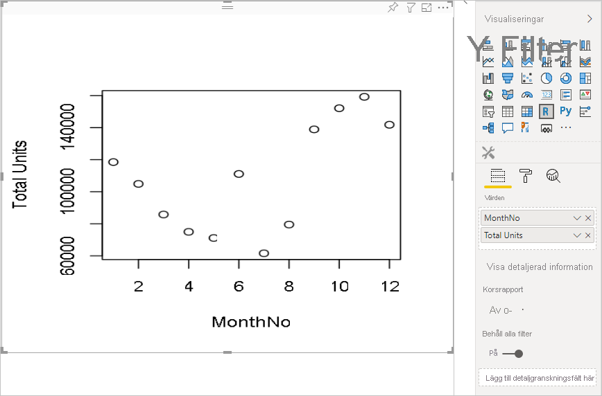
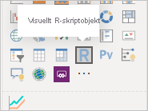
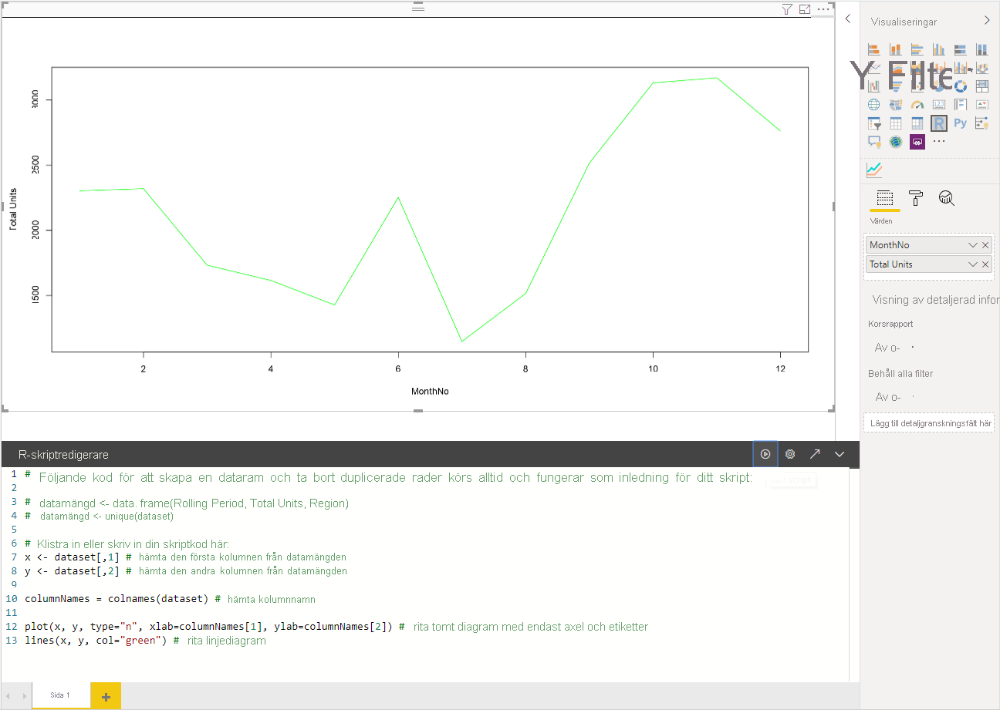
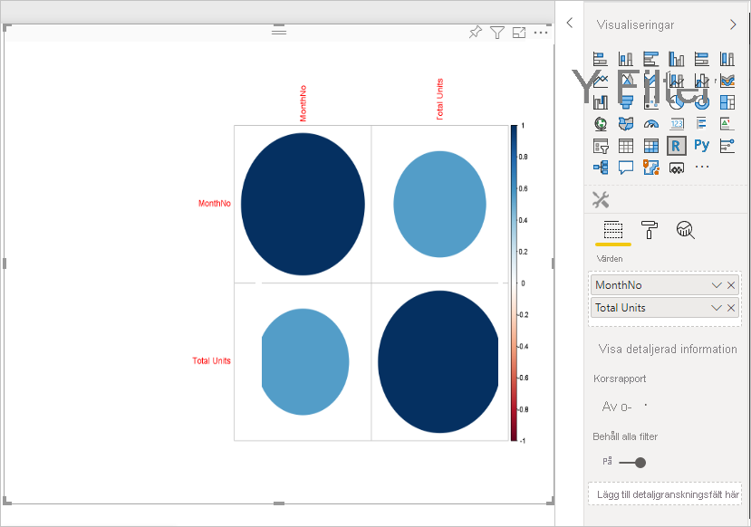
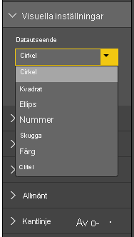
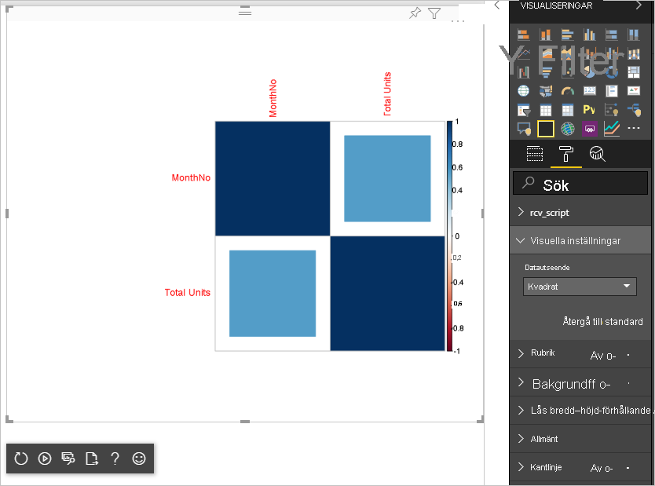

# <a name="tutorial-create-an-r-powered-power-bi-visual"></a>Självstudie: Skapa R-baserade visuella objekt för Power BI

I den här självstudien beskriver vi hur du skapar ett R-baserat visuellt objekt för Power BI.

I de här självstudierna får du lära dig att

> [!div class="checklist"]
>
> * Skapa R-baserade visuella objekt
> * Redigera ett R-skript i Power BI Desktop.
> * Lägga till bibliotek i det visuella objektet
> * Lägg till en statisk egenskap

## <a name="prerequisites"></a>Förutsättningar

* Ett **Power BI Pro**-konto. [Registrera dig för en kostnadsfri utvärderingsversion](https://powerbi.microsoft.com/pricing/) innan du börjar.
* R-motorn. Du kan hämta R kostnadsfritt från flera platser, inklusive [nedladdningssidan för Revolution Open](https://mran.revolutionanalytics.com/download/) och [CRAN Repository](https://cran.r-project.org/bin/windows/base/). Läs mer i [Skapa visuella Power BI-objekt med R](../../desktop-r-visuals.md).
* [Power BI Desktop](../../fundamentals/desktop-get-the-desktop.md).
* [Windows PowerShell](https://docs.microsoft.com/powershell/scripting/install/installing-windows-powershell?view=powershell-6) version 4 eller senare för Windows-användare ELLER [Terminal](https://macpaw.com/how-to/use-terminal-on-mac) för OSX-användare.

## <a name="getting-started"></a>Kom igång

1. Förbered exempeldata för det visuella objektet. Du kan spara dessa värden till en Excel-databas eller *.csv*-fil och importera den till Power BI Desktop.

    | MonthNo | Totalt antal enheter |
    |-----|-----|
    | 1 | 2303 |
    | 2 | 2319 |
    | 3 | 1732 |
    | 4 | 1615 |
    | 5 | 1427 |
    | 6 | 2253 |
    | 7 | 1147 |
    | 8 | 1515 |
    | 9 | 2516 |
    | 10 | 3131 |
    | 11 | 3170 |
    | 12 | 2762 |

1. Om du vill skapa ett visuellt objekt öppnar du PowerShell eller Terminal och kör följande kommando:

   ```cmd
   pbiviz new rVisualSample -t rvisual
   ```

   Det här kommandot skapar en ny mappstruktur baserat på `rvisual`-mallen. Den här mallen innehåller ett grundläggande, användarklart R-baserat visuellt objekt som kör följande R-skript:

   ```r
   plot(Values)
   ```

   Dataramen `Values` kommer att innehålla kolumner i `Values`-datarollen.

1. Tilldela data till det visuella objektet för utvecklare genom att lägga till **Månadsnr** och **Totalt antal enheter** i **Värden**  för det visuella objektet.

   

## <a name="editing-the-r-script"></a>Redigera R-skriptet

När du använder `pbiviz` för att skapa det R-baserade visuella objektet baserat på `rvisual`-mallen skapas en fil med namnet *script.R* i rotmappen för det visuella objektet. Den här filen innehåller R-skriptet som körs för att generera avbildningen för en användare. Du kan skapa ett R-skript i Power BI Desktop.

1. I Power BI Desktop väljer du det **visuella R-skriptobjektet**:

   

1. Klistra in den här R-koden i **R-skriptredigeraren**:

    ```r
    x <- dataset[,1] # get the first column from dataset
    y <- dataset[,2] # get the second column from dataset

    columnNames = colnames(dataset) # get column names

    plot(x, y, type="n", xlab=columnNames[1], ylab=columnNames[2]) # draw empty plot with axis and labels only
    lines(x, y, col="green") # draw line plot
    ```

1. Välj ikonen **Kör skript** för att se resultatet.

    

1. När R-skriptet är klart kopierar du det till `script.r`-filen i det visuella projektet som skapats något av de föregående stegen.

1. Ändra `name` för `dataRoles` i *capabilities-json* till `dataRoles`. Power BI överför data som `dataset` dataramobjekt för det visuella R-skriptobjektet, men det visuella R-skriptobjektet hämtar dataramnamnet enligt `dataRoles`-namn.

    ```json
    {
      "dataRoles": [
        {
          "displayName": "Values",
          "kind": "GroupingOrMeasure",
          "name": "dataRoles"
        }
      ],
      "dataViewMappings": [
        {
          "scriptResult": {
            "dataInput": {
              "table": {
                "rows": {
                  "select": [
                    {
                      "for": {
                        "in": "dataset"
                      }
                    }
                  ],
                  "dataReductionAlgorithm": {
                    "top": {}
                  }
                }
              }
            },
            ...
          }
        }
      ],
    }
    ```

1. Lägg till följande kod för att ge stöd för att ändra storlek på bilden i filen *src/visual.ts*.

    ```typescript
      public onResizing(finalViewport: IViewport): void {
          this.imageDiv.style.height = finalViewport.height + "px";
          this.imageDiv.style.width = finalViewport.width + "px";
          this.imageElement.style.height = finalViewport.height + "px";
          this.imageElement.style.width = finalViewport.width + "px";
      }
    ```

## <a name="add-libraries-to-visual-package"></a>Lägg till bibliotek i ett visuellt paket

Med den här proceduren kan ditt visuella objekt använda `corrplot`-paketet.

1. Lägg till biblioteksberoendet för ditt visuella objekt i `dependencies.json`. Här är ett exempel på filinnehållet:

    ```json
    {
      "cranPackages": [
        {
          "name": "corrplot",
          "displayName": "corrplot",
          "url": "https://cran.r-project.org/web/packages/corrplot/"
        }
      ]
    }
    ```

    `corrplot`-paketet är en grafiskvisning av en korrelationsmatris. Mer information om `corrplot` finns i [En introduktion till corrplot-paket](https://cran.r-project.org/web/packages/corrplot/vignettes/corrplot-intro.html).

1. Börja använda paketet i `script.r`-filen när du har gjort dessa ändringar.

    ```r
    library(corrplot)
    corr <- cor(dataset)
    corrplot(corr, method="circle", order = "hclust")
    ```

Resultatet av att använda `corrplot`-paketet ser ut som i det här exemplet:



## <a name="adding-a-static-property-to-the-property-pane"></a>Lägga till en statisk egenskap i egenskapsfönstret

Gör det möjligt för användare att ändra gränssnittsinställningar. Det gör du genom att lägga till egenskaper i egenskapsfönstret som ändrar det användarbaserade beteendet för R-skriptet.

Du kan konfigurera `corrplot` med hjälp av argumentet `method` för funktionen `corrplot`. Standardskriptet använder en cirkel. Ändra ditt visuella objekt så att användaren kan välja mellan flera alternativ.

1. Definiera objektet och egenskapen i filen *capabilities.json*. Använd sedan det här objektnamnet i uppräkningsmetoden för att hämta dessa värden från egenskapsfönstret.

    ```json
    {
      "settings": {
      "displayName": "Visual Settings",
      "description": "Settings to control the look and feel of the visual",
      "properties": {
        "method": {
          "displayName": "Data Look",
          "description": "Control the look and feel of the data points in the visual",
          "type": {
            "enumeration": [
              {
                "displayName": "Circle",
                "value": "circle"
              },
              {
                "displayName": "Square",
                "value": "square"
              },
              {
                "displayName": "Ellipse",
                "value": "ellipse"
              },
              {
                "displayName": "Number",
                "value": "number"
              },
              {
                "displayName": "Shade",
                "value": "shade"
              },
              {
                "displayName": "Color",
                "value": "color"
              },
              {
                "displayName": "Pie",
                "value": "pie"
              }
            ]
          }
        }
      }
    }
    ```

1. Öppna filen *settings.ts*. Skapa en `CorrPlotSettings`-klass med egenskapen offentlig `method`. Typen är `string` och standardvärdet är `circle`. Lägg till egenskapen `settings` i `VisualSettings`-klassen med standardvärdet:

    ```typescript
    "use strict";

    import { dataViewObjectsParser } from "powerbi-visuals-utils-dataviewutils";
    import DataViewObjectsParser = dataViewObjectsParser.DataViewObjectsParser;

    export class VisualSettings extends DataViewObjectsParser {
      public rcv_script: rcv_scriptSettings = new rcv_scriptSettings();
      public settings: CorrPlotSettings = new CorrPlotSettings();
    }

    export class CorrPlotSettings {
      public method: string = "circle";
    }

    export class rcv_scriptSettings {
      public provider;
      public source;
    }
    ```

    Efter de här stegen kan du ändra egenskapen för det visuella objektet.

   

    Slutligen måste R-skriptet börja med en egenskap. Om användaren inte ändrar egenskapen får det visuella objektet inget värde för den här egenskapen.

    För R Runtime-variabler för egenskaperna är namngivningskonventionen `<objectname>_<propertyname>`, i det här fallet `settings_method`.

1. Ändra R-skriptet i ditt visuella objekt så att det matchar följande kod:

    ```r
    library(corrplot)
    corr <- cor(dataset)

    if (!exists("settings_method"))
    {
        settings_method = "circle";
    }

    corrplot(corr, method=settings_method, order = "hclust")
    ```

Det slutgiltiga visuella objektet ser ut som i följande exempel:



## <a name="next-steps"></a>Nästa steg

Mer information om R-baserade visuella objekt finns i [Använda R-baserade visuella Power BI-objekt i Power BI](../../desktop-r-powered-custom-visuals.md).

Läs mer om hur du skapar R-baserade visuella objekt i [Skapa visuella Power BI-objekt med R](../../desktop-r-visuals.md).
