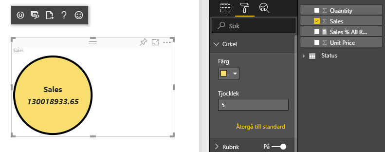
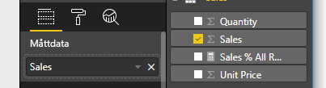

# <a name="tutorial-create-a-react-based-visual"></a>Självstudie: Skapa ett React-baserat visuellt objekt

I den här självstudien beskrivs hur du skapar ett visuellt Power BI-objekt med [React](https://reactjs.org/). Det visuella objektet visar ett värde i en cirkel. Det visuella objektet har anpassad storlek och inställningar för att anpassa den. Med informationen i den här artikeln kan du skapa egna visuella Power BI-objekt med React.



I de här självstudierna får du lära dig att

> [!div class="checklist"]
>
> * Ställt in din utvecklingsmiljö
> * Skapa ett visuellt React-objekt
> * Konfigurera funktioner för det visuella objektet
> * Rendera från Power BI
> * Ändra storlek på det visuella objektet
> * Gör det visuella objektet anpassningsbart

## <a name="prerequisites"></a>Förutsättningar

* Ett **Power BI Pro**-konto. [Registrera dig för en kostnadsfri utvärderingsversion](https://powerbi.microsoft.com/pricing/) innan du börjar.
* [Visual Studio Code](https://www.visualstudio.com/).
* [Windows PowerShell](https://docs.microsoft.com/powershell/scripting/install/installing-windows-powershell?view=powershell-6) version 4 eller senare för Windows-användare ELLER [Terminal](https://macpaw.com/how-to/use-terminal-on-mac) för OSX-användare.
* En miljö som den beskrivs i [Konfigurera utvecklingsmiljön](custom-visual-develop-tutorial.md#setting-up-the-developer-environment).

## <a name="getting-started"></a>Kom igång

Börja genom att skapa ett minimalt visuellt Power BI-objekt med `pbiviz`. Mer information om projekt och projektstruktur finns i [Struktur för visuellt Power BI-objekt](visual-project-structure.md). Den fullständiga källkoden för det här visuella objektet finns i [Cirkelkort visuellt React-objekt](https://github.com/Microsoft/powerbi-visuals-circlecard-react).

Du kan klona eller ladda ned den fullständiga källkoden för det visuella objektet från [GitHub](https://github.com/Microsoft/powerbi-visuals-circlecard-react).

1. Starta PowerShell och kör följande kommando:

   ```powershell
   pbiviz new ReactCircleCard
   ```

   Kommandot skapar en mapp med namnet *ReactCircleCard*.

1. Ändra kataloger till den mappen och öppna Visual Studio Code.

   ```powershell
   cd ./ReactCircleCard
   code .
   ```

1. Starta utvecklingsservern för ditt visuella objekt.

   ```powershell
   pbiviz start
   ```

   

Detta grundläggande visuella objekt representerar uppdateringsantalet. Låt oss omvandla det till ett cirkelkort i nästa steg.

## <a name="change-the-visual-to-a-circle-card"></a>Ändra det visuella objektet till ett cirkelkort

Det här grundläggande visuella objektet representerar ett uppdateringsantal. Därefter transformerar du det till ett cirkelkort som representerar ett mått och dess rubrik.

1. Kör följande kommando för att installera nödvändiga beroenden:

   ```powershell
   npm i react react-dom
   ```

1. Kör följande kommando för att installera React 16 och motsvarande versioner av `react-dom` och skriv:

   ```powershell
   npm i @types/react @types/react-dom
   ```

1. Skapa en React-komponentklass. I Visual Studio Code väljer du **Arkiv** > **Ny fil**. Kopiera följande kod till filen.

    ```typescript
    import * as React from "react";

    export class ReactCircleCard extends React.Component<{}>{
        render(){
            return (
                <div className="circleCard">
                    Hello, React!
                </div>
            )
        }
    }

    export default ReactCircleCard;
    ```

1. Välj **Spara som**. Gå till *src*-katalogen. Ange namnet *komponent*. För **Spara som-typ**, väljer du **TypeScript React**.

1. Öppna *src/visual.ts*. Byt ut koden med följande exempelkod:

    ```typescript
    "use strict";
    import powerbi from "powerbi-visuals-api";

    import DataView = powerbi.DataView;
    import VisualConstructorOptions = powerbi.extensibility.visual.VisualConstructorOptions;
    import VisualUpdateOptions = powerbi.extensibility.visual.VisualUpdateOptions;
    import IVisual = powerbi.extensibility.visual.IVisual;

    import "./../style/visual.less";

    export class Visual implements IVisual {

        constructor(options: VisualConstructorOptions) {

        }

        public update(options: VisualUpdateOptions) {

        }
    }
    ```

1. Importera React-beroenden och den komponent som du nyss lade till.

    ```typescript
    import * as React from "react";
    import * as ReactDOM from "react-dom";
    ...
    import ReactCircleCard from "./component";
    ```

   Standard Power BI TypeScript-inställningarna tar inte React *tsx*-filer. Visual Studio Code markerar `component` som ett fel.

1. Öppna filen *tsconfig.json* och lägg till två rader i början av `compilerOptions`-objektet.

    ```json
    {
      "compilerOptions": {
        "jsx": "react",
        "types": ["react", "react-dom"],
        //...
      }
    }
    ```

   Felet på `component` borde vara borta.

   Rendera komponenten genom att lägga till HTML-målelementet. Det här elementet är `HTMLElement` i `VisualConstructorOptions`, vilket skickas till konstruktorn.

1. Ändra `Visual`-klassen som i följande kod:

    ```typescript
      private target: HTMLElement;
      private reactRoot: React.ComponentElement<any, any>;

      constructor(options: VisualConstructorOptions) {
          this.reactRoot = React.createElement(ReactCircleCard, {});
          this.target = options.element;

          ReactDOM.render(this.reactRoot, this.target);
      }
    ```

1. Spara ändringarna och kör den befintliga koden med hjälp av det här kommandot:

    ```bash
    pbiviz start
    ```

   > [!NOTE]
   > Om du tidigare körde `pbiviz` måste du starta om den för att tillämpa ändringarna i *tsconfig.json*.

  

## <a name="configure-capabilities"></a>Konfigurera funktioner

Du kan konfigurera funktionerna för det visuella objektet.

1. Öppna `capabilities.json`. Ta bort `Category Data`-objektet från `dataRoles`. `ReactCircleCard` visar ett enda värde, så vi behöver bara `Measure Data`. `dataRoles`-nyckeln ser nu ut så här:

    ```json
    "dataRoles": [
        {
            "displayName": "Measure Data",
            "name": "measure",
            "kind": "Measure"
        }
    ],
    ```

1. Ta bort allt innehåll i `objects`-nyckeln. Du fyller i det senare.

    ```json
        "objects": {},
    ```

1. Kopiera följande kod för `dataViewMappings`-egenskapen. Värdet för `max: 1` innebär att det bara går att skicka en måttkolumn.

    ```json
        "dataViewMappings": [
            {
                "conditions": [
                    {
                        "measure": {
                            "max": 1
                        }
                    }
                ],
                "single": {
                    "role": "measure"
                }
            }
        ]
    ```

Nu kan du hämta data från `Fields`-fönstret till inställningarna för det visuella objektet.



## <a name="receive-properties-from-power-bi"></a>Ta emot egenskaper från Power BI

Du kan rendera data med hjälp av React. Komponenten kan visa data från sitt eget tillstånd.

1. Ändra *src/component.tsx*.

    ```javascript
    export interface State {
        textLabel: string,
        textValue: string
    }

    export const initialState: State = {
        textLabel: "",
        textValue: ""
    }

    export class ReactCircleCard extends React.Component<{}, State>{
        constructor(props: any){
            super(props);
            this.state = initialState;
        }

        render(){
            const { textLabel, textValue } = this.state;

            return (
                <div className="circleCard">
                    <p>
                        {textLabel}
                        <br/>
                        <em>{textValue}</em>
                    </p>
                </div>
            )
        }
    }
    ```

1. Lägg till format för ny markering genom att redigera *styles/visual.less*.

    ```css
    .circleCard {
        position: relative;
        box-sizing: border-box;
        border: 1px solid #000;
        border-radius: 50%;
        width: 200px;
        height: 200px;
    }

    p {
        text-align: center;
        line-height: 30px;
        font-size: 20px;
        font-weight: bold;

        position: relative;
        top: -30px;
        margin: 50% 0 0 0;
    }
    ```

1. Visuella objekt tar emot aktuella data som ett argument för metoden `update`. Öppna *src/visual.ts* och lägg till koden i `ReactCircleCard.update`.

    ```typescript
    //...
    import { ReactCircleCard, initialState } from "./component";
    //...

    export class Visual implements IVisual {
        //...
        public update(options: VisualUpdateOptions) {

            if(options.dataViews && options.dataViews[0]){
                const dataView: DataView = options.dataViews[0];

                ReactCircleCard.update({
                    textLabel: dataView.metadata.columns[0].displayName,
                    textValue: dataView.single.value.toString()
                });
            }
            } else {
                this.clear();
            }
        }

        private clear() {
            ReactCircleCard.update(initialState);
        }
    }
    ```

    Koden väljer `textLabel` och `textValue` från `DataView` och uppdaterar komponentens tillstånd om data finns.

1. Om du vill skicka uppdateringar till komponentinstansen, infogar du följande kod i `ReactCircleCard`-klassen:

    ```typescript
        private static updateCallback: (data: object) => void = null;

        public static update(newState: State) {
            if(typeof ReactCircleCard.updateCallback === 'function'){
                ReactCircleCard.updateCallback(newState);
            }
        }

        public state: State = initialState;

        public componentWillMount() {
            ReactCircleCard.updateCallback = (newState: State): void => { this.setState(newState); };
        }

        public componentWillUnmount() {
            ReactCircleCard.updateCallback = null;
        }
    ```

1. Testa det visuella objektet. Kontrollera att `pbiviz start` har körts och spara alla filer. Uppdatera det visuella objektet.

   

## <a name="make-component-resizable"></a>Gör att komponenten kan ändras storlek på

I det här avsnittet ska göra så komponenten kan ändras storlek på. För tillfället har komponenten fast bredd och höjd.

Hämta den aktuella storleken för det visuella visningsområdet från `options`-objektet.

1. Öppna *src/visual.ts*. Importera `IViewport`-gränssnittet och lägg till egenskapen `viewport` i klassen `visual`.

    ```typescript
    import IViewport = powerbi.IViewport;

    //...

    export class Visual implements IVisual {
        private viewport: IViewport;
        //...
    }
    ```

1. Lägg till följande kod i `update`-metoden för `visual`.

    ```typescript
      if (options.dataViews && options.dataViews[0]) {
          const dataView: DataView = options.dataViews[0];

          this.viewport = options.viewport;
          const { width, height } = this.viewport;
          const size = Math.min(width, height);

          ReactCircleCard.update({
              size,
              //...
          });
      }
    ```

1. Lägg till egenskaper i `State`-gränssnittet i *src/component.tsx*.

    ```typescript
    export interface State {
        //...
        size: number
    }

    const initialState: State = {
        //...
        size: 200
    }
    ```

1. Gör följande ändringar i `render`-metoden i *src/component.tsx*:

    ```typescript
        render() {
            const { textLabel, textValue, size } = this.state;

            const style: React.CSSProperties = { width: size, height: size };

            return (
                <div className="circleCard" style={style}>
                    {/* ... */}
                </div>
            )
        }
    ```

1. Byt ut reglerna `width` och `height` i *style/visual.less* med `min-width` och `min-height`.

    ```css
        min-width: 200px;
        min-height: 200px;
    ```

Nu kan du ändra storlek på visningsområdet. Cirkelns diameter motsvarar minsta storlek som bredd eller höjd.

## <a name="make-your-power-bi-visual-customizable"></a>Gör ditt visuella Power BI-objekt anpassningsbart

I det här avsnittet gör du det visuella objektet anpassningsbart.

1. Öppna *capabilities.json*. Lägg till följande inställningar till `objects`-egenskapen.

    ```json
    //...
        "objects": {
            "circle": {
                "displayName": "Circle",
                "properties": {
                    "circleColor": {
                        "displayName": "Color",
                        "description": "The fill color of the circle.",
                        "type": {
                            "fill": {
                                "solid": {
                                    "color": true
                                }
                            }
                        }
                    },
                    "circleThickness": {
                        "displayName": "Thickness",
                        "description": "The circle thickness.",
                        "type": {
                            "numeric": true
                        }
                    }
                }
            }
        },
    //...
    ```

1. Byt ut befintlig kod i *src/settings.ts* mot den här koden:

    ```typescript
    "use strict";

    import { dataViewObjectsParser } from "powerbi-visuals-utils-dataviewutils";
    import DataViewObjectsParser = dataViewObjectsParser.DataViewObjectsParser;

    export class CircleSettings {
        public circleColor: string = "white";
        public circleThickness: number = 2;
    }

    export class VisualSettings extends DataViewObjectsParser {
        public circle: CircleSettings = new CircleSettings();
    }
    ```

1. Lägg till dessa `import`-satser överst i *src/visual.ts*:

    ```typescript
    import VisualObjectInstance = powerbi.VisualObjectInstance;
    import EnumerateVisualObjectInstancesOptions = powerbi.EnumerateVisualObjectInstancesOptions;
    import VisualObjectInstanceEnumerationObject = powerbi.VisualObjectInstanceEnumerationObject;

    import { VisualSettings } from "./settings";

    ```

1. Lägg till `enumerateObjectInstances`-metoden i *src/visual.ts*. Den här metoden används för att tillämpa visuella inställningar.

    ```typescript
    export class Visual implements IVisual {
        private settings: VisualSettings;

        //...

        public enumerateObjectInstances(
            options: EnumerateVisualObjectInstancesOptions
        ): VisualObjectInstance[] | VisualObjectInstanceEnumerationObject {

            return VisualSettings.enumerateObjectInstances(this.settings || VisualSettings.getDefault(), options);
        }
    }
    ```

1. Lägg till kod så att `dataView`-objektet nu kan ta emot inställningar.

    ```typescript
        public update(options: VisualUpdateOptions) {

            if(options.dataViews && options.dataViews[0]){
                //...
                this.settings = VisualSettings.parse(dataView) as VisualSettings;
                const object = this.settings.circle;

                ReactCircleCard.update({
                    borderWidth: object && object.circleThickness ? object.circleThickness : undefined,
                    background: object && object.circleColor ? object.circleColor : undefined,
                    //...
                });
            }
        }
    }
    ```

1. Tillämpa motsvarande ändringar på *src/component.tsx*, genom att först lägga till dessa värden i `State`:

    ```typescript
    export interface State {
        //...
        background?: string,
        borderWidth?: number
    }
    ```

1. Lägg därefter till följande kod i `render`-metoden:

    ```typescript
        const { /*...*/ background, borderWidth } = this.state;

        const style: React.CSSProperties = { /*...*/ background, borderWidth };
    ```

    

## <a name="next-steps"></a>Nästa steg

Mer information om Power BI-utveckling finns i [Riktlinjer för visuella Power BI-objekt](guidelines-powerbi-visuals.md) och [Visuella objekt i Power BI](power-bi-visuals-concept.md).