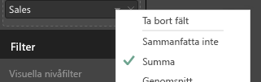
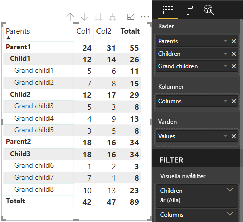

# <a name="data-view-mappings-in-power-bi-visuals"></a>Datavymappningar i visuella objekt för Power BI

`dataViewMappings` beskriver hur datarollerna är relaterade till varandra och gör att du kan ange villkorskrav för dem.
Det finns ett avsnitt för var och en av `dataMappings`.

Varje giltig mappning skapar en `DataView`, men för närvarande går det bara att utföra en fråga per visuellt objekt så i de flesta fall får du bara en `DataView`. Men du kan ange flera datamappningar med olika villkor. Exempel:

```json
"dataViewMappings": [
    {
        "conditions": [ ... ],
        "categorical": { ... },
        "single": { ... },
        "table": { ... },
        "matrix": { ... }
    }
]
```

> [!NOTE]
> Observera att Power BI endast skapar en mappning till en DataView om den giltiga mappningen definieras i `dataViewMappings`.

Om `categorical` definieras i `dataViewMappings` men andra mappningar som `table`, `single` med flera inte gör det som i följande exempel:
```json
"dataViewMappings": [
    {
        "categorical": { ... }
    }
]
```

skapar Power BI en `DataView` med en enda `categorical`-mappning (`table` och andra mappningar blir `undefined`):
```javascript
{
    "categorical": {
        "categories": [ ... ],
        "values": [ ... ]
    },
    "metadata": { ... }
}
```

## <a name="conditions"></a>Villkor

Beskriver villkoren för en viss datamappning. Du kan ange flera uppsättningar med villkor, och om data matchar någon av de beskrivna villkorsuppsättningarna kommer det visuella objektet att acceptera dessa data som giltiga.

För närvarande kan du ange ett minsta och ett högsta värde för varje fält. Det representerar antalet fält som kan bindas till den datarollen. 

> [!NOTE]
> Om en dataroll utelämnas i villkoret kan den ha valfritt antal fält.

### <a name="example-1"></a>Exempel 1

Du kan dra flera fält till varje dataroll. I det här exemplet begränsar vi kategorin till ett datafält och mått till två datafält.

```json
"conditions": [
    { "category": { "max": 1 }, "y": { "max": 2 } },
]
```

### <a name="example-2"></a>Exempel 2

I det här exemplet krävs ett av två villkor. Antingen exakt ett kategoridatafält och exakt två mått, eller exakt två kategorier och exakt ett mått.

```json
"conditions": [
    { "category": { "min": 1, "max": 1 }, "measure": { "min": 2, "max": 2 } },
    { "category": { "min": 2, "max": 2 }, "measure": { "min": 1, "max": 1 } }
]
```

## <a name="single-data-mapping"></a>Enkel datamappning

Enkel datamappning är den enklaste formen av datamappning. Den accepterar ett enda måttfält och ger den totala summan. Om fältet är numeriskt får du summan. Annars får du antalet unika värden.

Om du vill använda enkel datamappning måste du definiera namnet på den dataroll som du vill mappa. Den här mappningen fungerar bara med ett enda måttfält. Om du tilldelar ytterligare ett fält skapas ingen datavy. Därför är det också bra att ta med ett villkor som begränsar data till ett enda fält.

> [!NOTE]
> Den här datamappningen kan inte användas tillsammans med andra datamappningar. Den är avsedd att minska data till ett enda numeriskt värde.

### <a name="example-3"></a>Exempel 3

```json
"dataViewMappings": {
    "conditions": [
        { "Y": { "max": 1 } }
    ],
    "single": {
        "role": "Y"
    }
}  
```

Den resulterande datavyn kommer fortfarande att innehålla de andra typerna (tabell, kategorisk och så vidare), men varje mappning kommer bara att innehålla det enskilda värdet. Bästa praxis är att bara komma åt värdet i ”single”.

```JSON
{
    "dataView": [
        {
            "metadata": null,
            "categorical": null,
            "matrix": null,
            "table": null,
            "tree": null,
            "single": {
                "value": 94163140.3560001
            }
        }
    ]
}
```

## <a name="categorical-data-mapping"></a>Kategorisk datamappning

Kategorisk datamappning används för att hämta en eller två oberoende grupper av data.

### <a name="example-4"></a>Exempel 4

Här är definitionen från vårt föregående exempel med DataRoles.

```json
"dataRole":[
    {
        "displayName": "Category",
        "name": "category",
        "kind": "Grouping"
    },
    {
        "displayName": "Y Axis",
        "name": "measure",
        "kind": "Measure"
    }
]
```

Och nu för mappningen:

```json
"dataViewMappings": {
    "categorical": {
        "categories": {
            "for": { "in": "category" }
        },
        "values": {
            "select": [
                { "bind": { "to": "measure" } }
            ]
        }
    }
}
```

Det är ett enkelt exempel som kan utläsas på följande sätt: ”Mappa min `category`-DataRole så att för varje fält jag drar till `category` så mappas dess data till `categorical.categories`. Mappa även min `measure`-DataRole till `categorical.values`.”

* **for...in** – För alla objekt i den här datarollen, ta med dessa i datafrågan.
* **bind...to** – Ger samma resultat som ”for...in”, men denna DataRole förväntas ha ett villkor som begränsar den till ett enda fält.

### <a name="example-5"></a>Exempel 5

I det här exemplet använder vi de två första DataRoles från det föregående exemplet och definierar även `grouping` och `measure2`.

```json
"dataRole":[
    {
        "displayName": "Category",
        "name": "category",
        "kind": "Grouping"
    },
    {
        "displayName": "Y Axis",
        "name": "measure",
        "kind": "Measure"
    },
    {
        "displayName": "Grouping with",
        "name": "grouping",
        "kind": "Grouping"
    },
    {
        "displayName": "X Axis",
        "name": "measure2",
        "kind": "Grouping"
    }
]
```

Och nu för mappningen:

```json
"dataViewMappings":{
    "categorical": {
        "categories": {
            "for": { "in": "category" }
        },
        "values": {
            "group": {
                "by": "grouping",
                "select":[
                    { "bind": { "to": "measure" } },
                    { "bind": { "to": "measure2" } }
                ]
            }
        }
    }
}
```

Här ligger skillnaden i hur vi mappar categorical.values. Vi säger: ”Mappa datarollerna `measure` och `measure2` som ska grupperas efter datarollen `grouping`.”

### <a name="example-6"></a>Exempel 6

Här är dataRoles.

```json
"dataRoles": [
    {
        "displayName": "Categories",
        "name": "category",
        "kind": "Grouping"
    },
    {
        "displayName": "Measures",
        "name": "measure",
        "kind": "Measure"
    },
    {
        "displayName": "Series",
        "name": "series",
        "kind": "Measure"
    }
]
```

Här är dataViewMapping.

```json
"dataViewMappings": [
    {
        "categorical": {
            "categories": {
                "for": {
                    "in": "category"
                }
            },
            "values": {
                "group": {
                    "by": "series",
                    "select": [{
                            "for": {
                                "in": "measure"
                            }
                        }
                    ]
                }
            }
        }
    }
]
```

Den kategoriska `dataview` kan visualiseras så här.

| Kategorisk |  |  | | | |
|-----|-----|------|------|------|------|
| | År | 2013 | 2014 | 2015 | 2016 |
| Land | | |
| USA | | x | x | 125 | 100 |
| Kanada | | x | 50 | 200 | x |
| Mexiko | | 300 | x | x | x |
| Storbritannien | | x | x | 75 | x |

Power BI genererar detta som kategorisk datavy. Detta är uppsättningen med kategorier.

```JSON
{
    "categorical": {
        "categories": [
            {
                "source": {...},
                "values": [
                    "Canada",
                    "Mexico",
                    "UK",
                    "USA"
                ],
                "identity": [...],
                "identityFields": [...],
            }
        ]
    }
}
```

Varje kategori mappar även till en uppsättning värden. Vart och ett av dessa värden grupperas efter serie, vilket i det här fallet är år.

Försäljningen 2013 i Kanada är null och försäljningen 2014 i Kanada är 50.

```JSON
{
    "values": [
        {
            "source": {...},
            "values": [
                null,
                300,
                null,
                null
            ],
            "identity": [...],
        },
        {
            "source": {...},
            "values": [
                50,
                null,
                150,
                null
            ],
            "identity": [...],
        },
        {
            "source": {...},
            "values": [
                200,
                null,
                null,
                125
            ],
            "identity": [...],
        },
        {
            "source": {...},
            "values": [
                null,
                null,
                null,
                100
            ],
            "identity": [...],
        }
    ]
}
```

## <a name="table-data-mapping"></a>Tabelldatamappning

Tabelldatavyn är en enkel datamappning. I stort sett är det en lista över datapunkter där numeriska datapunkter kan aggregeras.

### <a name="example-7"></a>Exempel 7

Med de aktuella funktionerna:

```json
"dataRoles": [
    {
        "displayName": "Values",
        "name": "values",
        "kind": "Measure"
    }
]
```

```json
"dataViewMappings": [
    {
        "table": {
            "rows": {
                "for": {
                    "in": "values"
                }
            }
        }
    }
]
```

Tabellen `dataview` kan visualiseras så här.  

| Land| År | Försäljning |
|-----|-----|------|
| USA | 2016 | 100 |
| USA | 2015 | 50 |
| Kanada | 2015 | 200 |
| Kanada | 2015 | 50 |
| Mexiko | 2013 | 300 |
| Storbritannien | 2014 | 150 |
| USA | 2015 | 75 |

Power BI genererar detta som tabelldatavy. Anta inte att det finns någon specifik ordning.

```JSON
{
    "table" : {
        "columns": [...],
        "rows": [
            [
                "Canada",
                2014,
                50
            ],
            [
                "Canada",
                2015,
                200
            ],
            [
                "Mexico",
                2013,
                300
            ],
            [
                "UK",
                2014,
                150
            ],
            [
                "USA",
                2015,
                100
            ],
            [
                "USA",
                2015,
                75
            ],
            [
                "USA",
                2016,
                100
            ]
        ]
    }
}
```

Data kan aggregeras genom att välja önskat fält och klicka på Sum (Summa).  



## <a name="matrix-data-mapping"></a>Matrisdatamappning

Matrisdatamappningen liknar tabelldatamappningen, men raderna visas hierarkiskt. Och ett av `dataRole`-värdena kan användas som kolumnrubrikvärde.

```json
{
    "dataRoles": [
        {
            "name": "Category",
            "displayName": "Category",
            "displayNameKey": "Visual_Category",
            "kind": "Grouping"
        },
        {
            "name": "Column",
            "displayName": "Column",
            "displayNameKey": "Visual_Column",
            "kind": "Grouping"
        },
        {
            "name": "Measure",
            "displayName": "Measure",
            "displayNameKey": "Visual_Values",
            "kind": "Measure"
        }
    ],
    "dataViewMappings": [
        {
            "matrix": {
                "rows": {
                    "for": {
                        "in": "Category"
                    }
                },
                "columns": {
                    "for": {
                        "in": "Column"
                    }
                },
                "values": {
                    "select": [
                        {
                            "for": {
                                "in": "Measure"
                            }
                        }
                    ]
                }
            }
        }
    ]
}
```

Power BI skapar en hierarkisk datastruktur. Trädets rot innehåller data från den första kolumnen för `Category`-datarollen med underordnade från den andra kolumnen för datarollen.

Datauppsättning:

| Parents (Överordnade) | Underordnade | Grand children (Under-underordnade) | Kolumner | Värden |
|-----|-----|------|-------|-------|
| Parent1 | Child1 | Grand child1 | Col1 | 5 |
| Parent1 | Child1 | Grand child1 | Col2 | 6 |
| Parent1 | Child1 | Grand child2 | Col1 | 7 |
| Parent1 | Child1 | Grand child2 | Col2 | 8 |
| Parent1 | Child2 | Grand child3 | Col1 | 5 |
| Parent1 | Child2 | Grand child3 | Col2 | 3 |
| Parent1 | Child2 | Grand child4 | Col1 | 4 |
| Parent1 | Child2 | Grand child4 | Col2 | 9 |
| Parent1 | Child2 | Grand child5 | Col1 | 3 |
| Parent1 | Child2 | Grand child5 | Col2 | 5 |
| Parent2 | Child3 | Grand child6 | Col1 | 1 |
| Parent2 | Child3 | Grand child6 | Col2 | 2 |
| Parent2 | Child3 | Grand child7 | Col1 | 7 |
| Parent2 | Child3 | Grand child7 | Col2 | 1 |
| Parent2 | Child3 | Grand child8 | Col1 | 10 |
| Parent2 | Child3 | Grand child8 | Col2 | 13 |

Det visuella matrisobjektet i Power BI återger detta som en tabell.



Det visuella objektet hämtar datastrukturen enligt beskrivningen nedan (endast de första två raderna visas):

```json
{
    "metadata": {...},
    "matrix": {
        "rows": {
            "levels": [...],
            "root": {
                "childIdentityFields": [...],
                "children": [
                    {
                        "level": 0,
                        "levelValues": [...],
                        "value": "Parent1",
                        "identity": {...},
                        "childIdentityFields": [...],
                        "children": [
                            {
                                "level": 1,
                                "levelValues": [...],
                                "value": "Child1",
                                "identity": {...},
                                "childIdentityFields": [...],
                                "children": [
                                    {
                                        "level": 2,
                                        "levelValues": [...],
                                        "value": "Grand child1",
                                        "identity": {...},
                                        "values": {
                                            "0": {
                                                "value": 5 // value for Col1
                                            },
                                            "1": {
                                                "value": 6 // value for Col2
                                            }
                                        }
                                    },
                                    ...
                                ]
                            },
                            ...
                        ]
                    },
                    ...
                ]
            }
        },
        "columns": {
            "levels": [...],
            "root": {
                "childIdentityFields": [...],
                "children": [
                    {
                        "level": 0,
                        "levelValues": [...],
                        "value": "Col1",
                        "identity": {...}
                    },
                    {
                        "level": 0,
                        "levelValues": [...],
                        "value": "Col2",
                        "identity": {...}
                    },
                    ...
                ]
            }
        },
        "valueSources": [...]
    }
}
```

## <a name="data-reduction-algorithm"></a>Algoritm för dataminskning

Du kan använda `DataReductionAlgorithm` om du vill styra mängden data som tas emot i datavyn.

Som standard tillämpas ”top” i DataReductionAlgorithm för alla anpassade visuella objekt med "count" angivet till 1 000 datapunkter. Det motsvarar att ange följande egenskaper i capabilities.json:

```json
"dataReductionAlgorithm": {
    "top": {
        "count": 1000
    }
}
```

Du kan ändra värdet för "count" till ett heltalsvärde på upp till 30 000. R-baserade anpassade visuella objekt har stöd för upp till 150 000 rader.

## <a name="data-reduction-algorithm-types"></a>Typer av algoritmer för dataminskning

Det finns fyra typer av `DataReductionAlgorithm`-inställningar:

* `top` – om du vill begränsa data till värden som tas längst upp i datamängden. De översta "count"-värdena hämtas från datamängden.
* `bottom` – om du vill begränsa data till värden som tas längst ned i datamängden. De sista ”count”-värdena hämtas från datamängden.
* `sample` – minska datamängden med en enkel samplingsalgoritm som är begränsad till antalet objekt i "count". Det innebär att det första och sista objektet ingår och ett antal objekt (”count”) med samma intervall mellan dem.
Om du till exempel har datamängden [0, 1, 2, ... 100] och `count: 9`, får du följande värden: [0, 10, 20 ... 100]
* `window` – läser in ett ”fönster” med datapunkter vid en tidpunkt som innehåller "count"-element. För närvarande är `top` och `window` lika. Det pågår arbete för att ge fullständigt stöd för en fönsterinställning.

## <a name="data-reduction-algorithm-usage"></a>Använda algoritmen för dataminskning

`DataReductionAlgorithm` kan användas i kategorisk datavymappning, tabelldatavymappning`dataview` eller matrisdatavymappning.

Den kan anges i `categories` och/eller gruppavsnittet med `values` för kategorisk datamappning.

### <a name="example-8"></a>Exempel 8

```json
"dataViewMappings": {
    "categorical": {
        "categories": {
            "for": { "in": "category" },
            "dataReductionAlgorithm": {
                "window": {
                    "count": 300
                }
            }  
        },
        "values": {
            "group": {
                "by": "series",
                "select": [{
                        "for": {
                            "in": "measure"
                        }
                    }
                ],
                "dataReductionAlgorithm": {
                    "top": {
                        "count": 100
                    }
                }  
            }
        }
    }
}
```

Algoritmen för dataminskning kan tillämpas på `rows`-avsnittet i`dataview` tabelldatavymappning.

### <a name="example-9"></a>Exempel 9

```json
"dataViewMappings": [
    {
        "table": {
            "rows": {
                "for": {
                    "in": "values"
                },
                "dataReductionAlgorithm": {
                    "top": {
                        "count": 2000
                    }
                } 
            }
        }
    }
]
```

Algoritmen för dataminskning kan tillämpas på avsnittet `rows` och/eller `columns` i `matrix` `dataview`-mappning.
