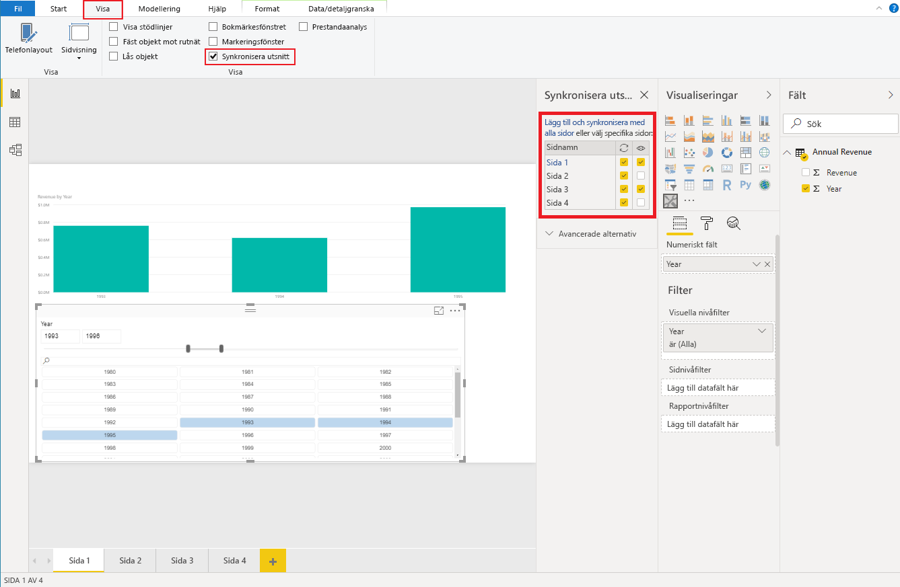

# <a name="sync-slicers-in-power-bi-visuals"></a>Synkronisering av utsnitt i visuella Power BI-objekt

För att stödja funktionen [Synkronisering av utsnitt](https://docs.microsoft.com/power-bi/desktop-slicers) måste ditt anpassade utsnittsobjekt använda API-version 1.13 eller senare.

Dessutom behöver du aktivera alternativet i filen *capabilities.json* enligt följande kod:

```json
{
    ...
    "supportsHighlight": true,
    "suppressDefaultTitle": true,
    "supportsSynchronizingFilterState": true,
    "sorting": {
        "default": {}
    }
}
```

När du har uppdaterat filen *capabilities.json* kan du visa fönstret med alternativ för **Synkronisera utsnitt** när du väljer det anpassade visuella utsnittsobjektet.

> [!NOTE]
> Funktionen Synkronisering av utsnitt stöder inte fler än ett fält. Om utsnittet har fler än ett fält (**Kategori** eller **Mått**) inaktiveras funktionen.



I fönstret **Synkronisera utsnitt** kan du se att utsnittets synlighet och filtrering kan tillämpas på flera rapportsidor.
