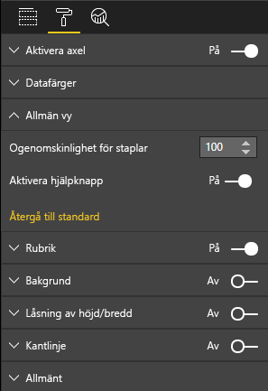

# <a name="create-a-launch-url"></a>Skapa en start-URL

När du skapar en start-URL kan du öppna en ny flik i webbläsaren (eller ett nytt fönster) genom att delegera det faktiska arbetet till Power BI.

> [!IMPORTANT]
> `host.launchUrl()` introducerades i visualiserings-API 1.9.0.

## <a name="sample"></a>Exempel

Importera `IVisualHost`-gränssnittet och spara länken till `host`-objektet i det visuella objektets konstruktor.

```typescript
import powerbi from "powerbi-visuals-api";
import IVisualHost = powerbi.extensibility.visual.IVisualHost;

export class Visual implements IVisual {
    private host: IVisualHost;
    // ...
    constructor(options: VisualConstructorOptions) {
        // ...
        this.host = options.host;
        // ...
    }

    // ...
}
```

## <a name="usage"></a>Användning

Använd API-anropet `host.launchUrl()` och skicka mål-URL:en som ett strängargument:

```typescript
this.host.launchUrl('https://some.link.net');
```

## <a name="restrictions"></a>Begränsningar

* Använd endast absoluta sökvägar, inte relativa sökvägar. Använd till exempel en absolut sökväg såsom `https://some.link.net/subfolder/page.html`. Den relativa sökvägen, `/page.html`, öppnas inte.

* För närvarande stöds endast protokollen *HTTP* och *HTTPS*. Undvik *FTP*, *MAILTO* och så vidare.

## <a name="best-practices"></a>Metodtips

* Vanligtvis är det bäst att endast öppna en länk som ett svar på en användares uttryckliga åtgärd. Gör det enkelt för användaren att förstå att om du klickar på länken eller knappen så öppnas en ny flik. Att utlösa ett `launchUrl()`-anrop utan någon åtgärd från användaren, eller som en sidoeffekt av en annan åtgärd, kan vara förvirrande eller frustrerande för användaren.

* Om länken inte är avgörande för att det visuella objektet ska fungera korrekt rekommenderar vi att du ger rapportens författare ett sätt att inaktivera och dölja länken. Den här rekommendationen är särskilt relevant för speciella Power BI-användningsfall, till exempel inbäddning av en rapport i ett program från tredje part eller publicering av den på webben.

* Undvik att utlösa ett `launchUrl()`-anrop inifrån en loop, det visuella objektets `update`-funktion eller någon annan ofta återkommande kod.

## <a name="a-step-by-step-example"></a>Ett stegvist exempel

### <a name="add-a-link-launching-element"></a>Lägga till ett länkstartande element

Följande rader lades till i det visuella objektets `constructor`-funktion:

```typescript
    this.helpLinkElement = this.createHelpLinkElement();
    options.element.appendChild(this.helpLinkElement);
```

En privat funktion som skapar och kopplar fästpunktselementet lades till:

```typescript
private createHelpLinkElement(): Element {
    let linkElement = document.createElement("a");
    linkElement.textContent = "?";
    linkElement.setAttribute("title", "Open documentation");
    linkElement.setAttribute("class", "helpLink");
    linkElement.addEventListener("click", () => {
        this.host.launchUrl("https://docs.microsoft.com/power-bi/developer/visuals/custom-visual-develop-tutorial");
    });
    return linkElement;
};
```

Slutligen definierar en post i filen *visual.less* formatet för länkelementet:

```less
.helpLink {
    position: absolute;
    top: 0px;
    right: 12px;
    display: block;
    width: 20px;
    height: 20px;
    border: 2px solid #80B0E0;
    border-radius: 20px;
    color: #80B0E0;
    text-align: center;
    font-size: 16px;
    line-height: 20px;
    background-color: #FFFFFF;
    transition: all 900ms ease;

    &:hover {
        background-color: #DDEEFF;
        color: #5080B0;
        border-color: #5080B0;
        transition: all 250ms ease;
    }

    &.hidden {
        display: none;
    }
}
```

### <a name="add-a-toggling-mechanism"></a>Lägga till en växlingsmekanism

Om du vill lägga till en växlingsmekanism behöver du lägga till ett statiskt objekt så att rapportens författare kan växla synligheten för länkelementet. (Standardinställningen är *hidden* (dold).) Mer information finns i [självstudien om statiska objekt](https://microsoft.github.io/PowerBI-visuals/docs/concepts/objects-and-properties).

Ett statiskt booleskt `showHelpLink`-objekt lades till i objektposten för filen *capabilities.json* enligt följande kod:

```typescript
"objects": {
    "generalView": {
            "displayName": "General View",
            "properties":
                "showHelpLink": {
                    "displayName": "Show Help Button",
                    "type": {
                        "bool": true
                    }
                }
            }
        }
    }
```



Följande rader lades till i det visuella objektets `update`-funktion:

```typescript
if (settings.generalView.showHelpLink) {
    this.helpLinkElement.classList.remove("hidden");
} else {
    this.helpLinkElement.classList.add("hidden");
}
```

Klassen *hidden* definieras i filen *visual.less* för att styra visningen av elementet.