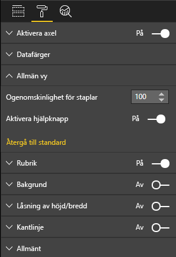

# <a name="launch-url"></a>Starta URL

Med Starta URL kan du öppna en ny flik i webbläsaren (eller fönstret) genom att delegera det faktiska arbetet till Power BI.

## <a name="sample"></a>Exempel

```typescript
   this.host.launchUrl('https://powerbi.microsoft.com');
```

## <a name="usage"></a>Användning

Använd API-anropet `host.launchUrl()` och skicka mål-URL:en som ett strängargument:

```typescript
this.host.launchUrl('http://some.link.net');
```

## <a name="restrictions"></a>Begränsningar

* Använd endast absoluta sökvägar, inte relativa. `http://some.link.net/subfolder/page.html` fungerar bra, men `/page.html` öppnas inte.
* För närvarande stöds endast protokollen `http` och `https`. Undvik `ftp`, `mailto` och så vidare.

## <a name="best-practices"></a>Metodtips

1. I de flesta fall är det bäst att bara öppna en länk som ett svar på en användares uttryckliga åtgärd. Gör det enkelt för användaren att förstå att om du klickar på länken eller knappen så öppnas en ny flik. Att utlösa ett `launchUrl()`-anrop utan någon åtgärd från användaren, eller som en sidoeffekt av en annan åtgärd, kan vara förvirrande eller frustrerande för användaren.
2. Om länken inte är avgörande för att det visuella objektet ska fungera korrekt, rekommenderar vi att du ger rapportens författare ett sätt att inaktivera och dölja länken. Det finns Power BI-användningsfall då detta är särskilt relevant, till exempel när en rapport bäddas in i ett program från tredje part eller publiceras på webben.
3. Undvik att utlösa ett `launchUrl()`-anrop inifrån en loop,det visuella objektets `update`-funktion eller någon annan ofta återkommande kod.

## <a name="step-by-step-example"></a>Exempel – steg för steg

### <a name="adding-a-link-launching-element"></a>Lägga till ett element för att starta en länk

Följande rader lades till i det visuella objektets `constructor`-funktion:

```typescript
    this.helpLinkElement = this.createHelpLinkElement();
    options.element.appendChild(this.helpLinkElement);
```

Och en privat funktion som skapar och kopplar fästpunktselementet lades till:

```typescript
private createHelpLinkElement(): Element {
    let linkElement = document.createElement("a");
    linkElement.textContent = "?";
    linkElement.setAttribute("title", "Open documentation");
    linkElement.setAttribute("class", "helpLink");
    linkElement.addEventListener("click", () => {
        this.host.launchUrl("https://docs.microsoft.com/power-bi/developer/custom-visual-develop-tutorial");
    });
    return linkElement;
};
```

Slutligen definierar en post i filen visual.less formatet för länkelementet:

```less
.helpLink {
    position: absolute;
    top: 0px;
    right: 12px;
    display: block;
    width: 20px;
    height: 20px;
    border: 2px solid #80B0E0;
    border-radius: 20px;
    color: #80B0E0;
    text-align: center;
    font-size: 16px;
    line-height: 20px;
    background-color: #FFFFFF;
    transition: all 900ms ease;

    &:hover {
        background-color: #DDEEFF;
        color: #5080B0;
        border-color: #5080B0;
        transition: all 250ms ease;
    }

    &.hidden {
        display: none;
    }
}
```

### <a name="adding-a-toggling-mechanism"></a>Lägga till en växlingsfunktion

Detta kräver att du lägger till ett statiskt objekt (se [självstudien för statiska objekt](https://microsoft.github.io/PowerBI-visuals/docs/concepts/objects-and-properties)) så att rapportens författare kan växla synlighetsläget för länkelementet (standardinställningen är dold).
Ett booleskt statiskt objekt, `showHelpLink`, har lagts till i `capabilities.json`-objektposten:

```typescript
"objects": {
    "generalView": {
            "displayName": "General View",
            "properties":
                "showHelpLink": {
                    "displayName": "Show Help Button",
                    "type": {
                        "bool": true
                    }
                }
            }
        }
    }
```



Följande rader lades till i det visuella objektets `update`-funktion:

```typescript
if (settings.generalView.showHelpLink) {
    this.helpLinkElement.classList.remove("hidden");
} else {
    this.helpLinkElement.classList.add("hidden");
}
```

Klassen `hidden` definieras i visual.less för att styra visningen av elementet.
