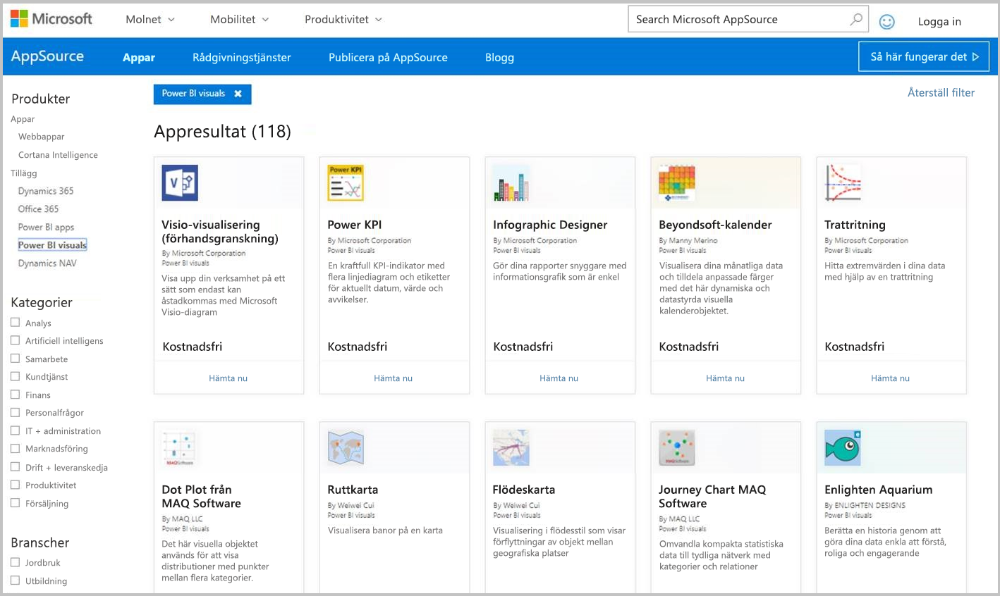
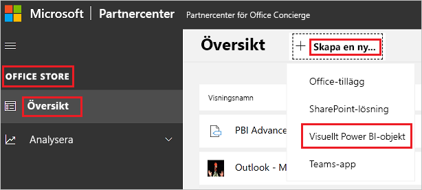

# Publicera visuella Power BI-objekt på Partnercenter

När du har skapat ditt visuella Power BI-objekt, vill du kanske publicera det på AppSource så att andra kan hitta och använda det. Mer information om hur du skapar ett visuellt Power BI-objekt finns i [Utveckla ett visuellt Power BI-objekt](custom-visual-develop-tutorial.md).

## Vad är AppSource?

[AppSource](https://appsource.microsoft.com/marketplace/apps?product=power-bi-visuals) är det ställe där du hittar SaaS-appar och tillägg för dina Microsoft-produkter och tjänster.

## Förbereda att skicka ditt visuella Power BI-objekt

Innan du skickar in ett visuellt Power BI-objekt till AppSource, så kontrollera att du har läst [Riktlinjer för visuella Power BI-objekt](guidelines-powerbi-visuals.md) och [testat dina anpassade visuella objekt](https://github.com/Microsoft/PowerBI-visuals/blob/master/Tutorial/SubmissionTesting.md).

När du är redo att skicka in ditt visuella Power BI-objekt, så verifiera att ditt visuella objekt uppfyller alla de krav som anges nedan.

| Objekt | Krävs | Beskrivning |
| --- | --- | --- |
| Pbiviz-paket |Ja |Packa ditt visuella Power BI-objekt i ett Pbiviz-paket som innehåller alla nödvändiga metadata. Visuellt namn Visningsnamn GUID Version Beskrivning Författarens namn och e-post |
| Exempel på .pbix-rapportfil |Ja |Om du vill visa ditt visuella objekt bör du hjälpa användarna att bekanta sig med det. Fokusera på det mervärde som det visuella objektet medför för användaren och ge exempel på användningsområden och formateringsalternativ. Du kan också lägga till en sida med *tips* på slutet med olika tips och saker att undvika och liknande. Exemplet på en .pbix-rapportfil måste fungera offline, utan några externa anslutningar. |
| Ikon |Ja |Du bör inkludera den anpassade visuella logotypen som visas i Store. Formatet kan vara .png, .jpg, .jpeg eller .gif. Det måste vara exakt 300 px (bredd) x 300 px (höjd). **Viktigt!** Studer guiden [AppSource-lageravbildningar](https://docs.microsoft.com/office/dev/store/craft-effective-appsource-store-images) noga innan du skickar in ikonen. |
| Skärmbilder |Ja |Du måste tillhandahålla minst en skärmbild. Formatet kan vara .png, .jpg, .jpeg eller .gif. Måtten måste vara exakt 1366 px (bredd) x 768 px (höjd). Filens storlek får inte överstiga 1024 kb. Lägg till textbubblor som tydligt betonar mervärdet av de viktiga funktioner som visas på respektive skärmbild. |
| Länk till nedladdningssupport |Ja |Tillhandahåll en support-URL för dina kunder. Den här länken har angetts som en del av din Partnercenter-registrering och är synlig för användare när de bereder sig åtkomst till ditt visuella objekts lista i AppSource. Formatet på URL:en ska inkludera https:// eller https://. |
| Länk till sekretessdokumentet |Ja |Tillhandahåll en länk till det visuella objektets sekretesspolicy. Den här länken har angetts som en del av din Partnercenter-registrering och är synlig för användare när de bereder sig åtkomst till ditt visuella objekts lista i AppSource. Formatet på länken ska inkludera https:// eller https://. |
| Licensavtal (EULA) |Ja |Du måste tillhandahålla en EULA-fil ditt visuella Power BI-objekt. Du kan använda [standardavtalet](https://go.microsoft.com/fwlink/?linkid=2041178), [avtalet för visuella Power BI-objekt](https://visuals.azureedge.net/app-store/Power%20BI%20-%20Default%20Custom%20Visual%20EULA.pdf) eller ditt eget EULA-avtal. |
| Videolänk |Nej |Om du vill öka användarnas intresse för ditt anpassade visuella objekt, så tillhandahåll en länk till en video om ditt visuella objekt. Formatet på URL:en ska inkludera https:// eller https://. |
| GitHub-lagringsplats |Nej |Dela en offentlig länkt till ett [GitHub](https://www.github.com)-centrallager med källor till dina visuella Power BI-objekt och exempeldata. På så vis får andra utvecklare möjlighet att komma med feedback och föreslå förbättringar av din kod. |

## Skaffa appakets-XML

Om du vill skicka in ett visuellt Power BI-objekt behöver du ett appakets-XML från Power BI-teamet. Om du vill ha ett appakets-XML, så skicka ett e-postmeddelande till teamet för visuella Power BI-objekt ([pbivizsubmit@microsoft.com](mailto:pbivizsubmit@microsoft.com)).

Innan du skapar **pbiviz**-paketet måste du fylla i följande fält i **pbiviz.json**-filen:
* beskrivning
* supportUrl
* författare
* name
* e-post

Bifoga **pbiviz-filen** och **pbix-filen med exempelrapporten** i ditt e-postmeddelande. Power BI-teamet kommer att svara med instruktioner och en XML-appaketsfil att överföra. Det här XML-appaketet krävs för att skicka ditt visuella objekt via Office Developer Center.

> [!NOTE]
> För att förbättra kvaliteten och säkerställa att befintliga rapporter inte slutar fungera, tar det ytterligare 2 veckor för uppdateringar i befintliga visuella objekt att nå produktionsmiljön efter att de har godkänts i Store.

## Skicka in till AppSource

Om du vill skicka in ditt visuella Power BI-objekt till AppSource måste du skaffa ett appaket från Power BI-teamet och sedan skicka det till Partnercenter. 

### Hämta appaketet

Innan du skickar till AppSource, måste du skicka ett e-postmeddelande med **pbiviz**-filen och **pbx**-filen till Power BI-teamet. På så vis kan Power BI-teamet överföra filerna till en offentlig resursserver. Annars kommer butiken inte att hämta filerna. 

Power BI-teamet måste kontrollera filerna för varje ny överföring av visuella Power BI-objekt, uppdateringar av visuella Power BI-objekt och korrigeringar av avvisade överföringar.

### Skicka in till Partnercenter

Om du vill skicka in dina visuella Power BI-objekt till Partnercenter så måste du vara registrerad hos ditt Partnercenter. Om du inte har registrerat dig ännu så [öppna ett utvecklarkonto i Partnercenter](https://docs.microsoft.com/office/dev/store/open-a-developer-account).

Följ stegen nedan när du ska skicka in ditt visuella Power BI-objekt till Partnercenter. Mer information om överföringsprocessen finns i [Skicka in din Office-lösning till AppSource via Partnercenter](https://docs.microsoft.com/office/dev/store/use-partner-center-to-submit-to-appsource).

1. Logga in på **Partnercenter**.

2. Välj **OFFICE STORE** i den vänstra rutan.

3. Välj **Översikt**.

4. Välj **Skapa ny** och välj **Visuellt Power BI-objekt**på den nedrullningsbara menyn.

    

5. Skriv in ett namn på ditt visuella Power BI-objekt i fönstret **Skapa ett nytt visuellt Power BI-objekt** och välj **Skapa**.

6. Välj **Paket** och överför XML-appaketet för ditt visuella Power BI-objekt.

7. Välj **Egenskaper** och fyll i den information som krävs.

8. Om produkten kräver ytterligare inköp, så välj **Produktkonfiguration** och markera kryssrutan **Tillhörande tjänstinköp**.

9. (Valfritt) Om du vill [certifiera](power-bi-custom-visuals-certified.md) ditt visuella objekt så välj **Produktkonfiguration** och markera kryssrutan **Power BI-certifiering**.
    >[!TIP]
    >Certifieringsprocessen för Power BI kan ta tid. Om du skapar ett nytt visuellt Power BI-objekt rekommenderar vi att du publicerar ditt visuella Power BI-objekt via Partnercenter innan du begär Power BI-certifiering. Detta säkerställer att publiceringen av ditt visuella objekt inte försenas.

10. Välj **Produktkonfiguration** och klicka på **Granska och publicera**.

## Spåra sändningsstatus och användning

Du kan granska [verifieringsprinciperna](https://dev.office.com/officestore/docs/validation-policies#13-power-bi-custom-visuals).

Därefter kommer du att kunna visa status för ansökan i [appinstrumentpanelen](https://sellerdashboard.microsoft.com/Application/Summary/).

## Godkänn ditt visuella objekt

När du har skapat ditt visuella objekt kan du välja att få det [certifierat](power-bi-custom-visuals-certified.md).

## Nästa steg

* [Utveckla ett anpassat visuellt objekt i Power BI](custom-visual-develop-tutorial.md)

* [Visualiseringar i Power BI](../../visuals/power-bi-report-visualizations.md)  

* [Visuella objekt i Power BI](power-bi-custom-visuals.md)  

* [Certifiera ett visuellt Power BI-objekt](power-bi-custom-visuals-certified.md)

* Har du fler frågor? [Fråga Power BI Community](https://community.powerbi.com/)
