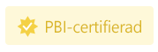

# Certifiera ett visuellt Power BI-objekt

Certifierade visuella Power BI-objekt är visuella objekt i [AppSource](https://appsource.microsoft.com/en-us/marketplace/apps?page=1&product=power-bi-visuals) som uppfyller Microsoft Power BI-teamets [kodkrav](#certification-requirements). Dessa visuella objekt testas för att kontrollera att de inte har åtkomst till externa tjänster eller resurser och att de följer säkra kodningsmönster och riktlinjer.

När ett visuellt Power BI-objekt har certifierats erbjuder det fler funktioner. Du kan [exportera det till PowerPoint](../../consumer/end-user-powerpoint.md) och du kan visa det visuella objektet i e-postmeddelanden när en användare [prenumererar på rapportsidor](../../consumer/end-user-subscribe.md).

Certifieringsprocessen är valfri. Visuella Power BI-objekt som inte är certifierade är inte nödvändigtvis osäkra visuella objekt i Power BI. Vissa visuella Power BI-objekt är inte certifierade eftersom de inte är kompatibla med ett eller flera av [certifieringskraven](power-bi-custom-visuals-certified.md#certification-requirements). Till exempel en visuell karta i Power BI som ansluter till en extern tjänst eller ett visuellt Power BI-objekt som använder kommersiella bibliotek.

> [!NOTE]
> Microsoft har inte skapat de visuella Power BI-objekten från tredje part. Kontakta upphovsmannen direkt för att verifiera funktionaliteten för visuella objekt från tredje part.

## Certifieringskrav

För att få dina visuella Power BI-objekt [certifierade](#get-a-power-bi-visual-certified) måste ditt visuella Power BI-objekt uppfylla de krav som anges i det här avsnittet. 

### Allmänna krav

Ditt visuella Power BI-objekt måste godkännas av Partnercenter. Vi rekommenderar att ditt visuella Power BI-objekt redan finns i [AppSource](https://appsource.microsoft.com/marketplace/apps?page=1&product=power-bi-visuals). Mer information om att publicera visuella Power BI-objekt till AppSource finns i [Publicera visuella Power BI-objekt på Partnercenter](office-store.md).

Innan du skickar in ditt visuella Power BI-objekt för certifiering ska du kontrollera att det uppfyller [riktlinjerna för visuella Power BI-objekt](guidelines-powerbi-visuals.md).

När du skickar det visuella Power BI-objektet ska du se till att det kompilerade paketet exakt matchar det skickade paketet.

### Krav för kodlagring

Även om du inte behöver dela koden offentligt i GitHub måste kodlagringsplatsen vara tillgänglig för granskning av Power BI-teamet. Det bästa sättet att göra det på är genom att tillhandahålla källkoden (Java Script eller TypeScript) i GitHub.

Lagringsplatsen måste innehålla följande:
* Kod för endast ett visuellt Power BI-objekt. Den får inte innehålla kod för flera visuella Power BI-objekt eller orelaterad kod.
* En gren med namnet **certification** (skrivet med gemener). Källkoden i den här grenen måste matcha det skickade paketet. Den här koden kan bara uppdateras under nästa sändningsprocess om du skickar in det visuella Power BI-objektet igen.

Om ditt visuella Power BI-objekt använder privata NPM-paket eller Git-delmoduler måste du ge åtkomst till de övriga lagringsplatserna som innehåller den här koden.

Om du vill förstå hur en visuell Power BI-lagringsplats ser ut, så ta en titt på GitHub-lagringsplatsen för [exempelstapeldiagrammet för visuella Power BI-objekt](https://github.com/microsoft/PowerBI-visuals-sampleBarChart).

### Filkrav

Använd den senaste versionen av API:t för att skriva visuella Power BI-objekt.

Lagringsplatsen måste innehålla följande filer:
* **.gitignore** – Lägg till `node_modules`, `.tmp` och `dist` till den här filen. Koden får inte innehålla mappen *node_modules*, *.tmp* eller *dist*.
* **capability. JSON-** – Om du skickar nyare versioner av visuella Power BI-objekt med ändringar i egenskaperna i den här filen ska du kontrollera att de inte bryter rapporter för befintliga användare.
* **pbiviz.json** 
* **package.json**. Det visuella objektet måste ha följande paket installerat:
   * [tslint](https://www.npmjs.com/package/tslint) – version 5.18.0 eller senare.
   * [typescript](https://www.npmjs.com/package/typescript) – version 3.0.0 eller senare.
   * [tslint-microsoftcontrib](https://www.npmjs.com/package/tslint-microsoft-contrib) – version 6.2.0 eller senare
   * Filen måste innehålla ett kommando för att köra linter – `"lint": "tslint -c tslint.json -p tsconfig.json"`
* **package-lock.json**
* **tsconfig.json**

### Kommandokrav

Kontrollera att följande kommandon inte returnerar några fel.

* `npm install`
* `pbiviz package`
* `npm audit` – Får inte returnera varningar av hög eller måttlig nivå.
* [TSlint från Microsoft](https://www.npmjs.com/package/tslint-microsoft-contrib) med [krävd konfiguration](https://github.com/microsoft/PowerBI-visuals-sampleBarChart/blob/master/tslint.json). Detta kommando får inte returnera fel.

### Kompileringskrav

Använd den senaste versionen av [powerbi-visuals-tools](https://www.npmjs.com/package/powerbi-visuals-tools) för att skriva visuella Power BI-objekt.

Du måste kompilera det visuella Power BI-objektet med `pbiviz package`. Om du använder egna build-skript anger du ett `npm run package` anpassat build-kommando.

### Krav för källkod

Kontrollera att du följer principlistan [Ytterligare certifiering för visuella Power BI-objekt](https://docs.microsoft.com/legal/marketplace/certification-policies#1200-power-bi-visuals-additional-certification). Om ditt bidrag inte följer dessa riktlinjer innehåller e-postmeddelandet med avvisandet från Partnercenter de principnummer som anges i den här länken.

Följ de kodkrav som anges nedan för att kontrollera att koden följer Power BI:s certifieringsprinciper.  

**Krävs**
* Använd bara offentliga, granskade OSS-komponenter som offentliga Javascript- eller TypeScript-bibliotek.
* Koden måste ha stöd för [API:et för renderingshändelser](event-service.md).
* Se till att DOM ändras på ett säkert sätt. Sanera användarindata eller användardata innan du lägger till dem i DOM.
* Använd [exempelrapporten](https://github.com/Microsoft/PowerBI-visuals/raw/gh-pages/assets/reports/large_data.pbix) som en testdatamängd.

**Inte tillåten**
* Tillgång till externa tjänster eller resurser. Till exempel får inga HTTP/S- eller WebSocket-begäranden gå ut från Power BI till några tjänster.
* Använda `innerHTML`eller `D3.html(user data or user input)`.
* JavaScript-fel eller undantag i webbläsarkonsolen för indata.
* Godtycklig eller dynamisk kod, till exempel `eval()`, osäker användning av `settimeout()`, `requestAnimationFrame()`, `setinterval(user input function)` och användarindata eller användardata.
* Minimerade JavaScript-filer eller-projekt.

## Skicka ett visuellt Power BI-objekt för certifiering

Du kan begära att ditt visuella Power BI-objekt certifieras av Power BI-teamet via Partner Center.

>[!TIP]
>Certifieringsprocessen för Power BI kan ta tid. Om du skapar ett nytt visuellt Power BI-objekt rekommenderar vi att du publicerar ditt visuella Power BI-objekt via Partnercenter innan du begär Power BI-certifiering. Detta säkerställer att publiceringen av ditt visuella objekt inte försenas.

Så här begär du Power BI-certifiering:

1. Logga in på Partner Center.
2. På sidan **Översikt** väljer du ditt visuella Power BI-objekt och går till **Produktkonfigurationssidan**.
3. Markera kryssrutan **Begär Power BI-certifiering**.
4. På sidan **Granska och publicera** anger du en länk till källkoden och de autentiseringsuppgifter som krävs för att komma åt den i textrutan **Kommentarer för certifiering**.

### Process för överföring av privat lagringsplats

Om du använder en privat lagringsplats, t.ex. GitHub, för att skicka in dina visuella Power BI-objekt för certifiering, så följ anvisningarna i det här avsnittet.
1. Skapa ett nytt konto för valideringsteamet.
2. Konfigurera [tvåfaktorautentisering](https://help.github.com/github/authenticating-to-github/securing-your-account-with-two-factor-authentication-2fa) för ditt konto.
3. [Generera en ny uppsättning återställningskoder](https://help.github.com/github/authenticating-to-github/configuring-two-factor-authentication-recovery-methods#generating-a-new-set-of-recovery-codes).
4. När du skickar in ditt visuella Power BI-objekt, så ange följande:
    * En länk till lagringsplatsen
    * Inloggningsuppgifter (inklusive lösenord)
    * Återställningskoder
    * Läs behörighet till vårt konto ([pbicvsupport](https://github.com/pbicvsupport))

## Certifierade visuella märken i Power BI

När ett visuellt Power BI-objekt certifieras, så får det ett märke som indikerar att det har certifierats.

### Certifierade visuella Power BI-objekt i AppSource

* När du söker online efter [visuella Power BI-objekt i AppSource](https://appsource.microsoft.com/marketplace/apps?product=power-bi-visuals), så indikerer ett litet gult märke på det visuella objektets kort att detta är ett certifierat visuellt Power BI-objekt.

    

* När du har klickat på det visuella Power BI.kortet i AppSource, så visas ett gult märke med texten *PBI-certifierat*, vilket indikerar att det här visuella Power BI-objektet är certifierat.

    

### Certifierade visuella Power BI-objekt i Power BI-gränssnittet

* När du importerar ett visuellt Power BI-objekt från Power BI (Desktop eller tjänst) så indikerar ett blått märke att det visuella Power BI-objektet är certifierat.

    

* Du kan bara visa certifierade visuella Power BI-objekt genom att välja filteralternativet *Power BI-certifierat*.

## Nästa steg

* Om du är webbutvecklare som är intresserad av att skapa egna visuella Power BI-objekt och lägga till dem i  [Microsoft AppSource](https://appsource.microsoft.com) kan du börja du med självstudien  [Utveckla ett visuellt Power BI-objekt](custom-visual-develop-tutorial.md).

* Mer information om visuella objekt finns i [Vanliga frågor och svar om certifierade visuella objekt](power-bi-custom-visuals-faq.md#certified-power-bi-visuals).

* [Utveckla ett visuellt Power BI-objekt](custom-visual-develop-tutorial.md)

* [Microsofts spellista för visuella Power BI-objekt på YouTube](https://www.youtube.com/playlist?list=PL1N57mwBHtN1vIjfvuBIzZllrmKo-Vz6x)

* [Visuella objekt i Power BI](power-bi-custom-visuals.md)

* [Publicera visuella Power BI-objekt i Microsoft AppSource](office-store.md)

* Har du fler frågor? [Prova Power BI Community](https://community.powerbi.com/)