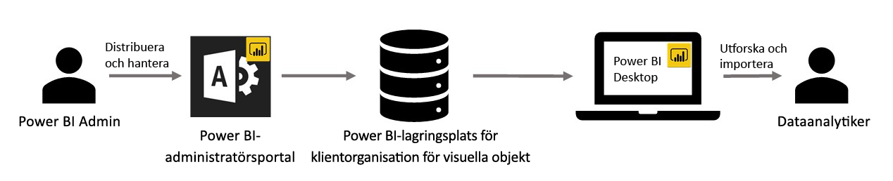

# Visuella objekt för organisationer i Power BI

Du kan använda visuella Power BI-objekt i Power BI om du vill skapa en unik typ av visuella objekt som är skräddarsydd för dig. Dessa visuella Power BI-objekt skapas av utvecklare, och de skapas ofta när flera av de visuella objekt som ingår i Power BI inte riktigt uppfyller deras behov.

I vissa organisationer är visuella Power BI-objekt ännu viktigare – de kan vara nödvändiga för att förmedla specifika data eller insikter som är unika för organisationen, de kan ha särskilda datakrav eller de kan lyfta fram privata affärsmetoder. Sådana organisationer behöver utveckla visuella Power BI-objekt, dela dem i hela organisationen och se till att de underhålls ordentligt. Med visuella Power BI-objekt kan organisationer göra just detta.

I följande bild visas den process genom vilken organisationens visuella Power BI-objekt i Power BI flödar från administratören, via utveckling och underhåll, för att slutligen hamna hos dataanalytikern.

Visuella objekt för organisationer distribueras och hanteras av Power BI-administratören från administrationsportalen. När de visuella Power BI-objekten väl har distribuerats till organisationens databas, kan användarna i organisationen enkelt identifiera och importera dem till sina rapporter direkt från Power BI Desktop.

Mer information om hur du använder visuella Power BI-objekt i en organisation i rapporter som du har skapat finns i följande artikel: [Lär dig mer om att importera organisationens visuella objekt i dina rapporter](power-bi-custom-visuals.md).

## Administrera visuella Power BI-objekt i en organisation

Mer information om hur du administrerar, distribuerar och hanterar visuella Power BI-objekt i din organisation finns i följande artikel: [Mer information om distribution och hantering av en organisations visuella Power BI-objekt](https://go.microsoft.com/fwlink/?linkid=866790).

> [!WARNING]
> Ett anpassat visuellt Power BI-objekt som har installerats från en fil kan innehålla kod som innebär säkerhets- och integritetsrisker. Kontrollera att författaren eller källan till den visuella Power BI-objektfilen är tillförlitlig innan du distribuerar dem till organisationens databas.

## Överväganden och begränsningar

Det finns flera överväganden och begränsningar som du behöver känna till.

Administration:

* Äldre visuella Power BI-objekt (t.ex visuella Power BI-objekt som inte har byggts ovanpå den nya versionens API:er) stöds inte

* Om ett visuellt Power BI-objekt från ApSource eller en fil tas bort från databasen upphör alla befintliga rapporter som använder det borttagna visuella objektet att återges. Det går inte att ångra borttagningen från databasen. Om du tillfälligt vill inaktivera ett visuellt Power BI-objekt från ApSource eller en fil använder du funktionen "Inaktivera".

* Visuella Power BI-objekt på organisationsnivå stöds inte i Power BI Report Server.

Slutanvändare:

* En organisations visuella Power BI-objekt är privata visuella objekt som importerats från organisationens centrallager. Som alla privata visuella objekt kan de inte [exporteras till PowerPoint](https://docs.microsoft.com/power-bi/consumer/end-user-powerpoint) eller visas i e-postmeddelanden som tas emot när en användare [prenumererar på rapportsidor](https://docs.microsoft.com/power-bi/consumer/end-user-subscribe). Endast [certifierade visuella Power BI-objekt](power-bi-custom-visuals-certified.md) som importeras direkt från marknadsplatsen stöder dessa funktioner.

* Visuella Visio-objekt, visuella PowerApps-objekt, visuella kartruteobjekt och visuella GlobeMap-objekt från AppSource-marknadsplatsen återges inte om de distribueras via organisationens centrallager.

## Felsök

Information om felsökning finns i [Felsöka dina visuella Power BI-objekt](power-bi-custom-visuals-troubleshoot.md).

## Vanliga frågor och svar

Mer information och svar på frågor finns i [Vanliga frågor och svar om visuella Power BI-objekt](power-bi-custom-visuals-faq.md#organizational-power-bi-visuals).

Har du fler frågor? [Testa Power BI Community](https://community.powerbi.com/).
