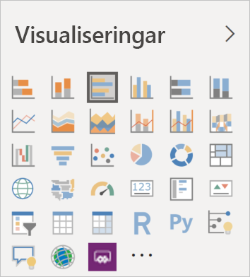

# Visuella objekt i Power BI

Power BI har många inbyggda visuella objekt redan från start. Du kommer åt de här visuella objekten via visualiseringsfönstret i både [Power BI Desktop](https://powerbi.microsoft.com/desktop/) och [Power BI-tjänsten](https://app.powerbi.com), och du kan använda dem till att skapa och redigera Power BI-innehåll.

Du hittar många fler visuella Power BI-objekt via Microsoft [AppSource](https://nam06.safelinks.protection.outlook.com/?url=https%3A%2F%2Fappsource.microsoft.com%2Fen-us%2Fmarketplace%2Fapps%3Fpage%3D1%26product%3Dpower-bi-visuals&data=02%7C01%7CKesem.Sharabi%40microsoft.com%7C6d9286afacb3468d4cde08d740b76694%7C72f988bf86f141af91ab2d7cd011db47%7C1%7C0%7C637049028749147718&sdata=igWm0e1vXdgGcbyvngQBrHQVAkahPnxPC1ZhUPntGI8%3D&reserved=0) eller Power BI. De här visuella objekten har skapats av Microsoft och våra partners, och de har testats av valideringsteamet på AppSource.

Du kan också utveckla egna visuella Power BI-objekt för användning i organisationen, eller i hela Power BI-communityn.

## Visuella standardobjekt i Power BI

Här är de visuella Power BI-objekt du har tillgång till via visualiseringsfönstret i *Power BI Desktop* och *Power BI-tjänsten*.

Om du vill ta bort ett visuellt Power BI-objekt från visualiseringsfönstret högerklickar du på det och väljer **Ta bort**.

Om du vill återställa det visuella Power BI-standardobjektet i visualiseringsfönstret klickar du på **Importera ett anpassat visuellt objekt** och väljer **Återställ visuella standardobjekt**. 

## Visuella Power BI-objekt i AppSource

Både communitymedlemmar och Microsoft har bidragit med visuella Power BI-objekt och publicerat dem för allmän tillgänglighet på [AppSource](https://appsource.microsoft.com/marketplace/apps?product=power-bi-visuals). Du kan ladda ned de här visuella objekten och använda dem i Power BI-rapporter. Microsoft har testat och godkänt dessa visuella Power BI-objekt vad gäller funktionalitet och kvalitet.

>[!NOTE]
>* När du använder Power BI-kontroller som skapats med vårt SDK kan du importera data från eller skicka data till tredje part, eller andra tjänster som ligger utanför Power BI-klientorganisationens geografiska område, efterlevnadsgräns eller nationella molninstans.
>* Certifierade Power BI-kontroller är kontroller i AppSource som testats så att kontrollen garanterat inte använder några externa tjänster eller resurser.
>* När du importerar Power BI-kontroller från AppSource kan de uppdateras automatiskt utan att du meddelas om det.

### Vad är AppSource?

[AppSource](https://appsource.microsoft.com/marketplace/apps?product=power-bi-visuals) är en plats där du kan hitta appar och tillägg till dina Microsoft-program. På AppSource får miljontals användare av produkter som Microsoft 365, Azure, Dynamics 365, Cortana och Power BI tillgång till lösningar som hjälper dem att utföra sitt arbete ännu mer effektivt och insiktsfullt än förut.

### Certifierade visuella Power BI-objekt

Certifierade visuella Power BI-objekt är visuella objekt i [AppSource](https://nam06.safelinks.protection.outlook.com/?url=https%3A%2F%2Fappsource.microsoft.com%2Fen-us%2Fmarketplace%2Fapps%3Fpage%3D1%26product%3Dpower-bi-visuals&data=02%7C01%7CKesem.Sharabi%40microsoft.com%7C6d9286afacb3468d4cde08d740b76694%7C72f988bf86f141af91ab2d7cd011db47%7C1%7C0%7C637049028749147718&sdata=igWm0e1vXdgGcbyvngQBrHQVAkahPnxPC1ZhUPntGI8%3D&reserved=0) som uppfyller vissa specificerade kodkrav som Microsoft Power BI-teamet har testat och godkänt. Testerna är utformade för att kontrollera att det visuella objektet inte har tillgång till externa tjänster eller resurser.

Om du vill se en lista med certifierade visuella Power BI-objekt, eller skicka in dina egna, kan du läsa i [Certifierade visuella Power BI-objekt](power-bi-custom-visuals-certified.md).

### Exempel på visuella Power BI-objekt

Alla visuella Power BI-objekt i AppSource har ett dataexempel som illustrerar hur det visuella objektet fungerar. Om du vill ladda ned exemplet går du till [AppSource](https://nam06.safelinks.protection.outlook.com/?url=https%3A%2F%2Fappsource.microsoft.com%2Fen-us%2Fmarketplace%2Fapps%3Fpage%3D1%26product%3Dpower-bi-visuals&data=02%7C01%7CKesem.Sharabi%40microsoft.com%7C6d9286afacb3468d4cde08d740b76694%7C72f988bf86f141af91ab2d7cd011db47%7C1%7C0%7C637049028749147718&sdata=igWm0e1vXdgGcbyvngQBrHQVAkahPnxPC1ZhUPntGI8%3D&reserved=0), väljer ett visuellt Power BI-objekt, går till avsnittet *Prova ett exempel* och klickar på länken **Exempelrapport**.

## Organisationslager

Power BI-administratörer godkänner och distribuerar visuella Power BI-objekt i organisationen. På så sätt kan rapportförfattare enkelt upptäcka, uppdatera och använda de här visuella Power BI-objekten. Administratörer kan enkelt hantera de visuella objekten med åtgärder som att uppdatera versioner, inaktivera och aktivera visuella Power BI-objekt.

Du kommer åt organisationslagret genom att gå till fönstret *Visualisering*, klicka på **Importera ett anpassat visuellt objekt** och välja **Importera från Marketplace**. Överst i fönstret *Visuella Power BI-objekt* väljer du sedan fliken **Min organisation**.

[Läs mer om visuella objekt för organisationen](power-bi-custom-visuals-organization.md).

## Filer för visuella objekt

Visuella Power BI-objekt är paket som innehåller kod för att återge de data som de förses med. Alla kan skapa anpassade visuella objekt och paketera dem som enskilda `.pbiviz`-filer som sedan kan importeras till Power BI-rapporter.

Om du vill importera ett visuellt Power BI-objekt klickar du på **Importera ett anpassat visuellt objekt** i fönstret *Visualisering* och väljer **Importera från fil**.

Om du är webbutvecklare och intresserad av att skapa egna visuella objekt och lägga till dem i AppSource så kan du lära dig att [utveckla ett visuellt Power BI-objekt](custom-visual-develop-tutorial.md) och att [publicera ett visuellt Power BI-objekt till AppSource](office-store.md).

> [!WARNING]
> Ett anpassat visuellt Power BI-objekt kan innehålla kod som innebär säkerhets- och integritetsrisker. Se till att du litar på författaren och källan till det visuella Power BI-objektet innan du importerar det till din rapport.

## Nästa steg

>[!div class="nextstepaction"]
>[Utveckla ett visuellt Power BI-objekt](custom-visual-develop-tutorial.md)

>[!div class="nextstepaction"]
>[Projektstruktur för Power BI-kontroller](visual-project-structure.md)

>[!div class="nextstepaction"]
>[Riktlinjer för Power BI-kontroller](guidelines-powerbi-visuals.md)

>[!div class="nextstepaction"]
>[Vanliga frågor och svar](power-bi-custom-visuals-faq.md)

>[!div class="nextstepaction"]
>[Power BI Community](https://community.powerbi.com/)