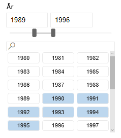
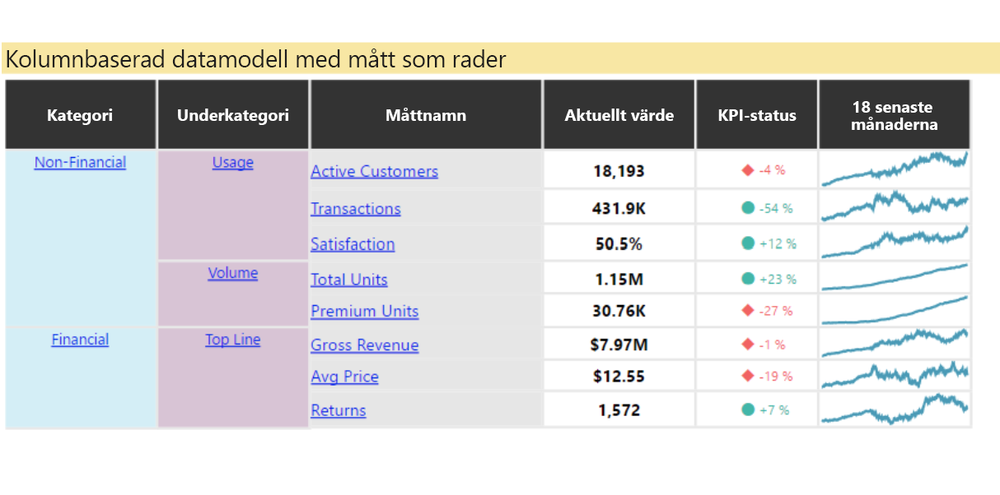
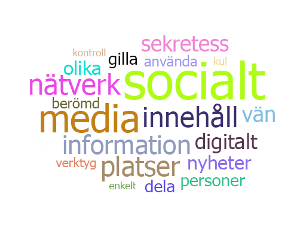
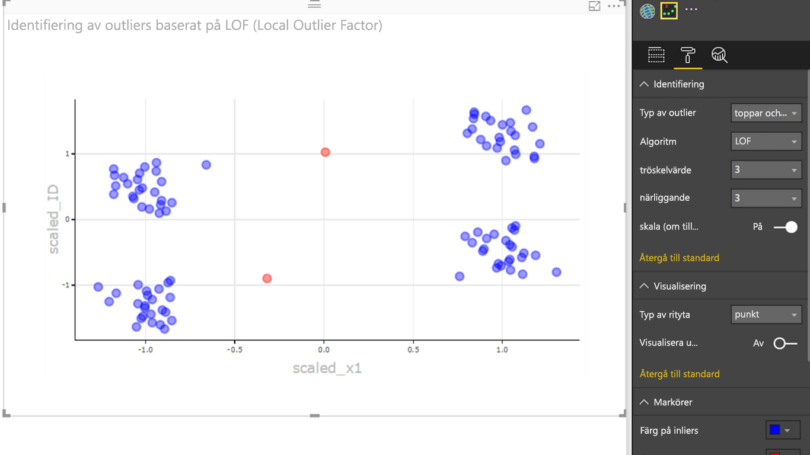

# Exempel på Power BI-visualiseringar

Du kan ladda ned, använda och ändra dessa visuella Power BI-objekt från GitHub. Dessa exempel illustrerar hur du kan hantera vanliga situationer när du bedriver utvecklingsarbete i Power BI.

## Utsnitt

Ett utsnitt begränsar den del av datamängden som visas i andra visuella objekt i en rapport. Utsnitt är en av flera metoder som används för att filtrera data i Power BI.

|   |  | |
| ------------- | ------------- | -------------|
| [Chiclet-utsnitt](https://github.com/Microsoft/powerbi-visuals-chicletslicer/)   Visa bild- eller textknappar som fungerar som filter på arbetsytan för andra visuella objekt | [Tidslinje-utsnitt](https://github.com/Microsoft/powerbi-visuals-timeline/)  Datumintervallsväljare för grafik som filtrerar efter datum | [Utsnittsexempel](https://github.com/Microsoft/powerbi-visuals-sampleslicer/)  Visar användningen av API:et för avancerad filtrering

## Diagram

Bli inspirerad med vårt galleri, med bl.a. stapeldiagram, cirkeldiagram, ordmoln och annat.

|   |  | |
| ------------- | ------------- | -------------|
| [Aster-punktdiagram](https://github.com/Microsoft/powerbi-visuals-asterplot/)   En variant på ett vanligt ringdiagram som använder ett andra värde för att driva en svepvinkel | [Jämförande stapeldiagram](https://github.com/Microsoft/powerbi-visuals-bulletchart/)  Ett stapeldiagram med extra visuella element som ger ytterligare kontext, som är användbart vid målspårning | [Chord](https://github.com/Microsoft/powerbi-visuals-chord/)  En grafisk metod som visar relationerna mellan data i en matris
|  | |  
| [Punktritning](https://github.com/Microsoft/powerbi-visuals-dotplot/)  Visa frekvensfördelning på ett snyggt sätt | [Dubbel KPI](https://github.com/Microsoft/powerbi-visuals-dualkpi/)  Visualiserar effektivt två mått över tid, vilket visar deras trend på en gemensam tidslinje | [Förbättrat punktdiagram](https://github.com/Microsoft/powerbi-visuals-enhancedscatter/)  Förbättringar i det befintliga punktdiagrammet
| | | 
| [Tvingat diagram](https://github.com/Microsoft/powerbi-visuals-forcegraph/)  Tvinga layoutdiagram med en böjd linje, vilket är användbart när du vill visa anslutningar mellan entiteter | [Gantt](https://github.com/Microsoft/powerbi-visuals-gantt/)  Ett stapeldiagram som illustrerar ett projekts tidslinje eller ett schema med resurser | [Termisk tabellkarta](https://github.com/Microsoft/powerbi-visuals-heatmap/)  Jämför data enkelt och intuitivt med färger i en tabell
|  |  |  
| [Histogramdiagram](https://github.com/Microsoft/powerbi-visuals-histogram/)  Visualiserar distributionen av data över ett kontinuerligt intervall eller en viss tidsperiod | [LineDot-diagram](https://github.com/Microsoft/powerbi-visuals-linedotchart/)  Ett animerat linjediagram med roliga animerade punkter som fångar publikens intresse med data | [Mekko-diagram](https://github.com/Microsoft/powerbi-visuals-mekkochart/)  En blandning av ett 100 % stående stapeldiagram och 100 % liggande stapeldiagram kombinerat i en vy
|  |  |  
| [Multi-KPI](https://github.com/microsoft/PowerBI-visuals-MultiKPI/)   En kraftfull visualisering av flera KPI: er med en nyckel-KPI tillsammans med flera miniatyrdiagram med stöddata | [Power KPI](https://github.com/microsoft/PowerBI-visuals-PowerKPI/)  En kraftfull KPI-indikator med flera linjediagram och etiketter för aktuellt datum, värde och avvikelser. | [Power KPI-matris](https://github.com/microsoft/PowerBI-visuals-PowerKPIMatrix/)  Övervaka balanserade styrkort och obegränsat antal mått och KPI:er i en komprimerad lättläst lista
| |  |  
| [Pulsdiagram](https://github.com/Microsoft/powerbi-visuals-pulsechart/)  Det här linjediagrammet som är kommenterat med nyckelhändelser passar perfekt när du ska berätta en historia med data| [Polärdiagram](https://github.com/Microsoft/powerbi-visuals-radarchart/)  Presenterar flera mått som ritats på en kategorisk axel, vilket är användbart när du ska jämföra attribut | [Sankey-diagram](https://github.com/Microsoft/powerbi-visuals-sankey/)  Flödesdiagram där bredden på serien är proportionell mot flödets mängd
|  | | 
| [Stream-diagram](https://github.com/Microsoft/powerbi-visuals-streamgraph/)  Ett staplat ytdiagram med utjämnad interpolering, vilket ofta används för att visa värden över tid | [Soldiagram](https://github.com/Microsoft/powerbi-visuals-sunburst/)  Ett ringdiagram med flera nivåer som effektivt visualiserar hierarkiska data| [Storm-diagram](https://github.com/Microsoft/powerbi-visuals-tornado/)  Jämför den relativa vikten för variabler mellan två grupper
 | 
 | [Ordmoln](https://github.com/Microsoft/powerbi-visuals-wordcloud/)  Skapa ett roligt visuellt objekt från frekvent text i dina data

## WebGL

Med WebGL kan webbinnehåll använda ett API som baseras på OpenGL ES 2.0 i samband med 2D-och 3D-återgivning på en HTML-arbetsyta.

| |
| ------------- |
| [Världskarta](https://github.com/Microsoft/powerbi-visuals-globemap/)  Rita platser på en interaktiv 3D-karta

## R-visualiseringar

Dessa exempel visar hur du kan dra nytta av de visuella R-objektens och R-skriptens analytiska och visuella kraft.

| | | |
|------------- |------------- |------------- |------------- |
| [Association Rules](https://github.com/Microsoft/powerbi-visuals-assorules/)  Avslöja relationer mellan tillsynes orelaterade data med hjälp av if...then-instruktioner | [Klustring](https://github.com/Microsoft/powerbi-visuals-clustering-kmeans/)  Sök efter liknande grupper i dina data med hjälp av K-means-algoritmer | [Klustring med extremvärden](https://github.com/microsoft/PowerBI-visuals-dbscan/)  Hitta likhetsgrupper och extremvärden i dina data
|  |  |  
| [Korrelationsrityta](https://github.com/Microsoft/powerbi-visuals-corrplot/)  Markera de mest korrelerade variablerna i en datatabell | [Beslutsträdsdiagram](https://github.com/Microsoft/powerbi-visuals-decision-tree/)  Ett schematiskt trädformat diagram som används för att fastställa statistisk sannolikhet med hjälp av rekursiv partitionering | [Prognosticering av TBATS](https://github.com/Microsoft/powerbi-visuals-forcasting-tbats/)  Tidsserieprognoser för serier som har flera säsonger med hjäp av TBATS-modellen
|  |  |  
| [Prognosticering med ARIMA](https://github.com/Microsoft/powerbi-visuals-forcastingarima/)  Förutsäg framtida värden baserat på historiska data med ARIMA (Autoregressive Integrated Moving Avg) | [Trattritning](https://github.com/Microsoft/powerbi-visuals-funnel/)  Hitta extremvärden i dina data med hjälp av en trattritning | [Identifiering av extremvärden](https://github.com/Microsoft/powerbi-visuals-outliers-det/)  Hitta extremvärden i dina data med den lämligaste metoden och ritytan
|  |  | 
| [Spline-diagram](https://github.com/Microsoft/powerbi-visuals-spline/)  Visualisera och förstå datastörningar | [Tidsseriefördelningsdiagram](https://github.com/Microsoft/powerbi-visuals-timeseriesdecomposition/)  Förstå tidsseriekomponenter med "Säsongs- och trendnedbrytning med Loess" | [Prognostiseringsdiagram för tidsserier](https://github.com/Microsoft/powerbi-visuals-forcasting-exp/)  Använda en modell för exponentiell utjämning för att förutsäga framtida värden baserat på tidigare observerade värden

## Nästa steg

Om du vill testa att skapa visuella Power BI-objekt, kan du studera [-självstudien: Utveckla ett visuellt Power BI-objekt](custom-visual-develop-tutorial.md).
