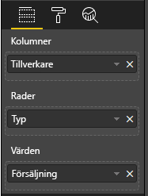

# <a name="add-interactivity-into-visual-by-power-bi-visuals-selections"></a>Lägga till interaktivitet i visuella objekt med Power BI-markeringar

I Power BI finns det två olika interaktionssätt mellan visuella objekt – markering och filtrering. Exemplet nedan visar hur du markerar objekt i ett visuellt objekt och informerar andra visuella objekt i rapporten om den nya markeringsstatusen.

`Selection`-objektet motsvarar gränssnittet:

```typescript
export interface ISelectionId {
    equals(other: ISelectionId): boolean;
    includes(other: ISelectionId, ignoreHighlight?: boolean): boolean;
    getKey(): string;
    getSelector(): Selector;
    getSelectorsByColumn(): SelectorsByColumn;
    hasIdentity(): boolean;
}
```

## <a name="how-to-use-selectionmanager-to-select-data-points"></a>Så här använder du SelectionManager till att markera datapunkter

Det visuella värdobjektet innehåller en metod för att skapa instanser av markeringshanteraren. Markeringshanteraren är ansvarig för att markera, ta bort markeringar, visa snabbmenyn, lagra aktuella markeringar och kontrollera markeringsstatusen. Markeringshanteraren innehåller dessutom motsvarande metoder för dessa åtgärder.

### <a name="create-instance-of-selection-manager"></a>Skapa en instans av markeringshanteraren

När du använder markeringshanteraren måste du skapa en instans av den. Visuella objekt skapar vanligtvis en instans av markeringshanteraren i `constructor` för det visuella objektet.

```typescript
export class Visual implements IVisual {
    private target: HTMLElement;
    private host: IVisualHost;
    private selectionManager: ISelectionManager;
    // ...
    constructor(options: VisualConstructorOptions) {
        this.host = options.host;
        // ...
        this.selectionManager = this.host.createSelectionManager();
    }
    // ...
}
```

### <a name="create-instance-of-selection-builder"></a>Skapa en instans av markeringsverktyget

När instansen för markeringshanteraren har skapats, måste du skapa `selections` för varje datapunkt i det visuella objektet. Det visuella värdobjektet innehåller metoden `createSelectionIdBuilder` där du kan generera markeringar för varje datapunkt. Den här metoden returnerar en instans av objektet med gränssnittet `powerbi.visuals.ISelectionIdBuilder`:

```typescript
export interface ISelectionIdBuilder {
    withCategory(categoryColumn: DataViewCategoryColumn, index: number): this;
    withSeries(seriesColumn: DataViewValueColumns, valueColumn: DataViewValueColumn | DataViewValueColumnGroup): this;
    withMeasure(measureId: string): this;
    withMatrixNode(matrixNode: DataViewMatrixNode, levels: DataViewHierarchyLevel[]): this;
    withTable(table: DataViewTable, rowIndex: number): this;
    createSelectionId(): ISelectionId;
}
```

Objektet innehåller motsvarande metoder för att skapa `selections` för olika typer av datavymappningar.

> [!NOTE]
> Metoderna `withTable` och `withMatrixNode` lanserades i API 2.5.0 för visuella Power BI-objekt.
> Om du behöver använda markeringar i datavymappningar för tabeller eller matriser, måste du uppdatera API-versionen till 2.5.0 eller högre.

### <a name="create-selections-for-categorical-data-view-mapping"></a>Skapa markeringar för mappning av kategoriska datavyer

Vi ska se hur markeringar visas i mappningen av kategoriska datavyer i exempeldatamängden:

| Tillverkare | Typ | Värde |
| - | - | - |
| Chrysler | Inhemsk bil | 28883 |
| Chrysler | Inhemsk lastbil | 117131 |
| Chrysler | Importerad bil | 0 |
| Chrysler | Importerad lastbil | 6362 |
| Ford | Inhemsk bil | 50032 |
| Ford | Inhemsk lastbil | 122446 |
| Ford | Importerad bil | 0 |
| Ford | Importerad lastbil | 0 |
| GM | Inhemsk bil | 65426 |
| GM | Inhemsk lastbil | 138122 |
| GM | Importerad bil | 197 |
| GM | Importerad lastbil | 0 |
| Honda | Inhemsk bil | 51450 |
| Honda | Inhemsk lastbil | 46115 |
| Honda | Importerad bil | 2932 |
| Honda | Importerad lastbil | 0 |
| Nissan | Inhemsk bil | 51476 |
| Nissan | Inhemsk lastbil | 47343 |
| Nissan | Importerad bil | 5485 |
| Nissan | Importerad lastbil | 1430 |
| Toyota | Inhemsk bil | 55643 |
| Toyota | Inhemsk lastbil | 61227 |
| Toyota | Importerad bil | 20799 |
| Toyota | Importerad lastbil | 23614 |

Och det visuella objektet använder följande mappning av datavyn:

```json
{
    "dataRoles": [
        {
            "displayName": "Columns",
            "name": "columns",
            "kind": "Grouping"
        },
        {
            "displayName": "Rows",
            "name": "rows",
            "kind": "Grouping"
        },
        {
            "displayName": "Values",
            "name": "values",
            "kind": "Measure"
        }
    ],
    "dataViewMappings": [
        {
            "categorical": {
                "categories": {
                    "for": {
                        "in": "columns"
                    }
                },
                "values": {
                    "group": {
                        "by": "rows",
                        "select": [
                            {
                                "for": {
                                    "in": "values"
                                }
                            }
                        ]
                    }
                }
            }
        }
    ]
}
```

I exemplet är `Manafacturer` `columns` och `Type` är `rows`. Det finns serier som skapats med grupperade värden av `rows` (`Type`).

Och det visuella objektet ska kunna segmentera data från `Manafacturer` och `Type`.

När användaren exempelvis väljer `Chrysler` i `Manafacturer`, bör andra visuella objekt visa följande data:

| Tillverkare | Typ | Värde |
| - | - | - |
| **Chrysler** | Inhemsk bil | 28883 |
| **Chrysler** | Inhemsk lastbil | 117131 |
| **Chrysler** | Importerad bil | 0 |
| **Chrysler** | Importerad lastbil | 6362 |

När användaren väljer `Import Car` i `Type` (väljer data i serier), bör de andra visuella objekten visa följande data:

| Tillverkare | Typ | Värde |
| - | - | - |
| Chrysler | **Importerad bil** | 0 |
| Ford | **Importerad bil** | 0 |
| GM | **Importerad bil** | 197 |
| Honda | **Importerad bil** | 2932 |
| Nissan | **Importerad bil** | 5485 |
| Toyota | **Importerad bil** | 20799 |


De visuella datakorgarna måste fyllas i.



Det finns `Manafacturer` som kategori (kolumner), `Type` som serier (rader) och `Value` som `Values` för serier.

> [!NOTE]
> `Values` krävs för serier, eftersom enligt mappningen av datavyer förväntar sig det visuella objektet att `Values` kommer att grupperas av `Rows`-data.

#### <a name="create-selections-for-categories"></a>Skapa markeringar för kategorier

```typescript
// categories
const categories = dataView.categorical.categories;

// create label for 'Manafacturer' column
const p = document.createElement("p") as HTMLParagraphElement;
p.innerText = categories[0].source.displayName.toString();
this.target.appendChild(p);

// get count of category elements
const categoriesCount = categories[0].values.length;

// iterate all categories to generate selection and create button elements to use selections
for (let categoryIndex = 0; categoryIndex < categoriesCount; categoryIndex++) {
    const categoryValue: powerbi.PrimitiveValue = categories[0].values[categoryIndex];

    const categorySelectionId = this.host.createSelectionIdBuilder()
        .withCategory(categories[0], categoryIndex) // we have only one category (only one `Manafacturer` column)
        .createSelectionId();
    this.dataPoints.push({
        value: categoryValue,
        selection: categorySelectionId
    });
    console.log(categorySelectionId);

    // create button element to apply selection on click
    const button = document.createElement("button") as HTMLButtonElement;
    button.value = categoryValue.toString();
    button.innerText = categoryValue.toString();
    button.addEventListener("click", () => {
        // handle click event to apply correspond selection
        this.selectionManager.select(categorySelectionId);
    });
    this.target.appendChild(button);
}
```

I exempelkoden kan du se att vi itererar alla kategorier. I varje iteration anropar vi `createSelectionIdBuilder` för att skapa nästa markering för varje kategori, genom att anropa `withCategory`-metoden för markeringsverktyget. Metoden `createSelectionId` används som en slutgiltig metod för att returnera genererade `selection`-objekt.

I `withCategory`-metoden skickar vi kolumnen `category`, i det exempel är den `Manafacturer`, samt indexet för kategorielementet.

#### <a name="create-selections-for-series"></a>Skapa markeringar för serier

```typescript
// get groupped values for series
const series: powerbi.DataViewValueColumnGroup[] = dataView.categorical.values.grouped();

// create label for 'Type' column
const p2 = document.createElement("p") as HTMLParagraphElement;
p2.innerText = dataView.categorical.values.source.displayName;
this.target.appendChild(p2);

// iterate all series to generate selection and create button elements to use selections
series.forEach( (ser: powerbi.DataViewValueColumnGroup) => {
    // create selection id for series
    const seriesSelectionId = this.host.createSelectionIdBuilder()
        .withSeries(dataView.categorical.values, ser)
        .createSelectionId();

    this.dataPoints.push({
        value: ser.name,
        selection: seriesSelectionId
    });

    // create button element to apply selection on click
    const button = document.createElement("button") as HTMLButtonElement;
    button.value =ser.name.toString();
    button.innerText = ser.name.toString();
    button.addEventListener("click", () => {
        // handle click event to apply correspond selection
        this.selectionManager.select(seriesSelectionId);
    });
    this.target.appendChild(button);
});
```

### <a name="create-selections-for-table-data-view-mapping"></a>Skapa markeringar för mappning av tabelldatavyer

Exempel på mappning av tabelldatavyer

```json
{
    "dataRoles": [
        {
            "displayName": "Values",
            "name": "values",
            "kind": "GroupingOrMeasure"
        }
    ],
    "dataViewMappings": [
        {
            "table": {
                "rows": {
                    "for": {
                        "in": "values"
                    }
                }
            }
        }
    ]
}
```

Om du vill skapa en markering för varje rad i mappningen av tabelldatavyn, måste du anropa `withTable`-metoden i markeringsverktyget.

```typescript
public update(options: VisualUpdateOptions) {
    const dataView = options.dataViews[0];
    dataView.table.rows.forEach((row: DataViewTableRow, rowIndex: number) => {
        this.target.appendChild(rowDiv);
        const selection: ISelectionId = this.host.createSelectionIdBuilder()
            .withTable(dataView.table, rowIndex)
            .createSelectionId();
    }
}
```

Den visuella koden itererar raderna i tabellen och varje rad anropar tabellmetoden `withTable`. Parametrarna i `withTable`-metoden är `table`-objekt och index för tabellraden.

### <a name="create-selections-for-matrix-data-view-mapping"></a>Skapa markeringar för mappning av matrisdatavyer

```typescript
public update(options: VisualUpdateOptions) {
    const host = this.host;
    const rowLevels: powerbi.DataViewHierarchyLevel[] = dataView.matrix.rows.levels;
    const columnLevels: powerbi.DataViewHierarchyLevel[] = dataView.matrix.rows.levels;

    // iterate rows hierarchy
    nodeWalker(dataView.matrix.rows.root, rowLevels);
    // iterate columns hierarchy
    nodeWalker(dataView.matrix.columns.root, columnLevels);

    function nodeWalker(node: powerbi.DataViewMatrixNode, levels: powerbi.DataViewHierarchyLevel[]) {
        const nodeSelection = host.createSelectionIdBuilder().withMatrixNode(node, levels);

        if (node.children && node.children.length) {
            node.children.forEach(child => {
                nodeWalker(child, levels);
            });
        }
    }
}
```

I exemplet anropar `nodeWalker` rekursivt varje nod och underordnade noder.

`nodeWalker` skapar `nodeSelection`-objekt vid varje anrop. Varje `nodeSelection` utgör en `selection` av motsvarande noder.

## <a name="select-datapoints-to-slice-other-visuals"></a>Välja datapunkter för att segmentera andra visuella objekt

I exempelkoderna för markering av kategorisk datavymappning, såg du att vi skapade klickhanterare för knappelement. Hanteraren anropar `select`-metoden i markeringshanteraren och skickar markeringsobjekt.

```typescript
button.addEventListener("click", () => {
    // handle click event to apply correspond selection
    this.selectionManager.select(categorySelectionId);
});
```

Gränssnittet för `select`-metoden är

```typescript
interface ISelectionManager {
    // ...
    select(selectionId: ISelectionId | ISelectionId[], multiSelect?: boolean): IPromise<ISelectionId[]>;
    // ...
}
```

Du kan se att `select` kan acceptera en matris med markeringar. Det innebär att ditt visuella objekt kan välja flera datapunkter. Med den andra parametern `multiSelect` kan du markera flera. Om värdet är sant tar Power BI inte bort föregående markeringsstatus utan tillämpar aktuell markering, annars kommer föregående markering att återställas.

Ett vanligt scenario där `multiSelect`-hantering av CTRL-knappens status används på klickhändelsen.

```typescript
button.addEventListener("click", (mouseEvent) => {
    const multiSelect = (mouseEvent as MouseEvent).ctrlKey;
    this.selectionManager.select(seriesSelectionId, multiSelect);
});
```

## <a name="next-steps"></a>Nästa steg

* [Läs om hur du använder markeringar till att binda visuella egenskaper till datapunkter](objects-properties.md#objects-selector)

* [Läs om hur du hanterar markeringar när du växlar mellan bokmärken](bookmarks-support.md#visuals-with-selection)

* [Läs om hur du lägger till snabbmenyn för visuella datapunkter](context-menu.md)

* [Läs om hur du använder InteractivityUtils för att lägga till markeringar i visuella Power BI-objekt](utils-interactivity-selections.md)
