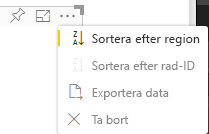

# <a name="sorting-options-for-power-bi-visuals"></a>Sorteringsalternativ för visuella Power BI-objekt

I den här artikeln beskrivs hur *sorteringsalternativ* anger sorteringsbeteendet för visuella Power BI-objekt. 

Sorteringsfunktionen kräver en av följande parametrar.

## <a name="default-sorting"></a>Standardsortering

Alternativet `default` är den enklaste varianten. Det gör det möjligt att sortera data som visas i avsnittet "DataMappings". Det här alternativet möjliggör sortering av datamappningarna av användaren anger sorteringsriktningen.

```json
    "sorting": {
        "default": {   }
    }
```



## <a name="implicit-sorting"></a>Implicit sortering

Implicit sortering är sortering med matrisparametern `clauses`, som beskriver sortering för varje dataroll. `implicit` innebär att det visuella objektets användare inte kan ändra sorteringsordningen. Power BI visar inte sorteringsalternativ i menyn för det visuella objektet. Power BI sorterar dock data enligt angivna inställningar.

`clauses`-parametrar kan innehålla flera objekt med två parametrar:

- `role`: Bestämmer `DataMapping` för sortering
- `direction`: Bestämmer sorteringsriktningen (1 = stigande, 2 = fallande)

```json
    "sorting": {
        "implicit": {
            "clauses": [
                {
                    "role": "category",
                    "direction": 1
                },
                {
                    "role": "measure",
                    "direction": 2
                }
            ]
        }
    }
```

## <a name="custom-sorting"></a>Anpassad sortering

Anpassad sortering innebär att sorteringen hanteras av utvecklaren i det visuella objektets kod.
