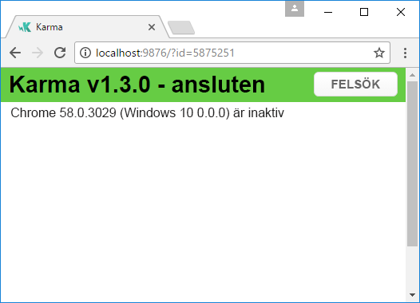
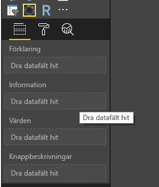

# <a name="tutorial-add-unit-tests-for-power-bi-visual-projects"></a>Självstudie: Lägga till enhetstester för projekt med visuella Power BI-objekt

I den här artikeln beskrivs grunderna i att skriva enhetstester för visuella Power BI-objekt, däribland hur du gör följande:

* Konfigurera testramverket för Karma JavaScript-testköraren, Jasmine.
* Använda paketet powerbi-visuals-utils-testutils.
* Använda påhittade exempel till att förenkla enhetstestning för visuella Power BI-objekt.

## <a name="prerequisites"></a>Förutsättningar

* Ett installerat projekt för visuella Power BI-objekt
* En konfigurerad Node.JS-miljö

## <a name="install-and-configure-the-karma-javascript-test-runner-and-jasmine"></a>Installera och konfigurera Karma JavaScript-testköraren och Jasmine

Lägg till de bibliotek som krävs till filen *package.json* i avsnittet `devDependencies`:

```json
"@babel/polyfill": "^7.2.5",
"@types/d3": "5.5.0",
"@types/jasmine": "2.5.37",
"@types/jasmine-jquery": "1.5.28",
"@types/jquery": "2.0.41",
"@types/karma": "3.0.0",
"@types/lodash-es": "4.17.1",
"coveralls": "3.0.2",
"istanbul-instrumenter-loader": "^3.0.1",
"jasmine": "2.5.2",
"jasmine-core": "2.5.2",
"jasmine-jquery": "2.1.1",
"jquery": "3.1.1",
"karma": "3.1.1",
"karma-chrome-launcher": "2.2.0",
"karma-coverage": "1.1.2",
"karma-coverage-istanbul-reporter": "^2.0.4",
"karma-jasmine": "2.0.1",
"karma-junit-reporter": "^1.2.0",
"karma-sourcemap-loader": "^0.3.7",
"karma-typescript": "^3.0.13",
"karma-typescript-preprocessor": "0.4.0",
"karma-webpack": "3.0.5",
"puppeteer": "1.17.0",
"style-loader": "0.23.1",
"ts-loader": "5.3.0",
"ts-node": "7.0.1",
"tslint": "^5.12.0",
"webpack": "4.26.0"
```

Mer information om *package.json* finns i beskrivningen på [npm-package.json](https://docs.npmjs.com/files/package.json).

Spara filen *package.json* och kör följande kommando på platsen `package.json`:

```cmd
npm install
```

Pakethanteraren installerar alla nya paket som läggs till i *package.json*.

Kör enhetstester genom att konfigurera testköraren och `webpack`-konfigurationen.

Följande kod är ett exempel på filen *test.webpack.config.js*:

```typescript
const path = require('path');
const webpack = require("webpack");

module.exports = {
    devtool: 'source-map',
    mode: 'development',
    optimization : {
        concatenateModules: false,
        minimize: false
    },
    module: {
        rules: [
            {
                test: /\.tsx?$/,
                use: 'ts-loader',
                exclude: /node_modules/
            },
            {
                test: /\.json$/,
                loader: 'json-loader'
            },
            {
                test: /\.tsx?$/i,
                enforce: 'post',
                include: /(src)/,
                exclude: /(node_modules|resources\/js\/vendor)/,
                loader: 'istanbul-instrumenter-loader',
                options: { esModules: true }
            },
            {
                test: /\.less$/,
                use: [
                    {
                        loader: 'style-loader'
                    },
                    {
                        loader: 'css-loader'
                    },
                    {
                        loader: 'less-loader',
                        options: {
                            paths: [path.resolve(__dirname, 'node_modules')]
                        }
                    }
                ]
            }
        ]
    },
    externals: {
        "powerbi-visuals-api": '{}'
    },
    resolve: {
        extensions: ['.tsx', '.ts', '.js', '.css']
    },
    output: {
        path: path.resolve(__dirname, ".tmp/test")
    },
    plugins: [
        new webpack.ProvidePlugin({
            'powerbi-visuals-api': null
        })
    ]
};
```

Följande kod är ett exempel på filen *karma.conf.ts*:

```typescript
"use strict";

const webpackConfig = require("./test.webpack.config.js");
const tsconfig = require("./test.tsconfig.json");
const path = require("path");

const testRecursivePath = "test/visualTest.ts";
const srcOriginalRecursivePath = "src/**/*.ts";
const coverageFolder = "coverage";

process.env.CHROME_BIN = require("puppeteer").executablePath();

import { Config, ConfigOptions } from "karma";

module.exports = (config: Config) => {
    config.set(<ConfigOptions>{
        mode: "development",
        browserNoActivityTimeout: 100000,
        browsers: ["ChromeHeadless"], // or Chrome to use locally installed Chrome browser
        colors: true,
        frameworks: ["jasmine"],
        reporters: [
            "progress",
            "junit",
            "coverage-istanbul"
        ],
        junitReporter: {
            outputDir: path.join(__dirname, coverageFolder),
            outputFile: "TESTS-report.xml",
            useBrowserName: false
        },
        singleRun: true,
        plugins: [
            "karma-coverage",
            "karma-typescript",
            "karma-webpack",
            "karma-jasmine",
            "karma-sourcemap-loader",
            "karma-chrome-launcher",
            "karma-junit-reporter",
            "karma-coverage-istanbul-reporter"
        ],
        files: [
            "node_modules/jquery/dist/jquery.min.js",
            "node_modules/jasmine-jquery/lib/jasmine-jquery.js",
            {
                pattern: './capabilities.json',
                watched: false,
                served: true,
                included: false
            },
            testRecursivePath,
            {
                pattern: srcOriginalRecursivePath,
                included: false,
                served: true
            }
        ],
        preprocessors: {
            [testRecursivePath]: ["webpack", "coverage"]
        },
        typescriptPreprocessor: {
            options: tsconfig.compilerOptions
        },
        coverageIstanbulReporter: {
            reports: ["html", "lcovonly", "text-summary", "cobertura"],
            dir: path.join(__dirname, coverageFolder),
            'report-config': {
                html: {
                    subdir: 'html-report'
                }
            },
            combineBrowserReports: true,
            fixWebpackSourcePaths: true,
            verbose: false
        },
        coverageReporter: {
            dir: path.join(__dirname, coverageFolder),
            reporters: [
                // reporters not supporting the `file` property
                { type: 'html', subdir: 'html-report' },
                { type: 'lcov', subdir: 'lcov' },
                // reporters supporting the `file` property, use `subdir` to directly
                // output them in the `dir` directory
                { type: 'cobertura', subdir: '.', file: 'cobertura-coverage.xml' },
                { type: 'lcovonly', subdir: '.', file: 'report-lcovonly.txt' },
                { type: 'text-summary', subdir: '.', file: 'text-summary.txt' },
            ]
        },
        mime: {
            "text/x-typescript": ["ts", "tsx"]
        },
        webpack: webpackConfig,
        webpackMiddleware: {
            stats: "errors-only"
        }
    });
};
```

Vid behov kan du ändra den här konfigurationen.

Koden i *karma.conf.js* innehåller följande variabel:

* `recursivePathToTests`: Letar upp testkoden

* `srcRecursivePath`: Letar upp JavaScript-utdatakoden efter kompilering

* `srcCssRecursivePath`: Letar upp utdata-CSS efter kompilering av mindre fil med format

* `srcOriginalRecursivePath`: Letar upp det visuella objektets källkod

* `coverageFolder`: Bestämmer var täckningsrapporten ska skapas

Konfigurationsfilen innehåller följande egenskaper:

* `singleRun: true`: Testerna körs i ett system för kontinuerlig integrering (CI) eller kan köras en enda gång. Du kan ändra inställningen till *false* (falskt) för felsökning av dina tester. Karma håller webbläsaren igång så att du kan använda konsolen för felsökning.

* `files: [...]`: I den här matrisen kan du ange vilka filer som ska läsas in i webbläsaren. Det finns vanligtvis källfiler, testfall och bibliotek (Jasmine, testverktyg). Du kan lägga till ytterligare filer i listan om det behövs.

* `preprocessors`: I det här avsnittet konfigurerar du åtgärder som körs innan enhetstesterna körs. De förkompilerar TypeScript till JavaScript, förbereder källmappfiler samt genererar kodtäckningsrapport. Du kan inaktivera `coverage` när du felsöker tester. Täckning genererar ytterligare kontrollkod för testtäckningen, vilket komplicerar felsökningstesterna.

Beskrivningar av alla Karma-konfigurationer finns på sidan för [Karma-konfigurationsfil](https://karma-runner.github.io/1.0/config/configuration-file.html).

För bekvämlighetens skull kan du lägga till ett testkommando i `scripts`:

```json
{
    "scripts": {
        "pbiviz": "pbiviz",
        "start": "pbiviz start",
        "typings":"node node_modules/typings/dist/bin.js i",
        "lint": "tslint -r \"node_modules/tslint-microsoft-contrib\"  \"+(src|test)/**/*.ts\"",
        "pretest": "pbiviz package --resources --no-minify --no-pbiviz --no-plugin",
        "test": "karma start"
    }
    ...
}
```

Nu är du redo att börja skriva enhetstesterna.

## <a name="check-the-dom-element-of-the-visual"></a>Kontrollera det visuella objektets DOM-element

För att testa det visuella objektet skapar du först en instans av det.

### <a name="create-a-visual-instance-builder"></a>Skapar en instansbyggare för visuella objekt

Lägg till en *visualBuilder.ts*-fil i mappen *test* med hjälp av följande kod:

```typescript
import {
    VisualBuilderBase
} from "powerbi-visuals-utils-testutils";

import {
    BarChart as VisualClass
} from "../src/visual";

import  powerbi from "powerbi-visuals-api";
import VisualConstructorOptions = powerbi.extensibility.visual.VisualConstructorOptions;

export class BarChartBuilder extends VisualBuilderBase<VisualClass> {
    constructor(width: number, height: number) {
        super(width, height);
    }

    protected build(options: VisualConstructorOptions) {
        return new VisualClass(options);
    }

    public get mainElement() {
        return this.element.children("svg.barChart");
    }
}
```

Det finns `build`-metoder för att skapa en instans av det visuella objektet. `mainElement` är en get-metod som returnerar en instans av "root"-DOM-element (dokumentobjektsmodell) i ditt visuella objekt. Get-metoden är valfri men gör det enklare att skriva enhetstester.

Nu har du en version av en instans av ditt visuella objekt. Vi skriver testfallet. Testfallet kontrollerar de SVG-element som skapas när ditt visuella objekt visas.

### <a name="create-a-typescript-file-to-write-test-cases"></a>Skapa en TypeScript-fil för att skriva testfall

Lägg till en *visualTest.ts*-fil för testfallen med hjälp av följande kod:

```typescript
import powerbi from "powerbi-visuals-api";

import { BarChartBuilder } from "./VisualBuilder";

import {
    BarChart as VisualClass
} from "../src/visual";

import VisualBuilder = powerbi.extensibility.visual.test.BarChartBuilder;

describe("BarChart", () => {
    let visualBuilder: VisualBuilder;
    let dataView: DataView;

    beforeEach(() => {
        visualBuilder = new VisualBuilder(500, 500);
    });

    it("root DOM element is created", () => {
        expect(visualBuilder.mainElement).toBeInDOM();
    });
});
```

Flera metoder anropas:

* [`describe`](https://jasmine.github.io/api/2.6/global.html#describe): Beskriver ett testfall. I samband med Jasmine-ramverket beskriver den ofta en uppsättning eller en grupp med specifikationer.

* `beforeEach`: Anropas före varje anrop av metoden `it`, som definieras i metoden [`describe`](https://jasmine.github.io/api/2.6/global.html#beforeEach).

* [`it`](https://jasmine.github.io/api/2.6/global.html#it): Definierar en enskild specifikation. Metoden `it` bör innehålla en eller flera `expectations`.

* [`expect`](https://jasmine.github.io/api/2.6/global.html#expect): Skapar en förväntan på en specifikation. En specifikation lyckas om alla förväntningar lyckas utan problem.

* `toBeInDOM`: En av *matchers*-metoderna. Mer information om matchers finns i [Jasmine-namnrymd: matchers](https://jasmine.github.io/api/2.6/matchers.html).

Mer information om Jasmine finns på sidan med [dokumentation om Jasmine-ramverket](https://jasmine.github.io/).

### <a name="launch-unit-tests"></a>Starta enhetstester

Det här testet kontrollerar att de visuella objektens rot-SVG-element skapas. För att köra enhetstestet anger du följande kommando i kommandoradsverktyget:

```cmd
npm run test
```

`karma.js` kör testfallet i webbläsaren Chrome.



> [!NOTE]
> Du måste installera Google Chrome lokalt.

I kommandoradsfönstret får du följande utdata:

```cmd
> karma start

23 05 2017 12:24:26.842:WARN [watcher]: Pattern "E:/WORKSPACE/PowerBI/PowerBI-visuals-sampleBarChart/data/*.csv" does not match any file.
23 05 2017 12:24:30.836:WARN [karma]: No captured browser, open https://localhost:9876/
23 05 2017 12:24:30.849:INFO [karma]: Karma v1.3.0 server started at https://localhost:9876/
23 05 2017 12:24:30.850:INFO [launcher]: Launching browser Chrome with unlimited concurrency
23 05 2017 12:24:31.059:INFO [launcher]: Starting browser Chrome
23 05 2017 12:24:33.160:INFO [Chrome 58.0.3029 (Windows 10 0.0.0)]: Connected on socket /#2meR6hjXFmsE_fjiAAAA with id 5875251
Chrome 58.0.3029 (Windows 10 0.0.0): Executed 1 of 1 SUCCESS (0.194 secs / 0.011 secs)

=============================== Coverage summary ===============================
Statements   : 27.43% ( 65/237 )
Branches     : 19.84% ( 25/126 )
Functions    : 43.86% ( 25/57 )
Lines        : 20.85% ( 44/211 )
================================================================================
```

### <a name="how-to-add-static-data-for-unit-tests"></a>Så lägger du till statiska data för enhetstester

Skapa filen *visualData.ts* i mappen *test* med hjälp av följande kod:

```typescript
import powerbi from "powerbi-visuals-api";
import DataView = powerbi.DataView;

import {
    testDataViewBuilder,
    getRandomNumbers
} from "powerbi-visuals-utils-testutils";

export class SampleBarChartDataBuilder extends TestDataViewBuilder {
    public static CategoryColumn: string = "category";
    public static MeasureColumn: string = "measure";

    public constructor() {
        super();
        ...
    }

    public getDataView(columnNames?: string[]): DataView {
        let dateView: any = this.createCategoricalDataViewBuilder([
            ...
        ],
        [
            ...
        ], columnNames).build();

        // there's client side computed maxValue
        let maxLocal = 0;
        this.valuesMeasure.forEach((item) => {
                if (item > maxLocal) {
                    maxLocal = item;
                }
        });
        (<any>dataView).categorical.values[0].maxLocal = maxLocal;
    }
}
```

Klassen `SampleBarChartDataBuilder` utökar `TestDataViewBuilder` och implementerar den abstrakta metoden `getDataView`.

När du lagrar data i datafältsbuckets skapar Power BI ett kategoriskt `dataview`-objekt som baseras på dina data.



I enhetstester har du inte Power BI-kärnfunktioner för att reproducera data. Men du behöver mappa dina statiska data till den kategoriska `dataview`. Klassen `TestDataViewBuilder` kan hjälpa dig att mappa dem.

Mer information om mappning av datavyer finns i [DataViewMappings](https://github.com/Microsoft/PowerBI-visuals/blob/master/Capabilities/DataViewMappings.md).

I metoden `getDataView` anropar du metoden `createCategoricalDataViewBuilder` med dina data.

I det visuella `sampleBarChart`-objektets [capabilities.json](https://github.com/Microsoft/PowerBI-visuals-sampleBarChart/blob/master/capabilities.json#L2)-fil har vi dataRoles- och dataViewMapping-objekt:

```json
"dataRoles": [
    {
        "displayName": "Category Data",
        "name": "category",
        "kind": "Grouping"
    },
    {
        "displayName": "Measure Data",
        "name": "measure",
        "kind": "Measure"
    }
],
"dataViewMappings": [
    {
        "conditions": [
            {
                "category": {
                    "max": 1
                },
                "measure": {
                    "max": 1
                }
            }
        ],
        "categorical": {
            "categories": {
                "for": {
                    "in": "category"
                }
            },
            "values": {
                "select": [
                    {
                        "bind": {
                            "to": "measure"
                        }
                    }
                ]
            }
        }
    }
],
```

För att generera samma mappning måste du ange följande parametrar till metoden `createCategoricalDataViewBuilder`:

```typescript
([
    {
        source: {
            displayName: "Category",
            queryName: SampleBarChartData.ColumnCategory,
            type: ValueType.fromDescriptor({ text: true }),
            roles: {
                Category: true
            },
        },
        values: this.valuesCategory
    }
],
[
    {
        source: {
            displayName: "Measure",
            isMeasure: true,
            queryName: SampleBarChartData.MeasureColumn,
            type: ValueType.fromDescriptor({ numeric: true }),
            roles: {
                Measure: true
            },
        },
        values: this.valuesMeasure
    },
], columnNames)
```

Där är `this.valuesCategory` en matris med kategorier:

```ts
public valuesCategory: string[] = ["Monday", "Tuesday", "Wednesday", "Thursday", "Friday", "Saturday", "Sunday"];
```

Och `this.valuesMeasure` är en matris med mått för varje kategori:

```ts
public valuesMeasure: number[] = [742731.43, 162066.43, 283085.78, 300263.49, 376074.57, 814724.34, 570921.34];
```

Nu kan du använda klassen `SampleBarChartDataBuilder` i enhetstestet.

Klassen `ValueType` definieras i paketet powerbi-visuals-utils-testutils. Och metoden `createCategoricalDataViewBuilder` kräver biblioteket `lodash`.

Lägg till de här paketen i beroendena.

I `package.json` i avsnittet `devDependencies`

```json
"lodash-es": "4.17.1",
"powerbi-visuals-utils-testutils": "2.2.0"
```

Anropa

```cmd
npm install
```

för att installera biblioteket `lodash-es`.

Nu kan du köra enhetstestet igen. Du måste få följande utdata:

```cmd
> karma start

23 05 2017 16:19:54.318:WARN [watcher]: Pattern "E:/WORKSPACE/PowerBI/PowerBI-visuals-sampleBarChart/data/*.csv" does not match any file.
23 05 2017 16:19:58.333:WARN [karma]: No captured browser, open https://localhost:9876/
23 05 2017 16:19:58.346:INFO [karma]: Karma v1.3.0 server started at https://localhost:9876/
23 05 2017 16:19:58.346:INFO [launcher]: Launching browser Chrome with unlimited concurrency
23 05 2017 16:19:58.394:INFO [launcher]: Starting browser Chrome
23 05 2017 16:19:59.873:INFO [Chrome 58.0.3029 (Windows 10 0.0.0)]: Connected on socket /#NcNTAGH9hWfGMCuEAAAA with id 3551106
Chrome 58.0.3029 (Windows 10 0.0.0): Executed 1 of 1 SUCCESS (1.266 secs / 1.052 secs)

=============================== Coverage summary ===============================
Statements   : 56.72% ( 135/238 )
Branches     : 32.54% ( 41/126 )
Functions    : 66.67% ( 38/57 )
Lines        : 52.83% ( 112/212 )
================================================================================
```

Ditt visuella objekt öppnas i webbläsaren Chrome så här:


Sammanfattningen visar att täckningen har ökat. Öppna `coverage\index.html` för att ta reda på mer om aktuell kodtäckning.


Eller titta på omfånget för mappen `src`:


I omfånget för filen kan du titta på källkoden. `Coverage`-verktygen skulle markera raden i rött om viss kod inte körs under enhetstesterna.


> [!IMPORTANT]
> Kodtäckning innebär inte att du har god funktionstäckning för det visuella objektet. Ett enkelt enhetstest ger över 96 procents täckning i `src\visual.ts`.

## <a name="next-steps"></a>Nästa steg

När ditt visuella objekt är redo kan du skicka det till publicering. Mer information finns i [Publicera visuella Power BI-objekt till AppSource](office-store.md).
