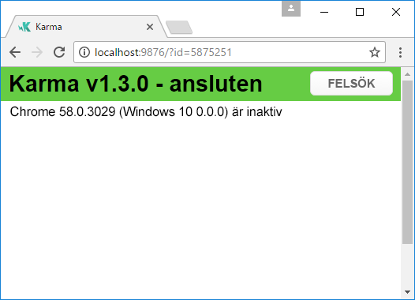
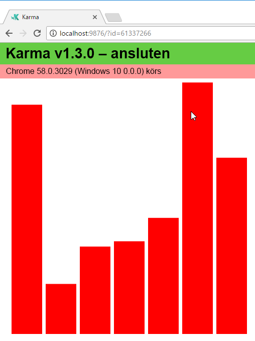
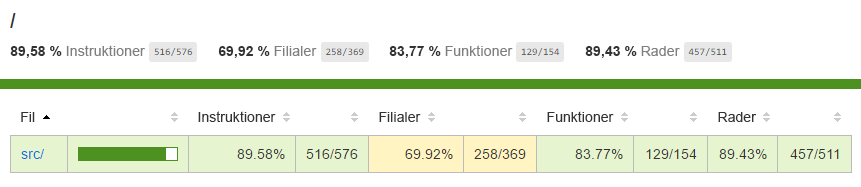
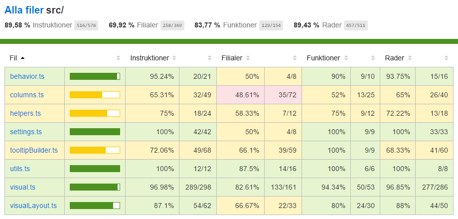

# <a name="tutorial-add-unit-tests-for-power-bi-visual-projects"></a>Självstudie: lägga till enhetstester för projekt med visuella Power BI-objekt

I den här självstudien beskrivs grunderna i att skriva enhetstester för visuella Power BI-objekt.

I den här självstudien överväger vi följande:

* hur du använder testköraren karma.js och testramverket – jasmine.js
* hur du använder paketet powerbi-visuals-utils-testutils
* hur en uppsättning påhittade exempel hjälper till att förenkla enhetstestning för visuella Power BI-objekt.

## <a name="prerequisites"></a>Förutsättningar

* Du har ett projekt för visuella Power BI-objekt
* Konfigurerad Node.JS-miljö

## <a name="install-and-configure-karmajs-and-jasmine"></a>Installera och konfigurera karma.js och jasmine

Lägg till nödvändiga bibliotek i package.json i avsnittet `devDependencies`:

```json
"@babel/polyfill": "^7.2.5",
"@types/d3": "5.5.0",
"@types/jasmine": "2.5.37",
"@types/jasmine-jquery": "1.5.28",
"@types/jquery": "2.0.41",
"@types/karma": "3.0.0",
"@types/lodash-es": "4.17.1",
"coveralls": "3.0.2",
"istanbul-instrumenter-loader": "^3.0.1",
"jasmine": "2.5.2",
"jasmine-core": "2.5.2",
"jasmine-jquery": "2.1.1",
"jquery": "3.1.1",
"karma": "3.1.1",
"karma-chrome-launcher": "2.2.0",
"karma-coverage": "1.1.2",
"karma-coverage-istanbul-reporter": "^2.0.4",
"karma-jasmine": "2.0.1",
"karma-junit-reporter": "^1.2.0",
"karma-sourcemap-loader": "^0.3.7",
"karma-typescript": "^3.0.13",
"karma-typescript-preprocessor": "0.4.0",
"karma-webpack": "3.0.5",
"puppeteer": "1.17.0",
"style-loader": "0.23.1",
"ts-loader": "5.3.0",
"ts-node": "7.0.1",
"tslint": "^5.12.0",
"webpack": "4.26.0"
```

Se beskrivningen nedan för att få mer information om paketet.

Spara `package.json` och kör på kommandoraden på vid platsen `package.json`:

```cmd
npm install
```

Pakethanteraren installerar alla nya paket som lagts till i `package.json`

För att köra enhetstester behöver vi konfigurera testköraren och `webpack`-konfigurationen. Exempel på konfiguration finns här

Exempel för `test.webpack.config.js`:

```typescript
const path = require('path');
const webpack = require("webpack");

module.exports = {
    devtool: 'source-map',
    mode: 'development',
    optimization : {
        concatenateModules: false,
        minimize: false
    },
    module: {
        rules: [
            {
                test: /\.tsx?$/,
                use: 'ts-loader',
                exclude: /node_modules/
            },
            {
                test: /\.json$/,
                loader: 'json-loader'
            },
            {
                test: /\.tsx?$/i,
                enforce: 'post',
                include: /(src)/,
                exclude: /(node_modules|resources\/js\/vendor)/,
                loader: 'istanbul-instrumenter-loader',
                options: { esModules: true }
            },
            {
                test: /\.less$/,
                use: [
                    {
                        loader: 'style-loader'
                    },
                    {
                        loader: 'css-loader'
                    },
                    {
                        loader: 'less-loader',
                        options: {
                            paths: [path.resolve(__dirname, 'node_modules')]
                        }
                    }
                ]
            }
        ]
    },
    externals: {
        "powerbi-visuals-api": '{}'
    },
    resolve: {
        extensions: ['.tsx', '.ts', '.js', '.css']
    },
    output: {
        path: path.resolve(__dirname, ".tmp/test")
    },
    plugins: [
        new webpack.ProvidePlugin({
            'powerbi-visuals-api': null
        })
    ]
};
```

Exempel för `karma.conf.ts`

```typescript
"use strict";

const webpackConfig = require("./test.webpack.config.js");
const tsconfig = require("./test.tsconfig.json");
const path = require("path");

const testRecursivePath = "test/visualTest.ts";
const srcOriginalRecursivePath = "src/**/*.ts";
const coverageFolder = "coverage";

process.env.CHROME_BIN = require("puppeteer").executablePath();

import { Config, ConfigOptions } from "karma";

module.exports = (config: Config) => {
    config.set(<ConfigOptions>{
        mode: "development",
        browserNoActivityTimeout: 100000,
        browsers: ["ChromeHeadless"], // or Chrome to use locally installed Chrome browser
        colors: true,
        frameworks: ["jasmine"],
        reporters: [
            "progress",
            "junit",
            "coverage-istanbul"
        ],
        junitReporter: {
            outputDir: path.join(__dirname, coverageFolder),
            outputFile: "TESTS-report.xml",
            useBrowserName: false
        },
        singleRun: true,
        plugins: [
            "karma-coverage",
            "karma-typescript",
            "karma-webpack",
            "karma-jasmine",
            "karma-sourcemap-loader",
            "karma-chrome-launcher",
            "karma-junit-reporter",
            "karma-coverage-istanbul-reporter"
        ],
        files: [
            "node_modules/jquery/dist/jquery.min.js",
            "node_modules/jasmine-jquery/lib/jasmine-jquery.js",
            {
                pattern: './capabilities.json',
                watched: false,
                served: true,
                included: false
            },
            testRecursivePath,
            {
                pattern: srcOriginalRecursivePath,
                included: false,
                served: true
            }
        ],
        preprocessors: {
            [testRecursivePath]: ["webpack", "coverage"]
        },
        typescriptPreprocessor: {
            options: tsconfig.compilerOptions
        },
        coverageIstanbulReporter: {
            reports: ["html", "lcovonly", "text-summary", "cobertura"],
            dir: path.join(__dirname, coverageFolder),
            'report-config': {
                html: {
                    subdir: 'html-report'
                }
            },
            combineBrowserReports: true,
            fixWebpackSourcePaths: true,
            verbose: false
        },
        coverageReporter: {
            dir: path.join(__dirname, coverageFolder),
            reporters: [
                // reporters not supporting the `file` property
                { type: 'html', subdir: 'html-report' },
                { type: 'lcov', subdir: 'lcov' },
                // reporters supporting the `file` property, use `subdir` to directly
                // output them in the `dir` directory
                { type: 'cobertura', subdir: '.', file: 'cobertura-coverage.xml' },
                { type: 'lcovonly', subdir: '.', file: 'report-lcovonly.txt' },
                { type: 'text-summary', subdir: '.', file: 'text-summary.txt' },
            ]
        },
        mime: {
            "text/x-typescript": ["ts", "tsx"]
        },
        webpack: webpackConfig,
        webpackMiddleware: {
            stats: "errors-only"
        }
    });
};
```

Du kan ändra den här konfigurationen om det behövs.

Några inställningar för `karma.conf.js`:

* Variabeln `recursivePathToTests` söker efter platsen för testernas kod.

* Variabeln `srcRecursivePath` hittar JS-utdatakod efter kompilering.

* Variabeln `srcCssRecursivePath` hittar utdata-CSS efter kompilering av mindre fil med format.

* Variabeln `srcOriginalRecursivePath` hittar det visuella objektets källkod.

* Variabeln `coverageFolder` bestämmer en plats där rapporten över täckningen ska skapas.

Några egenskaper för konfiguration:

* `singleRun: true` – tester körs i CI-systemet. Och det räcker med en enda gång.
Du kan ändra till `false` för att felsöka dina tester. Karma fortsätter att köras i webbläsaren, och du kan använda konsolen för felsökning.

* `files: [...]` – i den här matrisen kan du ange filer för inläsning till webbläsaren.
Det finns vanligtvis källfiler, testfall och bibliotek (jasmine, test-utils). Du kan lägga till andra filer i listan om det behövs.

* `preprocessors` – i det här avsnittet av konfigurationen konfigurerar du åtgärder som körs innan enhetstesterna körs. Det finns förkompilering av TypeScript till JS, förberedelse av källmappfiler samt generering av rapport för kodtäckning. Du kan inaktivera `coverage` för felsökning av dina tester. Täckning genererar ytterligare kod för kontrollkod för testtäckningen, och den kommer att komplicera felsökningstesterna.

**Beskrivning av alla konfigurationer finns i [dokumentationen](https://karma-runner.github.io/1.0/config/configuration-file.html) för karma.js**

För bekväm användning kan du lägga till testkommandot i `scripts`:

```json
{
    "scripts": {
        "pbiviz": "pbiviz",
        "start": "pbiviz start",
        "typings":"node node_modules/typings/dist/bin.js i",
        "lint": "tslint -r \"node_modules/tslint-microsoft-contrib\"  \"+(src|test)/**/*.ts\"",
        "pretest": "pbiviz package --resources --no-minify --no-pbiviz --no-plugin",
        "test": "karma start"
    }
    ...
}
```

Nu är du redo att börja skriva enhetstesterna.

## <a name="simple-unit-test-for-check-dom-element-of-the-visual"></a>Enkelt enhetstest för kontroll av DOM-element för det visuella objektet

Vi måste skapa en instans av visualisering för att testa visuella objekt.

### <a name="creating-visual-instance-builder"></a>Skapar instansbyggare för visuella objekt

Lägg till filen `visualBuilder.ts` i mappen `test` med följande kod:

```typescript
import {
    VisualBuilderBase
} from "powerbi-visuals-utils-testutils";

import {
    BarChart as VisualClass
} from "../src/visual";

import  powerbi from "powerbi-visuals-api";
import VisualConstructorOptions = powerbi.extensibility.visual.VisualConstructorOptions;

export class BarChartBuilder extends VisualBuilderBase<VisualClass> {
    constructor(width: number, height: number) {
        super(width, height);
    }

    protected build(options: VisualConstructorOptions) {
        return new VisualClass(options);
    }

    public get mainElement() {
        return this.element.children("svg.barChart");
    }
}
```

Det finns `build`-metoder för att skapa en instans av det visuella objektet. `mainElement` är en get-metod som returnerar en instans av "rot"-DOM-elementet i ditt visuella objekt. Get-metoden är valfri men det blir enklare att skriva enhetstester.

Vi har alltså byggaren för en instans av visuellt objekt. Vi skriver testfallet. Det blir ett testfall för att kontrollera de SVG-element som skapas när dina visuella objekt visas.

### <a name="creating-typescript-file-to-write-test-cases"></a>Skapa TypeScript-fil för att skriva testfall

Lägg till `visualTest.ts`-fil för testfall med följande koder:

```typescript
import powerbi from "powerbi-visuals-api";

import { BarChartBuilder } from "./VisualBuilder";

import {
    BarChart as VisualClass
} from "../src/visual";

import VisualBuilder = powerbi.extensibility.visual.test.BarChartBuilder;

describe("BarChart", () => {
    let visualBuilder: VisualBuilder;
    let dataView: DataView;

    beforeEach(() => {
        visualBuilder = new VisualBuilder(500, 500);
    });

    it("root DOM element is created", () => {
        expect(visualBuilder.mainElement).toBeInDOM();
    });
});
```

Det finns anrop av flera metoder.

* Metoden [`describe`](https://jasmine.github.io/api/2.6/global.html#describe) beskriver testfall. I en kontext för jasmine-ramverket kallas detta ofta för en svit eller grupp med specifikationer.

* Metoden `beforeEach` anropas före varje anrop av metoden `it`, som definieras i metoden [`describe`](https://jasmine.github.io/api/2.6/global.html#beforeEach).

* `it` definierar en enskild specifikation. Metoden [`it`](https://jasmine.github.io/api/2.6/global.html#it) ska innehålla en eller flera `expectations`.

* Metoden [`expect`](https://jasmine.github.io/api/2.6/global.html#expect) skapar en förväntan för en specifikation. En specifikation lyckas om alla förväntningar lyckas utan problem.

* `toBeInDOM` – detta är en av matchningsmetoderna. Du kan läsa om exists-matchare i [dokumentationen](https://jasmine.github.io/api/2.6/matchers.html) för jasmine-ramverket.

**Läs mer om jasmine-ramverket i den officiella [dokumentationen](https://jasmine.github.io/).**

Sedan kan du köra enhetstestet genom att skriva ett kommando i kommandoradsverktyget.

Det här testet kontrollerar att de visuella objektens rot-SVG-element skapas.

### <a name="launch-unit-tests"></a>Starta enhetstester

För att köra enhetstestet kan du skriva det här kommandot i kommandoradsverktyget.

```cmd
npm run test
```

`karma.js` kör Chrome-webbläsaren och testfallet.



> [!NOTE]
> Google Chrome måste installeras lokalt.

I kommandoraden får du följande utdata:

```cmd
> karma start

23 05 2017 12:24:26.842:WARN [watcher]: Pattern "E:/WORKSPACE/PowerBI/PowerBI-visuals-sampleBarChart/data/*.csv" does not match any file.
23 05 2017 12:24:30.836:WARN [karma]: No captured browser, open http://localhost:9876/
23 05 2017 12:24:30.849:INFO [karma]: Karma v1.3.0 server started at http://localhost:9876/
23 05 2017 12:24:30.850:INFO [launcher]: Launching browser Chrome with unlimited concurrency
23 05 2017 12:24:31.059:INFO [launcher]: Starting browser Chrome
23 05 2017 12:24:33.160:INFO [Chrome 58.0.3029 (Windows 10 0.0.0)]: Connected on socket /#2meR6hjXFmsE_fjiAAAA with id 5875251
Chrome 58.0.3029 (Windows 10 0.0.0): Executed 1 of 1 SUCCESS (0.194 secs / 0.011 secs)

=============================== Coverage summary ===============================
Statements   : 27.43% ( 65/237 )
Branches     : 19.84% ( 25/126 )
Functions    : 43.86% ( 25/57 )
Lines        : 20.85% ( 44/211 )
================================================================================
```

### <a name="how-to-add-static-data-for-unit-tests"></a>Så lägger du till statiska data för enhetstester

Skapa filen `visualData.ts` i mappen `test`. Med följande koder:

```typescript
import powerbi from "powerbi-visuals-api";
import DataView = powerbi.DataView;

import {
    testDataViewBuilder,
    getRandomNumbers
} from "powerbi-visuals-utils-testutils";

export class SampleBarChartDataBuilder extends TestDataViewBuilder {
    public static CategoryColumn: string = "category";
    public static MeasureColumn: string = "measure";

    public constructor() {
        super();
        ...
    }

    public getDataView(columnNames?: string[]): DataView {
        let dateView: any = this.createCategoricalDataViewBuilder([
            ...
        ],
        [
            ...
        ], columnNames).build();

        // there's client side computed maxValue
        let maxLocal = 0;
        this.valuesMeasure.forEach((item) => {
                if (item > maxLocal) {
                    maxLocal = item;
                }
        });
        (<any>dataView).categorical.values[0].maxLocal = maxLocal;
    }
}
```

Klassen `SampleBarChartDataBuilder` utökar `TestDataViewBuilder` och implementerar den abstrakta metoden `getDataView`.

När du lagrar data i datafältsbuckets skapar Power BI ett kategoriskt `dataview`-objekt baserat på dina data.


I enhetstester har du inte Power BI-kärnfunktioner för att återskapa detta. Men du behöver mappa dina statiska data till kategorisk `dataview`. Och klassen `TestDataViewBuilder` hjälper till med detta.

[Läs mer om DataViewMapping](https://github.com/Microsoft/PowerBI-visuals/blob/master/Capabilities/DataViewMappings.md)

I metoden `getDataView` anropar du bara metoden `createCategoricalDataViewBuilder` med dina data.

I det visuella `sampleBarChart`-objektets [capabilities.json](https://github.com/Microsoft/PowerBI-visuals-sampleBarChart/blob/master/capabilities.json#L2) har vi dataRoles- och dataViewMapping-objekt:

```json
"dataRoles": [
    {
        "displayName": "Category Data",
        "name": "category",
        "kind": "Grouping"
    },
    {
        "displayName": "Measure Data",
        "name": "measure",
        "kind": "Measure"
    }
],
"dataViewMappings": [
    {
        "conditions": [
            {
                "category": {
                    "max": 1
                },
                "measure": {
                    "max": 1
                }
            }
        ],
        "categorical": {
            "categories": {
                "for": {
                    "in": "category"
                }
            },
            "values": {
                "select": [
                    {
                        "bind": {
                            "to": "measure"
                        }
                    }
                ]
            }
        }
    }
],
```

För att generera samma mappning måste du ange följande parametrar till metoden `createCategoricalDataViewBuilder`:

```typescript
([
    {
        source: {
            displayName: "Category",
            queryName: SampleBarChartData.ColumnCategory,
            type: ValueType.fromDescriptor({ text: true }),
            roles: {
                Category: true
            },
        },
        values: this.valuesCategory
    }
],
[
    {
        source: {
            displayName: "Measure",
            isMeasure: true,
            queryName: SampleBarChartData.MeasureColumn,
            type: ValueType.fromDescriptor({ numeric: true }),
            roles: {
                Measure: true
            },
        },
        values: this.valuesMeasure
    },
], columnNames)
```

Där är `this.valuesCategory` matrisen med kategorier.

```ts
public valuesCategory: string[] = ["Monday", "Tuesday", "Wednesday", "Thursday", "Friday", "Saturday", "Sunday"];
```

Och `this.valuesMeasure` är matrisen med mått för varje kategori. Exempel:

```ts
public valuesMeasure: number[] = [742731.43, 162066.43, 283085.78, 300263.49, 376074.57, 814724.34, 570921.34];
```

Nu kan du använda klassen `SampleBarChartDataBuilder` i enhetstestet.

Klassen `ValueType` definierad i paketet `powerbi-visuals-utils-testutils`. Och metoden `createCategoricalDataViewBuilder` kräver biblioteket `lodash`.

Lägg till de här paketen i beroenden.

I `package.json` i avsnittet `devDependencies`

```json
"lodash-es": "4.17.1",
"powerbi-visuals-utils-testutils": "2.2.0"
```

Anropa

```cmd
npm install
```

för att installera biblioteket `lodash-es`.

Nu kan du köra enhetstestet igen. Du måste få dessa utdata

```cmd
> karma start

23 05 2017 16:19:54.318:WARN [watcher]: Pattern "E:/WORKSPACE/PowerBI/PowerBI-visuals-sampleBarChart/data/*.csv" does not match any file.
23 05 2017 16:19:58.333:WARN [karma]: No captured browser, open http://localhost:9876/
23 05 2017 16:19:58.346:INFO [karma]: Karma v1.3.0 server started at http://localhost:9876/
23 05 2017 16:19:58.346:INFO [launcher]: Launching browser Chrome with unlimited concurrency
23 05 2017 16:19:58.394:INFO [launcher]: Starting browser Chrome
23 05 2017 16:19:59.873:INFO [Chrome 58.0.3029 (Windows 10 0.0.0)]: Connected on socket /#NcNTAGH9hWfGMCuEAAAA with id 3551106
Chrome 58.0.3029 (Windows 10 0.0.0): Executed 1 of 1 SUCCESS (1.266 secs / 1.052 secs)

=============================== Coverage summary ===============================
Statements   : 56.72% ( 135/238 )
Branches     : 32.54% ( 41/126 )
Functions    : 66.67% ( 38/57 )
Lines        : 52.83% ( 112/212 )
================================================================================
```

Och du måste se den startade Chrome-webbläsaren med ditt visuella objekt.



Gör så att sammanfattning av uppmärksamhetstäckning ökas. Öppna `coverage\index.html` för att ta reda på mer om aktuell kodtäckning



Eller i omfånget för mappen `src`



I omfånget för filen kan du titta på källkoden. `Coverage`-verktygen skulle markera radbakgrunden röd om en kod inte kördes vid körning av enhetstester.


> [!IMPORTANT]
> Men kodtäckning innebär inte att du har god funktionstäckning för visuella objekt. Ett enkelt enhetstest tillhandahöll över 96 % täckning i `src\visual.ts`.

## <a name="next-steps"></a>Nästa steg

När ditt visuella objekt är redo kan du skicka det till publicering.

[Läs mer om att publicera visuella objekt till AppSource](../office-store.md)
