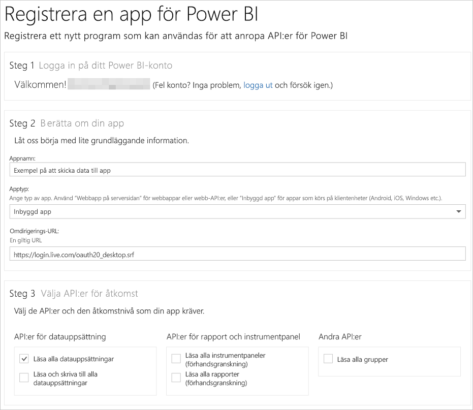

# Steg 1: Registrera en app med Azure AD
Den här artikeln ingår i en stegvis genomgång för att [skicka data till en datauppsättning](walkthrough-push-data.md).

Det första steget för att skicka data till en datauppsättning i Power BI är att registrera din app i Azure AD. Du måste först ha ett **klient-ID** som identifierar din app i Azure AD. Utan ett **klient-ID** kan Azure AD inte autentisera appen.

> **Obs**: Innan du registrerar en app för Power BI måste du [registrera dig för Power BI](create-an-azure-active-directory-tenant.md).
> 
> 

Här följer stegen för att registrera en app i Azure AD.

## Registrera en app i Azure AD
1. Gå till dev.powerbi.com/apps.
2. Klicka på **Logga in med ditt befintliga konto** och logga in på ditt Power BI-konto.
3. Ange ett **Appnamn**, till exempel ”testapp för att skicka data”.
4. Välj **inbyggd app** som **apptyp**.
5. Ange en **omdirigerings-URL**, som **https://login.live.com/oauth20_desktop.srf**. En omdirigerings-uri ger **Azure AD** mer information om den **inbyggda kundappen** som den ska autentisera. Standard-URI för ett klientprogram är https://login.live.com/oauth20_desktop.srf.
6. För **Välj API:er för åtkomst**, välj **Läsa och skriva alla datauppsättningar**. För alla behörigheter för Power BI-appen, se [Power BI behörigheter](power-bi-permissions.md).
7. Klicka på **Registrera app** och spara det **klient-ID** som genererades. En **klient-ID** identifierar appen i Azure AD.

Så här bör sidan **Registrera ett program för Power BI** se ut:

Nästa steg visar hur du [hämtar en autentiseringsåtkomsttoken](walkthrough-push-data-get-token.md).

[Nästa steg >](walkthrough-push-data-get-token.md)

## Nästa steg
[Registrera dig för Power BI](create-an-azure-active-directory-tenant.md)  
[Hämta en åtkomsttoken för autentisering](walkthrough-push-data-get-token.md)  
[Genomgång – Skicka data till en datauppsättning](walkthrough-push-data.md)  
[Registrera ett program](register-app.md)  
[Översikt över Power BI REST API](overview-of-power-bi-rest-api.md)  

Har du fler frågor? [Fråga Power BI Community](http://community.powerbi.com/)

